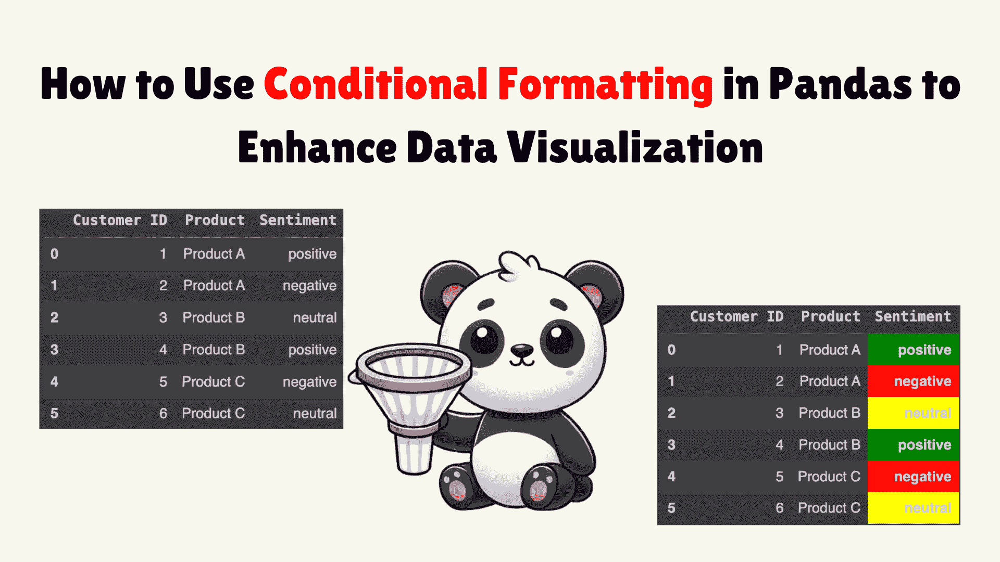
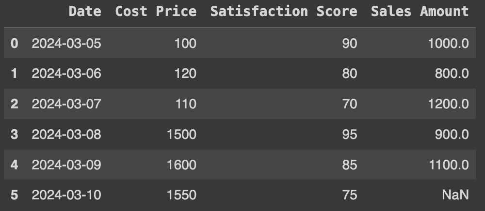
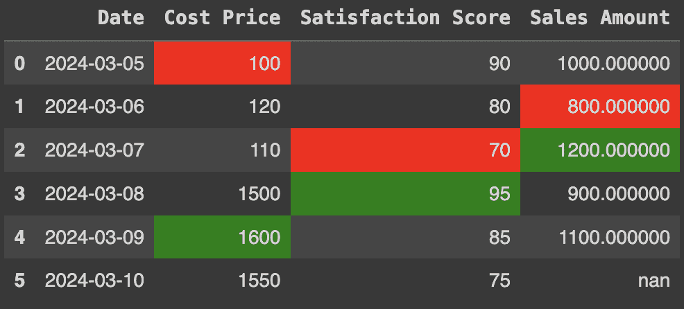
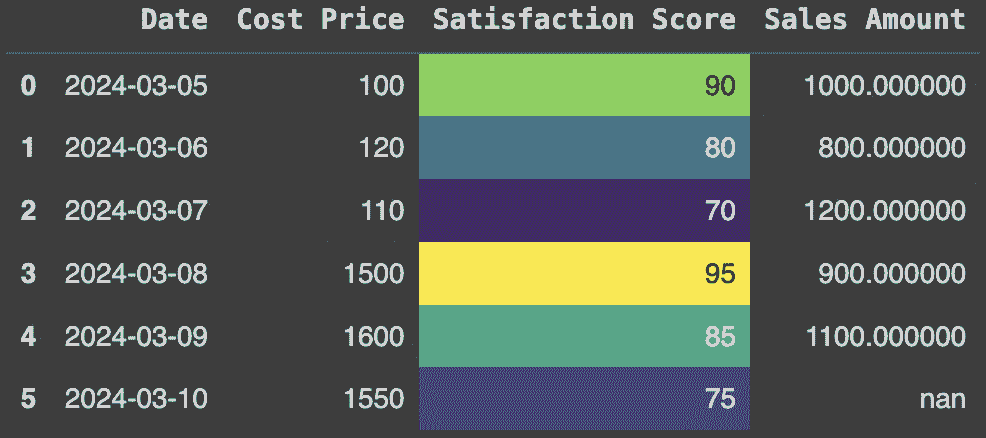
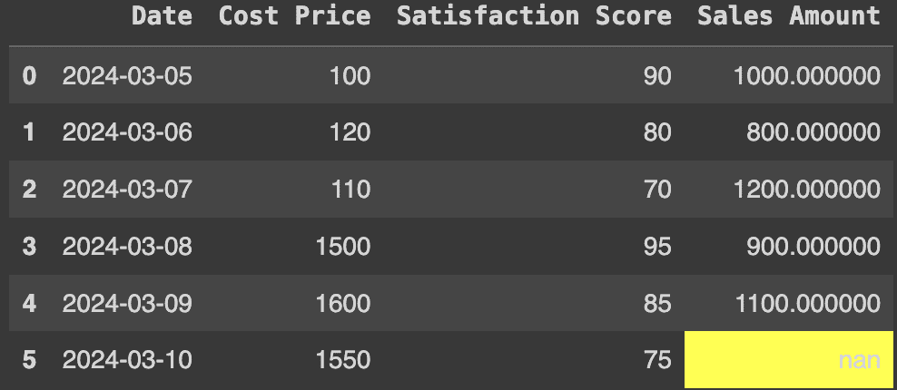
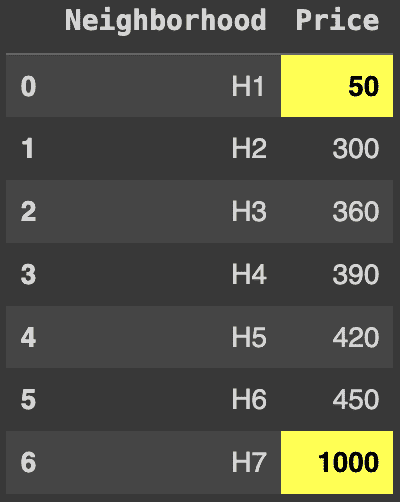
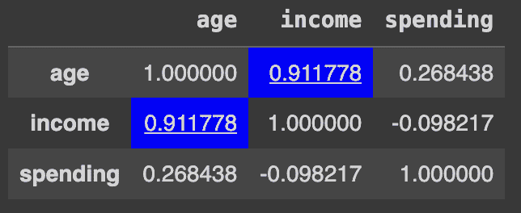

# 如何在 Pandas 中使用条件格式化来提升数据可视化

> 原文：[`www.kdnuggets.com/how-to-use-conditional-formatting-in-pandas-to-enhance-data-visualization`](https://www.kdnuggets.com/how-to-use-conditional-formatting-in-pandas-to-enhance-data-visualization)



图片来源 | DALLE-3 & Canva

虽然 pandas 主要用于数据处理和分析，但它也可以提供基本的数据可视化功能。然而，普通的数据框可能会使信息显得杂乱无章。那怎么做才能改善呢？如果你以前使用过 Excel，你知道可以用不同的颜色、字体样式等来突出重要值。使用这些样式和颜色的目的是有效地传达信息。你也可以在 pandas 数据框中做类似的工作，使用条件格式化和 Styler 对象。

* * *

## 我们的前三个课程推荐

 1\. [谷歌网络安全证书](https://www.kdnuggets.com/google-cybersecurity) - 快速进入网络安全职业道路

 2\. [谷歌数据分析专业证书](https://www.kdnuggets.com/google-data-analytics) - 提升你的数据分析技能

 3\. [谷歌 IT 支持专业证书](https://www.kdnuggets.com/google-itsupport) - 支持你的组织的 IT 工作

* * *

在这篇文章中，我们将探讨什么是条件格式化以及如何使用它来增强数据的可读性。

## 条件格式化

条件格式化是 pandas 中的一个功能，允许你根据某些标准格式化单元格。你可以轻松突出异常值、可视化趋势或强调重要数据点。pandas 中的 Styler 对象提供了一种方便的方法来应用条件格式化。在介绍示例之前，让我们快速了解一下 Styler 对象的工作原理。

## Styler 对象是什么？它是如何工作的？

你可以通过使用`property`来控制数据框的视觉呈现。这个属性返回一个 Styler 对象，负责数据框的样式设置。Styler 对象允许你操控数据框的 CSS 属性，以创建视觉上吸引人且信息丰富的展示。其通用语法如下：

```py` ``` df.style.<method>(<arguments>) ```py    Where <method> is the specific formatting function you want to apply, and <arguments> are the parameters required by that function. The Styler object returns the formatted dataframe without changing the original one. There are two approaches to using conditional formatting with the Styler object:    *   **Built-in Styles:** To apply quick formatting styles to your dataframe *   **Custom Stylization:** Create your own formatting rules for the Styler object and pass them through one of the following methods (`Styler.applymap`: element-wise or `Styler.apply`: column-/row-/table-wise)    Now, we will cover some examples of both approaches to help you enhance the visualization of your data.    ## Examples: Built-in-Styles    Let’s create a dummy stock price dataset with columns for Date, Cost Price, Satisfaction Score, and Sales Amount to demonstrate the examples below:    ``` 导入 pandas 作为 pd  导入 numpy 作为 np    数据 = {'日期': ['2024-03-05', '2024-03-06', '2024-03-07', '2024-03-08', '2024-03-09', '2024-03-10'],          '成本价格': [100, 120, 110, 1500, 1600, 1550],          '满意度评分': [90, 80, 70, 95, 85, 75],          '销售金额': [1000, 800, 1200, 900, 1100, None]}    df = pd.DataFrame(data)  df ```py    **Output:**   Original Unformatted Dataframe  ### 1\. Highlighting Maximum and Minimum Values    We can use `highlight_max` and `highlight_min` functions to highlight the maximum and minimum values in a column or row. For column set axis=0 like this:    ``` # 高亮显示最大值和最小值  df.style.highlight_max(color='green', axis=0 , subset=['成本价格', '满意度评分', '销售金额']).highlight_min(color='red', axis=0 , subset=['成本价格', '满意度评分', '销售金额']) ```py    **Output:**      Max & Min Values  ### 2\. Applying Color Gradients    Color gradients are an effective way to visualize the values in your data. In this case, we will apply the gradient to satisfaction scores using the colormap set to 'viridis'. This is a type of color coding that ranges from purple (low values) to yellow (high values). Here is how you can do this:    ``` # 应用颜色渐变  df.style.background_gradient(cmap='viridis', subset=['满意度评分']) ```py    **Output:**   Colormap - viridis  ### 3\. Highlighting Null or Missing Values    When we have large datasets, it becomes difficult to identify null or missing values. You can use conditional formatting using the built-in `df.style.highlight_null` function for this purpose. For example, in this case, the sales amount of the 6th entry is missing. You can highlight this information like this:    ``` # 高亮显示空值或缺失值  df.style.highlight_null('yellow', subset=['销售金额']) ```py    **Output:**      Highlighting Missing Values  ## Examples: Custom Stylization Using `apply()` & `applymap()`    ### 1\.  Conditional Formatting for Outliers    Suppose that we have a housing dataset with their prices, and we want to highlight the houses with outlier prices (i.e., prices that are significantly higher or lower than the other neighborhoods). This can be done as follows:    ``` 导入 pandas 作为 pd  导入 numpy 作为 np    # 房价数据集  df = pd.DataFrame({     '社区': ['H1', 'H2', 'H3', 'H4', 'H5', 'H6', 'H7'],     '价格': [50, 300, 360, 390, 420, 450, 1000],  })    # 计算 Q1 (25 百分位数), Q3 (75 百分位数) 和四分位距 (IQR)  q1 = df['价格'].quantile(0.25)  q3 = df['价格'].quantile(0.75)  iqr = q3 - q1    # 异常值的界限  lower_bound = q1 - 1.5 * iqr  upper_bound = q3 + 1.5 * iqr    # 自定义函数来高亮显示异常值  def highlight_outliers(val):     if val < lower_bound or val > upper_bound:        return 'background-color: yellow; font-weight: bold; color: black'     else:        return ''    df.style.applymap(highlight_outliers, subset=['价格'])  ```py    **Output:**   Highlighting Outliers  ### 2\. Highlighting Trends    Consider that you run a company and are recording your sales daily. To analyze the trends, you want to highlight the days when your daily sales increase by 5% or more. You can achieve this using a custom function and the apply method in pandas. Here’s how:    ``` 导入 pandas 作为 pd    # 公司销售数据集  数据 = {'日期': ['2024-02-10', '2024-02-11', '2024-02-12', '2024-02-13', '2024-02-14'],          '销售': [100, 105, 110, 115, 125]}    df = pd.DataFrame(data)    # 每日百分比变化  df['pct_change'] = df['销售'].pct_change() * 100    # 如果销售增长超过 5%，则高亮显示该天  def highlight_trend(row):      return ['background-color: green; border: 2px solid black; font-weight: bold' if row['pct_change'] > 5 else '' for _ in row]    df.style.apply(highlight_trend, axis=1) ```py    **Output:**    ### 3\. Highlighting Correlated Columns    Correlated columns are important because they show relationships between different variables. For example, if we have a dataset containing age, income, and spending habits and our analysis shows a high correlation (close to 1) between age and income, then it suggests that older people generally have higher incomes. Highlighting correlated columns helps to visually identify these relationships. This approach becomes extremely helpful as the dimensionality of your data increases. Let's explore an example to better understand this concept:    ``` 导入 pandas 作为 pd    # 人员数据集  数据 = {      '年龄': [30, 35, 40, 45, 50],      '收入': [60000, 66000, 70000, 75000, 100000],      '支出': [10000, 15000, 20000, 18000, 12000]  }    df = pd.DataFrame(data)    # 计算相关矩阵  corr_matrix = df.corr()    # 高亮显示高度相关的列  def highlight_corr(val):      if val != 1.0 and abs(val) > 0.5:   # 排除自相关          return 'background-color: blue; text-decoration: underline'      else:          return ''    corr_matrix.style.applymap(highlight_corr) ```py    **Output:**   Correlated Columns  ## Wrapping Up    These are just some of the examples I showed as a starter to up your game of data visualization. You can apply similar techniques to various other problems to enhance the data visualization, such as highlighting duplicate rows, grouping into categories and selecting different formatting for each category, or highlighting peak values. Additionally, there are many other CSS options you can explore in the [official documentation](https://pandas.pydata.org/pandas-docs/version/1.0/user_guide/style.html). You can even define different properties on hover, like magnifying text or changing color. Check out the "[Fun Stuff](https://pandas.pydata.org/pandas-docs/version/1.0/user_guide/style.html#Fun-stuff)" section for more cool ideas. This article is part of my Pandas series, so if you enjoyed this, there's plenty more to explore. Head over to my author page for more tips, tricks, and tutorials.    **[](https://www.linkedin.com/in/kanwal-mehreen1/)**[Kanwal Mehreen](https://www.linkedin.com/in/kanwal-mehreen1/)**** Kanwal is a machine learning engineer and a technical writer with a profound passion for data science and the intersection of AI with medicine. She co-authored the ebook "Maximizing Productivity with ChatGPT". As a Google Generation Scholar 2022 for APAC, she champions diversity and academic excellence. She's also recognized as a Teradata Diversity in Tech Scholar, Mitacs Globalink Research Scholar, and Harvard WeCode Scholar. Kanwal is an ardent advocate for change, having founded FEMCodes to empower women in STEM fields.     ### More On This Topic    *   [Five Ways to do Conditional Filtering in Pandas](https://www.kdnuggets.com/2022/12/five-ways-conditional-filtering-pandas.html) *   [7 AI-Powered Tools to Enhance Productivity for Data Scientists](https://www.kdnuggets.com/2023/02/7-aipowered-tools-enhance-productivity-data-scientists.html) *   [Enhance Your Python Coding Style with Ruff](https://www.kdnuggets.com/enhance-your-python-coding-style-with-ruff) *   [6 ChatGPT Prompts to Enhance your Productivity at Work](https://www.kdnuggets.com/6-chatgpt-prompts-to-enhance-your-productivity-at-work) *   [Revamping Data Visualization: Mastering Time-Based Resampling in Pandas](https://www.kdnuggets.com/revamping-data-visualization-mastering-timebased-resampling-in-pandas) *   [7 Pandas Plotting Functions for Quick Data Visualization](https://www.kdnuggets.com/7-pandas-plotting-functions-for-quick-data-visualization) ```
