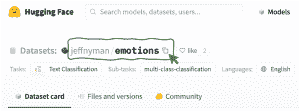
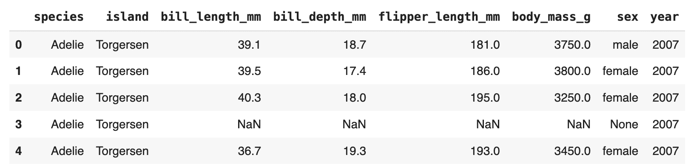

# 如何使用 Hugging Face 的数据集库进行高效的数据加载

> 原文：[`www.kdnuggets.com/how-to-use-hugging-faces-datasets-library-for-efficient-data-loading`](https://www.kdnuggets.com/how-to-use-hugging-faces-datasets-library-for-efficient-data-loading)


图片由编辑 | Midjourney 提供

本教程演示如何使用 Hugging Face 的 Datasets 库从不同来源加载数据集，仅需几行代码。

* * *

## 我们的前三个课程推荐

 1\. [Google 网络安全证书](https://www.kdnuggets.com/google-cybersecurity) - 快速进入网络安全职业生涯。

 2\. [Google 数据分析专业证书](https://www.kdnuggets.com/google-data-analytics) - 提升您的数据分析技能

 3\. [Google IT 支持专业证书](https://www.kdnuggets.com/google-itsupport) - 支持您的组织的 IT

* * *

Hugging Face Datasets 库简化了数据集的加载和处理过程。它为 Hugging Face 的中心提供了数千个数据集的统一接口。该库还实现了各种性能指标，以评估基于变换器的模型。

## 初始设置

某些 Python 开发环境可能需要在导入之前安装 Datasets 库。

```py
!pip install datasets
import datasets
```

## 通过名称加载 Hugging Face Hub 数据集

Hugging Face 在其中心托管了大量数据集。以下函数按名称输出这些数据集的列表：

```py
from datasets import list_datasets
list_datasets()
```

让我们加载其中一个，即 [情感数据集](https://huggingface.co/datasets/jeffnyman/emotions)，以对推文中的情感进行分类，方法是指定其名称：

```py
data = load_dataset("jeffnyman/emotions")
```

如果您想加载在浏览 Hugging Face 网站时遇到的数据集，并且不确定正确的命名约定是什么，请点击数据集名称旁边的“复制”图标，如下所示：



数据集被加载到一个 **DatasetDict** 对象中，该对象包含三个子集或折叠：训练集、验证集和测试集。

```py
DatasetDict({
train: Dataset({
features: ['text', 'label'],
num_rows: 16000
})
validation: Dataset({
features: ['text', 'label'],
num_rows: 2000
})
test: Dataset({
features: ['text', 'label'],
num_rows: 2000
})
})
```

每个折叠反过来是一个 **Dataset** 对象。使用字典操作，我们可以检索训练数据折叠：

```py
train_data = all_data["train"]
```

这个 Dataset 对象的长度表示训练实例（推文）的数量。

```py
len(train_data)
```

生成以下输出：

```py
16000
```

通过索引（例如，第 4 个）获取单个实例就像模仿列表操作一样简单：

```py
train_data[3]
```

该操作返回一个 Python 字典，其中数据集中的两个属性作为键：输入推文 **文本** 和 **标签**，表示它被分类的情感。

```py
{'text': 'i am ever feeling nostalgic about the fireplace i will know that it is still on the property',
'label': 2}
```

我们还可以通过切片同时获取几个连续的实例：

```py
print(train_ds[:100])
```

这个操作返回一个单一的字典，如之前一样，但现在每个键都有一个值的列表，而不是单一值。

```py
{'text': ['i didnt feel humiliated', ...],
'label': [0, ...]}
```

最后，要访问单个属性值，我们指定两个索引：一个用于其位置，另一个用于属性名称或键：

```py
train_data[3]["text"]
```

## 加载你自己的数据

如果你不想使用 Hugging Face 数据集中心，而是想使用自己的数据集，Datasets 库也允许你这样做，通过使用相同的 `load_dataset()` 函数，并传入两个参数：数据集的文件格式（例如“csv”、“text”或“json”）以及其所在的路径或网址。

这个例子从一个公共 GitHub 仓库加载 Palmer Archipelago Penguins 数据集：

```py
url = "https://raw.githubusercontent.com/allisonhorst/palmerpenguins/master/inst/extdata/penguins.csv"
dataset = load_dataset('csv', data_files=url)
```

## 将数据集转换为 Pandas DataFrame

最后但同样重要的是，有时将加载的数据转换为 Pandas **DataFrame** 对象是方便的，这可以利用 Pandas 库的广泛功能来简化数据处理、分析和可视化。

```py
penguins = dataset["train"].to_pandas()
penguins.head()
```



现在你已经学会了如何使用 Hugging Face 的专用库高效加载数据集，下一步是通过使用大语言模型（LLMs）来利用它们。

[](https://www.linkedin.com/in/ivanpc/)****[伊万·帕洛马雷斯·卡拉斯科萨](https://www.linkedin.com/in/ivanpc/)**** 是一位在人工智能、机器学习、深度学习和 LLMs 领域的领袖、作家、演讲者和顾问。他培训和指导他人将 AI 应用于现实世界。

### 更多相关主题

+   [如何使用 Hugging Face Tokenizers 库进行文本数据预处理](https://www.kdnuggets.com/how-to-use-the-hugging-face-tokenizers-library-to-preprocess-text-data)

+   [如何使用 Pandas 对大数据集执行内存高效操作](https://www.kdnuggets.com/how-to-perform-memory-efficient-operations-on-large-datasets-with-pandas)

+   [如何使用 Hugging Face AutoTrain 微调 LLMs](https://www.kdnuggets.com/how-to-use-hugging-face-autotrain-to-finetune-llms)

+   [如何使用 GPT 生成创意内容，通过 Hugging Face…](https://www.kdnuggets.com/how-to-use-gpt-for-generating-creative-content-with-hugging-face-transformers)

+   [一个开发 Hugging Face 用于客户数据建模的社区](https://www.kdnuggets.com/2022/08/objectiv-community-developing-hugging-face-customer-data-modeling.html)

+   [前 10 大机器学习演示：Hugging Face Spaces 版](https://www.kdnuggets.com/2022/05/top-10-machine-learning-demos-hugging-face-spaces-edition.html)
