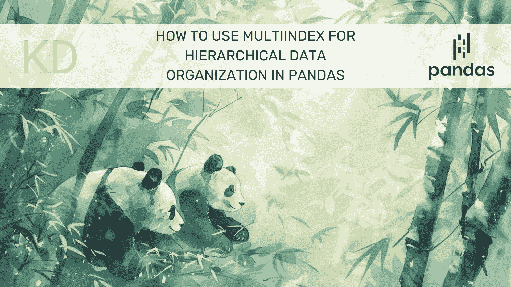

# 如何在 Pandas 中使用 MultiIndex 进行层次数据组织

> 原文：[`www.kdnuggets.com/how-to-use-multiindex-for-hierarchical-data-organization-in-pandas`](https://www.kdnuggets.com/how-to-use-multiindex-for-hierarchical-data-organization-in-pandas)



图片由编辑提供 | Midjourney & Canva

让我们学习如何在 Pandas 中使用 MultiIndex 进行层次数据处理。

* * *

## 我们的前三个课程推荐

 1\. [谷歌网络安全证书](https://www.kdnuggets.com/google-cybersecurity) - 快速进入网络安全职业。

 2\. [谷歌数据分析专业证书](https://www.kdnuggets.com/google-data-analytics) - 提升你的数据分析能力

 3\. [谷歌 IT 支持专业证书](https://www.kdnuggets.com/google-itsupport) - 支持你的组织的 IT 需求

* * *

## 准备

我们需要确保安装了 Pandas 包。你可以使用以下代码进行安装：

```py
pip install pandas
```

然后，让我们学习如何在 Pandas 中处理 MultiIndex 数据。

## 在 Pandas 中使用 MultiIndex

Pandas 中的 MultiIndex 指的是在 DataFrame 或 Series 上进行多级索引。当我们在二维表格结构中处理更高维的数据时，这个过程很有帮助。通过 MultiIndex，我们可以用多个键来索引数据，并且更好地组织它们。让我们用一个数据集示例来更好地理解它们。

```py
import pandas as pd

index = pd.MultiIndex.from_tuples(
    [('A', 1), ('A', 2), ('B', 1), ('B', 2)],
    names=['Category', 'Number']
)

df = pd.DataFrame({
    'Value': [10, 20, 30, 40]
}, index=index)

print(df)
```

输出：

```py
 Value
Category Number       
A        1          10
         2          20
B        1          30
         2          40
```

如你所见，上面的 DataFrame 有一个包含类别和编号的两级索引。

也可以使用 DataFrame 中现有的列来设置 MultiIndex。

```py
data = {
    'Category': ['A', 'A', 'B', 'B'],
    'Number': [1, 2, 1, 2],
    'Value': [10, 20, 30, 40]
}
df = pd.DataFrame(data)
df.set_index(['Category', 'Number'], inplace=True)

print(df)
```

输出：

```py
 Value
Category Number       
A        1          10
         2          20
B        1          30
         2          40
```

即使采用不同的方法，我们也能得到类似的结果。这就是为什么我们可以在 DataFrame 中使用 MultiIndex。

如果你已经有了 MultiIndex DataFrame，可以使用以下代码交换级别。

```py
print(df.swaplevel())
```

输出：

```py
 Value
Number Category       
1      A            10
2      A            20
1      B            30
2      B            40
```

当然，我们可以使用以下代码将 MultiIndex 返回为列：

```py
print(df.reset_index())
```

输出：

```py
 Category  Number  Value
0        A       1     10
1        A       2     20
2        B       1     30
3        B       2     40
```

那么，如何在 Pandas DataFrame 中访问 MultiIndex 数据呢？我们可以使用`.loc`方法。例如，我们访问 MultiIndex DataFrame 的第一级。

```py
print(df.loc['A']) 
```

输出：

```py
 Value
Number       
1          10
2          20
```

我们也可以使用元组访问数据值。

```py
print(df.loc[('A', 1)])
```

输出：

```py
Value    10
Name: (A, 1), dtype: int64
```

最后，我们可以使用`.groupby`方法对 MultiIndex 进行统计聚合。

```py
print(df.groupby(level=['Category']).sum())
```

输出：

```py
 Value
Category       
A            30
B            70
```

精通 Pandas 中的 MultiIndex 将帮助你深入了解层次数据。

## 额外资源

+   [Pandas：如何在数据透视表中移除 MultiIndex](https://www.statology.org/pandas-pivot-table-remove-multiindex/)

+   [7 步掌握 Python 和 Pandas 的数据清理](https://www.kdnuggets.com/7-steps-to-mastering-data-cleaning-with-python-and-pandas)

+   [如何为机器学习索引、切片和重塑 NumPy 数组](https://machinelearningmastery.com/index-slice-reshape-numpy-arrays-machine-learning-python/)

**[Cornellius Yudha Wijaya](https://www.linkedin.com/in/cornellius-yudha-wijaya/)** 是一名数据科学助理经理和数据撰写者。在全职工作于 Allianz Indonesia 的同时，他喜欢通过社交媒体和写作媒体分享 Python 和数据技巧。Cornellius 涉猎多种 AI 和机器学习主题。

### 更多相关内容

+   [一本将彻底改变你们组织方式的新书…](https://www.kdnuggets.com/2022/02/manning-new-book-revolutionize-way-organization-approaches-data.html)

+   [MLOps 工程师在组织中的角色](https://www.kdnuggets.com/2023/04/role-mlops-engineer-organization.html)

+   [揭示隐藏的模式：分层聚类简介](https://www.kdnuggets.com/unveiling-hidden-patterns-an-introduction-to-hierarchical-clustering)

+   [如何在 Pandas 中使用条件格式来增强数据可视化](https://www.kdnuggets.com/how-to-use-conditional-formatting-in-pandas-to-enhance-data-visualization)

+   [如何使用 pivot_table 函数进行高级数据汇总…](https://www.kdnuggets.com/how-to-use-the-pivot_table-function-for-advanced-data-summarization-in-pandas)

+   [如何有效使用 Pandas 的 GroupBy](https://www.kdnuggets.com/2023/01/effectively-pandas-groupby.html)
