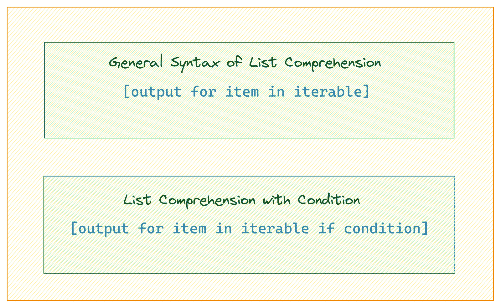
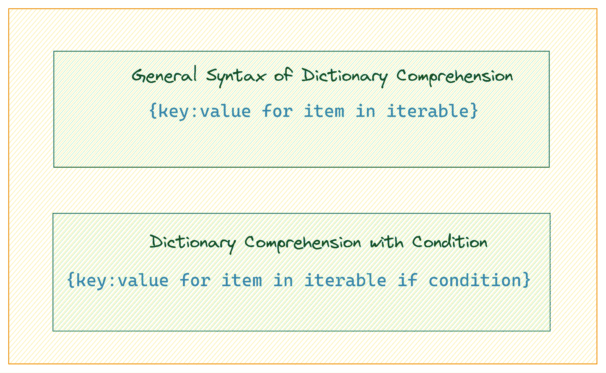
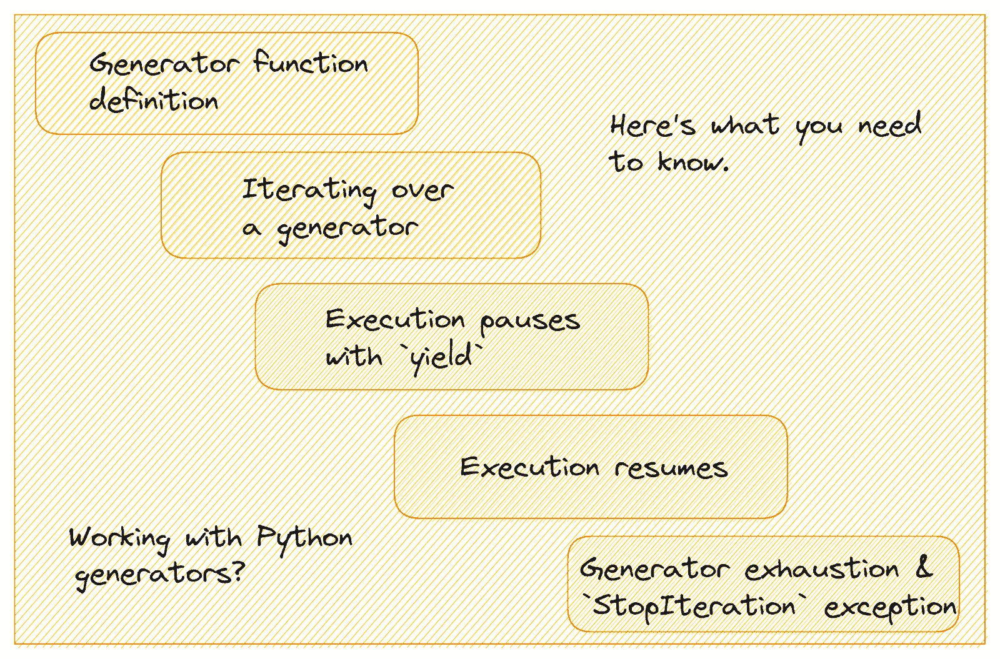

# 如何编写高效的 Python 代码：初学者教程

> 原文：[`www.kdnuggets.com/how-to-write-efficient-python-code-a-tutorial-for-beginners`](https://www.kdnuggets.com/how-to-write-efficient-python-code-a-tutorial-for-beginners)


图片由作者提供

初学者喜欢使用 Python 编程，因为它的简单性和易读语法。然而，编写高效的 Python 代码比你想象的要复杂。这需要对语言的一些特性有一定理解（不过它们也很容易掌握）。

* * *

## 我们的前三个课程推荐

 1\. [谷歌网络安全证书](https://www.kdnuggets.com/google-cybersecurity) - 快速进入网络安全职业道路

 2\. [谷歌数据分析专业证书](https://www.kdnuggets.com/google-data-analytics) - 提升你的数据分析技能

 3\. [谷歌 IT 支持专业证书](https://www.kdnuggets.com/google-itsupport) - 支持你的组织进行 IT 管理

* * *

如果你来自其他编程语言，如 C++ 或 JavaScript，这个教程是为你提供一些编写高效 Python 代码的技巧。但是如果你是初学者——将 Python 作为你的第一门（编程）语言——那么这个教程将帮助你从一开始就编写 Pythonic 代码。

我们将重点关注以下内容：

+   Pythonic 循环

+   列表和字典推导式

+   上下文管理器

+   生成器

+   集合类

那么让我们开始吧！

# 1\. 编写 Pythonic 循环

理解循环构造无论你编程使用哪种语言都是重要的。如果你来自 C++ 或 JavaScript 这样的语言，学习如何编写 Pythonic 循环会很有帮助。

## 使用 range 生成数字序列

`range()`函数生成一个数字序列，通常在循环中作为迭代器使用。

`range()`函数返回一个范围对象，该对象默认从 0 开始，到指定的数字（但不包括）为止。

这里是一个例子：

```py
for i in range(5):
    print(i)
```

```py
Output >>>

0
1
2
3
4
```

使用`range()`函数时，你可以根据需要自定义起始点、终止点和步长。

## 使用 enumerate 访问索引和项

`enumerate()`函数在你需要同时获取每个元素的索引和值时非常有用。

在这个例子中，我们使用索引来访问`fruits`列表：

```py
fruits = ["apple", "banana", "cherry"]

for i in range(len(fruits)):
    print(f"Index {i}: {fruits[i]}")
```

```py
Output >>>

Index 0: apple
Index 1: banana
Index 2: cherry
```

但使用`enumerate()`函数，你可以同时访问索引和元素，如下所示：

```py
fruits = ["apple", "banana", "cherry"]

for i, fruit in enumerate(fruits):
    print(f"Index {i}: {fruit}")
```

```py
Output >>>

Index 0: apple
Index 1: banana
Index 2: cherry
```

## 使用 zip 在多个可迭代对象中并行遍历

`zip()`函数用于并行遍历多个可迭代对象。它将不同可迭代对象中的对应元素配对在一起。

考虑以下示例，其中你需要遍历`names`和`scores`列表：

```py
names = ["Alice", "Bob", "Charlie"]
scores = [95, 89, 78]

for i in range(len(names)):
    print(f"{names[i]} scored {scores[i]} points.")
```

这输出：

```py
Output >>>

Alice scored 95 points.
Bob scored 89 points.
Charlie scored 78 points.
```

这里是一个使用`zip()`函数的更具可读性的循环：

```py
names = ["Alice", "Bob", "Charlie"]
scores = [95, 89, 78]

for name, score in zip(names, scores):
    print(f"{name} scored {score} points.")
```

```py
Output >>>

Alice scored 95 points.
Bob scored 89 points.
Charlie scored 78 points.
```

使用`zip()`的 Pythonic 版本更优雅，避免了手动索引的需要，使代码更清晰易读。

# 2\. 使用列表和字典推导

在 Python 中，列表推导和字典推导是用来分别创建列表和字典的简洁单行表达式。它们还可以包含条件语句来根据某些条件过滤项。

我们从循环版本开始，然后转到对列表和字典的推导式。

## Python 中的列表推导

假设你有一个`numbers`列表。你想创建一个`squared_numbers`列表。你可以使用如下的 for 循环：

```py
numbers = [1, 2, 3, 4, 5]
squared_numbers = []

for num in numbers:
    squared_numbers.append(num ** 2)

print(squared_numbers)
```

```py
Output >>> [1, 4, 9, 16, 25]
```

但列表推导提供了更清晰和简洁的语法来完成这项工作。它们允许你通过对可迭代对象中的每个项应用表达式来创建一个新列表。



列表推导语法 | 图片作者

这里是使用列表推导式表达式的简洁替代方案：

```py
numbers = [1, 2, 3, 4, 5]
squared_numbers = [num ** 2 for num in numbers]

print(squared_numbers)
```

```py
Output >>> [1, 4, 9, 16, 25]
```

在这里，列表推导创建了一个新列表，其中包含`numbers`列表中每个数字的平方。

## 带有条件过滤的列表推导

你还可以在列表推导式表达式中添加过滤条件。考虑这个例子：

```py
numbers = [1, 2, 3, 4, 5]
odd_numbers = [num for num in numbers if num % 2 != 0]

print(odd_numbers)
```

```py
Output >>> [1, 3, 5]
```

在这个例子中，列表推导创建了一个只包含`numbers`列表中奇数的新列表。

## Python 中的字典推导

使用类似于列表推导的语法，字典推导允许你从现有的可迭代对象创建字典。



字典推导语法 | 图片作者

假设你有一个`fruits`列表。你想创建一个`fruit:len(fruit)`键值对的字典。

下面是如何使用 for 循环来实现这一点：

```py
fruits = ["apple", "banana", "cherry", "date"]
fruit_lengths = {}

for fruit in fruits:
    fruit_lengths[fruit] = len(fruit)

print(fruit_lengths)
```

```py
Output >>> {'apple': 5, 'banana': 6, 'cherry': 6, 'date': 4}
```

现在让我们写出字典推导的等效形式：

```py
fruits = ["apple", "banana", "cherry", "date"]
fruit_lengths = {fruit: len(fruit) for fruit in fruits}

print(fruit_lengths)
```

```py
Output >>> {'apple': 5, 'banana': 6, 'cherry': 6, 'date': 4}
```

这个字典推导创建了一个字典，其中键是水果，值是水果名称的长度。

## 带有条件过滤的字典推导

让我们修改我们的字典推导式表达式以包含一个条件：

```py
fruits = ["apple", "banana", "cherry", "date"]
long_fruit_names = {fruit: len(fruit) for fruit in fruits if len(fruit) > 5}

print(long_fruit_names)
```

```py
Output >>> {'banana': 6, 'cherry': 6}
```

在这里，字典推导创建了一个字典，键是水果名称，值是它们的长度，但只对名称长度超过 5 个字符的水果。

# 3\. 使用上下文管理器进行有效的资源处理

Python 中的上下文管理器帮助你有效管理资源。使用上下文管理器，你可以轻松地设置和清理资源。上下文管理器最简单和最常见的例子是在文件处理上。

看下面的代码片段：

```py
filename = 'somefile.txt'
file = open(filename,'w')
file.write('Something')
```

它没有关闭文件描述符，导致资源泄漏。

```py
print(file.closed)
Output >>> False
```

你可能会得到以下结果：

```py
filename = 'somefile.txt'
file = open(filename,'w')
file.write('Something')
file.close()
```

虽然这试图关闭描述符，但它没有考虑到在写操作期间可能出现的错误。

现在，你可以实现异常处理以尝试打开文件并在没有错误的情况下写入内容：

```py
filename = 'somefile.txt'
file = open(filename,'w')
try:
    file.write('Something')
finally:
    file.close()
```

但这很冗长。现在看看以下使用 `with` 语句的版本，它支持作为上下文管理器的 `open()` 函数：

```py
filename = 'somefile.txt'
with open(filename, 'w') as file:
    file.write('Something')

print(file.closed)
```

```py
Output >>> True
```

我们使用 `with` 语句来创建一个上下文，在其中打开文件。这确保了当执行退出 `with` 块时，文件会被正确关闭——即使在操作过程中引发了异常。

# 4. 使用生成器进行内存高效处理

生成器提供了一种优雅的方式来处理大数据集或无限序列——提高代码效率并减少内存消耗。

## 什么是生成器？

生成器是使用 `yield` 关键字逐个返回值的函数，保留其内部状态以便在调用之间继续。与一次计算所有值并返回完整列表的常规函数不同，生成器按需计算并逐步生成值，使它们适合处理大型序列。

## 生成器是如何工作的？



图片由作者提供

让我们了解生成器是如何工作的：

+   生成器函数的定义方式类似于常规函数，但它使用 `yield` 而不是 `return` 关键字来返回一个值。

+   当你调用生成器函数时，它会返回一个生成器对象。你可以使用循环或调用 `next()` 来遍历它。

+   当遇到 `yield` 语句时，函数的状态被保存，并且返回的值会传递给调用者。函数的执行会暂停，但它的局部变量和状态会被保留。

+   当生成器的 `next()` 方法再次被调用时，执行将从暂停的地方继续，函数将继续执行直到下一个 `yield` 语句。

+   当函数退出或抛出 `StopIteration` 异常时，生成器被认为是耗尽的，进一步调用 `next()` 将抛出 `StopIteration`。

## 创建生成器

你可以使用生成器函数或生成器表达式来创建生成器。

这是一个示例生成器函数：

```py
def countdown(n):
    while n > 0:
        yield n
        n -= 1

# Using the generator function
for num in countdown(5):
    print(num)
```

```py
Output >>> 

5 
4 
3 
2 
1
```

生成器表达式类似于列表推导式，但它们创建的是生成器而不是列表。

```py
# Generator expression to create a sequence of squares
squares = (x ** 2 for x in range(1, 6))

# Using the generator expression
for square in squares:
    print(square)
```

```py
Output >>> 

1 
4 
9 
16 
25
```

# 5. 利用集合类

我们将通过了解两个有用的集合类来结束本教程：

+   命名元组

+   计数器

## 使用 NamedTuple 创建更具可读性的元组

在 Python 中，[命名元组](https://www.google.com/url?q=https://docs.python.org/3/library/collections.html%23collections.namedtuple&sa=D&source=editors&ust=1699804716906412&usg=AOvVaw3u8nY9OIf6hzmfClcR1woI) 在 [collections 模块](https://www.google.com/url?q=https://docs.python.org/3/library/collections.html&sa=D&source=editors&ust=1699804716906824&usg=AOvVaw0ZnueyvpsC8tcF6R59HImz) 中是内置元组类的一个子类。但它提供了命名字段，这使得它比常规元组更具可读性和自解释性。

这是创建一个 3D 空间点的简单元组并访问单个元素的示例：

```py
# 3D point tuple
coordinate = (1, 2, 3)

# Accessing data using tuple unpacking 
x, y, z = coordinate
print(f"X-coordinate: {x}, Y-coordinate: {y}, Z-coordinate: {z}")
```

```py
Output >>> X-coordinate: 1, Y-coordinate: 2, Z-coordinate: 3
```

这里是 namedtuple 版本：

```py
from collections import namedtuple

# Define a Coordinate3D namedtuple
Coordinate3D = namedtuple("Coordinate3D", ["x", "y", "z"])

# Creating a Coordinate3D object
coordinate = Coordinate3D(1, 2, 3)

print(coordinate)

# Accessing data using named fields
print(f"X-coordinate: {coordinate.x}, Y-coordinate: {coordinate.y}, Z-coordinate: {coordinate.z}")
```

```py
Output >>>

Coordinate3D(x=1, y=2, z=3)
X-coordinate: 1, Y-coordinate: 2, Z-coordinate: 3
```

因此，NamedTuples 让你编写比普通元组更清晰、更易维护的代码。

## 使用 Counter 简化计数

[Counter](https://www.google.com/url?q=https://docs.python.org/3/library/collections.html%23collections.Counter&sa=D&source=editors&ust=1699804716911084&usg=AOvVaw1l3sRFtUOoTYOGxmXgvsV3)是[collections 模块](https://www.google.com/url?q=https://docs.python.org/3/library/collections.html&sa=D&source=editors&ust=1699804716911412&usg=AOvVaw3kdFmHhIoOUaxhjTo0ufmE)中的一个类，旨在计算可迭代对象（如列表或字符串）中元素的频率。它返回一个带有`{element:count}`键值对的 Counter 对象。

让我们以在长字符串中计算字符频率为例。

这里是使用循环计算字符频率的传统方法：

```py
word = "incomprehensibilities"

# initialize an empty dictionary to count characters
char_counts = {}

# Count character frequencies
for char in word:
    if char in char_counts:
        char_counts[char] += 1
    else:
         char_counts[char] = 1

# print out the char_counts dictionary
print(char_counts)

# find the most common character
most_common = max(char_counts, key=char_counts.get)

print(f"Most Common Character: '{most_common}' (appears {char_counts[most_common]} times)")
```

我们手动遍历字符串，更新字典以计算字符频率，并找到最常见的字符。

```py
Output >>>

{'i': 5, 'n': 2, 'c': 1, 'o': 1, 'm': 1, 'p': 1, 'r': 1, 'e': 3, 'h': 1, 's': 2, 'b': 1, 'l': 1, 't': 1}

Most Common Character: 'i' (appears 5 times)
```

现在，让我们使用`Counter`类和语法`Counter(iterable)`来实现相同的任务：

```py
from collections import Counter

word = "incomprehensibilities"

# Count character frequencies using Counter
char_counts = Counter(word)

print(char_counts)

# Find the most common character
most_common = char_counts.most_common(1)

print(f"Most Common Character: '{most_common[0][0]}' (appears {most_common[0][1]} times)")
```

```py
Output >>>

Counter({'i': 5, 'e': 3, 'n': 2, 's': 2, 'c': 1, 'o': 1, 'm': 1, 'p': 1, 'r': 1, 'h': 1, 'b': 1, 'l': 1, 't': 1})
Most Common Character: 'i' (appears 5 times)
```

所以`Counter`提供了一种更简单的方式来计算字符频率，无需手动迭代和字典管理。

# 总结

希望你找到了一些有用的技巧来增加你的 Python 工具箱。如果你想学习 Python 或者正在准备编程面试，以下是一些资源来帮助你在学习过程中：

+   [5 本免费书籍帮助你掌握 Python](https://www.google.com/url?q=/5-free-books-to-help-you-master-python&sa=D&source=editors&ust=1699804716920444&usg=AOvVaw3obUh_MCpu386ETLYVGayY)

+   [7 个必须知道的 Python 编程面试技巧](https://www.google.com/url?q=/2023/03/7-mustknow-python-tips-coding-interviews.html&sa=D&source=editors&ust=1699804716921117&usg=AOvVaw2_kKapgZNvaTIeg6R3B2pw)

学习愉快！

**[](https://twitter.com/balawc27)**[Bala Priya C](https://www.kdnuggets.com/wp-content/uploads/bala-priya-author-image-update-230821.jpg)**** 是一位来自印度的开发者和技术作家。她喜欢在数学、编程、数据科学和内容创作的交叉点上工作。她的兴趣和专长领域包括 DevOps、数据科学和自然语言处理。她喜欢阅读、写作、编程和咖啡！目前，她正在通过编写教程、指南、评论文章等与开发者社区分享她的知识。Bala 还创建了有趣的资源概述和编码教程。

### 更多相关话题

+   [使用管道编写干净的 Python 代码](https://www.kdnuggets.com/2021/12/write-clean-python-code-pipes.html)

+   [8 个内置 Python 装饰器以编写优雅代码](https://www.kdnuggets.com/8-built-in-python-decorators-to-write-elegant-code)

+   [Pydon'ts - 编写优雅的 Python 代码：免费书评](https://www.kdnuggets.com/2022/05/pydonts-write-elegant-python-code-free-book-review.html)

+   [掌握 Python：编写清晰、有组织且高效代码的 7 种策略](https://www.kdnuggets.com/mastering-python-7-strategies-for-writing-clear-organized-and-efficient-code)

+   [将 Python 字典转换为 JSON：初学者教程](https://www.kdnuggets.com/convert-python-dict-to-json-a-tutorial-for-beginners)

+   [在 Python 中将字节转换为字符串：初学者教程](https://www.kdnuggets.com/convert-bytes-to-string-in-python-a-tutorial-for-beginners)
