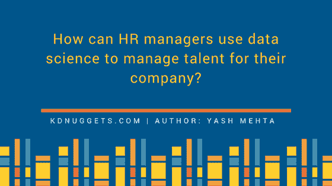
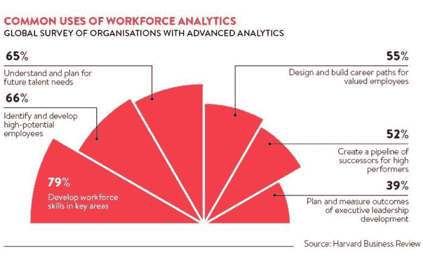

# HR 经理如何使用数据科学来管理公司的人才

> 原文：[`www.kdnuggets.com/2017/06/hr-managers-data-science-manage-talent.html`](https://www.kdnuggets.com/2017/06/hr-managers-data-science-manage-talent.html)

对于大多数从未站在招聘桌另一边的人来说，人才获取听起来可能是一个微不足道的术语。但实际上，整个招聘过程非常耗时、昂贵，并且需要大量资源。招聘经理负责组织内所有招聘流程。他们必须制定吸引大量合格候选人的计划，同时创建一个候选人愿意留下的环境。

* * *

## 我们的前三个课程推荐

 1\. [Google 网络安全证书](https://www.kdnuggets.com/google-cybersecurity) - 开启网络安全职业快车道

 2\. [Google 数据分析专业证书](https://www.kdnuggets.com/google-data-analytics) - 提升你的数据分析能力

 3\. [Google IT 支持专业证书](https://www.kdnuggets.com/google-itsupport) - 支持你的 IT 组织

* * *

**让我们指出招聘经理面临的一些挑战：**

+   **合格候选人：** 招聘经理有责任找到最合适的人选。一般来说，一个公司职位会收到大约 250 份简历。如果通过在线职位门户发布工作，这个数字会增加到大约 427,000 份简历。这些数字不仅令人震惊，而且手动筛选候选人或通过某些筛选算法筛选也是另一个艰巨任务。

+   **需求和供应比例：** 随着市场上工作机会的增加，候选人变得非常挑剔。他们有多种选择，如果在其他地方找到更可行和令人兴奋的工作，他们可以轻易地拒绝一份工作。招聘经理必须制定计划并创建营销策略，使候选人留下。如果一个已选候选人退出，那么又必须重新开始整个过程，寻找新的替代者。

+   **招聘经理和招聘人员之间脆弱的关系：** 有时候，招聘经理并没有清晰地沟通工作需求。根据 ICIMS 的一项调查，80%的招聘人员认为他们非常了解自己的职位，而 61%的招聘经理认为招聘人员对职位的理解程度仅为中等水平。这种双方之间的不平衡相当紧张，并且在顺畅工作流程中形成了一道障碍。

通过有效使用数据，为根据需求和要求简化[人员配备的任务的一个解决方案](https://www.peoplehr.com/blog/index.php/2016/04/29/time-to-use-data-to-improve-your-staffing/)，正如[Mike Loukides 所述](https://www.oreilly.com/ideas/what-is-data-science)，O’Reilly Media 副总裁，"数据科学家涉及到收集数据，将其转化为可操作的形式，让数据讲述自己的故事，并将这些故事呈现给他人。"

**如何在招聘过程中使用数据科学：**

+   可以用于跟踪、分析和分享员工相关信息，以便深入了解候选人的档案。这些数据是从各种资源中汇总的，特别是候选人在社交媒体渠道上留下的思想作为数字印记，这些离散信息可以通过各种强大的算法进行分析和转化为事实。

一篇[forbes.com 的文章](https://www.forbes.com/sites/joshbersin/2013/02/17/bigdata-in-human-resources-talent-analytics-comes-of-age/#1fb5b1884cd0)发表了 Josh Bersin 解释了客户如何通过分析多年来候选人数据来提升销售业绩达到了$4 百万在六个月内。

+   数据分析和科学还将帮助组织更有效地实现业务目标，同时也减少他们的总招聘成本。27%的雇主表示，糟糕的招聘每年会损失他们大约$50000。但是通过数据科学和分析，这种成本可以显著降低，同时为某个职位提供最佳候选人。

+   HR 经理也可以利用数据科学创建几个估计值，如人才库的投资、每个招聘的成本、培训成本和每个员工的成本。它提供了更好的优化、预测和报告技术。

**各种形式的分析可用并正在被许多组织部署。其中一些是：**

+   **人才分析：** 它有助于引导适合的人才，改进培训计划，分析员工流失情况，以及招聘规划和保留策略。

+   **工作力分析和规划：** 这是了解组织关键需求的另一种方式。它涉及大小、类型、经验、知识等重要属性，这些属性对提高组织整体效率至关重要。这将有助于最大化产出并确保未来业务成功。

+   **预测分析：** 这种类型的分析完全基于统计和数据。它帮助领导者根据现有事实制定计划。以图形形式的图表、统计设计易于理解，并为领导者提供了关键情况的清晰图像，如薪资差距、评估、辞职员工等。

一项由 [IBM 和 MIT 进行的调查](https://www-935.ibm.com/services/us/gbs/thoughtleadership/peopleequation/) 揭示了那些采用 HR 分析的组织在业务方面取得了积极的成果。他们看到销售额总体增加了 8%，净营业收入增加了 24%，每位员工的销售额增加了 58%。

因此，我们可以说，在数字化时代，组织转向数据科学以进行人才招聘是必不可少的步骤。尽管涉足 HR 分析会面临一些挑战，这些挑战可能有些复杂和令人不知所措，但结果将是积极的。

**简介：Yash Mehta** 是物联网、大数据科学和 M2M 领域的专家，目前担任 [helotechnology.com](http://helotechnology.com/) 的主编。Yash 还创办了一个名为 IoT Worm 的物联网软件和博客。你可以在 [LinkedIn](https://www.linkedin.com/in/yash-mehta-esthan/)、[Twitter](https://twitter.com/iotworm) 和他的个人博客 [yashmehta](http://yashmehta.org/) 上关注他。

**相关：**

+   文本挖掘 101：从简历中挖掘信息

+   使用深度学习从职位描述中提取知识

+   数据科学的定性研究方法？

### 更多相关主题

+   [NoSQL 数据库及其应用场景](https://www.kdnuggets.com/2023/03/nosql-databases-cases.html)

+   [如何有效地使用 Docker 标签管理镜像版本](https://www.kdnuggets.com/how-to-use-docker-tags-to-manage-image-versions-effectively)

+   [招聘经理在数据科学家身上寻找的素质](https://www.kdnuggets.com/2022/04/qualities-hiring-managers-looking-data-scientists.html)

+   [KDnuggets™ 新闻 22:n03，1 月 19 日：深入了解 13 个数据...](https://www.kdnuggets.com/2022/n03.html)

+   [Python 上下文管理器的 3 个有趣用途](https://www.kdnuggets.com/3-interesting-uses-of-python-context-managers)

+   [如何在 Python 中创建自定义上下文管理器](https://www.kdnuggets.com/how-to-create-custom-context-managers-in-python)
