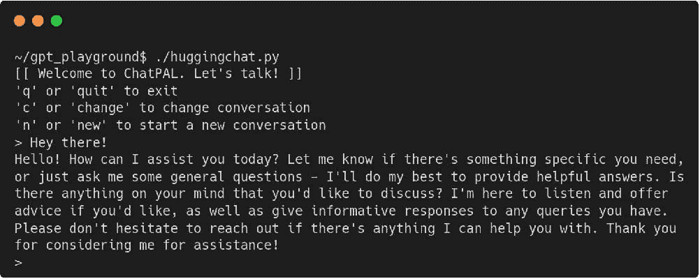

# HuggingChat Python API: 您的免费替代方案

> 原文：[`www.kdnuggets.com/2023/05/huggingchat-python-api-alternative.html`](https://www.kdnuggets.com/2023/05/huggingchat-python-api-alternative.html)


图片由作者使用 Midjourney 创建

你最近见过那么多 ChatGPT 的替代品，但你有没有试过来自 HuggingFace 的[HuggingChat](https://hf.co/chat/)？

* * *

## 我们的三大课程推荐

 1\. [Google Cybersecurity Certificate](https://www.kdnuggets.com/google-cybersecurity) - 快速进入网络安全职业的快车道。

 2\. [Google Data Analytics Professional Certificate](https://www.kdnuggets.com/google-data-analytics) - 提升你的数据分析技能

 3\. [Google IT Support Professional Certificate](https://www.kdnuggets.com/google-itsupport) - 支持您组织的 IT

* * *

HuggingChat 是一个免费的开源替代品，替代商业聊天产品如 ChatGPT。从理论上讲，该服务可以利用多个模型，但截至目前我只看到它使用了来自[OpenAssistant](https://open-assistant.io/)的 LLaMa 30B SFT 6（[oasst-sft-6-llama-30b](https://huggingface.co/OpenAssistant/oasst-sft-6-llama-30b-xor)）。

你可以在[这里](https://www.youtube.com/watch?v=TFa539R09EQ)了解 OpenAssistant 有趣的努力，看看他们如何构建他们的聊天机器人。虽然模型可能不是 GPT4 级别，但它无疑是一个有能力的 LLM，具有值得查看的有趣训练故事。

免费和开源？听起来很棒。不过等一下……还有更多！

无法访问 ChatGPT4 API？即使可以访问也厌倦了付费？为什么不试试这个非官方的[HuggingChat Python API](https://github.com/Soulter/hugging-chat-api)？

无需 API 密钥，无需注册，无需任何繁琐的步骤！只需`pip install hugface`，然后从命令行复制、粘贴并运行下面的示例脚本。

```py
#!/usr/bin/env python
# -*- coding: utf-8 -*-

from hugchat import hugchat

# Create a chatbot connection
chatbot = hugchat.ChatBot()

# New a conversation (ignore error)
id = chatbot.new_conversation()
chatbot.change_conversation(id)

# Intro message
print('[[ Welcome to ChatPAL. Let\'s talk! ]]')
print('\'q\' or \'quit\' to exit')
print('\'c\' or \'change\' to change conversation')
print('\'n\' or \'new\' to start a new conversation')

while True:
	user_input = input('> ')
	if user_input.lower() == '':
		pass
	elif user_input.lower() in ['q', 'quit']:
		break
	elif user_input.lower() in ['c', 'change']:
		print('Choose a conversation to switch to:')
		print(chatbot.get_conversation_list())
	elif user_input.lower() in ['n', 'new']:
		print('Clean slate!')
		id = chatbot.new_conversation()
		chatbot.change_conversation(id)
	else:
		print(chatbot.chat(user_input))
```

运行脚本 — `./huggingchat.py`，或者你给文件起的任何名字 — 然后得到类似如下的结果（在打招呼之后）：



简单的示例脚本接受输入并将其传递给 API，显示返回的结果。脚本唯一的输入解释是查找退出的关键字、开始新对话的关键字，或切换到你已经进行中的预设对话的关键字。一切都很直观。

欲了解有关该库的更多信息，包括`chat()`函数的参数，请查看其 GitHub 仓库。

对于聊天机器人 API 有各种有趣的使用案例，特别是一个你可以自由探索而不必花钱的。你唯一受限的就是你的想象力。

编程愉快！

**[马修·梅约](https://www.linkedin.com/in/mattmayo13/)** ([**@mattmayo13**](https://twitter.com/mattmayo13)) 是数据科学家和 KDnuggets 的主编，KDnuggets 是开创性的在线数据科学和机器学习资源。他的兴趣包括自然语言处理、算法设计与优化、无监督学习、神经网络以及自动化机器学习方法。马修拥有计算机科学硕士学位和数据挖掘研究生文凭。他的联系方式是 editor1 at kdnuggets[dot]com。

### 更多相关话题

+   [机器学习中的替代特征选择方法](https://www.kdnuggets.com/2021/12/alternative-feature-selection-methods-machine-learning.html)

+   [OpenChatKit：开源 ChatGPT 替代品](https://www.kdnuggets.com/2023/03/openchatkit-opensource-chatgpt-alternative.html)

+   [8 个开源替代 ChatGPT 和 Bard 的选项](https://www.kdnuggets.com/2023/04/8-opensource-alternative-chatgpt-bard.html)

+   [ChatGLM-6B：轻量级开源 ChatGPT 替代品](https://www.kdnuggets.com/2023/04/chatglm6b-lightweight-opensource-chatgpt-alternative.html)

+   [MiniGPT-4：轻量级的 GPT-4 替代品，用于增强的…](https://www.kdnuggets.com/2023/04/minigpt4-lightweight-alternative-gpt4-enhanced-visionlanguage-understanding.html)

+   [Dolly 2.0：商业使用的 ChatGPT 开源替代品](https://www.kdnuggets.com/2023/04/dolly-20-chatgpt-open-source-alternative-commercial.html)
