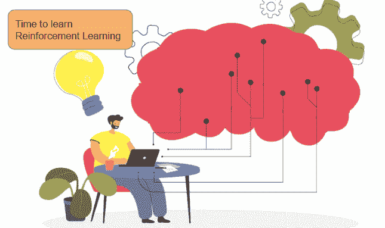
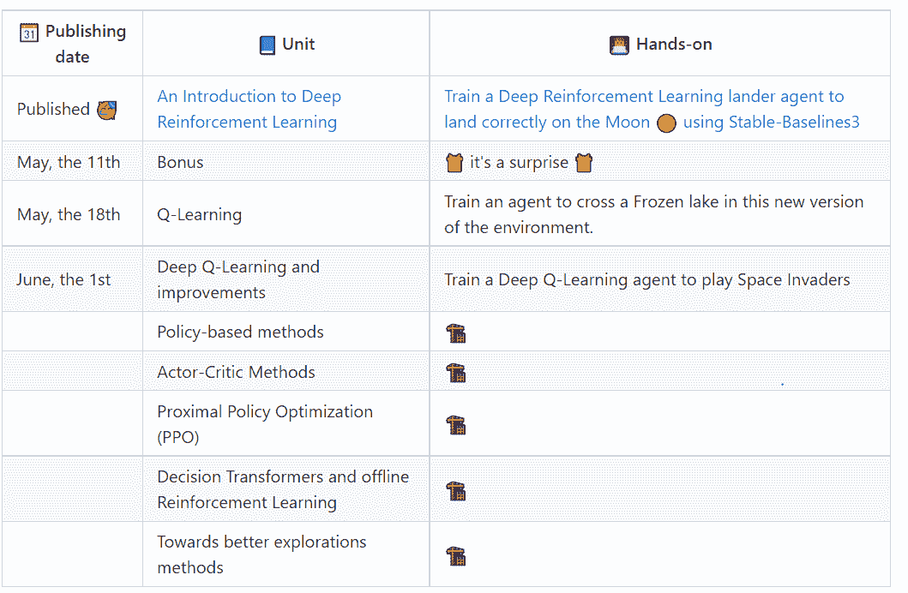

# HuggingFace 推出了免费的深度强化学习课程

> 原文：[`www.kdnuggets.com/2022/05/huggingface-launched-free-deep-reinforcement-learning-course.html`](https://www.kdnuggets.com/2022/05/huggingface-launched-free-deep-reinforcement-learning-course.html)

这是一个自学进度的课程，提供了大量参考材料以理解理论，并使用 Colab 进行实践。完成课程后，你还可以获得证书。那么你还在等什么？让我们开始吧。

技术向量由 pch.vector 和 freepik 创建

* * *

## 我们的三大推荐课程

 1\. [Google 网络安全证书](https://www.kdnuggets.com/google-cybersecurity) - 加速你在网络安全领域的职业发展

 2\. [Google 数据分析专业证书](https://www.kdnuggets.com/google-data-analytics) - 提升你的数据分析技能

 3\. [Google IT 支持专业证书](https://www.kdnuggets.com/google-itsupport) - 支持你的组织的 IT

* * *

# 什么是深度强化学习？

这是一种机器学习类型，其中代理通过采取行动并最大化累积奖励来学习在环境中执行任务。

它在多个领域有应用，例如实时的广告展示出价优化、自驾车、包括数据中心冷却在内的工业自动化、股票价格预测等。你可以在[这里](https://neptune.ai/blog/reinforcement-learning-applications)阅读更多关于其实际应用的内容。

强化学习（RL）被宣传为超越[人工通用智能的障碍](https://venturebeat.com/2021/06/09/deepmind-says-reinforcement-learning-is-enough-to-reach-general-ai/)。在没有绝对的[‘正确’答案](https://www.cdotrends.com/story/15555/why-reinforcement-learning-matters-business)的情况下，学习 RL 是设计 AI 解决方案的最佳选择。

到现在为止，你一定很期待学习这个 AI 子领域。那么好消息来了——Hugging Face 推出了免费的深度强化学习课程。它是自学进度的，并提供了大量关于理论、教程和实践指南的指引。

# 先决条件

在我们了解课程结构和涵盖的内容之前，让我们先了解一下基本要求：

## 1\. Python

**[Python 编程入门](https://www.udacity.com/course/introduction-to-python--ud1110)**

课程要求你了解 Python，并建议使用免费的 Udacity 课程来理解其基础知识。这是一个为期 5 周、自学进度的入门友好课程，包含实际问题。它涵盖了编程最佳实践、数据类型、变量以及列表、集合、字典和元组等数据结构。

**[Python 初学者完整课程](https://www.youtube.com/watch?v=_uQrJ0TkZlc&ab_channel=ProgrammingwithMosh)**

这是 Mosh 制作的一个 6 小时长的播放列表，涵盖了异常、类、继承和构造函数等概念。课程以 3 个 Python 项目结束 - 用 Python 自动化、用 Python 进行机器学习和用 Django 构建网站。

## 2\. 深度学习基础

**[freecodecamp 的深度学习教程](https://www.youtube.com/watch?v=VyWAvY2CF9c&ab_channel=freeCodeCamp.org)**

深度学习是机器学习的一个子分支。如果你是完全的初学者，你应该查看这个教程，以理解深度学习的基础知识、各种术语和关键概念。它解释了神经网络如何学习，什么是各种激活函数、损失函数和优化器。它还概述了神经网络架构，并以一个 5 步框架来构建神经网络作为结束。

**[MIT 深度学习基础](https://blog.tensorflow.org/2019/02/mit-deep-learning-basics-introduction-tensorflow.html)**

这个 TensorFlow 博客包含了 Lex Fridman 的深度学习基础视频的链接。它是对深度学习网络 7 种架构范式的一个优秀概述（以及 Tensorflow 教程链接）：

1.  前馈神经网络

1.  卷积神经网络（CNNs）

1.  循环神经网络（RNNs）

1.  编码器-解码器架构

1.  自编码器

1.  生成对抗网络（GANs）

1.  深度强化学习

## 3\. PyTorch

**[使用 PyTorch 进行深度学习：60 分钟速成](https://pytorch.org/tutorials/beginner/deep_learning_60min_blitz.html)**

本教程旨在提供对 PyTorch 的 Tensor 库和神经网络的高层次概述

**[PyTorch 深度学习简介](https://www.udacity.com/course/deep-learning-pytorch--ud188)**

在学习了 PyTorch 的基础知识后，下一步的最佳进阶是使用它来实现你的第一个神经网络。这个免费课程也通过编码练习为你提供了 PyTorch 的实际应用经验，平均需要 2 个月完成。

所以我们现在准备好学习 Hugging Face 提供的免费深度强化学习课程。

# 主要特点

+   这是一个自学进度的课程，共 8 个单元。

+   [第一个单元](https://github.com/huggingface/deep-rl-class/tree/main/unit1)涵盖了深度强化学习的基础知识，已发布，包含约 2 小时的理论和 1 小时的实践

+   学习强化学习的最佳参考书是[Sutton 和 Barto](http://incompleteideas.net/book/RLbook2020.pdf)。你可能第一次阅读时不能完全理解概念，需要多次迭代。

+   它附带一个实操的 Google Colab，免去了你在机器上安装所有内容的麻烦，并允许你自己进行实验。

# 计划

课程涵盖了诸如 Q 学习、深度 Q 学习、基于策略和演员-评论家方法等主题。

所以赶紧去 [注册](https://forms.gle/tfa2nUDKxxg8DJAX8) 课程，并每周关注课程内容。额外的好处是，你可以在上传八个模型和完成八个实践后获得证书。

期待在接下来的几周里有大量的学习。

**[Vidhi Chugh](https://vidhi-chugh.medium.com/)** 是一位获奖的 AI/ML 创新领袖和 AI 伦理学家。她在数据科学、产品和研究的交汇点工作，以提供商业价值和洞察力。她是数据中心科学的倡导者，并且在数据治理方面是领先的专家，致力于构建值得信赖的 AI 解决方案。

### 更多相关主题

+   [使用 HuggingFace Pipelines 和 Streamlit 回答问题](https://www.kdnuggets.com/2021/10/simple-question-answering-web-app-hugging-face-pipelines.html)

+   [用 HuggingFace 微调 BERT 进行推文分类](https://www.kdnuggets.com/2022/01/finetuning-bert-tweets-classification-ft-hugging-face.html)

+   [使用 HuggingFace Transformers 的简单 NLP Pipelines](https://www.kdnuggets.com/2023/02/simple-nlp-pipelines-huggingface-transformers.html)

+   [一个简单实现的 HuggingFace 端到端项目](https://www.kdnuggets.com/a-simple-to-implement-end-to-end-project-with-huggingface)

+   [实践强化学习课程 第三部分：SARSA](https://www.kdnuggets.com/2022/01/handson-reinforcement-learning-course-part-3-sarsa.html)

+   [实践强化学习课程，第一部分](https://www.kdnuggets.com/2021/12/hands-on-reinforcement-learning-course-part-1.html)
