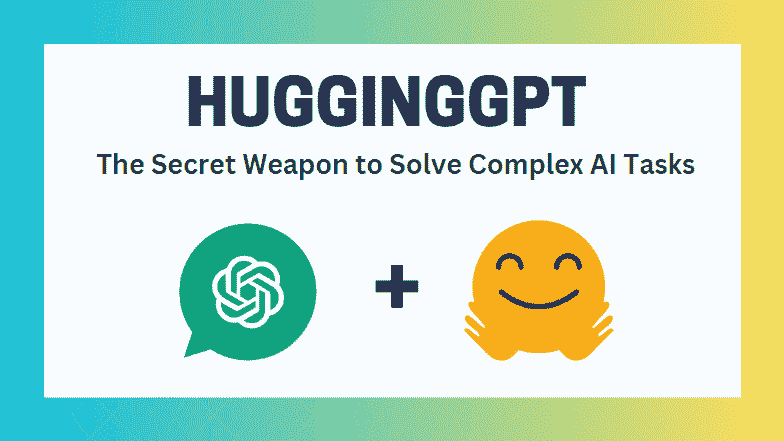
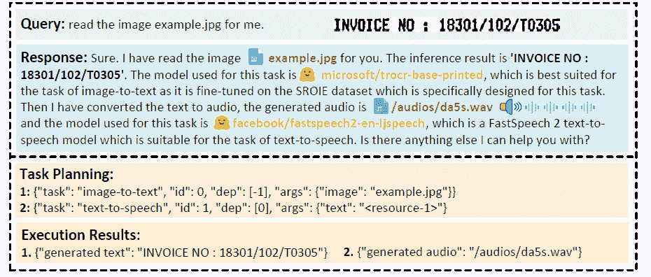
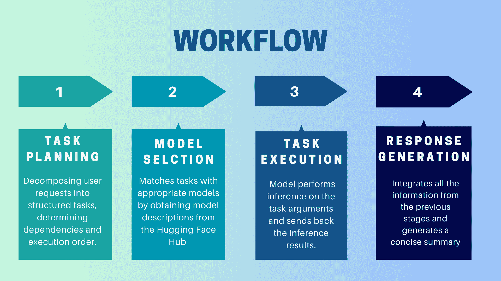

# HuggingGPT: 解决复杂 AI 任务的秘密武器

> 原文：[`www.kdnuggets.com/2023/05/hugginggpt-secret-weapon-solve-complex-ai-tasks.html`](https://www.kdnuggets.com/2023/05/hugginggpt-secret-weapon-solve-complex-ai-tasks.html)



作者提供的图片

# 介绍

你听说过“通用人工智能”（AGI）这个术语吗？如果没有，我来解释一下。AGI 可以被认为是一种能像人类一样理解、处理和响应智力任务的 AI 系统。这是一个具有挑战性的任务，需要深入了解人脑的运作方式，以便我们可以复制它。然而，ChatGPT 的出现引起了研究界对开发这种系统的巨大兴趣。微软发布了一个这样的关键 AI 系统，名为 HuggingGPT（微软贾维斯）。这是我遇到的最令人惊叹的事物之一。

在深入了解 HuggingGPT 的新功能和工作原理之前，让我们首先了解一下 ChatGPT 存在的问题以及为什么它在解决复杂 AI 任务时会遇到困难。像 ChatGPT 这样的大型语言模型在解释文本数据和处理一般任务方面表现出色。然而，它们在处理特定任务时经常会遇到困难，可能会产生荒谬的回应。你可能在解决复杂的数学问题时遇到过 ChatGPT 的虚假回答。另一方面，我们有像 Stable Diffusion 和 DALL-E 这样的专家 AI 模型，它们对其领域有更深入的理解，但在处理更广泛的任务时却存在困难。我们不能充分发挥 LLM 的潜力来解决具有挑战性的 AI 任务，除非我们在它们与专业 AI 模型之间建立连接。这就是 HuggingGPT 所做的。它结合了两者的优势，创造了更高效、更准确、更全面的 AI 系统。

# 什么是 HuggingGPT？

根据微软发布的一篇[近期论文](https://arxiv.org/abs/2303.17580)，HuggingGPT 利用 LLM 的强大功能，将其作为控制器连接到机器学习社区（HuggingFace）的各种 AI 模型上。与其对 ChatGPT 进行各种任务的训练，不如让它使用外部工具以提高效率。[HuggingFace](https://huggingface.co/) 是一个为开发者和研究人员提供大量工具和资源的网站。它还拥有各种专业和高精度的模型。HuggingGPT 使用这些模型来处理不同领域和模式的复杂 AI 任务，从而取得了令人印象深刻的结果。在文本和图像方面，它具有类似于 OpenAI GPT-4 的多模态能力。而且，它还可以连接到互联网，你可以提供外部网页链接以询问相关问题。

假设你希望模型生成一段关于图像上文字的音频朗读。HuggingGPT 将使用最合适的模型按顺序执行此任务。首先，它会从文本生成图像，并利用该结果进行音频生成。你可以在下面的图像中查看响应细节。简直令人惊叹！



多模型协作在视频和音频模态下的定性分析 ([来源](https://arxiv.org/abs/2303.17580))

# HuggingGPT 是如何工作的？



作者提供的图片

HuggingGPT 是一个协作系统，使用 LLM 作为接口将用户请求发送到专家模型。整个过程从用户提示到模型，再到接收响应，可以分解为以下几个离散的步骤：

## 1\. 任务规划

在这一阶段，HuggingGPT 利用 ChatGPT 理解用户提示，然后将查询分解为小的可执行任务。它还确定这些任务的依赖关系并定义其执行顺序。HuggingGPT 有四个任务解析槽位，即任务类型、任务 ID、任务依赖关系和任务参数。HuggingGPT 和用户之间的聊天记录会被记录并显示在屏幕上，显示资源的历史记录。

## 2\. 模型选择

根据用户的上下文和可用模型，HuggingGPT 使用上下文任务模型分配机制来选择最合适的模型进行特定任务。根据这一机制，模型的选择被视为一个单项选择问题，最初会根据任务类型筛选出模型。之后，模型会根据下载数量进行排序，因为下载量被认为是反映模型质量的可靠指标。根据这个排名选择“Top-K”模型。这里的 K 只是一个常数，表示模型的数量，例如，如果设置为 3，则会选择下载量最高的 3 个模型。

## 3\. 任务执行

在这里，任务被分配给特定模型，模型执行推理并返回结果。为了提高这一过程的效率，HuggingGPT 可以同时运行不同的模型，只要它们不需要相同的资源。例如，如果我给出一个生成猫和狗图片的提示，那么不同的模型可以并行执行这个任务。然而，有时模型可能需要相同的资源，这就是为什么 HuggingGPT 维护一个**<resource>** 属性来跟踪资源使用情况。它确保资源得到有效利用。

## 4\. 响应生成

最后一步是生成对用户的响应。首先，它整合了来自前几个阶段的信息和推理结果。信息以结构化的格式呈现。例如，如果提示是检测图像中的狮子数量，它将绘制适当的边界框并标注检测概率。LLM（ChatGPT）然后使用这种格式，并以人类友好的语言呈现。

# 设置 HuggingGPT

HuggingGPT 基于 Hugging Face 的最先进 GPT-3.5 架构构建，这是一种能够生成自然语言文本的深度神经网络模型。以下是如何在本地计算机上进行设置：

## 系统要求

默认配置要求 Ubuntu 16.04 LTS、至少 24GB 的 VRAM、最少 12GB（最低）、16GB（标准）或 80GB（完整）的 RAM，以及至少 284GB 的磁盘空间。此外，你还需要 42GB 的空间用于 damo-vilab/text-to-video-ms-1.7b，126GB 用于 ControlNet，66GB 用于 stable-diffusion-v1-5，以及 50GB 用于其他资源。对于 "lite" 配置，你只需要 Ubuntu 16.04 LTS。

## 入门步骤

首先，替换 server/configs/config.default.yaml 文件中的 OpenAI Key 和 Hugging Face Token 为你的密钥。或者，你可以将它们分别放入环境变量 **OPENAI_API_KEY** 和 **HUGGINGFACE_ACCESS_TOKEN** 中。

运行以下命令：

**对于服务器：**

1.  设置 Python 环境并安装所需的依赖项。

```py
# setup env
cd server
conda create -n jarvis python=3.8
conda activate jarvis
conda install pytorch torchvision torchaudio pytorch-cuda=11.7 -c pytorch -c nvidia
pip install -r requirements.txt
```

1.  下载所需的模型。

```py
# download models. Make sure that `git-lfs` is installed.
cd models
bash download.sh # required when `inference_mode` is `local` or `hybrid`.
```

1.  运行服务器

```py
# run server
cd ..
python models_server.py --config configs/config.default.yaml # required when `inference_mode` is `local` or `hybrid`
python awesome_chat.py --config configs/config.default.yaml --mode server # for text-davinci-003
```

现在你可以通过向 Web API 端点发送 HTTP 请求来访问 Jarvis 的服务。发送请求到：

+   使用 POST 方法访问 **/hugginggpt** 端点以获取完整服务。

+   使用 POST 方法访问 **/tasks** 端点以获取阶段 #1 的中间结果。

+   使用 POST 方法访问 **/results** 端点以获取阶段 #1-3 的中间结果。

请求应为 JSON 格式，并应包括表示用户输入的消息列表。

**对于 Web：**

1.  在以服务器模式启动应用程序 awesome_chat.py 后，安装 node js 和 npm。

1.  导航到 web 目录并安装以下依赖项。

```py
cd web
npm install
npm run dev
```

1.  将 http://{LAN_IP_of_the_server}:{port}/ 设置为 web/src/config/index.ts 中的 HUGGINGGPT_BASE_URL，以防你在另一台机器上运行 web 客户端。

1.  如果你想使用视频生成特性，请手动编译 ffmpeg，并启用 H.264。

```py
# Optional: Install ffmpeg
# This command needs to be executed without errors.
LD_LIBRARY_PATH=/usr/local/lib /usr/local/bin/ffmpeg -i input.mp4 -vcodec libx264 output.mp4
```

1.  双击设置图标以切换回 ChatGPT。

**对于 CLI：**

使用 CLI 设置 Jarvis 非常简单。只需运行以下命令：

```py
cd server
python awesome_chat.py --config configs/config.default.yaml --mode cli
```

**对于 Gradio：**

[Gradio 演示](https://huggingface.co/spaces/microsoft/HuggingGPT)也托管在 Hugging Face Space 上。你可以在输入 OPENAI_API_KEY 和 HUGGINGFACE_ACCESS_TOKEN 后进行实验。

要在本地运行：

1.  安装所需的依赖项，从 Hugging Face Space 克隆项目仓库，并导航到项目目录。

1.  启动模型服务器，然后使用以下命令启动 Gradio 演示：

```py
python models_server.py --config configs/config.gradio.yaml
python run_gradio_demo.py --config configs/config.gradio.yaml
```

1.  在浏览器中访问 [`localhost:7860`](http://localhost:7860) 并通过输入各种数据进行测试

1.  可选地，您还可以通过运行以下命令将演示作为 Docker 镜像运行：

```py
docker run -it -p 7860:7860 --platform=linux/amd64 registry.hf.space/microsoft-hugginggpt:latest python app.py
```

注意：如遇任何问题，请参考 [官方 GitHub 仓库](https://github.com/microsoft/JARVIS)。

# 最后的思考

HuggingGPT 也有一些限制，我在这里想要强调。例如，系统的效率是一个主要瓶颈，在之前提到的所有阶段，HuggingGPT 需要与 LLMs 进行多次交互。这些交互可能导致用户体验下降和延迟增加。类似地，最大上下文长度也受限于允许的令牌数量。另一个问题是系统的可靠性，因为 LLMs 可能误解提示并生成错误的任务序列，从而影响整个过程。尽管如此，它在解决复杂 AI 任务方面具有显著潜力，是通向 AGI 的重要进展。让我们看看这项研究会带我们走向何方。这就是总结，请随时在下方评论区表达您的观点。

**[Kanwal Mehreen](https://www.linkedin.com/in/kanwal-mehreen1)** 是一名有志的软件开发者，对数据科学和 AI 在医学中的应用充满兴趣。Kanwal 被选为 2022 年 APAC 区域的 Google Generation Scholar。Kanwal 喜欢通过撰写关于热门话题的文章来分享技术知识，并热衷于提高女性在科技行业中的代表性。

* * *

## 我们的前三大课程推荐

 1\. [谷歌网络安全证书](https://www.kdnuggets.com/google-cybersecurity) - 快速进入网络安全职业生涯。

 2\. [谷歌数据分析专业证书](https://www.kdnuggets.com/google-data-analytics) - 提升您的数据分析技能

 3\. [谷歌 IT 支持专业证书](https://www.kdnuggets.com/google-itsupport) - 支持您的组织的 IT

* * *

### 更多相关话题

+   [GPT-4：8 个模型合一；秘密已揭晓](https://www.kdnuggets.com/2023/08/gpt4-8-models-one-secret.html)

+   [开始使用 LLMOps：无缝互动背后的秘密](https://www.kdnuggets.com/getting-started-with-llmops-the-secret-sauce-behind-seamless-interactions)

+   [想用您的数据技能解决全球问题？了解更多……](https://www.kdnuggets.com/2022/04/jhu-want-data-skills-solve-global-problems.html)

+   [数据科学项目，帮助您解决现实世界问题](https://www.kdnuggets.com/2022/11/data-science-projects-help-solve-real-world-problems.html)

+   [如何使用 NumPy 解决非线性方程组](https://www.kdnuggets.com/how-to-use-numpy-to-solve-systems-of-nonlinear-equations)

+   [解决 5 个复杂的 SQL 问题：难解的查询解析](https://www.kdnuggets.com/2022/07/5-hardest-things-sql.html)
