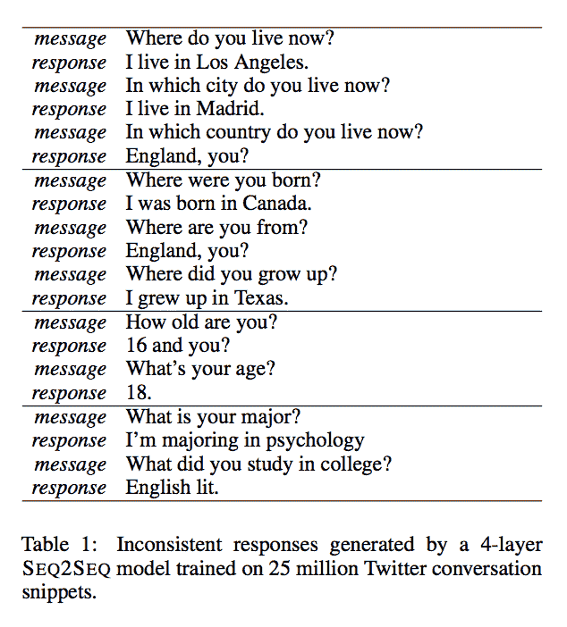
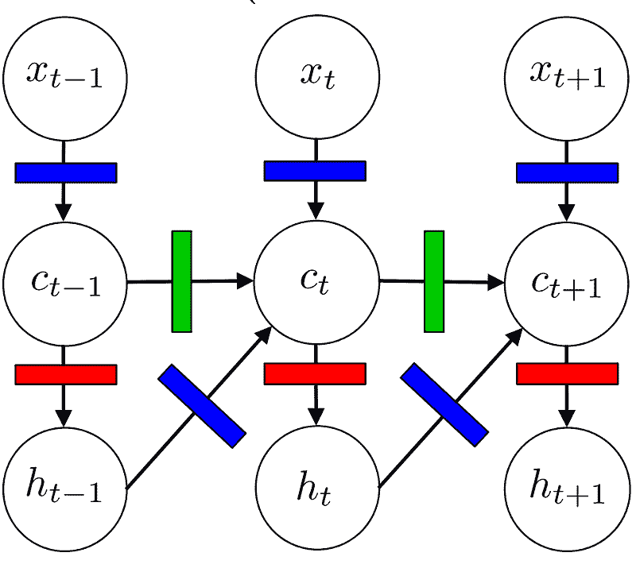
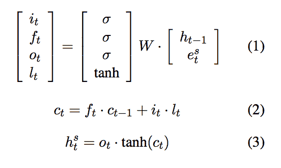
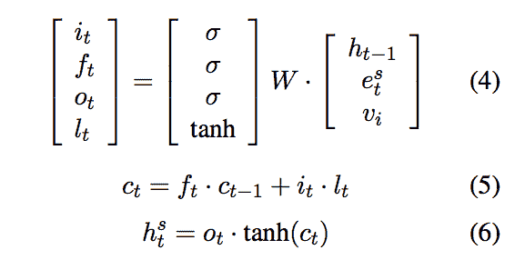
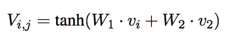
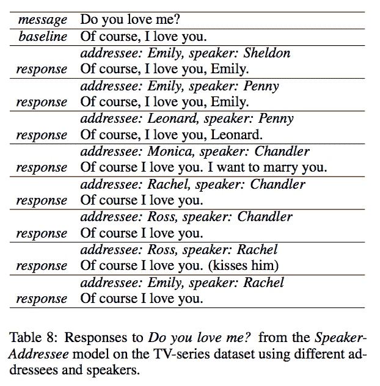

# 人类向量：融合说话者嵌入，使您的机器人更强大

> 原文：[`www.kdnuggets.com/2016/09/human-vector-incorporate-speaker-embedding-powerful-bot.html`](https://www.kdnuggets.com/2016/09/human-vector-incorporate-speaker-embedding-powerful-bot.html)

**由 Megan Barnes, Init.ai 提供**。

我们如何评估人工智能？你可能最近听说过[**自动驾驶汽车**](https://medium.com/self-driving-cars)；它们的发布似乎迫在眉睫。自动驾驶汽车有一个明确的评估目标：*不要发生碰撞*。除了避免事故之外，并没有关于汽车驾驶*好坏*的概念。

在对话代理的工程挑战中，我们对期望的标准变得越来越高且模糊。在对话式人工智能中有一个类似于*不要发生碰撞*的概念：功能性失败。我们能够识别出机器人何时真的不了解我们。它们的回答可能不会解答我们的问题，与对话无关，或者根本没有意义。背后研究者在“[A Persona-Based Neural Conversation Model](http://nlp.stanford.edu/pubs/jiwei2016Persona.pdf)”中指出了机器人可能失败的一个更微妙的方式：它们的（缺乏）个性。

在人类对话中，我们依赖于对其他说话者行为的假设。这在[**语用学**](https://en.wikipedia.org/wiki/Pragmatics)领域被称为[**合作原则**](https://en.wikipedia.org/wiki/Cooperative_principle)。这一原则分解为‘[**准则**](https://en.wikipedia.org/wiki/Cooperative_principle#Grice.27s_Maxims)’，说话者要么遵循这些准则，要么违背它们。简而言之，我们依赖他人说出真实的陈述，提供尽可能多的信息，保持相关性，并适当地表达。当说话者故意违背这些准则时，它会传达我们可以理解的[**意义**](https://en.wikipedia.org/wiki/Implicature)（例如，讽刺，其中说话者做出明显不真实的陈述）。然而，当偏离准则是无意的时，它可能会使对话偏离轨道。

考虑一下来自“A Persona-Based Neural Conversation Model”的这些示例对话：

*(Li et al. 1)*

这里的问题在于我们对世界的知识使得这明显违反了质量准则（意指：*说实话*）。一个人不能同时生活在两个不同的地方或拥有两个不同的年龄。这意味着我们至少能理解到某些回答是不真实的。可以想象，一个熟练的英语使用者可能会故意做出这些完全相同的陈述，并在过程中产生一种含义。例如，在上面的最后一次交流中，回答者可能在开玩笑关于心理学专业所需的阅读量。是否真的有趣则是一个品味问题。与机器人不同的是，我们不期望看到幽默。我们很清楚不一致的回答是无意的，这使得沟通变得困难。

不一致回应的具体问题是语言建模的内在问题，因为数据驱动的系统旨在生成最有可能的回应，而不考虑回应的来源。在输出空间中进行搜索时，模型根据最可能的单词序列来推断另一个序列。在上述研究中，基线模型是一个[LSTM](https://en.wikipedia.org/wiki/Long_short-term_memory) [递归神经网络](https://en.wikipedia.org/wiki/Recurrent_neural_network)，这是一种在对话 AI 中常见的架构。它使用 softmax 函数在可能的输出上创建概率分布，并选择序列中最可能的下一个单词，无论训练数据中是谁生成的。人类发言者期望与他们交谈的机器人保持一致的*角色*，而当前技术忽视了这一点。

李等人将人物角色描述为“由身份元素（背景事实或用户档案）、语言行为和互动风格的组合”（1）。一个人物角色基于生成部分训练数据的真实个体，并由一个向量，即发言者嵌入，表示。他们随机初始化发言者嵌入，并在训练过程中学习这些嵌入。

一个基本的 LSTM 可以用如下图形表示：

*(Kevin Gimpel 2016)*

其中*x*表示序列中的词嵌入，*c*表示隐藏层，*h*表示模型的输出，所有这些在时间*t*。彩色矩形表示门，用于转换输入向量。该模型也可以用下面的函数表示（其中*e*代替*x*表示词嵌入），*i, f, o*和*l*代表上面的多色门。

*(李等人 2)*

在李等人称之为发言者模型的研究中，他们将模型注入了发言者嵌入向量**v**，如下面的表示所示。

*(李等人 3)*

这将发言者*i*的信息添加到序列的每一个时间步中。这相当于在 LSTM 图形模型的隐藏层中添加一个*v*输入节点，标记为蓝色门。将发言者嵌入融入 LSTM 模型中提高了其性能，降低了困惑度，并在大多数研究人员检查的数据集中提高了 BLEU 分数。

研究人员还指出，一个单一的角色应该是可适应的。一个人不会用相同的方式称呼他们的老板和他们的小弟弟。因此，他们还决定尝试他们称之为发言者-受话者模型的方案。该模型用发言者对嵌入**V**替代了发言者嵌入，其形式如下。发言者对嵌入旨在建模特定个体之间的互动。

*(李等，4)*

说话者-听众模型取得了类似的成功。这是一个特别有趣的结果，说明说话者-听众模型在使用电影对话数据进行训练时生成的（参考了《老友记》和《生活大爆炸》中的角色关系）：

*(李等，8)*

李等研究的重要启示是，人工智能是一个多样化的领域，包含需要细致解决方案的各种任务。神经网络很棒，但如果它们被当作黑箱对待，在复杂任务如对话上只能发挥有限作用。我们需要考虑我们实际期望从机器人中得到什么。连贯的、适应性的个性和量身定制的系统是实现复杂结果的关键。毕竟，我们对机器人的期望不仅仅是避免崩溃。

**简介: [梅根·巴恩斯](https://medium.com/@megan.initai)** 是一名从事机器学习基础设施工作的软件开发人员。如果你对对话界面感兴趣，可以关注她的[Medium](https://medium.com/@megan.initai)和[Twitter](https://twitter.com/megan_initai)。

如果你打算为你的公司创建一个对话应用程序，可以查看[**Init.ai**](http://init.ai/)和我们在[Medium](https://medium.com/init-ai)上的博客，或在[Twitter](https://twitter.com/initdotai)上与我们联系。查看这篇文章中提到的原始研究[这里](http://nlp.stanford.edu/pubs/jiwei2016Persona.pdf)。

[原文](https://blog.init.ai/the-human-vector-incorporate-speaker-embeddings-to-make-your-bot-more-powerful-ade6fdfca035)。经允许转载。

**相关:**

+   聊天机器人深度学习，第二部分——在 TensorFlow 中实现检索型模型

+   构建数据驱动对话系统的可用语料库调查

+   人工智能‘聊天机器人’——何时或是否？

* * *

## 我们的前三个课程推荐

 1\. [谷歌网络安全证书](https://www.kdnuggets.com/google-cybersecurity) - 快速进入网络安全职业生涯。

 2\. [谷歌数据分析专业证书](https://www.kdnuggets.com/google-data-analytics) - 提升你的数据分析水平

 3\. [谷歌 IT 支持专业证书](https://www.kdnuggets.com/google-itsupport) - 支持你的组织 IT

* * *

### 更多相关话题

+   [Python 向量数据库与向量索引：LLM 应用架构](https://www.kdnuggets.com/2023/08/python-vector-databases-vector-indexes-architecting-llm-apps.html)

+   [ChatGPT 的工作原理：机器人背后的模型](https://www.kdnuggets.com/2023/04/chatgpt-works-model-behind-bot.html)

+   [利用数据科学实现清洁能源的公平性](https://www.kdnuggets.com/2022/03/data-science-make-clean-energy-equitable.html)

+   [绿色 AI：使应用程序更可持续的 7 种策略](https://www.kdnuggets.com/greening-ai-7-strategies-to-make-applications-more-sustainable)

+   [LLaMA 3：Meta 最强大的开源模型](https://www.kdnuggets.com/llama-3-metas-most-powerful-open-source-model-yet)

+   [支持向量机：直观的方法](https://www.kdnuggets.com/2022/08/support-vector-machines-intuitive-approach.html)
