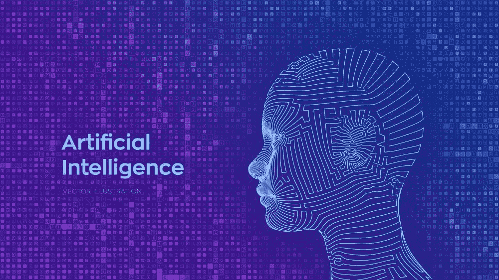

# 混合人工智能将在 2022 年成为主流

> 原文：[`www.kdnuggets.com/2022/03/hybrid-ai-go-mainstream-2022.html`](https://www.kdnuggets.com/2022/03/hybrid-ai-go-mainstream-2022.html)

[科学矢量由 iuriimotov 创建 - www.freepik.com](https://www.freepik.com/vectors/science)

人工智能（AI）正在成为全球数据生态系统中的主导趋势，预计在本十年展开时将加速发展。数据社区对人工智能及其能力了解得越多，就能越快地提升 IT 系统和结构。这也是 IDC 预测市场将[超过 5000 亿美元](https://www.idc.com/getdoc.jsp?containerId=prUS48127321)的主要原因，预计最早在 2024 年就会渗透到几乎所有行业，推动大量应用和服务的涌现，旨在提高工作效率。事实上，CB Insights Research 报告显示，到 2021 年第三季度末，AI 公司融资已[超越 2020 年水平](https://www.cbinsights.com/research/report/ai-trends-q3-2021/)，增长约 55%，创造了全球连续第四个季度的新纪录。

* * *

## 我们的三大课程推荐

 1\. [Google 网络安全证书](https://www.kdnuggets.com/google-cybersecurity) - 快速进入网络安全职业的快车道。

 2\. [Google 数据分析专业证书](https://www.kdnuggets.com/google-data-analytics) - 提升你的数据分析能力

 3\. [Google IT 支持专业证书](https://www.kdnuggets.com/google-itsupport) - 支持你的组织的 IT

* * *

2022 年，我们可以预期人工智能将在解决阻碍非结构化语言数据驱动过程的实际问题上变得更加出色，这要归功于在自然语言理解（NLU）等复杂认知任务中的进步。与此同时，对人工智能的行为及其原因的审查也将增加，例如美国国家标准与技术研究院（NIST）正在进行的旨在实现更[可解释的人工智能](https://nvlpubs.nist.gov/nistpubs/ir/2021/NIST.IR.8312.pdf)的努力。这将需要对人工智能的算法功能提供更大的透明度，而不会降低其性能或提高成本。

## **你可以通过一个词所处的环境来了解它**

在人工智能必须应对的所有挑战中，理解语言是最困难的之一。虽然大多数 AI 解决方案可以在眨眼之间处理大量原始数字或结构化数据，但语言中的多种含义和细微差别，依据其所处的上下文则完全不同。语言往往是有语境的，这意味着它们在不同情况下传达不同的理解。对我们的大脑来说简单自然的东西，对任何软件来说都不是那么简单。

这就是为什么能够正确且可靠地解释语言的软件开发，已成为 AI 全面发展的关键因素。达到这种计算能力将真正开启 AI 发展的闸门，使其能够访问和吸收几乎任何类型的知识。

NLU（自然语言理解）是这个难题中的关键一环，因为它能够利用丰富的语言信息。语言存在于企业活动的所有方面，这意味着没有从这种数据中提取尽可能多的价值，AI 方法是无法完整的。

基于知识的或符号 AI 方法，利用知识图谱，它是一个开放的框架。其结构由人类创建，并被理解为代表现实世界，其中概念通过语义关系进行定义和关联。得益于知识图谱和 NLU 算法，你可以直接阅读和学习任何文本，深入理解数据如何被解读以及如何从这些解读中得出结论。这类似于我们作为人类能够创建自己的特定领域知识，它使得 AI 项目能够将其算法结果与明确的知识表示关联起来。

在 2022 年，我们应该看到这种结合不同技术的 AI 方法的明确转变。混合 AI 利用不同的技术来提高整体结果，更好地解决复杂的认知问题。混合 AI 是 NLU 和自然语言处理（NLP）越来越受欢迎的方法。将基于 AI 的知识或符号 AI 与学习模型（机器学习，ML）相结合，是解锁非结构化语言数据的价值的最有效方式，满足当今企业对准确性、速度和规模的要求。

使用知识、符号推理和语义理解不仅会产生更准确的结果和更高效、有效的 AI 环境，还会减少对繁琐且资源密集的训练的需求，避免浪费大量文档和昂贵的高速数据基础设施。领域特定的知识可以通过主题专家和/或机器学习算法来添加，利用对小规模、精确训练集数据的分析，快速有效地产出高度准确的可操作结果。

## **混合 AI 的世界**

但为什么这种转变现在才发生？为什么 AI 之前无法利用基于语言的知识？我们一直被引导相信学习方法可以解决我们的所有问题。在某些情况下，它们确实可以，但仅仅因为机器学习在某些需求和特定背景下表现良好，并不意味着它总是最佳方法。在语言理解和处理能力方面，我们经常看到这一点。仅在过去几年，我们才看到基于混合（或复合）AI 方法的自然语言理解的显著进展。

与其将一种形式的 AI（其工具有限）用于解决问题，我们现在可以利用多种不同的方法。每种方法可以从不同角度、使用不同模型来评估和解决问题，从而以多重背景的方式解决问题。由于这些技术可以相互独立评估，因此更容易确定哪些方法能提供最优的结果。

随着企业已经体验到 AI 的潜力，这种混合方法有望在 2022 年成为战略性举措。它能显著节省时间和成本，同时提高分析和运营过程的速度、准确性和效率。举一个例子，目前的注释过程主要由特定专家执行，主要是由于培训的困难和费用。然而，通过结合适当的知识库和图谱，培训可以大大简化，使得这一过程能够在知识工作者中实现民主化。

## **更多内容即将推出**

当然，各种形式的 AI 研究仍在进行中。但我们将特别关注扩展知识图谱和自动化机器学习及其他技术，因为企业面临着快速且低成本利用大量数据的持续压力。

随着时间的推移，我们将看到组织在将这些混合模型应用于核心流程方面的稳定改进。商业自动化，如电子邮件管理和搜索，已经在眼前。例如，当前基于关键词的搜索方法本质上无法吸收和解释整个文档，因此只能提取基本的、主要是非上下文的信息。同样，自动化电子邮件管理系统也很少能穿透简单产品名称和其他信息点之外的意义。最终，用户需要从长长的搜索结果列表中筛选出重要的信息。这减慢了流程，延迟了决策，最终阻碍了生产力和收入。

在混合框架下赋予自然语言理解工具符号理解能力，将使所有基于知识的组织能够模拟人类在智能自动化过程中理解整个文档的能力。

**[Marco Varone](https://www.linkedin.com/in/marco-varone/)** 是 [expert.ai](https://www.expert.ai/) 的创始人兼首席技术官，该平台是语言理解领域的顶级人工智能平台。其独特的混合 NL 方法结合了符号化的人类理解与机器学习，从非结构化数据中提取有用的知识和洞见。

### 更多相关话题

+   [MLOps：将人工智能推向主流的关键](https://www.kdnuggets.com/2022/07/mlops-key-pushing-ai-mainstream.html)

+   [9 月 26-30 日：SIAM 数据科学数学会议（混合形式）](https://www.kdnuggets.com/2022/08/siam-conference-mathematics-data-science-hybrid.html)

+   [Windows on Snapdragon 将混合人工智能带到边缘应用](https://www.kdnuggets.com/qualcomm-windows-on-snapdragon-brings-hybrid-ai-to-apps-at-the-edge)

+   [人工智能、分析、机器学习、数据科学、深度学习…](https://www.kdnuggets.com/2021/12/developments-predictions-ai-machine-learning-data-science-research.html)

+   [数据科学与分析行业 2021 年主要发展及关键…](https://www.kdnuggets.com/2021/12/developments-predictions-data-science-analytics-industry.html)

+   [云计算机器学习的视角：2021 年的惊喜与 2022 年的预测](https://www.kdnuggets.com/2021/12/cloud-ml-perspective-surprises-2021-projections-2022.html)
