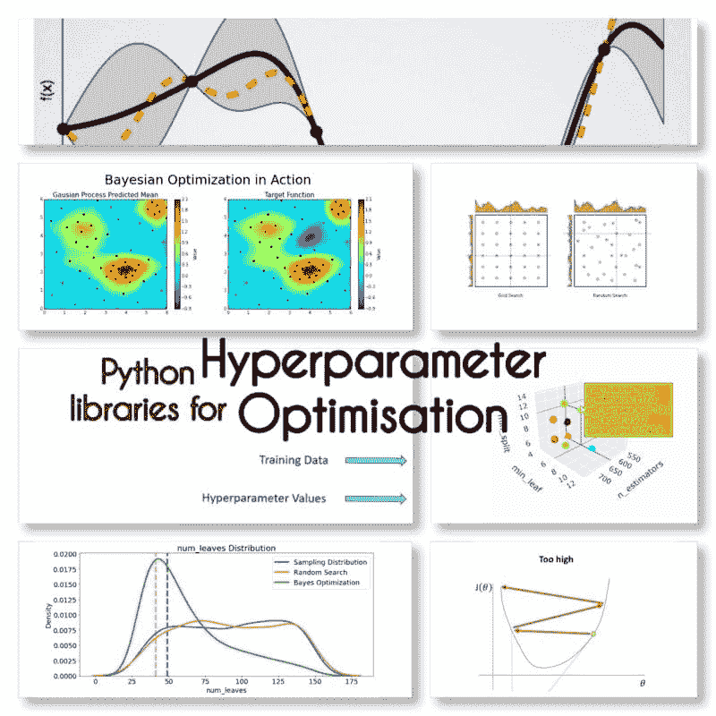

# 超参数优化：10 个顶级 Python 库

> 原文：[`www.kdnuggets.com/2023/01/hyperparameter-optimization-10-top-python-libraries.html`](https://www.kdnuggets.com/2023/01/hyperparameter-optimization-10-top-python-libraries.html)

图片由作者提供

超参数优化在确定机器学习模型的性能中起着关键作用。它们是训练的三个组成部分之一。

* * *

## 我们的前三大课程推荐

 1\. [谷歌网络安全证书](https://www.kdnuggets.com/google-cybersecurity) - 快速进入网络安全职业生涯。

 2\. [谷歌数据分析专业证书](https://www.kdnuggets.com/google-data-analytics) - 提升你的数据分析技能

 3\. [谷歌 IT 支持专业证书](https://www.kdnuggets.com/google-itsupport) - 支持你的组织的 IT 需求

* * *

# 模型的 3 个组成部分

## 训练数据

训练数据是算法利用的内容（可以理解为构建模型的指令），用于识别模式。

## 参数

算法通过根据训练数据调整参数（如权重）来“学习”，以进行准确预测，这些预测作为最终模型的一部分保存。

## 超参数

超参数是调节训练过程的变量，在训练过程中保持不变。

# 不同类型的搜索

## 网格搜索

用提供的超参数值的所有可能组合训练模型是一个耗时的过程。

## 随机搜索

训练模型时随机从定义的分布中抽样超参数值，这是一种更有效的搜索方法。

## 拥有网格搜索

用所有值训练模型，然后通过仅考虑在上轮表现最佳的参数值来重复“对搜索空间进行二分”。

## 贝叶斯搜索

从初始值开始，利用模型的表现来调整这些值。这就像侦探从嫌疑人列表开始，然后使用新信息来缩小列表。

# 超参数优化的 Python 库

我找到了这 10 个用于超参数优化的 Python 库。

## Optuna

你可以通过名为 optuna-dashboard 的实时 Web 仪表板调节几乎所有的 ML、DL 包/框架的估计器，包括 Sklearn、PyTorch、TensorFlow、Keras、XGBoost、LightGBM、CatBoost 等。

## Hyperopt

使用贝叶斯优化进行优化，包括条件维度。

## Scikit-learn

不同的搜索方法，如 GridSearchCV 或 HalvingGridSearchCV。

## Auto-Sklearn

AutoML 和 scikit-learn 估计器的替代品。

## 超活跃

非常容易学习但极其多才多艺，提供智能优化。

## Optunity

提供了不同的方法以及大量的评分函数。

## HyperparameterHunter

自动保存/从实验中学习以进行持续优化

## MLJAR

AutoML 从 ML 流水线生成 Markdown 报告

## KerasTuner

内置贝叶斯优化、Hyperband 和随机搜索算法

## Talos

TensorFlow、Keras 和 PyTorch 的超参数优化。

我是否遗漏了任何库？

**来源：**

+   [超参数优化](https://towardsdatascience.com/hyperparameters-optimization-526348bb8e2d)

**[玛丽亚姆·米拉迪](https://www.linkedin.com/in/maryammiradi/)** 是一名人工智能和数据科学负责人，拥有机器学习和深度学习的博士学位，专注于自然语言处理和计算机视觉。她拥有超过 15 年的成功人工智能解决方案经验，成功交付了 40 多个项目。她曾在 12 个不同的组织中工作，涵盖了金融犯罪检测、能源、银行、零售、电子商务和政府等多个行业。

### 该主题的更多内容

+   [使用 Grid Search 和 Random Search 在 Python 中进行超参数调优](https://www.kdnuggets.com/2022/10/hyperparameter-tuning-grid-search-random-search-python.html)

+   [超参数调优：GridSearchCV 和 RandomizedSearchCV 的解释](https://www.kdnuggets.com/hyperparameter-tuning-gridsearchcv-and-randomizedsearchcv-explained)

+   [数据科学、数据可视化与…的前 38 个 Python 库](https://www.kdnuggets.com/2020/11/top-python-libraries-data-science-data-visualization-machine-learning.html)

+   [使用 TPOT 优化机器学习流水线](https://www.kdnuggets.com/2021/05/machine-learning-pipeline-optimization-tpot.html)

+   [使用 AIMET 的神经网络优化](https://www.kdnuggets.com/2022/04/qualcomm-neural-network-optimization-aimet.html)

+   [SQL 查询优化技巧](https://www.kdnuggets.com/2023/03/sql-query-optimization-techniques.html)
