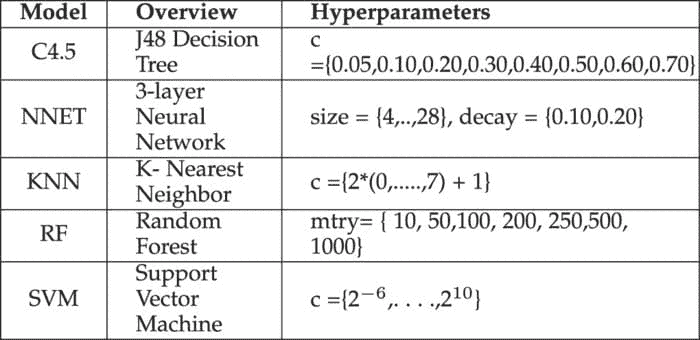
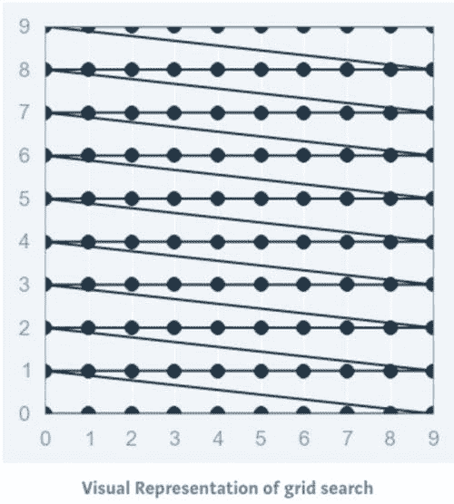
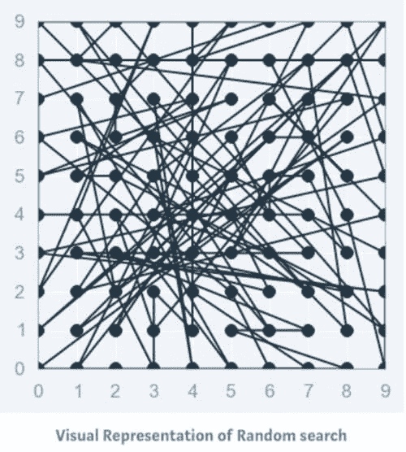
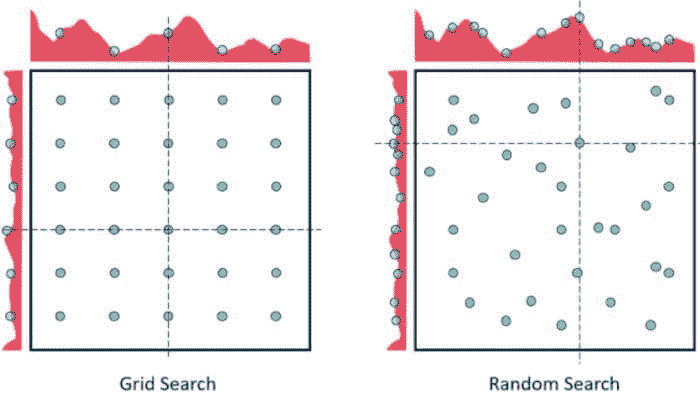
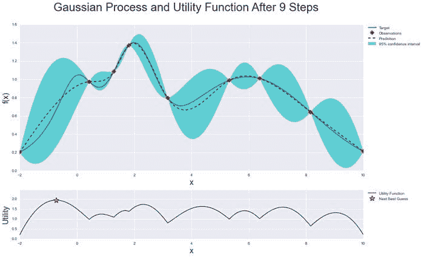
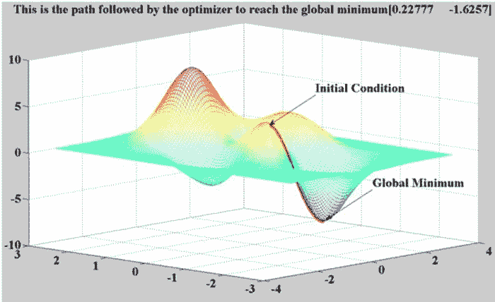
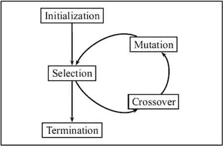

# 机器学习模型的超参数优化

> 原文：[`www.kdnuggets.com/2020/05/hyperparameter-optimization-machine-learning-models.html`](https://www.kdnuggets.com/2020/05/hyperparameter-optimization-machine-learning-models.html)

评论

[致谢](https://swisscognitive.ch/2020/01/13/machine-learning-in-adversity/)

### 介绍

* * *

## 我们的前三个课程推荐

 1\. [谷歌网络安全证书](https://www.kdnuggets.com/google-cybersecurity) - 快速开启网络安全职业生涯。

 2\. [谷歌数据分析专业证书](https://www.kdnuggets.com/google-data-analytics) - 提升您的数据分析技能。

 3\. [谷歌 IT 支持专业证书](https://www.kdnuggets.com/google-itsupport) - 支持您的组织的 IT。

* * *

模型优化是实现机器学习解决方案中的最大挑战之一。整个机器学习和深度学习理论的分支都致力于模型优化。

机器学习中的超参数优化旨在找到给定机器学习算法的超参数，以在验证集上测得最佳性能。与模型参数不同，超参数由机器学习工程师在训练前设定。随机森林中的树木数量是一个超参数，而神经网络中的权重是训练过程中学习到的模型参数。我喜欢把超参数看作是模型设置，需要调整以使模型能够最佳地解决机器学习问题。

一些模型超参数的例子包括：

+   用于训练神经网络的`learning rate`。

+   支持向量机中的`**C**`和`**????**`超参数。

+   k-最近邻算法中的`**k**`。

超参数优化找到一个超参数组合，以返回一个最优模型，该模型减少了预定义的损失函数，从而提高了给定独立数据上的准确性。



[带有相应超参数的分类模型。](https://www.computer.org/csdl/journal/ts/2018/06/07990590/13rRUx0gerA)

### 超参数优化方法

超参数对机器学习算法的训练有直接影响。因此，为了实现最佳性能，了解如何优化它们是很重要的。以下是一些常见的超参数优化策略：

### **1\. 手动超参数调整**

传统上，超参数是通过试错法手动调整的。这**仍然**是常见的做法，经验丰富的工程师可以“猜测”出能够为 ML 模型提供非常高准确度的参数值。然而，仍在不断寻找更好、更快、更自动化的优化超参数的方法。

### 2\. 网格搜索

网格搜索可以说是最基本的超参数调优方法。使用这种技术，我们只是为提供的所有超参数值的每个可能组合构建一个模型，评估每个模型，并选择产生最佳结果的架构。



网格搜索不仅适用于一种模型类型，还可以应用于机器学习中的各类模型，以计算用于任何给定模型的最佳参数。

例如，典型的软间隔支持向量机（SVM）分类器配备了 RBF 核函数，它有至少两个超参数需要优化以在未见数据上获得良好性能：正则化常数*C*和核超参数 γ。两个参数都是连续的，因此为了进行网格搜索，需要为每个参数选择一个有限的“合理”值，比如


网格搜索然后用这两个集合的笛卡尔积中的每一对（*C*, γ）训练一个 SVM，并在保留的验证集上评估它们的性能（或者通过对训练集的内部交叉验证，在这种情况下，每对会训练多个 SVM）。最后，网格搜索算法输出在验证过程中获得的最高分的设置。

**它在 Python 中如何工作？**

```py
from sklearn.datasets import load_iris
from sklearn.svm import SVC
iris **=** load_iris()
svc **=** SVR()
```

这是一个使用`[GridSearchCV](https://scikit-learn.org/stable/modules/generated/sklearn.model_selection.GridSearchCV.html)`来自`sklearn`库的网格搜索的 Python 实现。

```py
from sklearn.model_selection import GridSearchCV
from sklearn.svm import SVR
grid = GridSearchCV(
        estimator=SVR(kernel='rbf'),
        param_grid={
            'C': [0.1, 1, 100, 1000],
            'epsilon': [0.0001, 0.0005, 0.001, 0.005, 0.01, 0.05, 0.1, 0.5, 1, 5, 10],
            'gamma': [0.0001, 0.001, 0.005, 0.1, 1, 3, 5]
        },
        cv=5, scoring='neg_mean_squared_error', verbose=0, n_jobs=-1)
```

网格搜索的实现：

```py
grid.fit(X,y)
```

网格搜索的方法：

```py
#print the best score throughout the grid search
print grid.best_score_#print the best parameter used for the highest score of the model.
print grid.best_param_
```

然后，我们使用在网格搜索中选择的最佳超参数值，应用于实际模型，如上所示。

网格搜索的**缺点**之一是当涉及到维度时，它在评估超参数数量指数增长时表现不佳。然而，没有保证搜索会产生完美的解决方案，因为它通常通过在正确的集合周围徘徊来找到一个。

### 3\. 随机搜索

通常，有些超参数比其他超参数更为重要。进行随机搜索而不是网格搜索可以更精确地发现重要超参数的良好值。



随机搜索设置了一个超参数值的网格，并选择随机组合来训练模型和评分。这允许你明确控制尝试的参数组合的数量。搜索迭代的次数根据时间或资源进行设置。Scikit Learn 提供了`RandomizedSearchCV`函数来执行这一过程。

尽管`RandomizedSearchCV`可能找不到像`GridSearchCV`那么准确的结果，但它往往在比`GridSearchCV`快得多的时间内选出最佳结果。考虑到相同的资源，随机搜索甚至可能优于网格搜索。这在使用连续参数时可以在下面的图示中看到。

随机搜索的机会相对较高，因为随机搜索模式下，模型可能会在优化参数上进行训练而没有任何别名。由于维度较低，随机搜索在找到合适参数集的时间更短，因此适用于较低维度的数据。对于维度较少的情况，随机搜索是最佳的参数搜索技术。

在深度学习算法的情况下，它优于网格搜索。



[致谢](https://community.alteryx.com/t5/Data-Science-Blog/Hyperparameter-Tuning-Black-Magic/ba-p/449289)

在上图中，恭喜你有两个参数，通过 5x6 网格搜索你只检查每个参数的 5 种不同值（左侧图中的六行五列），而通过随机搜索你检查了每个参数的 14 种不同值。

**它在 Python 中如何工作？**

```py
from sklearn.datasets import load_iris
from sklearn.ensemble import RandomForestRegressor
iris **=** load_iris()
rf = RandomForestRegressor(random_state = 42)
```

下面是使用`sklearn`库的`RandomizedSearchCV`进行网格搜索的 Python 实现。

```py
from sklearn.model_selection import RandomizedSearchCV
random_grid = {'n_estimators': n_estimators,
               'max_features': max_features,
               'max_depth': max_depth,
               'min_samples_split': min_samples_split,
               'min_samples_leaf': min_samples_leaf,
               'bootstrap': bootstrap}rf_random = RandomizedSearchCV(estimator = rf, param_distributions = random_grid, n_iter = 100, cv = 3, verbose=2, random_state=42, n_jobs = -1)# Fit the random search model
```

随机搜索的拟合：

```py
rf_random.fit(X,y)
```

网格搜索中运行的方法：

```py
#print the best score throughout the grid search
print rf_random.best_score_#print the best parameter used for the highest score of the model.
print rf_random.best_param_Output:
**{'bootstrap': True,
 'max_depth': 70,
 'max_features': 'auto',
 'min_samples_leaf': 4,
 'min_samples_split': 10,
 'n_estimators': 400}**
```

### 4\. 贝叶斯优化

之前的两个方法通过各种超参数值进行单独实验，并记录每个模型的表现。由于每个实验都是孤立进行的，因此很容易并行化这个过程。然而，由于每个实验都是孤立进行的，我们无法利用一个实验的信息来改进下一个实验。贝叶斯优化属于*基于模型的序列优化*（SMBO）算法的一类，允许我们使用先前迭代的结果来改进下一次实验的采样方法。

这反过来限制了模型需要训练的次数，因为只有那些预计会产生更高验证分数的设置才会被传递以供评估。

贝叶斯优化通过构建最能描述你想优化的函数的后验分布（高斯过程）来工作。随着观察数量的增加，后验分布会改进，算法对参数空间中值得探索和不值得探索的区域变得更加确定。

我们可以在下面的图像中看到这一点：



来源：[贝叶斯优化](https://github.com/fmfn/BayesianOptimization)

当你一遍遍迭代时，算法会在考虑目标函数已知信息的基础上平衡探索和开发的需求。在每一步中，将为已知样本（之前探索过的点）拟合一个高斯过程，并结合探索策略（如 UCB（上置信界）或 EI（期望改进）），以确定应探索的下一点。

使用贝叶斯优化，我们可以更智能地探索参数空间，从而减少进行此过程所需的时间。

你可以查看下面的贝叶斯优化的 Python 实现：

[**thuijskens/bayesian-optimization**](https://github.com/thuijskens/bayesian-optimization/blob/master/ipython-notebooks/svm-optimization.ipynb)

### 5\. 基于梯度的优化

它特别用于神经网络的情况。它计算关于超参数的梯度，并使用梯度下降算法对其进行优化。

计算梯度问题并不是最难的，至少在高级的[自动微分](https://en.wikipedia.org/wiki/Automatic_differentiation)软件出现之后。（**当然，为所有 sklearn 分类器以通用方式实现这一点并不容易**）



[Credits](https://www.mathworks.com/matlabcentral/fileexchange/27631-derivative-based-optimization)

尽管有一些人使用这种想法的工作，但他们只是为一些特定且明确的问题（例如 SVM 调优）做了这件事。此外，这可能有很多假设，因为：

> 为什么这不是一个好主意？

**1\. 超参数优化通常是不平滑的**

+   GD 真的喜欢平滑函数，因为零梯度没有帮助。

+   每个由某些离散集合定义的超参数（例如 l1 与 l2 惩罚的选择）会引入不平滑的表面。

**2\. 超参数优化通常是非凸的**

+   梯度下降的整个收敛理论假设基础问题是凸的。

+   好的情况：你能获得某个局部最小值（可以非常糟糕）。

+   最坏的情况：梯度下降甚至没有收敛到某个局部最小值。

要获取 Python 实现和更多关于梯度下降优化算法的信息，请[点击这里](https://hackernoon.com/implementing-different-variants-of-gradient-descent-optimization-algorithm-in-python-using-numpy-809e7ab3bab4)。

### **6\. 进化优化**

进化优化遵循一个受生物进化概念启发的过程，由于自然进化是在变化环境中的动态过程，因此它们也非常适合动态优化问题。



进化算法通常用于寻找良好的近似解决方案，这些方案无法通过其他技术轻易解决。优化问题通常没有精确的解决方案，因为找到最优解决方案可能过于耗时和计算密集。然而，在这种情况下，进化算法是理想的，因为它们可以用于找到一个接近最优的解决方案，这通常是足够的。

进化算法的一个优点是它们可以生成没有任何人为误解或偏见的解决方案，这意味着它们可以产生我们可能永远无法自己想出的惊人想法。

你可以在[这里](https://en.wikipedia.org/wiki/Evolutionary_algorithm)了解更多关于进化算法的信息。你也可以在[这里](https://github.com/MorvanZhou/Evolutionary-Algorithm)查看 Python 实现。

> 一般来说，每当你想要优化调优超参数时，请考虑网格搜索和随机搜索！

### 结论

在本文中，我们了解到寻找合适的超参数值可能是一项令人沮丧的任务，可能导致机器学习模型的欠拟合或过拟合。我们看到如何通过使用网格搜索、随机搜索和其他算法来克服这一难题——这些算法优化超参数的调优，以节省时间并消除通过随机猜测导致的过拟合或欠拟合的可能性。

好了，这篇文章到此结束**。**希望你们喜欢阅读这篇文章，欢迎在评论区分享你的评论/想法/反馈。

感谢阅读 !!!

**作者：[纳戈什·辛格·乔汉](https://www.linkedin.com/in/nagesh-singh-chauhan-6936bb13b/)** 是一名数据科学爱好者。对大数据、Python 和机器学习感兴趣。

[原文](https://medium.com/swlh/hyperparameter-optimization-for-machine-learning-models-12582f00ae52)。经许可转载。

**相关：**

+   如何在 3 个简单步骤中对任何 Python 脚本进行超参数调优

+   使用 Biopython 进行冠状病毒 COVID-19 基因组分析

+   实用超参数优化

### 更多相关内容

+   [超参数优化：10 个顶级 Python 库](https://www.kdnuggets.com/2023/01/hyperparameter-optimization-10-top-python-libraries.html)

+   [使用 TPOT 进行机器学习管道优化](https://www.kdnuggets.com/2021/05/machine-learning-pipeline-optimization-tpot.html)

+   [使用网格搜索和随机搜索进行超参数调优](https://www.kdnuggets.com/2022/10/hyperparameter-tuning-grid-search-random-search-python.html)

+   [超参数调优：GridSearchCV 和 RandomizedSearchCV 解析](https://www.kdnuggets.com/hyperparameter-tuning-gridsearchcv-and-randomizedsearchcv-explained)

+   [SQL 查询优化技术](https://www.kdnuggets.com/2023/03/sql-query-optimization-techniques.html)

+   [数据库优化：探索 SQL 中的索引](https://www.kdnuggets.com/2023/07/database-optimization-exploring-indexes-sql.html)
