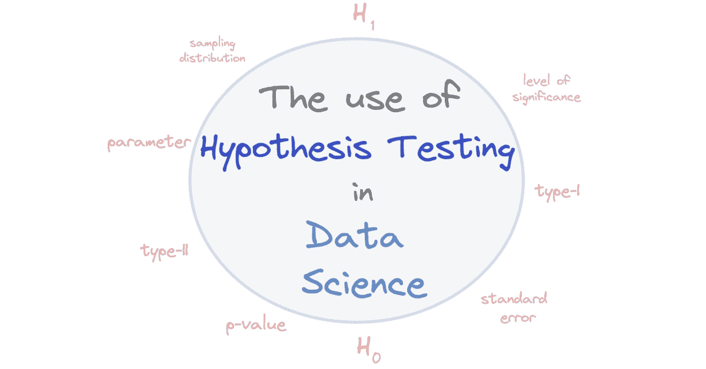

# 数据科学中的假设检验

> 原文：[`www.kdnuggets.com/2023/02/hypothesis-testing-data-science.html`](https://www.kdnuggets.com/2023/02/hypothesis-testing-data-science.html)

作者提供的图片

‘**假设**’一词源自希腊语单词‘hupo’，意思是“下方”，以及‘thesis’，意思是“放置”。利用有限的证据推断出一个可以作为进一步调查的起点的想法。

* * *

## 我们的前三大课程推荐

 1\. [谷歌网络安全证书](https://www.kdnuggets.com/google-cybersecurity) - 快速开启网络安全职业生涯。

 2\. [谷歌数据分析专业证书](https://www.kdnuggets.com/google-data-analytics) - 提升你的数据分析技能

 3\. [谷歌 IT 支持专业证书](https://www.kdnuggets.com/google-itsupport) - 支持你所在的组织进行 IT 工作

* * *

所以你可以说‘假设’是一个有根据的猜测，但这并不意味着它不能被证明是真实的。

# 什么是假设检验？

当我们提到**假设检验**时，这意味着使用系统化的程序来决定数据和研究是否可以支持我们对人群的特定理论。

我们通过使用两个互斥的假设关于一个人群，并评估这些陈述来决定这些陈述是否得到样本数据的支持。

## 什么时候在数据科学中使用假设检验？

如果你想根据预测结果进行比较，那么你需要使用假设检验。它将允许你比较发现的前后结果。

它通常用于我们想要比较的情况：

+   一个组与外部标准

+   两个或更多组之间

# 假设检验与假设生成

在数据科学的世界里，构建假设时有两个方面需要考虑。

**假设检验**是当团队根据现有数据集构建一个强有力的假设时。这将帮助团队在整个数据科学项目中进行指导和规划。然后使用完整的数据集对假设进行检验，并确定它是否：

+   零假设 - 人群中没有效应

+   替代假设 - 人群中存在某种效应

**假设生成**是基于各种因素的有根据的猜测，用于解决当前问题。它是将我们的解决问题能力与商业直觉结合的过程。你将关注特定因素如何影响目标变量，然后通过假设检验得出变量之间的关系。

# 不同类型的假设检验

## 零假设

统计变量之间没有关系，这种测试称为零假设检验。零假设表示为 H0。零假设的类型有：

+   简单假设

+   复合假设

+   精确假设

+   不精确假设

## 替代假设

存在两个变量之间的关系，证明它们具有统计关联。替代假设表示为 H1 或 HA。替代假设可以分为：

1.  **单尾。** 这是指你在一个方向上进行测试，忽略与另一个方向上其他变量的关系。样本均值会高于或低于总体均值，但不会同时如此。

1.  **双尾。** 这是指你在两个方向上进行测试，显示样本均值是否高于或低于总体均值。

## 非方向性假设

这是指假设没有明确方向，但说明一个因素影响另一个因素，或者两个变量之间有相关性。然而，关键点是这两个变量之间没有方向。

## 方向性假设

这是指使用两个变量之间的特定方向关系构建的假设，并基于现有理论。

# 它在数据科学中的用途是什么？

在处理数据时，需要在查看、操控或进行任何形式的分析之前先提出问题。提问将帮助你在准备阶段，使分析更加容易。

数据科学家将生成不同的问题，这些问题需要回答以提升业务表现。这些问题将帮助引导数据科学项目，使其在决策过程中更加有效。

例如，当提问并一起形成假设时，数据科学家可以仔细考虑哪些变量会影响他们的项目，以及哪些变量不需要考虑。

假设帮助数据科学家：

+   更好地理解当前的业务问题，并深入挖掘数据集中的变量。

+   使他们能够得出哪些重要因素对于解决问题至关重要，并有效利用时间在不重要的因素上。

+   在准备阶段通过从各种对业务问题至关重要的来源收集数据来提供帮助。

通过使用假设检验来排除可能性，帮助数据科学家得出更好的结论。他们将能更好地集中精力于当前的问题，并做出有效的决策以呈现给高管。

# 假设检验的其他术语

## 参数

参数是对目标总体的总结描述。例如，如果你的任务是找出班级的平均身高，你需要询问班级中每个人的身高（总体）。因为每个人都被问到了相同的问题，所以你会得到一个真实的描述，并得到一个参数。

## 统计量

统计量是对总体（样本）的一个小部分的描述。以同样的例子为例，如果你现在的任务是找出你所在年龄组的平均身高，你可以利用你从班级（样本）中收集的信息。这类信息被称为统计量。

## 抽样分布

抽样分布是通过从特定总体中选择大量样本得到的概率分布。例如，如果你从 200 家咖啡店的总体中随机抽取 10 家咖啡店作为样本，那么这个随机样本可能是咖啡店编号 4、7、13、76、94、145、11、189、52、165，或其他任何组合。

## 标准误差

标准误差类似于标准偏差，两者都衡量数据的离散程度。值越高，数据的离散程度越大。然而，区别在于标准误差使用的是样本数据，而标准偏差使用的是总体数据。标准误差告诉你样本统计量与实际总体均值的偏离程度。

## Type-I 错误

Type-I 错误，也称为假阳性，发生在团队错误地拒绝一个真实的原假设时。这意味着报告表明你的发现是显著的，但实际上是偶然出现的。

## Type-II 错误

Type-II 错误，也称为假阴性，发生在团队未能拒绝一个实际上是错误的原假设时。这意味着报告表明你的发现并不显著，但实际上是显著的。

## 显著性水平

显著性水平是你愿意接受的做出假阳性结论（Type I 错误）的概率和最大风险。数据科学家、研究人员等会提前设定这个值，并将其作为统计显著性的阈值。

## P 值

P 值是指概率值，是与显著性水平比较的一个数值，用于决定是否拒绝原假设。它决定样本数据是否支持反对原假设的观点，并判断原假设是否为真。如果你的 p 值高于显著性水平，那么原假设并没有错或不成立，结果也不具有统计显著性。然而，如果你的 p 值低于显著性水平，结果将被解释为反对原假设并被视为具有统计显著性。

# 结论

本文介绍了假设检验的基础知识以及数据科学家为何使用它。假设检验是数据科学家工作流程中的一个重要环节。它为他们的假设提供了更多的信心，使他们能够毫不犹豫地向高层展示他们的工作。

如果你想了解更多关于假设检验的知识，一本好的读物是 [假设检验：数据驱动决策的直观指南](https://www.amazon.co.uk/Hypothesis-Testing-Intuitive-Making-Decisions/dp/173543115X/ref=asc_df_173543115X/?tag=googshopuk-21&linkCode=df0&hvadid=463217944075&hvpos=&hvnetw=g&hvrand=2769942567965261555&hvpone=&hvptwo=&hvqmt=&hvdev=c&hvdvcmdl=&hvlocint=&hvlocphy=1006886&hvtargid=pla-960679261325&psc=1&th=1&psc=1)。

**[尼莎·阿亚](https://www.linkedin.com/in/nisha-arya-ahmed/)** 是一位数据科学家和自由职业技术写作员。她特别感兴趣于提供数据科学职业建议或教程以及数据科学相关的理论知识。她还希望探索人工智能如何能够促进人类寿命的不同方式。作为一名热衷于学习的人员，她寻求拓宽技术知识和写作技能，同时帮助指导他人。

### 了解更多相关话题

+   [假设检验与 A/B 测试](https://www.kdnuggets.com/hypothesis-testing-and-ab-testing)

+   [假设检验解释](https://www.kdnuggets.com/2021/09/hypothesis-testing-explained.html)

+   [数据科学的必备 A/B 测试课程](https://www.kdnuggets.com/2023/02/essential-ab-testing-course-data-science.html)

+   [数据科学面试中的 24 个 A/B 测试面试问题](https://www.kdnuggets.com/2022/09/24-ab-testing-interview-questions-data-science-interviews-crack.html)

+   [机器学习中训练数据与测试数据的区别](https://www.kdnuggets.com/2022/08/difference-training-testing-data-machine-learning.html)

+   [机器学习中的有效测试](https://www.kdnuggets.com/2022/01/effective-testing-machine-learning.html)
