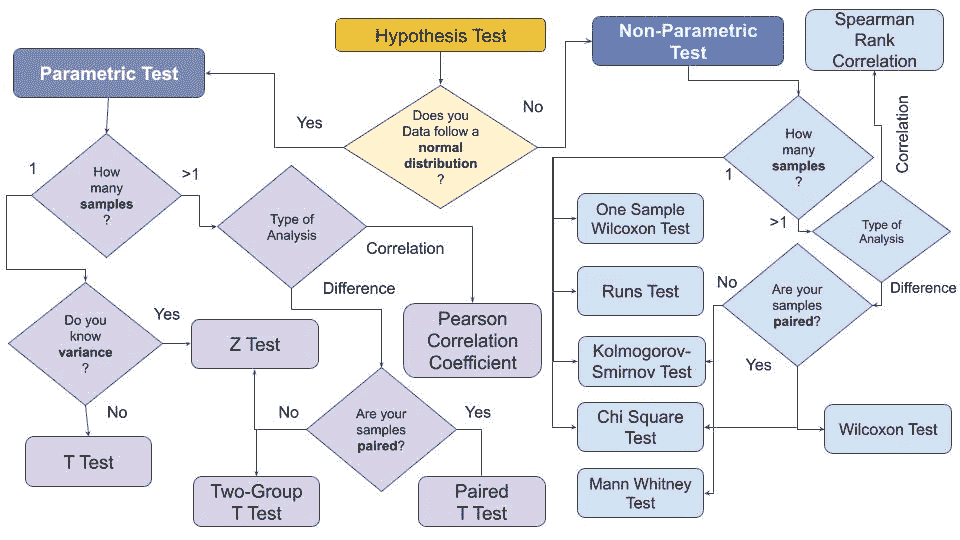
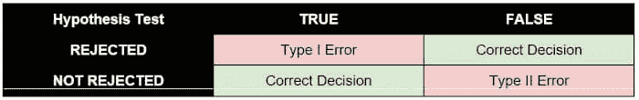
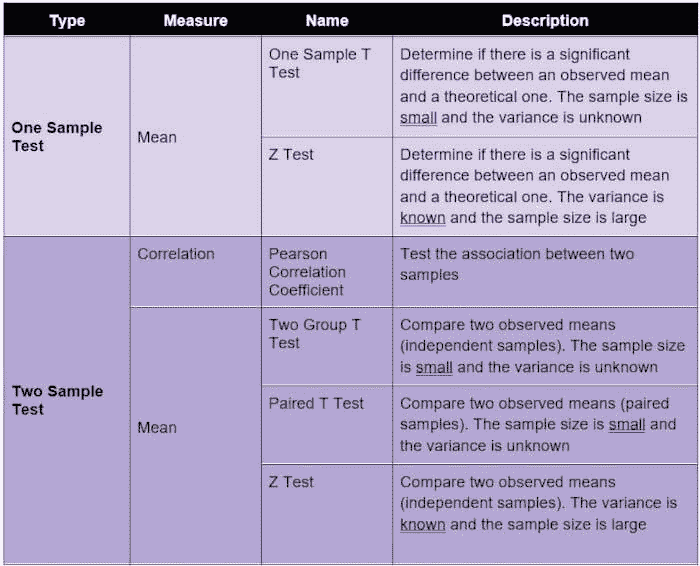
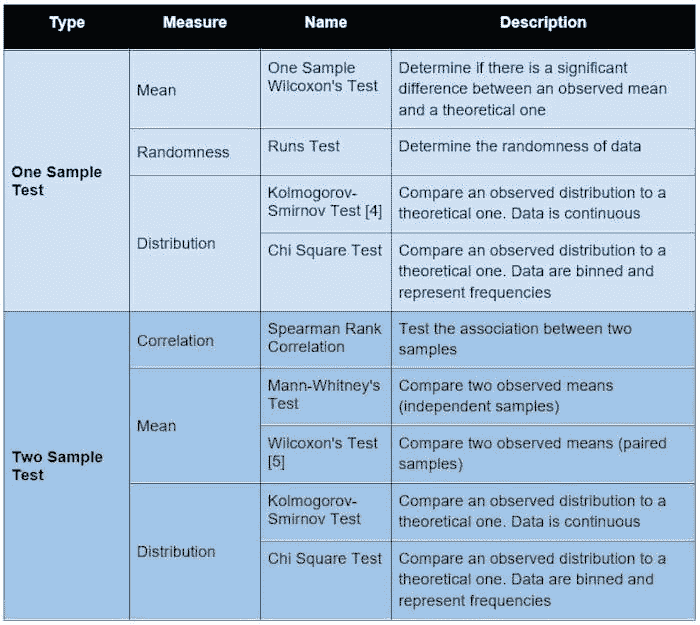

# 假设检验解释

> 原文：[`www.kdnuggets.com/2021/09/hypothesis-testing-explained.html`](https://www.kdnuggets.com/2021/09/hypothesis-testing-explained.html)

# 什么是假设检验？

* * *

## 我们的三大课程推荐

 1\. [谷歌网络安全证书](https://www.kdnuggets.com/google-cybersecurity) - 快速进入网络安全职业生涯。

 2\. [谷歌数据分析专业证书](https://www.kdnuggets.com/google-data-analytics) - 提升你的数据分析能力

 3\. [谷歌 IT 支持专业证书](https://www.kdnuggets.com/google-itsupport) - 在 IT 方面支持你的组织

* * *

根据吉姆·弗罗斯特的说法，假设检验是**一种推论统计形式，使我们能够根据代表性样本对整个总体得出结论** [..] 在大多数情况下，观察整个总体以了解其属性几乎是不可能的。唯一的替代方法是收集一个随机样本，然后使用统计学进行分析 [1]。

在进行假设检验时，首先必须提出一个假设。一个假设的例子是“总体中身高和性别之间存在相关性”，或者“两个总体组之间存在差异”。

通常，待证明的论点称为**替代假设**（HA），其对立面是**原假设**（H0）。在实践中，原假设表明总体中没有发生任何新事物。

在之前的示例中，原假设可以被表述为：总体中身高和性别之间没有相关性，并且两个组之间没有差异。假设检验的目的是验证是否可以拒绝原假设。**一般来说，拒绝原假设并不自动意味着接受替代假设。** 然而，在某些情况下，拒绝原假设可能意味着可以接受替代假设。

在进行假设检验时，可能会发生两种类型的错误：

+   第一类错误：当原假设实际上是正确的时拒绝原假设。

+   第二类错误：当原假设实际上是错误的时接受原假设。

以下表格总结了第一类和第二类错误：

# 假设检验的类型

假设检验可以分为两个大类 [2]：

+   **参数检验**，如果样本符合正态分布。一般来说，如果样本的均值为 0，方差为 1，则样本符合正态分布。

+   **非参数检验**，如果样本不符合正态分布。

根据要比较的样本数量，可以制定两类假设检验：

+   **单样本**，如果只有一个样本，必须与给定值进行比较。

+   **双样本**，如果有两个或更多样本需要比较。在这种情况下，可能的检验包括样本之间的**相关性**和**差异**。在这两种情况下，样本可以是配对的或不配对的。**配对样本**也称为依赖样本，而不配对样本也称为独立样本。在配对样本中，发生自然或匹配的配对。

通常，参数检验具有相应的非参数检验，如[3]所述。

本文顶部的图表回顾了如何根据样本选择合适的假设检验。

## 参数检验

如前所述，参数检验假设数据呈正态分布。下表描述了一些最受欢迎的参数检验及其测量内容。

## 非参数检验

非参数检验不对数据分布做任何假设。下表描述了一些最受欢迎的非参数检验及其测量内容。

# 摘要

在这篇简短的文章中，我描述了假设检验的概念，以及最受欢迎的检验及其使用场景。

对于那些仍然难以理解假设检验的人，有一个名为 easy-ht 的 Python 库 [6]，它可以在无需统计学知识的情况下运行主要的假设检验。关于如何使用*easy-ht*的教程可以在[此链接](https://alod83.altervista.org/)找到。

## 参考文献

[1] 统计假设检验概述 [`statisticsbyjim.com/hypothesis-testing/statistical-hypothesis-testing-overview/`](https://statisticsbyjim.com/hypothesis-testing/statistical-hypothesis-testing-overview/)

[2] 参数统计与非参数统计的区别是什么？ [`sourceessay.com/what-is-the-difference-between-parametric-and-non-parametric-statistics/`](https://sourceessay.com/what-is-the-difference-between-parametric-and-non-parametric-statistics/)

[3] 你应该使用哪个统计检验？ [`help.xlstat.com/s/article/which-statistical-test-should-you-use?language=en_US`](https://help.xlstat.com/s/article/which-statistical-test-should-you-use?language=en_US)

[4] Kolmogorov–Smirnov 检验 [`en.wikipedia.org/wiki/Kolmogorov%E2%80%93Smirnov_test`](https://en.wikipedia.org/wiki/Kolmogorov%E2%80%93Smirnov_test)

[5] Wilcoxon 检验 [`www.investopedia.com/terms/w/wilcoxon-test.asp`](https://www.investopedia.com/terms/w/wilcoxon-test.asp)

[6] easy-ht [`pypi.org/project/easy-ht/`](https://pypi.org/project/easy-ht/)

**[安杰利卡·洛·杜卡](https://alod83.altervista.org/)** ([Medium](https://alod83.medium.com/)) (@alod83) 在意大利比萨的国家研究委员会（IIT-CNR）信息学与电信研究所担任博士后研究员。她是比萨大学数字人文学科硕士课程中的“数据新闻学”教授。她的研究兴趣包括数据科学、数据分析、文本分析、开放数据、网络应用和数据新闻，应用于社会、旅游和文化遗产。她曾从事数据安全、语义网和链接数据方面的工作。安杰利卡还是一位热情的技术作家。

### 更多相关内容

+   [假设检验与 A/B 测试](https://www.kdnuggets.com/hypothesis-testing-and-ab-testing)

+   [数据科学中的假设检验](https://www.kdnuggets.com/2023/02/hypothesis-testing-data-science.html)

+   [机器学习的有效测试](https://www.kdnuggets.com/2022/01/effective-testing-machine-learning.html)

+   [介绍自然语言处理的测试库](https://www.kdnuggets.com/2023/04/introducing-testing-library-natural-language-processing.html)

+   [A/B 测试：全面指南](https://www.kdnuggets.com/ab-testing-a-comprehensive-guide)

+   [使用 DeepChecks 的机器学习测试初学者指南](https://www.kdnuggets.com/beginners-guide-to-machine-learning-testing-with-deepchecks)
