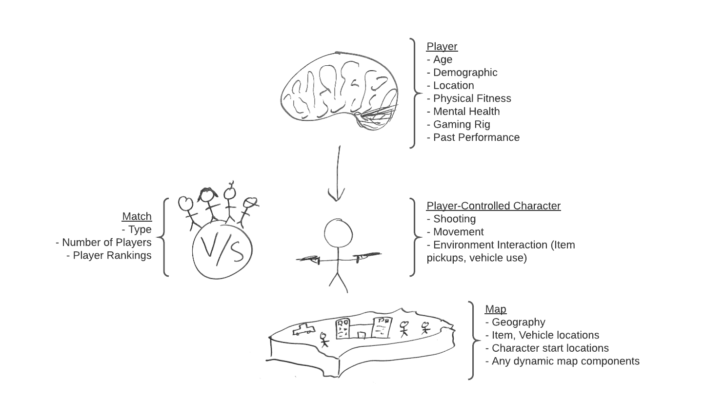
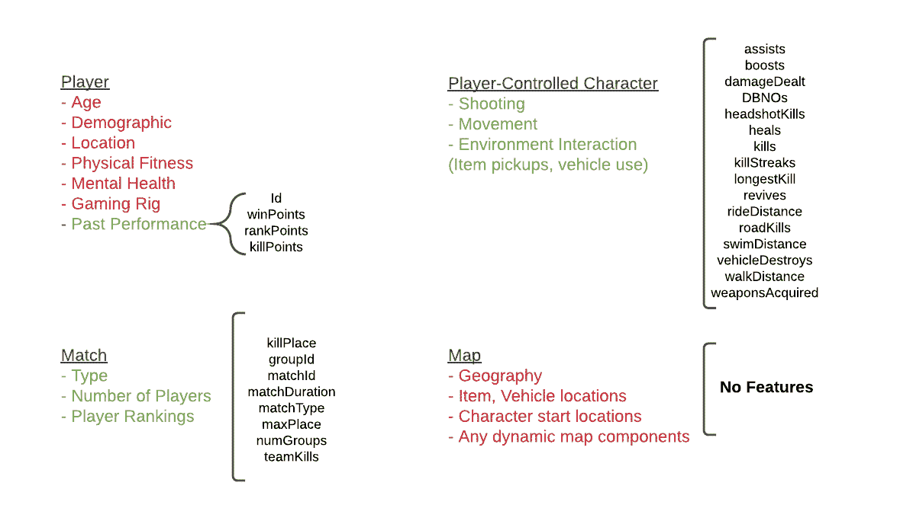
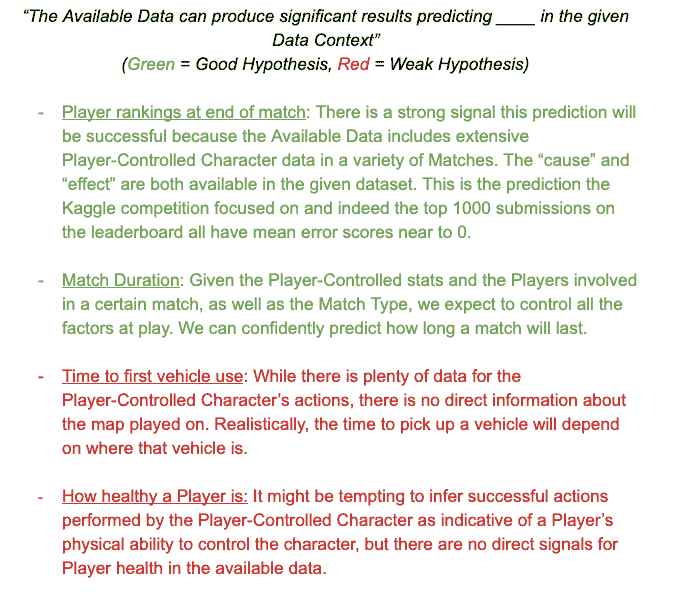
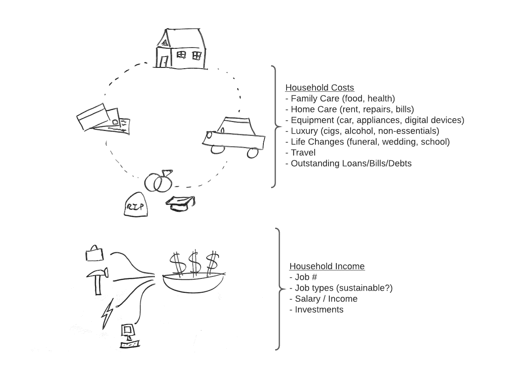
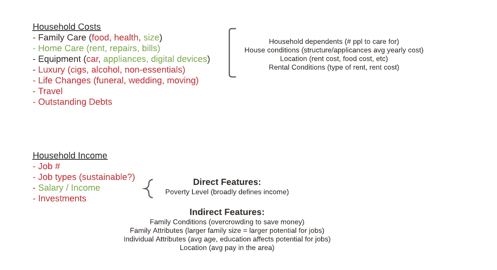
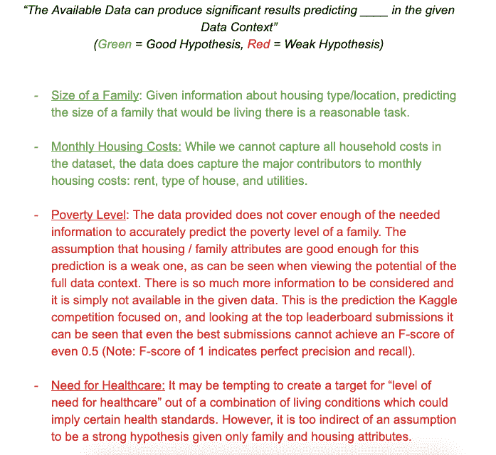

# 假设验证：每个成功的数据科学家都需要的最重要技能

> 原文：[`www.kdnuggets.com/2020/11/hypothesis-vetting-most-important-skill-every-successful-data-scientist-needs.html`](https://www.kdnuggets.com/2020/11/hypothesis-vetting-most-important-skill-every-successful-data-scientist-needs.html)

评论

**由 [AbderRahman Sobh](https://www.linkedin.com/in/abderrahman-sobh-507355122/)，数据科学家、机器学习工程师、软件开发者、导师**

最成功的数据科学项目始于良好的假设构建。一个经过深思熟虑的假设为数据科学项目设定了方向和计划。因此，假设是评估数据科学项目是否成功的最重要项。

* * *

## 我们的前三大课程推荐

 1. [Google 网络安全证书](https://www.kdnuggets.com/google-cybersecurity) - 快速进入网络安全职业生涯。

 2. [Google 数据分析专业证书](https://www.kdnuggets.com/google-data-analytics) - 提升你的数据分析技能

 3. [Google IT 支持专业证书](https://www.kdnuggets.com/google-itsupport) - 支持组织的 IT

* * *

这种技能不幸的是经常被忽视或以一种随意的方式教授，而倾向于进行功能重要性的实际测试以及在数据上应用模型以查看它们是否能够预测任何东西。虽然确实总是需要特征工程和模型选择，但在对问题没有真正理解的情况下进行这些操作可能是危险且低效的。

通过经验，我总结出了一种系统的方法来处理数据科学问题，这种方法既保证了相关的假设，又能强烈指示数据科学方法是否会成功。在本文中，我概述了用于完成此任务的步骤：定义数据背景、检查可用数据以及形成假设。我还查看了一些 Kaggle 的已完成竞赛，并将它们应用于此过程，以提供实际示例。

### 制作完美的假设

*1. 映射数据背景*

就像在物理问题中形成自由体图或在计算机科学中使用面向对象设计一样，描述给定数据背景中的所有有效实体有助于绘制它们之间预期的相互作用。此步骤的目标是完全指定在上下文中可能收集的所有数据，即完美数据集的描述。如果所有这些数据都可用，那么组件之间的相互作用将被完全定义，并且可以使用启发式公式来定义每种类型的因果关系。

*2. 检查可用数据与数据背景的重叠*

接下来，进行观察以确定可用数据中有多少符合前一步定义的完美数据集。重叠越多，定义实体之间交互的解决方案空间就越好。虽然这不是一个数字指标，但这种观察提供了强烈的直觉信号，表明可用数据是否足够适合和相关。如果有完全的重叠，那么启发式方法可能比拟合数据模型更好。如果重叠很少，那么即使是最好的建模技术也将无法一致地提供准确的预测。请注意，最强的预测信号总是那些直接相关的，因此间接特征关系的重视程度较低，更倾向于真实的信号。主要关注强信号的直觉是，收集具有强信号的更好数据将确保更好的性能和可靠性。相反，使用弱信号进行的预测在获得更好数据后很容易变得过时。

*3. 形成假设*

完成前两个步骤后，形成假设本身变得简单。假设通常是通过组合一组可用特征来预测另一特征的结果，这些特征可能在未来难以收集或其值可能在结果出现之前就需要。

既然数据背景与可用数据之间的重叠已经明确界定，并且假设相当一部分可用数据是相关的/类别平衡的/etc，那么假设可以简单地表述为：“可用数据可以在给定的数据背景中产生显著的结果，预测*____*”。请注意，预测标签是开放的，因为它可以被填入许多不同的内容！这是因为，只要符合数据背景且与可用数据有足够的重叠，几乎可以围绕任何给定的特征形成假设。选择特定的预测特征将取决于哪些使用案例最有利。

### 示例项目

下面，我精心挑选了几个不同的 Kaggle 项目，以使用假设形成技术进行分析。这些示例展示了一些特征设置的假设形成方法，以及每个示例都有一个可以在其数据背景中评估的假设。

**项目 1: 预测 PubG 比赛的获胜者** ([*https://www.kaggle.com/c/pubg-finish-placement-prediction*](https://www.kaggle.com/c/pubg-finish-placement-prediction))

选择这个项目是因为数据上下文被简化了，由于预测是在虚拟世界中进行的。模拟的预测预计会表现得更为一致，并沿着非常明确的路径操作，而不是现实生活系统中可能有的不易观察的因素。换句话说，数据上下文可以非常自信地被全面定义。在这个视频游戏中，玩家控制一个可以执行有限动作的单元。数据上下文已在下图中映射出：

数据可以映射到的四个主要实体是：玩家、玩家控制的角色、地图和比赛本身。我选择了这些高层次的实体，是基于它们之间的重要交互以及每个实体的独特性。因此，它们共同定义了这个场景中大部分甚至全部的数据上下文。

接下来，目标是观察比赛提供的数据中有多少符合数据上下文：

+   对于玩家数据，主要提供的是过去比赛的历史记录。关于玩家本身的信息非常有限。

+   关于玩家控制的角色以及比赛的完全重叠，即详尽的数据。

+   没有直接提供关于地图的特征。

利用这些洞察，可以定义出强有力的假设候选。再次强调，这种生成假设的技术忽略了特征相关性或间接关系，而是专注于绝对最强的信号，即直接相关的特征。在这次比赛中，涉及玩家控制的角色和比赛的预测被详细捕捉。相反，虽然我们可能能够根据玩家控制的角色推断出关于玩家的情况，但由于这会使假设变弱，因此避免了这种做法。

一些示例假设在下文中进行了评估，包括比赛中给定的假设：

**项目 2：预测哥斯达黎加贫困** ([*https://www.kaggle.com/c/costa-rican-household-poverty-prediction*](https://www.kaggle.com/c/costa-rican-household-poverty-prediction))

对于第二个示例，我选择了一个具有现实世界元素的项目，但仍保持了相对简单的背景。具体而言，这个比赛的假设是，可以利用给定的数据预测贫困水平。围绕这个假设的数据上下文可以定义为家庭成本与收入，如下图所示：

这个比赛中的数据特征非常详细，所以我将它们大致总结为几个类别：53 个特征用于房屋状况（材料、建筑、质量），6 个特征用于家庭状况，23 个特征用于家庭属性，32 个特征用于个人属性，6 个特征用于租赁状况，8 个特征用于位置。接下来，演示了给定数据与数据背景的重叠情况：

+   主要的导致贫困的成本因素未被收集在数据中。生活中的变化，如家庭成员的最近去世，也没有被包含在内。同样，未提及任何未偿债务。

+   日常成本因素如食品杂货和奢侈品购买不包括在此数据集中。

+   描述家庭收入的唯一一个广泛特征是贫困水平。在图示中，我包括了一些间接特征，这些特征可能会被利用，鉴于直接特征的稀缺。然而，这些特征永远不会像拥有关于工作/薪水/投资的适当数据那样强。

从观察数据重叠中得到的最大洞察是，比赛数据集中没有提供许多与预测贫困相关的方面。提供的信息主要集中在住房和家庭属性上。

以下是一些示例假设的评估，包括比赛给出的假设：

### 进一步阅读

我写这篇文章的目标是帮助他人获得对数据科学本质的实际理解，并提供一个使用它的起点。数据科学的工作应旨在真正解释我们周围的世界，帮助我们用数字方法填补空白，以便发现。

回到所有这些背后的强大模型和算法，它们本身就是深入的研究，帮助我们从复杂的数据场景中获得更多的理解。如果你对这些算法的工作原理感兴趣，我鼓励你查看我在 Kindle 上的书籍：[“*Essential Data Science: A Guide to the Applied Machine Learning Toolkit*”](https://www.amazon.com/Essential-Data-Science-Applied-Toolkit/dp/1092130330)。

**个人简介：[AbderRahman Sobh](https://www.linkedin.com/in/abderrahman-sobh-507355122/)** 是一位数据科学家、机器学习工程师、软件开发人员和导师。

[原文](https://abbysobh.medium.com/hypothesis-vetting-the-most-important-skill-every-successful-data-scientist-needs-6b84126140f8)。经许可转载。

**相关内容：**

+   如何获得最受欢迎的数据科学技能

+   我在 8 个月内提升数据科学技能的经历

+   数据科学的基本要求：开始数据科学需要掌握的 10 项关键技能

### 更多相关主题

+   [未来数据游戏的保障：2023 年每位数据科学家需要掌握的顶级技能](https://www.kdnuggets.com/futureproof-your-data-game-top-skills-every-data-scientist-needs-in-2023)

+   [每位数据科学家必备的软技能](https://www.kdnuggets.com/soft-skills-every-data-scientist-needs)

+   [2024 年每位数据科学家必备的 5 项基本技能](https://www.kdnuggets.com/5-essential-skills-every-data-scientist-needs-in-2024)

+   [2024 年每位数据科学家工具箱中必备的 5 个工具](https://www.kdnuggets.com/5-tools-every-data-scientist-needs-in-their-toolbox-in-2024)

+   [团队合作是数据科学中不可或缺的技能的 3 个原因](https://www.kdnuggets.com/2022/05/3-reasons-teamwork-essential-skill-data-science.html)

+   [成功数据科学家的 5 大特征](https://www.kdnuggets.com/2021/12/5-characteristics-successful-data-scientist.html)
