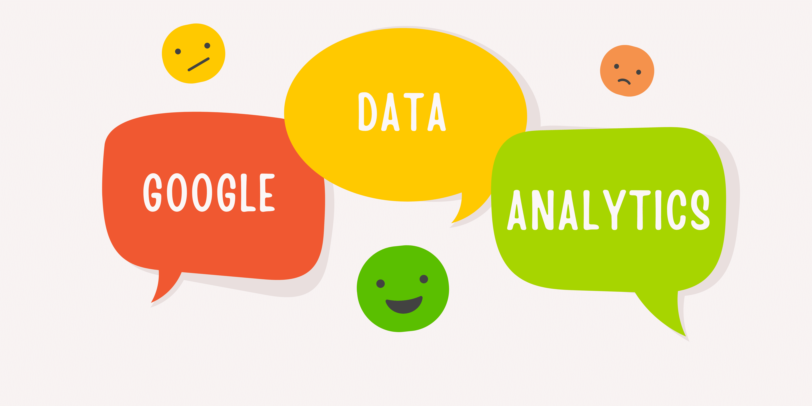

# 我参加了谷歌数据分析认证课程，目前已有 2,148,697 人注册

> 原文：[`www.kdnuggets.com/i-took-the-google-data-analytics-certification-where-2148697-have-already-enrolled`](https://www.kdnuggets.com/i-took-the-google-data-analytics-certification-where-2148697-have-already-enrolled)

作者提供的图片

如果你像我一样，已经到了一个回到大学不再是选择的年纪，或者你准备转行但需要指导——你来对地方了。我当时全职工作，没有选择，只能参加一个灵活的课程，因为我需要维持生活开支。大学完全不在考虑范围内。我需要一个可以让我在不妥协财务和过多时间的情况下获得技能和知识的课程。

* * *

## 我们的三大课程推荐

 1\. [谷歌网络安全证书](https://www.kdnuggets.com/google-cybersecurity) - 快速入门网络安全职业

 2\. [谷歌数据分析专业证书](https://www.kdnuggets.com/google-data-analytics) - 提升你的数据分析技能

 3\. [谷歌 IT 支持专业证书](https://www.kdnuggets.com/google-itsupport) - 支持你所在组织的 IT 需求

* * *

我在看到好评后偶然发现了[谷歌数据分析认证](https://imp.i384100.net/k0Yoj0)。

工作有点慢，所以我决定在没有因工作过度而感到疲惫时尝试一下。

## 什么是谷歌数据分析认证？

链接: [谷歌数据分析认证](https://imp.i384100.net/k0Yoj0)

谷歌的数据分析专业认证使你能够理解助理数据分析师使用的实践和流程。

在这项认证中，你将学习关键的分析技能，例如数据清理、分析和可视化，以及 SQL、R 编程和 Tableau 等工具。通过这些技能，你将能够了解如何清理和组织数据以进行分析，并使用电子表格、SQL 和 R 编程完成分析和计算。

到课程结束时，你将学习如何在仪表板、演示文稿和常用可视化平台中可视化和展示数据发现。

该课程面向初学者，如果你每周投入 10 小时，通常可以在 6 个月内完成。课程安排灵活——你可以按照自己的节奏学习！

## 我对认证的看法

在参加认证之前，我已经在两年前参加过一个训练营。当我进入科技行业并获得我的第一个初级数据科学家职位时，我意识到有些数据科学的元素是训练营没有教给我的。我曾经绕了很多圈子才明白，我需要回到基础，好好学习才能继续我的数据科学之旅。

所以这就是我所做的。我决定参加 Google 的数据分析认证，并设定了在 2 个月内完成它的目标。

所以学习之旅开始了，我想说的第一件事是：内容——令人惊叹！过程——顺利！指导——无可挑剔。

如果你像我一样觉得需要对数据分析或数据科学的学习进行一些复习，或者你是数据领域的新手，需要指导——这个课程正好满足了这些需求。

是的，学习材料很多，但所有这些材料都是学习过程中不可或缺的一部分，并且有助于我的理解。在每一章节之后，多项选择题帮助我理解每一部分，而不是在每个模块结束时才遇到一堆问题。

当涉及到完成各章节的多项选择题和模块测试时——我做得非常出色。是的，我之前的训练营知识在这方面帮了我一些忙，但经历了几年的数据科学空白期——这些内容对我获得认证简直是救星。

这门课程非常好，以至于我推荐给了一些没有技术经验的家人和朋友，他们回来后给予了很好的反馈，说课程的结构和过程对初学者非常友好。

我对这个认证的总体评价和反馈是，我会强烈推荐给那些对科技行业还不太熟悉的人，因为它的课程结构非常适合初学者，也适合那些想要巩固现有知识以确保自己掌握得非常牢固的人！

记住，这个认证是针对初学者的，这意味着你的数据科学学习之旅不应止步于此。持续学习新技能和工具将帮助你成为一名成功的数据科学家！

## 总结

每个人的学习过程都不同。有些人可能已经完成了认证，并且更喜欢其他学习方式。然而，如果你是一个需要指导并且喜欢循序渐进的人——这个认证强烈推荐！

KDnuggets 的团队希望每个人都能成功，我们希望我们能帮助你的学习之旅！

****[尼莎·阿里亚](https://www.linkedin.com/in/nisha-arya-ahmed/)****是一位数据科学家、自由技术写作员，以及 KDnuggets 的编辑和社区经理。她特别关注提供数据科学职业建议、教程以及基于理论的数据科学知识。尼莎涵盖了广泛的主题，并希望探索人工智能如何有利于人类寿命的延续。作为一名热衷学习者，尼莎致力于拓宽她的技术知识和写作技能，同时帮助指导他人。

### 相关主题

+   [2023 年 Google 数据分析认证评审](https://www.kdnuggets.com/2023/01/google-data-analytics-certification-review-2023.html)

+   [科技行业所有领域的热门 Google 认证](https://www.kdnuggets.com/popular-google-certification-for-all-areas-in-the-tech-industry)

+   [Google 刚刚推出了新课程：AI 基础](https://www.kdnuggets.com/google-have-just-dropped-a-new-course-ai-essentials)

+   [2022 年顶级数据分析师认证课程](https://www.kdnuggets.com/2022/11/top-data-analyst-certification-courses-2022.html)

+   [Meta 的新数据分析师专业认证已发布！](https://www.kdnuggets.com/metas-new-data-analyst-professional-certification-has-dropped)

+   [你在 2022 年添加了什么认证到你的工具包中？](https://www.kdnuggets.com/2022/03/sas-certification-adding-toolkit-2022.html)
