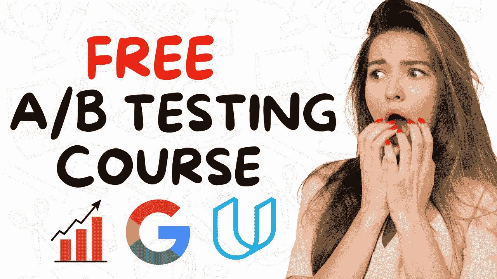

# 我参加了 Udacity 的免费 A/B 测试课程：这是我学到的内容

> 原文：[`www.kdnuggets.com/i-took-udacitys-free-a-b-testing-course-by-google-heres-what-i-learned`](https://www.kdnuggets.com/i-took-udacitys-free-a-b-testing-course-by-google-heres-what-i-learned)

图片由作者提供

我是一名拥有计算机科学背景的数据科学家。

* * *

## 我们的前 3 个课程推荐

 1\. [谷歌网络安全证书](https://www.kdnuggets.com/google-cybersecurity) - 快速进入网络安全职业生涯。

 2\. [谷歌数据分析专业证书](https://www.kdnuggets.com/google-data-analytics) - 提升你的数据分析技能

 3\. [谷歌 IT 支持专业证书](https://www.kdnuggets.com/google-itsupport) - 支持你的组织的 IT 部门

* * *

当我刚进入这个领域时，由于缺乏对基础数学和统计学概念的了解，我在数据科学面试中苦苦挣扎。

其中一个概念就是 A/B 测试。

尽管我在面试的编码部分表现出色，但当被问及推断统计和实验设计的问题时，我常常会僵住。

为了弥补这一知识差距，我参加了 [Udacity 上的免费 A/B 测试课程](https://www.udacity.com/course/ab-testing--ud257)，该课程由谷歌的高级数据专业人士教授。

在这篇文章中，我将详细解析我在课程中学到的内容，并解释你如何使用这些知识来建立对推断统计的理解。

## 什么是 A/B 测试，我们为什么需要它？

假设你的公司想要推出一种新类型的糖果，同时继续销售现有的甜点。

假设是新的糖果将吸引更多用户到全球各地的商店，从而导致总销售额的增加。

在将这种新糖果在所有商店推出之前，公司需要了解这样做是否有利可图。

它必须首先在几个商店上测试这一假设，只有在确实有销售增长的情况下，才扩大生产。

这就是 A/B 测试的作用所在。

简而言之，A/B 测试比较两种版本的事物，以找出哪一种更好。

A/B 测试通常包括以下几个组成部分：

+   变体 A：在我们的甜点店例子中，这是不销售新糖果的变体。它也被称为对照组。

+   变体 B：这是应用了变化的变体。在我们的例子中，这包括提供新糖果的商店组。它被称为处理组。

+   假设：这是你期望发生的事情的明确陈述。以下是我们例子中的假设：“销售新糖果的商店将看到比不销售的商店更高的平均销售额。”

假设陈述可以进一步细分为零假设和备择假设，这将在本免费课程中进行讲解。

## 你将在 Udacity 的免费 A/B 测试课程中学到什么

#### 1\. A/B 测试概述

你将了解 Netflix、Amazon 和 Google 等大型公司如何使用 A/B 测试。

我发现这个见解很有价值，因为你可以从在 Google 担任统计学家和工程师的讲师那里学习 A/B 测试的实际应用。

#### 2\. 推论统计与实验设计

然后，本课程将涵盖你需要了解的所有实验设计内容——从你想要测量的指标，到置信区间和统计显著性等概念。

你将学习：

+   如何构建置信区间

+   不同的统计分布（正态分布、二项分布）

+   设计零假设和备择假设的最佳实践。

本课程通过一个简单的实际例子来演示如何提高网站点击率，这个例子我觉得很有趣。

#### 3\. 实验的政策和伦理

本课将涵盖进行实验时的伦理考量——理解实验参与者是否面临风险以及获取用户同意。

#### 4\. 如何确定实验规模

你将学习如何确定实验的适当样本大小，包括统计功效、显著性水平、标准差和最小可检测效果（MDE）等度量。

如果这些概念对你来说很陌生，不用担心！

我开始这门课程时对上述统计主题了解不多，但凭借提供的额外学习材料和笔记，我能够轻松跟上进度。

#### 5\. 如何分析实验结果

在这里，你将了解在实验中所有组必须保持不变的指标类型。这些称为不变量。

你还将学习如何分析实验结果是否具有统计学意义——无论是单指标实验还是多指标实验。

#### 6\. 将结果转化为可操作的洞察

在这一部分，你将学习如何利用 A/B 测试的结果来做出商业决策。

例如，如果你发现销售新糖果的商店确实有显著的销售提升，那么下一步该怎么做？

你会将这种新糖果的多个批次推出到全球所有商店吗？还是从一个州或国家开始？

也许你会希望根据你收集的数据对实验进行迭代。

本课程的这一部分重点关注 A/B 测试的商业影响，并帮助在测试完成后进行决策。

#### 7\. 最终项目

在最终项目中，你将获得 Udacity 实际运行的实验中的真实数据。

使用这些数据，你需要回答一系列关于实验设计的问题——你将被要求计算标准差、实验持续时间和样本大小等指标。

在回答完有关数据集的所有问题后，你需要根据所进行的分析作出是否启动实验的最终建议。

## 收获

我进入[Udacity 的 A/B 测试课程](https://www.udacity.com/course/ab-testing--ud257)时，期望它会很数学密集且难以理解。

令我惊讶（也是高兴的是），它更加以商业为中心，专注于 A/B 测试的实际实施。

如果你想开始进行 A/B 测试，并且希望了解如何定义假设、选择样本大小以及其他实验参数，这门课程将帮助你快速上手。

我还推荐这门课程给那些希望加深对统计推断和实验设计理解的人，因为了解这些概念将帮助你在数据科学和分析面试中表现出色。

&nbsp

&nbsp

**[Natassha Selvaraj](https://linktr.ee/natasshaselvaraj)**是一位自学成才的数据科学家，对写作充满热情。Natassha 写作涉及所有数据科学相关的内容，是所有数据话题的真正大师。你可以通过[LinkedIn](https://www.linkedin.com/in/natassha-selvaraj-33430717a/)与她联系，或者查看她的[YouTube 频道](https://www.youtube.com/@natassha_ds)。

### 相关话题

+   [我参加了 Google 数据分析认证课程，已有 2,148,697 人注册……](https://www.kdnuggets.com/i-took-the-google-data-analytics-certification-where-2148697-have-already-enrolled)

+   [假设检验与 A/B 测试](https://www.kdnuggets.com/hypothesis-testing-and-ab-testing)

+   [数据科学的必备 A/B 测试课程](https://www.kdnuggets.com/2023/02/essential-ab-testing-course-data-science.html)

+   [我从使用 ChatGPT 进行数据科学中学到的东西](https://www.kdnuggets.com/what-i-learned-from-using-chatgpt-for-data-science)

+   [Google + Uplimit 提供的免费站点可靠性工程课程](https://www.kdnuggets.com/2024/02/uplimit-free-site-reliability-engineering-course-from-google)

+   [Google 推荐你在参加他们的机器学习……课程前做的准备](https://www.kdnuggets.com/2021/10/google-recommends-before-machine-learning-data-science-course.html)
