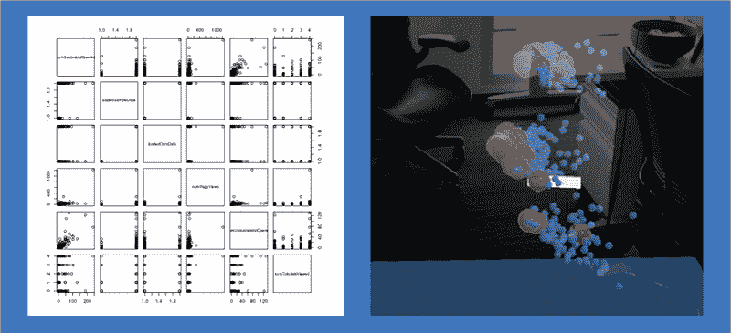

# 增强现实中的高维数据可视化

> 原文：[`www.kdnuggets.com/2017/09/ibm-visualizing-high-dimensional-data-augmented-reality.html`](https://www.kdnuggets.com/2017/09/ibm-visualizing-high-dimensional-data-augmented-reality.html)

**作者：本杰明·雷斯尼克**。赞助帖子。

创意共享许可证

> * * *
> 
> ## 我们的三大课程推荐
> ## 
>  1\. [谷歌网络安全证书](https://www.kdnuggets.com/google-cybersecurity) - 快速进入网络安全职业生涯。
> 
>  2\. [谷歌数据分析专业证书](https://www.kdnuggets.com/google-data-analytics) - 提升你的数据分析水平。
> 
>  3\. [谷歌 IT 支持专业证书](https://www.kdnuggets.com/google-itsupport) - 支持你的组织的 IT。
> 
> * * *
> 
> 如果你有兴趣试用[**IBM Watson 机器学习服务 - 点击这里**](https://developer.ibm.com/clouddataservices/docs/ibm-watson-machine-learning/get-started/)。
> 
> 尝试[**数据科学体验 - 订阅免费试用**](https://datascience.ibm.com/registration/stepone)。
> 
> 想象一下，几年后的一个周一早晨，你走进办公室。你给自己倒一杯咖啡，查看新闻，然后戴上一副 AR 眼镜。你发现自己被一片柔和发光的彩色光点包围。这些光点代表了驱动你业务的所有数据。你对这些数据非常熟悉。这些光点的图案和颜色就像指纹一样。但是，漂浮在咖啡机上的数据有些不寻常。你伸手选择那些数据。所有相关细节的摘要出现在附近的电脑屏幕上。
> 
> 如果某件事对你的业务重要，你的系统会跟踪它。当你想查看所有信息时，你会使用这种沉浸式可视化；突破电脑屏幕的限制，信息密集、高效且美观。

我在 IBM 的团队正在努力实现上述描述的体验。沉浸式洞察是一款增强现实数据可视化应用。请查看下面的视频了解我们的进展：

### 概述

本文概述了我团队最近一直在研究的一种技术。

我们一直在尝试一种总结和可视化高维数据的方法，使用沉浸式洞察。这种总结复杂数据中重要关系的能力是我们长期愿景的关键部分。

数据可以有很多属性。例如，Instacart 的开源数据集包含了购物记录。数据集中的每个人都可以看作一个数据点。每个数据点可以通过一系列购买的产品来描述。这对每个用户来说超过了 50,000 种可能的产品。

了解这些人彼此之间的关系将非常有用。但我们如何开始理解如此多的数据呢？

通常，当数据科学家首次获得数据集时，他们会使用 2D 散点图矩阵来快速概览内容。2D 散点图显示了属性对之间的关系。但对于具有大量属性的数据，这种分析方法的规模就显得不够。

2D 散点图矩阵，与 Immersive Insights 并置

受 [projector.tensorflow.org/](http://projector.tensorflow.org/) 的启发，我们使用以下技术进行数据分析：

1.  将复杂数据简化为总结重要关系的三维（在此案例中通过应用 PCA）

1.  使用 IBM Immersive Insights 可视化数据

1.  根据对嵌入关系的不断理解，迭代标记和颜色编码数据。

通过使用 Immersive Insights 导航该功能空间，可以更快地验证假设，并对高维数据集中实体之间的关系形成更好的直觉。

Immersive Insights 与 [IBM DSX](https://medium.com/@ostechtalks/ibm-data-science-experience-what-is-it-24d2eb3550dc) 集成。这使得将沉浸式可视化技术作为典型数据分析工作流的扩展变得可能。在 R、Python 和 Immersive Insights 之间来回切换相对容易。

适用于此技术的数据集通常用于训练机器学习模型。如果数据科学家使用此过程来理解其数据中的嵌入关系，这可能有助于他们改进 ML 特性和模型。这种技术也有助于了解黑箱预测模型在幕后可能在做什么。

短期内，Immersive Insights 团队专注于为熟悉编程的数据专家提供可视化技术。我们正在开发方法，以便这些专家在 AR 中可视化时间序列、地理和网络数据。

从长远来看，我们希望扩大产品的范围，以便业务分析师也能使用 Immersive Insights！

### Instacart 分析代码

我们是如何创建附加视频中所示的可视化效果的？

首先，数据是在一个 python notebook 中准备的。查看该代码[*这里*](https://apsportal.ibm.com/analytics/notebooks/e0e24014-f59d-4758-b819-d462534b8d87/view?access_token=e9e3d81e924a5069dd5fa4193dbab154a631fd69ec462ce8eaa80bb7f2c8e984)。

Instacart 的用户通过一个描述他们与每个潜在购买产品关系的向量进行建模。这个向量的形式是一个稀疏的 0 和 1 数组。每个 1 对应一个该用户至少购买过一次的产品。每个 0 对应一个未购买的产品。这种技术被称为"[独热编码](https://www.quora.com/What-is-one-hot-encoding-and-when-is-it-used-in-data-science)"。然后，对数据执行 PCA（主成分分析），以便用仅仅三个数字或"[主成分](https://en.wikipedia.org/wiki/Principal_component_analysis)"来描述每个用户。每个主成分总结了数据中的方差方面。实际上，由于内存限制，我只能分析 120,000 名用户。在执行 PCA 后，处理好的数据被导出到 CSV。

接下来，数据通过一个单独的 R notebook 发送到耳机进行可视化。查看那个代码[*这里*](https://apsportal.ibm.com/analytics/notebooks/33a4910b-4e11-48a7-9e55-7e9691073f4c/view?access_token=912ad4d832e2cc67b2d734d5b305aba3c84230043700ec7d53ec2cfafa7a414d)。

R notebook 根据可能影响潜在空间用户分布的各种标准对用户进行颜色编码。用户根据他们最常订购的部门（如冷冻食品、零食、农产品）进行颜色编码。另一种颜色编码方案则表示用户是否购买了任何有机食品。我还参考了 Immersive Insights 中各种用户的 ID，然后在 R notebook 中查找了他们的购买历史。这使我能够直观地了解哪些产品购买会导致用户被放置在潜在空间的不同区域。

### 分析结果

没有购买任何有机食品的用户在潜在空间中被紧密聚集。这一发现是支持从可视化中得出的定性观察的有力证据：Instacart 购买模式中的大部分方差似乎存在于购买高端商品的用户和喜欢类似商品的低价版本的用户之间。这种对成本敏感与高端购买者的差异对 Instacart 的营销、促销和推荐策略有着重要意义。

我们还发现，Instacart 用户购买的农产品远多于其他类别的商品。有许多不同类型的用户喜欢农产品。几乎每个人都买农产品！

当根据用户购买商品的最常见部门（即模式部门）对用户进行分类时，他们并不是线性可分的。我们发现，虽然这种分类方式有助于理解一些用户购买模式之间的关系，但它似乎错过了数据集三大主成分描述的大部分方差。

### 结论

本文介绍了一种使用增强现实分析大数据的技术。这种技术最适用于准备创建机器学习模型的数据科学家。

大数据、增强现实和机器学习正成为三种颠覆性技术，它们将塑造未来的商业和社会。如前所述，这些颠覆性技术可以以创造性、有用的方式相互融合。你可以在这里阅读有关这些结合的颠覆性技术的潜在影响：[`www.weforum.org/agenda/2016/01/the-fourth-industrial-revolution-what-it-means-and-how-to-respond/`](https://www.weforum.org/agenda/2016/01/the-fourth-industrial-revolution-what-it-means-and-how-to-respond/)

本文描述的技术范围有限。但 Immersive Insight 的愿景范围巨大。Immersive Insights 团队很高兴继续构想数据可视化和分析的未来。我们的目标：让数据变得简单。

### 有用的链接

[*在进行主成分分析（PCA）之前，缩放参数的最佳方法是什么？*](https://www.researchgate.net/post/What_is_the_best_way_to_scale_parameters_before_running_a_Principal_Component_Analysis_PCA)

本文有助于理解如何为 PCA 准备数据

[*http://machinelearningmastery.com/discover-feature-engineering-how-to-engineer-features-and-how-to-get-good-at-it/*](http://machinelearningmastery.com/discover-feature-engineering-how-to-engineer-features-and-how-to-get-good-at-it/)

本文帮助展示了为什么高维数据的探索性技术对机器学习从业者如此有用

> 尝试[**IBM Watson 机器学习服务 - 点击这里**](https://developer.ibm.com/clouddataservices/docs/ibm-watson-machine-learning/get-started/)
> 
> 尝试[**数据科学体验 - 订阅免费试用**](https://datascience.ibm.com/registration/stepone)

### 更多相关话题

+   [认识 Gorilla：UC Berkeley 和微软的 API 增强 LLM…](https://www.kdnuggets.com/2023/06/meet-gorilla-uc-berkeley-microsoft-apiaugmented-llm-outperforms-gpt4-chatgpt-claude.html)

+   [检索增强生成：信息检索与文本生成的结合…](https://www.kdnuggets.com/retrieval-augmented-generation-where-information-retrieval-meets-text-generation)

+   [数据可视化：Statology 入门](https://www.kdnuggets.com/visualizing-data-statology-primer)

+   [在 Scikit-learn 中可视化混淆矩阵](https://www.kdnuggets.com/2022/09/visualizing-confusion-matrix-scikitlearn.html)

+   [数据科学职业：7 个期望与现实](https://www.kdnuggets.com/2022/06/data-science-career-7-expectations-reality.html)

+   [数据科学：现实与期望](https://www.kdnuggets.com/2022/03/data-science-reality-expectations.html)
