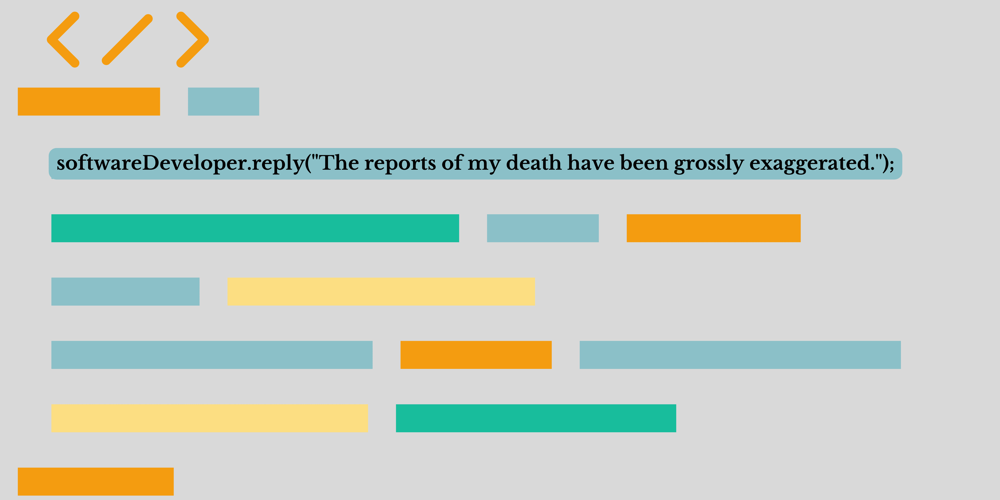

# 如果你想进入科技领域：成为一名软件开发者

> 原文：[`www.kdnuggets.com/if-you-want-to-get-in-the-tech-space-become-a-software-developer`](https://www.kdnuggets.com/if-you-want-to-get-in-the-tech-space-become-a-software-developer)

图片由作者提供

尽管我们生活在诸如 ChatGPT 这样的复杂人工智能工具的兴起和裁员的背景下，但关于科技行业是否仍然值得进入存在许多问题和意见。也有很大强调认为软件开发已经死了——但他们错了。

为了使组织成为数字优先，他们将需要软件开发者、分析师和其他相关角色来实现这一目标。

[美国新闻与世界报道](https://money.usnews.com/careers/best-jobs/rankings/best-technology-jobs)将软件开发者排名为最佳科技职位的第一位。他们在最佳 STEM 职位中排名第二，在 100 个最佳职位中排名第三，在最佳高薪职位中排名第十九。

如果你在想，为什么在 AI 和机器学习工具占据主导地位时，软件开发者仍然需求如此之高？就像世界上任何其他角色一样，它们也必须随着市场的发展而进化，以提高工作流程和效率，软件开发者将用新发布的工具以同样的方式做出调整。

最好的新技术在推出后仍然需要维护、升级和故障排除。没有什么是完成的产品。因此，像 ChatGPT 这样的工具虽然为很多人提供了更好的工作流程和工作生活平衡，但仍然需要具备正确技能的专家来确保其顺利运行。

这就是软件开发者发挥作用的地方。

## 为什么我们需要软件开发者？

如前所述，由于裁员对进入科技行业存在很大恐惧。然而，无论你在互联网上看到什么，裁员的数量基本保持不变。

越来越多的组织正在变得依赖技术，如果他们还没有开始的话。数字解决方案是主要的业务目标，因此对熟练的软件开发者的需求几乎没有减缓的迹象。

根据[美国劳工统计局](https://www.bls.gov/)，他们预测在未来十年内软件开发者职位的增长率将达到 26%。这意味着到 2030 年，我们将看到 120 万个新的软件开发者职位。

不要害怕科技裁员，这是虚惊一场。虽然 AI 在未来几年会变得更加复杂，但本质上，它仍然需要能够解决问题并为企业提供机会来构建更好解决方案的软件开发者。

## 如何成为一名软件开发者？

你可能在问自己，那我该怎么做？我如何进入软件工程师的行业？

### 计算机科学知识

你的第一步将是了解计算机科学的所有基础知识。你可以采取各种措施，例如攻读学位、参加在线课程或自学。

以下是一些推荐：

+   [计算机科学学士学位](https://imp.i384100.net/Py5RZY) 由伦敦大学提供

+   [计算机科学：编程的目的](https://imp.i384100.net/LX9OGY) 由普林斯顿大学提供

+   [计算机科学：算法、理论与机器](https://imp.i384100.net/q4PmqL) 由普林斯顿大学提供

+   [学习 R 编程](https://datacamp.pxf.io/Py5RZQ) 由 DataCamp 提供

+   [应用软件工程基础专门化](https://imp.i384100.net/AW4nD7) 由 IBM 提供

### 获取实践经验

雇主希望聘用能够将知识应用于实践的人。这意味着需要一个实际项目的作品集，雇主通常会对这些项目感兴趣。这表明你已经花时间学习基础知识并能够将其应用到像他们这样的公司中。

以下是一些推荐：

+   [使用 Streamlit 和 Python 构建数据科学网络应用](https://imp.i384100.net/6e4n9G)

+   [使用 Postman 工具开始你的 API 测试之旅](https://imp.i384100.net/3e4yxd)

+   [自然语言处理：推特情感分析](https://imp.i384100.net/vNAQ3j)

+   [入门 R 编程](https://imp.i384100.net/NkjRD2)

+   [使用 PyTorch 检测 COVID-19 胸部 X 光](https://imp.i384100.net/y2Vj3W)

查看 [高级数据科学项目的前 16 大技术数据来源](https://www.kdnuggets.com/top-16-technical-data-sources-for-advanced-data-science-projects)

## 总结

不要被关于技术裁员的头条新闻吓到。对软件开发人员的需求持续上升。

你最好的选择是今天开始学习！

****[Nisha Arya](https://www.linkedin.com/in/nisha-arya-ahmed/)**** 是一位数据科学家、自由技术作家，同时也是 KDnuggets 的编辑和社区经理。她特别关注提供数据科学职业建议或教程以及数据科学相关的理论知识。Nisha 涉及广泛的话题，希望探索人工智能如何有利于人类寿命的不同方式。作为一个热衷学习者，Nisha 寻求拓宽她的技术知识和写作技能，同时帮助指导他人。

### 更多相关主题

+   [如果你想成为数据分析师，应该考虑的 3 门课程](https://www.kdnuggets.com/3-courses-you-should-consider-if-you-want-to-become-a-data-analyst)

+   [软件开发人员 vs 软件工程师](https://www.kdnuggets.com/2022/05/software-developer-software-engineer.html)

+   [数据科学家如何引起 CFO 的关注（以及为什么你需要这样做）](https://www.kdnuggets.com/2021/12/data-scientists-get-ear-cfos-want.html)

+   [想成为数据科学家？第一部分：你需要的 10 种硬技能](https://www.kdnuggets.com/want-to-become-a-data-scientist-part-1-10-hard-skills-you-need)

+   [想成为数据科学家？第二部分：你需要的 10 种软技能](https://www.kdnuggets.com/want-to-become-a-data-scientist-part-2-10-soft-skills-you-need)

+   [成为生成式 AI 开发者的 4 个步骤](https://www.kdnuggets.com/4-steps-to-become-a-generative-ai-developer)
