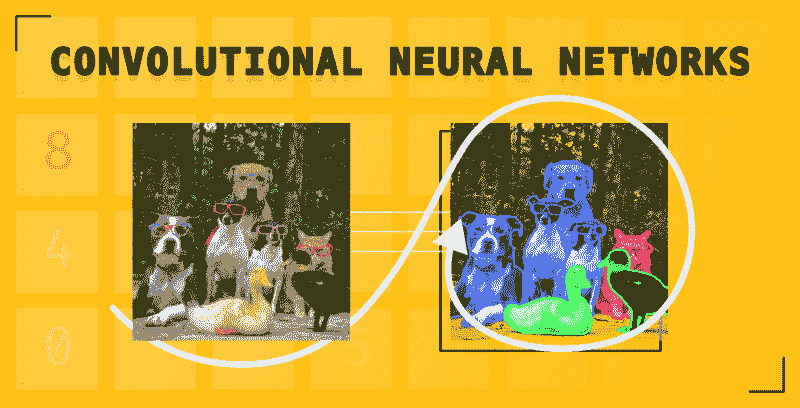
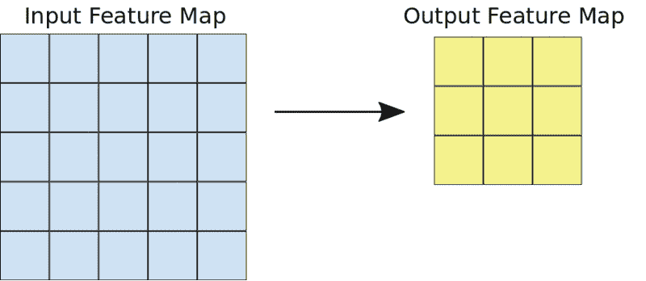
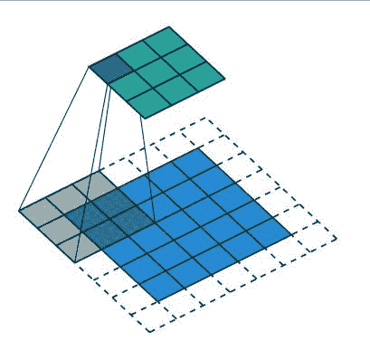
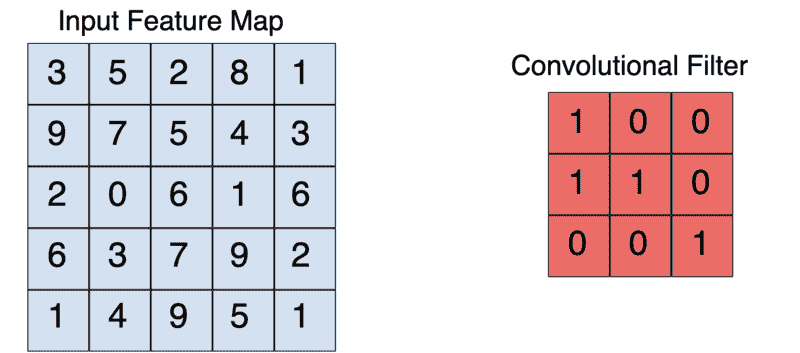
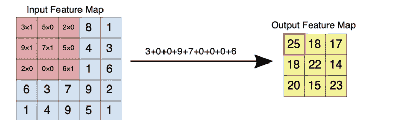
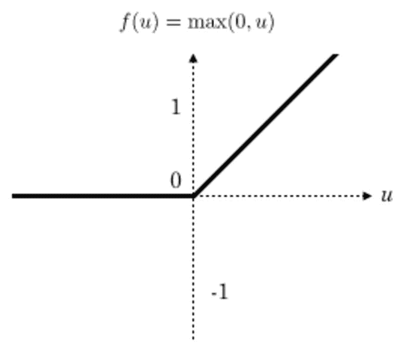
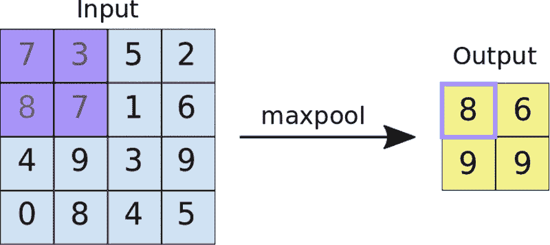
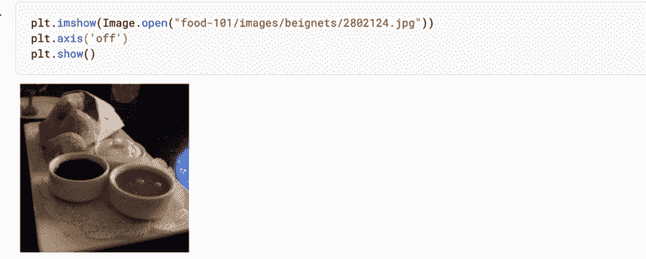
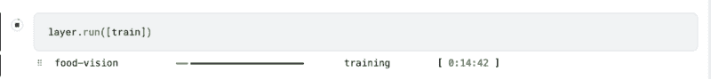

# 使用卷积神经网络 (CNN) 进行图像分类

> 原文：[`www.kdnuggets.com/2022/05/image-classification-convolutional-neural-networks-cnns.html`](https://www.kdnuggets.com/2022/05/image-classification-convolutional-neural-networks-cnns.html)



# 什么是卷积神经网络 (CNN)？

* * *

## 我们的三大课程推荐

 1\. [Google 网络安全证书](https://www.kdnuggets.com/google-cybersecurity) - 快速进入网络安全职业生涯。

 2\. [Google 数据分析专业证书](https://www.kdnuggets.com/google-data-analytics) - 提升你的数据分析技能

 3\. [Google IT 支持专业证书](https://www.kdnuggets.com/google-itsupport) - 支持你组织的 IT

* * *

卷积神经网络是一类特殊的神经网络，具有从图像数据中提取独特特征的能力。例如，它们被用于面部检测和识别，因为它们能够识别图像数据中的复杂特征。

# 卷积神经网络如何工作？

像其他类型的神经网络一样，CNN 消耗数值数据。

因此，输入这些网络的图像必须转换为数值表示形式。由于图像由像素组成，它们被转换为数值形式，然后传递给 CNN。

然而，正如我们将在下一部分讨论的那样，并非所有的数值表示都传递到网络中。要理解这一点，我们来看看训练 CNN 时涉及的一些步骤。

## 卷积

通过***卷积***操作减少传递给 CNN 的数值表示的大小。这一过程至关重要，以便只有在图像分类中重要的特征被传递给神经网络。除了提高网络的准确性，这也确保了在训练网络时使用最少的计算资源。

卷积操作的结果称为**特征图**、**卷积特征**或**激活图**。应用**特征检测器**会生成特征图。特征检测器也被称为**核心**或**滤波器**。

核心通常是一个 3x3 的矩阵。通过对核心与输入图像进行逐元素乘法，并将值求和，得到特征图。这是通过在输入图像上滑动核心来完成的。滑动的步骤被称为**步幅**。在创建 CNN 时，可以手动设置步幅和核心的大小。



[3x3 卷积操作](https://developers.google.com/machine-learning/practica/image-classification/convolutional-neural-networks)

例如，给定一个 5x5 的输入，3x3 的卷积核将输出一个 3x3 的特征图。

## 填充

在上述操作中，我们已经看到应用卷积操作时特征图的大小会减少。如果你希望特征图的大小与输入图像相同，该如何实现？这可以通过填充来实现。

填充涉及通过用零“填充”图像来增加输入图像的大小。因此，将滤波器应用于图像会导致特征图的大小与输入图像相同。



[未着色区域表示填充区域](https://commons.wikimedia.org/wiki/File:Convolution_arithmetic_-_Padding_strides.gif)

填充减少了卷积操作中丢失的信息量。它还确保图像的边缘在卷积操作中被更频繁地考虑。

在构建 CNN 时，你将有选项定义所需的填充类型或完全不使用填充。这里常见的选项是 ***valid*** 或 ***same***。Valid 表示不应用填充，而 ***same*** 表示应用填充，以便特征图的大小与输入图像的大小相同。



[3x3 卷积核将 5x5 输入降维为 3x3 输出](https://developers.google.com/machine-learning/practica/image-classification/convolutional-neural-networks)

这里是上述特征图和滤波器逐元素乘法的效果。



[5x5 输入与 3x3 滤波器的逐元素乘法](https://developers.google.com/machine-learning/practica/image-classification/convolutional-neural-networks)

## 激活函数

在每次卷积操作后应用了一个修正线性单元（ReLU）变换，以确保非线性。ReLU 是最流行的激活函数，但也有[其他激活函数](https://keras.io/api/layers/activations/)可供选择。

在变换之后，所有低于零的值都被返回为零，而其他值保持不变。



[ReLu 函数图](https://www.researchgate.net/figure/ReLU-activation-function_fig3_319235847)

## 池化

在这个操作中，特征图的大小进一步减少。有各种[池化方法](https://keras.io/api/layers/pooling_layers/)。

一种常见的技术是**最大池化**。池化滤波器的大小通常是一个 2×2 的矩阵。在最大池化中，2×2 的滤波器在特征图上滑动，并在给定的区域中选取最大值。此操作的结果是一个**池化特征图**。



[将 2×2 池化滤波器应用于 4×4 特征图](https://developers.google.com/machine-learning/practica/image-classification/convolutional-neural-networks)。

池化迫使网络识别图像中的关键特征，而不考虑其位置。减少的图像大小也使训练网络变得更快。

## Dropout 正则化

应用 Dropout 正则化是 CNN 中常见的做法。这涉及到随机丢弃某些层中的节点，使其在反向传播过程中不会被更新。这可以防止过拟合。

## 扁平化

扁平化涉及将池化特征图转换为一个单列，然后传递给全连接层。这是在从卷积层过渡到全连接层时的常见做法。

## 全连接层

扁平化后的特征图接着传递给全连接层。根据问题和网络结构，可能会有多个全连接层。最后一个全连接层负责输出预测结果。

最终层使用的激活函数取决于问题的类型。用于二分类的激活函数是 [sigmoid 激活函数](https://www.tensorflow.org/api_docs/python/tf/keras/activations/sigmoid)，而用于多类图像分类的则是 [softmax 激活函数](https://keras.io/api/layers/activation_layers/softmax)。


[全连接卷积神经网络](https://commons.wikimedia.org/wiki/File:Typical_cnn.png)

# 为什么选择卷积网络而不是前馈神经网络？

在学习了 CNN 之后，你可能会想知道为什么我们不能用普通神经网络处理图像问题。普通神经网络无法像 CNN 一样从图像中提取复杂特征。

CNN 通过应用过滤器从图像中提取特征的能力使其更适合处理图像问题。此外，直接将图像输入到前馈神经网络中计算成本也很高。

# 卷积神经网络架构

你可以从零开始设计你的 CNN。然而，你也可以利用许多已经开发并公开发布的架构。其中一些网络还提供了预训练模型，你可以轻松地将其适配到你的用例中。一些流行的架构包括：

+   [ResNet50](https://keras.io/api/applications/resnet/#resnet50-function)

+   [VGG19](https://keras.io/api/applications/vgg/#vgg19-function)

+   [Xception](https://keras.io/api/applications/xception/)

+   [Inception](https://keras.io/api/applications/inceptionv3)

你可以通过[Keras 应用](https://keras.io/api/applications/)开始使用这些架构。例如，以下是如何使用 VGG19：

```py
from tensorflow.keras.applications.vgg19 import VGG19
from tensorflow.keras.preprocessing import image
from tensorflow.keras.applications.vgg16 import preprocess_input
import numpy as np

model = VGG19(weights='imagenet', include_top=False)

img_path = 'elephant.jpg'
img = image.load_img(img_path, target_size=(224, 224))
x = image.img_to_array(img)
x = np.expand_dims(x, axis=0)
x = preprocess_input(x)

features = model.predict(x)
```

# TensorFlow 中的卷积神经网络（CNN）示例

现在，让我们使用[食物数据集](http://data.vision.ee.ethz.ch/cvl/food-101.tar.gz)构建一个食物分类 CNN。该数据集包含超过十万张属于 101 个类别的图像。

## 加载图像

第一步是下载并解压数据。

```py
!wget --no-check-certificate \
    http://data.vision.ee.ethz.ch/cvl/food-101.tar.gz \
    -O food.tar.gz
!tar xzvf food.tar.gz
```

让我们看一看数据集中一张图像。

```py
plt.imshow(Image.open("food-101/images/beignets/2802124.jpg"))
plt.axis('off')
plt.show()
```



## 生成 tf.data.Dataset

接下来，将图像加载到[TensorFlow 数据集](https://www.tensorflow.org/api_docs/python/tf/data/Dataset)中。我们将使用 20%的数据进行测试，其余用于训练。因此，我们需要为训练集和测试集创建一个`[ImageDataGenerator](https://www.tensorflow.org/api_docs/python/tf/keras/preprocessing/image/ImageDataGenerator?authuser=1)`。

训练集生成器还将指定一些[图像增强](https://www.tensorflow.org/tutorials/images/data_augmentation)技术，如缩放和翻转图像。增强可以防止网络的过拟合。

```py
base_dir = 'food-101/images'
train_datagen = ImageDataGenerator(rescale=1./255, 
                                   shear_range=0.2,
                                   zoom_range=0.2, 
                                   horizontal_flip=True,
                                   width_shift_range=0.1,
                                   height_shift_range=0.1,
                                   validation_split=0.2
                                   )
validation_gen = ImageDataGenerator(rescale=1./255,validation_split=0.2)
```

有了生成器，下一步是使用它们从基础目录加载食物图像。在加载图像时，我们指定图像的目标大小。所有图像将被调整为指定的大小。

```py
image_size = (200, 200)
training_set = train_datagen.flow_from_directory(base_dir,
                                                 seed=101,                                                 
                                                 target_size=image_size,
                                                 batch_size=32,
                                                 subset = "training",
                                                 class_mode='categorical')
```

加载图像时，我们还指定：

+   加载图像的目录。

+   批量大小，此处为 32，这意味着图像将以 32 张为一批加载。

+   子集；无论是训练还是验证。

+   类别模式为分类，因为我们有多个类别。如果只有两个类别，则为二进制。

```py
validation_set = validation_gen.flow_from_directory(base_dir, 
                                               target_size=image_size,
                                               batch_size=32, 
                                               subset = "validation",
                                               class_mode='categorical')
```

## 模型定义

下一步是定义 CNN 模型。网络的架构将类似于我们在 CNN 工作原理部分讨论的步骤。我们将使用[Keras Sequential API](https://keras.io/api/models/sequential/)来定义网络。CNN 是通过[Conv2D](https://www.tensorflow.org/api_docs/python/tf/keras/layers/Conv2D)层定义的。

```py
model = Sequential([

    Conv2D(filters=32,kernel_size=(3,3),  input_shape = (200, 200, 3),activation='relu'),
    MaxPooling2D(pool_size=(2,2)),

    Conv2D(filters=32,kernel_size=(3,3), activation='relu'),
    MaxPooling2D(pool_size=(2,2)),
    Dropout(0.25),

    Conv2D(filters=64,kernel_size=(3,3), activation='relu'),
    MaxPooling2D(pool_size=(2,2)),
    Dropout(0.25),

    Flatten(),
    Dense(128, activation='relu'),
    Dropout(0.25),
    Dense(101, activation='softmax')
])
```

Conv2D 层期望：

+   要应用的过滤器数量，此处为 32。

+   卷积核的大小，此处为 3 x 3。

+   输入图像的大小。200 x 200 是图像的大小，3 表示这是一个彩色图像。

+   激活函数；通常是[ReLu](https://keras.io/api/layers/activation_layers/relu)。

在网络中，我们应用 2 x 2 的池化滤波器，并应用[Dropout](https://keras.io/api/layers/regularization_layers/dropout/)层以防止过拟合。

最后一层有 101 个单元，因为有 101 个食物类别。激活函数是[softmax](https://keras.io/api/layers/activation_layers/softmax)，因为这是一个多类别图像分类问题。

## 编译 CNN 模型

我们 [编译](https://keras.io/api/models/model_training_apis) 网络时使用了类别损失和准确率，因为它涉及多个类别。

```py
model.compile(optimizer='adam',
              loss=keras.losses.CategoricalCrossentropy(),
              metrics=[keras.metrics.CategoricalAccuracy()])
```

## 训练 CNN 模型

现在让我们训练 CNN 模型。我们在训练过程中应用[早停回调](https://keras.io/api/callbacks/early_stopping)，以便在模型在一定迭代次数后没有改进时停止训练。在这种情况下是 3 个时期。

```py
callback = EarlyStopping(monitor='loss', patience=3)
history = model.fit(training_set,validation_data=validation_set, epochs=100,callbacks=[callback])
```

我们在这里使用的图像数据集相当大。因此，我们需要使用 GPU 来训练这个模型。我们可以利用 [Layer](http://layer) 提供的免费 GPU 来训练模型。为此，我们需要将上述开发的所有代码打包到一个函数中。该函数应返回一个模型。在这种情况下是一个 [TensorFlow](http://link) 模型。

要使用 GPU 来训练模型，只需将函数装饰为 GPU 环境。这是通过 [fabric 装饰器](https://docs.app.layer.ai/docs/reference/fabrics) 来指定的。

```py
#pip install layer-sdk -qqq
import layer
from layer.decorators import model, fabric,pip_requirements
# Authenticate a Layer account 
# The trained model will be saved there. 
layer.login()
# Initialize a project, the trained model will be save under this project. 
layer.init("image-classification")
@pip_requirements(packages=["wget","tensorflow","keras"])
@fabric("f-gpu-small")
@model(name="food-vision")
def train():
    from tensorflow.keras.preprocessing.image import ImageDataGenerator
    import tensorflow as tf
    from tensorflow import keras
    from tensorflow.keras import Sequential
    from tensorflow.keras.layers import Dense,Conv2D,MaxPooling2D,Flatten,Dropout
    from tensorflow.keras.preprocessing.image import ImageDataGenerator
    from tensorflow.keras.callbacks import EarlyStopping
    import os
    import matplotlib.pyplot as plt 
    from PIL import Image
    import numpy as np
    import pandas as pd
    import tarfile
    import wget
    wget.download("http://data.vision.ee.ethz.ch/cvl/food-101.tar.gz")
    food_tar = tarfile.open('food-101.tar.gz')
    food_tar.extractall('.') 
    food_tar.close()
    plt.imshow(Image.open("food-101/images/beignets/2802124.jpg"))
    plt.axis('off')
    layer.log({"Sample image":plt.gcf()})
    base_dir = 'food-101/images'
    class_names = os.listdir(base_dir)
    train_datagen = ImageDataGenerator(rescale=1./255, 
                                   shear_range=0.2,
                                   zoom_range=0.2, 
                                   horizontal_flip=True,
                                   width_shift_range=0.1,
                                   height_shift_range=0.1,
                                   validation_split=0.2
                                   )
    validation_gen = ImageDataGenerator(rescale=1./255,validation_split=0.2)
    image_size = (200, 200)
    training_set = train_datagen.flow_from_directory(base_dir,
                                                 seed=101,                                                 
                                                 target_size=image_size,
                                                 batch_size=32,
                                                 subset = "training",
                                                 class_mode='categorical')
    validation_set = validation_gen.flow_from_directory(base_dir, 
                                               target_size=image_size,
                                               batch_size=32, 
                                               subset = "validation",
                                               class_mode='categorical')
    model = Sequential([

    Conv2D(filters=32,kernel_size=(3,3),  input_shape = (200, 200, 3),activation='relu'),
    MaxPooling2D(pool_size=(2,2)),

    Conv2D(filters=32,kernel_size=(3,3), activation='relu'),
    MaxPooling2D(pool_size=(2,2)),
    Dropout(0.25),

    Conv2D(filters=64,kernel_size=(3,3), activation='relu'),
    MaxPooling2D(pool_size=(2,2)),
    Dropout(0.25),

    Flatten(),
    Dense(128, activation='relu'),
    Dropout(0.25),
    Dense(101, activation='softmax')])
    model.compile(optimizer='adam',
              loss=keras.losses.CategoricalCrossentropy(),
              metrics=[keras.metrics.CategoricalAccuracy()])
    callback = EarlyStopping(monitor='loss', patience=3)
    epochs=20
    history = model.fit(training_set,validation_data=validation_set, epochs=epochs,callbacks=[callback])
    metrics_df = pd.DataFrame(history.history)
    layer.log({"Metrics":metrics_df})
    loss, accuracy = model.evaluate(validation_set)
    layer.log({"Accuracy on test dataset":accuracy})
    metrics_df[["loss","val_loss"]].plot()
    layer.log({"Loss plot":plt.gcf()})
    metrics_df[["categorical_accuracy","val_categorical_accuracy"]].plot()
    layer.log({"Accuracy plot":plt.gcf()})
    return model
```

通过将训练函数传递给 `layer.run` 函数来完成模型训练。如果您希望在本地基础设施上训练模型，请正常调用 `train()` 函数。

```py
layer.run([train])
```



## 做出预测

模型准备好后，我们可以对新图像进行预测。可以按照以下步骤进行：

+   从 [Layer](http://layer.ai) 获取训练好的模型。

+   加载与训练图像大小相同的图像。

+   将图像转换为数组。

+   通过除以 255，将数组中的数字转换为 0 到 1 之间。训练图像也是这种形式。

+   扩展图像的维度，以添加一个批处理大小为 1，因为我们在对单张图像进行预测。

```py
from keras.preprocessing import image
import numpy as np
image_model = layer.get_model('layer/image-classification/models/food-vision').get_train()
!wget --no-check-certificate \
https://upload.wikimedia.org/wikipedia/commons/b/b1/Buttermilk_Beignets_%284515741642%29.jpg \
    -O /tmp/Buttermilk_Beignets_.jpg
test_image = image.load_img('/tmp/Buttermilk_Beignets_.jpg', target_size=(200, 200))
test_image = image.img_to_array(test_image)

test_image = test_image / 255.0
test_image = np.expand_dims(test_image, axis=0)

prediction = image_model.predict(test_image)

prediction[0][0]
```

由于这是一个多类别网络，我们将使用 [softmax 函数](https://www.tensorflow.org/api_docs/python/tf/nn/softmax?authuser=1) 来解释结果。该函数将 [logits](https://developers.google.com/machine-learning/glossary?authuser=1#logits) 转换为每个类别的概率。

```py
class_names = os.listdir(base_dir)
scores = tf.nn.softmax(prediction[0])
scores = scores.numpy()
f"{class_names[np.argmax(scores)]} with a { (100 * np.max(scores)).round(2) } percent confidence."
```

# 结论

在本文中，我们详细介绍了 CNN。特别是，我们讨论了：

+   什么是 CNN？

+   CNN 的工作原理。

+   CNN 架构。

+   如何构建一个用于图像分类问题的 CNN。

## 资源

[Google Colab 笔记本](https://colab.research.google.com/drive/1qfQijIFG7gva5TdehmL70NXmBfwCJEwe?usp=sharing)

**[Derrick Mwiti](https://www.linkedin.com/in/mwitiderrick/)** 在数据科学、机器学习和深度学习方面经验丰富，并且在建立机器学习社区方面具有敏锐的眼光。

### 相关主题

+   [卷积神经网络综合指南](https://www.kdnuggets.com/2023/06/comprehensive-guide-convolutional-neural-networks.html)

+   [使用 PyTorch 构建卷积神经网络](https://www.kdnuggets.com/building-a-convolutional-neural-network-with-pytorch)

+   [使用 Tensorflow 训练图像分类模型指南](https://www.kdnuggets.com/2022/12/guide-train-image-classification-model-tensorflow.html)

+   [神经网络前应尝试的 10 个简单方法](https://www.kdnuggets.com/2021/12/10-simple-things-try-neural-networks.html)

+   [使用 PyTorch 的可解释神经网络](https://www.kdnuggets.com/2022/01/interpretable-neural-networks-pytorch.html)

+   [深度神经网络不会引领我们走向 AGI](https://www.kdnuggets.com/2021/12/deep-neural-networks-not-toward-agi.html)
