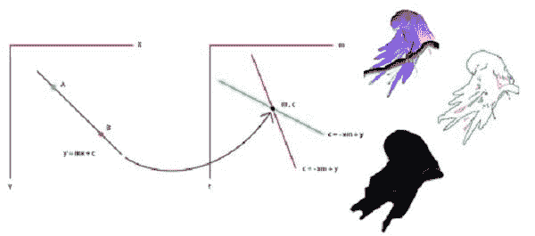
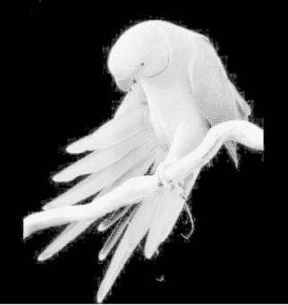
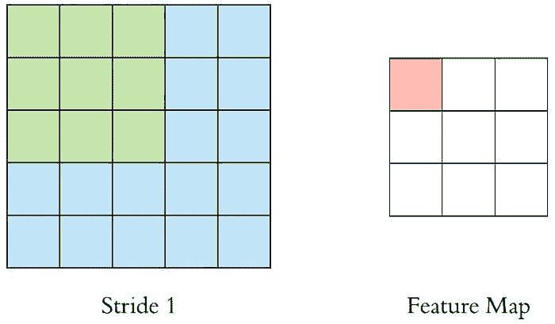
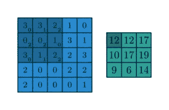
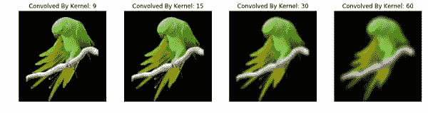

# 使用 Python 进行基础图像数据分析 – 第三部分

> 原文：[`www.kdnuggets.com/2018/09/image-data-analysis-python-p3.html`](https://www.kdnuggets.com/2018/09/image-data-analysis-python-p3.html)

 评论



之前我们已经看过一些在 Python 中非常基础的图像分析操作。在这最后一部分基础图像分析中，我们将讨论以下一些内容。

* * *

## 我们的前三大课程推荐

 1\. [Google 网络安全证书](https://www.kdnuggets.com/google-cybersecurity) - 快速进入网络安全职业。

 2\. [Google 数据分析专业证书](https://www.kdnuggets.com/google-data-analytics) - 提升你的数据分析技能

 3\. [Google IT 支持专业证书](https://www.kdnuggets.com/google-itsupport) - 支持你的组织 IT

* * *

以下内容是我在上学期完成的学术图像处理课程的反思。因此，我不打算将任何内容投入生产领域。相反，本文的目的是尝试实现一些基础图像处理技术的基本原理。为此，我将主要使用 [**SciKit-Image**](https://scikit-image.org/) 和 [**numpy**](http://www.numpy.org/) 来执行大部分操作，尽管我会偶尔使用其他库，而不是像 [**OpenCV**](https://opencv.org/) 这样的最受欢迎的工具。

我原本想将这个系列分成两部分，但由于内容的吸引力和多样性，我不得不将其拆分成太多部分。然而，您可以在我的主页上找到整个系列的两部分，链接如下。

**查找完整系列：** [**第一部分**](https://www.kdnuggets.com/2018/07/basic-image-data-analysis-numpy-opencv-p1.html)**,** [**第二部分**](https://www.kdnuggets.com/2018/07/image-data-analysis-numpy-opencv-p2.html) **所有源代码：** [**GitHub-图像处理-Python**](https://github.com/iphton/Image-Processing-in-Python)

如果你不想跳转，请继续在这里阅读。在上一篇文章中，我们讨论了一些基本操作。为了跟上今天的内容，持续阅读是非常重要的。

+   [导入图像并观察其属性](https://iphton.github.io/iphton.github.io/Image-Processing-in-Python-Part-1/#1-bullet)

+   [分离图层](https://iphton.github.io/iphton.github.io/Image-Processing-in-Python-Part-1/#2-bullet)

+   [灰度图](https://iphton.github.io/iphton.github.io/Image-Processing-in-Python-Part-1/#3-bullet)

+   [对像素值使用逻辑运算符](https://iphton.github.io/iphton.github.io/Image-Processing-in-Python-Part-1/#4-bullet)

+   [使用逻辑运算符的遮罩](https://iphton.github.io/iphton.github.io/Image-Processing-in-Python-Part-1/#5-bullet)

我很兴奋，让我们开始吧！

### 强度变换

让我们开始导入图像。

```py

%matplotlibinline

import imageio
import matplotlib.pyplot as plt
import warnings
import matplotlib.cbook
warnings.filterwarnings("ignore",category=matplotlib.cbook.mplDeprecation)

pic=imageio.imread('img/parrot.jpg')

plt.figure(figsize=(6,6))
plt.imshow(pic);
plt.axis('off');
```


### 图像负片

强度变换函数在数学上定义为：

```py
S = T(r)
```

其中 r 是输入图像的像素，s 是输出图像的像素。T 是一个变换函数，将每个 r 值映射到每个 s 值。

负片变换，这是身份变换的反向。在负片变换中，输入图像的每个值从 L−1 中减去，并映射到输出图像上。

在这种情况下，进行了以下转换：

```py
s=(L–1)–r
```

因此，每个值都减去**255**。结果是，较亮的像素变暗，较暗的图像变亮。这会导致图像负片。

```py

negative =255- pic # neg = (L-1) - img

plt.figure(figsize= (6,6))
plt.imshow(negative);
plt.axis('off');

```


### 对数变换

对数变换可以通过以下公式定义：

```py
s=c∗log(r+1)
```

其中 s 和 r 是输出图像和输入图像的像素值，c 是常数。对输入图像的每个像素值加上 1，因为如果图像中有像素强度为 0，则**log(0)**等于无穷大。因此，加 1 使得最小值至少为 1。

在对数变换过程中，图像中的暗像素相对于较高像素值被扩展。较高的像素值在对数变换中被压缩。这会导致以下图像增强效果。

对数变换中的 c 值调整我们所寻求的增强类型。

```py

%matplotlibinline

import imageio
import numpyasnp
import matplotlib.pyplotasplt

pic=imageio.imread('img/parrot.jpg')
gray=lambda rgb : np.dot(rgb[...,:3],[0.299,0.587,0.114])
gray=gray(pic)

 '''
log transform
-> s = c*log(1+r)

So, we calculate constant c to estimate s
-> c = (L-1)/log(1+|I_max|)

''' 

max_=np.max(gray)

def log_transform():
return(255/np.log(1+max_))*np.log(1+gray)

plt.figure(figsize=(5,5))
plt.imshow(log_transform(),cmap=plt.get_cmap(name='gray'))
plt.axis('off');

```



### 伽玛校正

伽玛校正，通常简称为伽玛，是一种非线性操作，用于在视频或静态图像系统中编码和解码亮度或三刺激值。伽玛校正也称为**幂律变换**。首先，我们的图像像素强度必须从范围**0, 255**缩放到**0, 1.0**。然后，通过应用以下公式，我们获得输出的伽玛校正图像：

```py
Vo  = V^(1/G)
```

其中**Vi**是我们的输入图像，**G**是我们的伽玛值。输出图像**Vo**随后被缩放回范围**0-255**。

伽玛值，**G < 1**有时称为**编码伽玛**，使用这种压缩幂律非线性进行编码的过程称为**伽玛压缩**；伽玛值< 1 会将图像向光谱的较暗端移动。

相反，伽玛值**G > 1**称为**解码伽玛**，应用扩展的幂律非线性称为**伽玛扩展**。伽玛值> 1 会使图像看起来更亮。伽玛值**G = 1**不会对输入图像产生影响：

```py

import imageio
import matplotlib.pyplotasplt

# Gamma encoding 
pic=image io.imread('img/parrot.jpg')
gamma=2.2# Gamma < 1 ~ Dark ; Gamma > 1 ~ Bright

gamma_correction=((pic/255)**(1/gamma))
plt.figure(figsize=(5,5))
plt.imshow(gamma_correction)
plt.axis('off');

```


### **伽玛校正的原因**

我们应用伽玛校正的原因是我们的眼睛对颜色和亮度的感知与数字相机的传感器不同。当数字相机上的传感器接收到两倍的光子时，信号也会加倍。然而，我们的眼睛并不是这样工作的。相反，我们的眼睛将双倍的光线感知为仅仅亮了一些。因此，虽然数字相机的亮度具有线性关系，而我们的眼睛则具有非线性关系。为了考虑这种关系，我们应用伽玛校正。

还有其他线性变换函数，列举如下：

+   对比度拉伸

+   强度级切片

+   位平面切片

### 卷积

我们在之前的[文章](https://www.kdnuggets.com/2018/07/image-data-analysis-numpy-opencv-p2.html)中简要讨论过，当计算机看到图像时，它看到的是像素值的数组。现在，根据图像的分辨率和大小，它会看到一个 32 x 32 x 3 的数字数组，其中 3 代表 RGB 值或通道。为了更好地说明这一点，假设我们有一张 PNG 格式的彩色图像，大小为 480 x 480。代表性的数组将是 480 x 480 x 3。每个这些数字的值从 0 到 255，这描述了该点的像素强度。

正如我们之前提到的，输入是一个 32 x 32 x 3 的像素值数组。现在，解释卷积的最佳方式是想象一个手电筒照在图像的左上角。假设手电筒照射到一个 3 x 3 的区域。现在，让我们想象这个手电筒在输入图像的所有区域上滑动。在机器学习术语中，这个手电筒被称为**滤波器**或[**内核**](https://en.wikipedia.org/wiki/Kernel_(image_processing)#Details)，有时也称为**权重**或**掩模**，而它照射的区域称为[**感受野**](https://en.wikipedia.org/wiki/Receptive_field)。

现在，这个滤波器也是一个数字数组，其中的数字称为权重或参数。一个非常重要的说明是，这个滤波器的深度必须与输入的深度相同，因此这个滤波器的尺寸是 3 x 3 x 3。

图像**内核**或**滤波器**是一个小矩阵，用于应用诸如模糊、锐化、轮廓描边或浮雕等效果，类似于 Photoshop 或 Gimp 中的效果。它们在机器学习中也用于**特征提取**，这是一种确定图像最重要部分的技术。有关更多信息，请查看 Gimp 的关于使用[图像内核](https://docs.gimp.org/en/plug-in-convmatrix.html)的优秀文档。我们可以在[这里](https://en.wikipedia.org/wiki/Kernel_(image_processing)#Details)找到最常见的内核列表。

现在，让我们将过滤器移动到左上角。当过滤器滑动或**卷积**输入图像时，它会将过滤器中的值与图像的原始像素值相乘（即计算逐元素乘法）。这些乘法结果会被求和。因此我们得到一个单一的数字。请记住，这个数字仅代表过滤器在图像的左上角时的值。现在，我们对输入体积的每个位置重复这个过程。下一步是将过滤器向右移动一个**步幅**或**步长** 1 单位，再向右移动一个**步幅** 1，依此类推。输入体积上的每个唯一位置都会产生一个数字。我们也可以选择步幅或步长为 2 或更多，但必须注意它是否适合输入图像。



在滑动过滤器覆盖所有位置后，我们会发现，剩下的是一个 30 x 30 x 1 的数字数组，我们称之为**激活图**或**特征图**。我们得到 30 x 30 数组的原因是 3 x 3 过滤器可以适配在 32 x 32 输入图像的 900 个不同位置。这 900 个数字被映射到 30 x 30 数组。我们可以通过以下步骤计算卷积后的图像：

```py
Convolved: (N−F)/S+1
```

其中 N 和 F 分别代表输入图像大小和卷积核大小，而 S 代表步幅或步长。因此，在这种情况下，输出将是

```py
32−31+1=30
```

假设我们有一个 3x3 的过滤器，对 5x5 矩阵进行卷积，根据方程，我们应该得到一个 3x3 矩阵，技术上称为**激活图**或**特征图**。

让我们从视觉上看一下，



此外，我们实际上使用了更多的过滤器而不是一个。然后我们的输出体积将是 28x28xn（其中 n 是**激活图**的数量）。

通过使用更多的过滤器，我们能够更好地保持空间维度。

然而，对于图像矩阵边界上的像素，一些卷积核元素可能会超出图像矩阵，因此没有来自图像矩阵的对应元素。在这种情况下，我们可以消除这些位置的卷积操作，从而得到一个比输入更小的输出矩阵，或者我们可以对输入矩阵应用[**填充**](https://www.quora.com/What-are-the-roles-of-stride-and-padding-in-a-convolutional-neural-network)。

现在，我确实意识到这些话题有些复杂，可能会成为独立的完整帖子。为了保持简洁却又不失全面性，我将提供链接到更多详细解释这些话题的资源。

首先，我们将一些自定义均匀窗口应用于图像。这会通过将每个像素与附近的像素平均来“烧录”图像：

```py

%%time
import numpy as np
import imageio
import matplotlib.pyplot as plt
from scipy.signal import convolve2d

def Convolution(image, kernel):
conv_bucket= []
for d in range(image.ndim):
conv_channel= convolve2d(image[:,:,d], kernel, 
                               mode="same", boundary="symm")
conv_bucket.append(conv_channel)
returnnp.stack(conv_bucket, axis=2).astype("uint8")

kernel_sizes= [9,15,30,60]
fig, axs=plt.subplots(nrows=1, ncols=len(kernel_sizes), figsize=(15,15));

pic =imageio.imread('img:/parrot.jpg')

for k, ax in zip(kernel_sizes, axs):
    kernel =np.ones((k,k))
    kernel /=np.sum(kernel)
ax.imshow(Convolution(pic, kernel));
ax.set_title("Convolved By Kernel: {}".format(k));
ax.set_axis_off();
Wall time: 43.5 s

```



请查看更多内容[这里](https://iphton.github.io/iphton.github.io/Image-Processing-in-Python-Part-2/#4-bullet)。我在其中深入讨论了各种类型的内核，并展示了它们的区别。

**简介：** [穆罕默德·因纳特](https://twitter.com/innat_2k14) 目前是一名电子与通信专业的四年级本科生。他热衷于将他的机器学习和数据科学知识应用于医疗保健和犯罪预测领域，以便在医疗和安全部门提供更好的解决方案。

**相关：**

+   [基本图像数据分析使用 Numpy 和 OpenCV – 第一部分](https://www.kdnuggets.com/2018/07/basic-image-data-analysis-numpy-opencv-p1.html)

+   [Python 中的基本图像处理，第二部分](https://www.kdnuggets.com/2018/07/image-data-analysis-numpy-opencv-p2.html)

+   [仅用 Numpy：使用 Numpy 实现 GAN 和 Adam 优化器](https://www.kdnuggets.com/2018/08/only-numpy-implementing-gans-adam-optimizer.html)

### 更多相关内容

+   [KDnuggets 新闻，6 月 29 日：数据科学的 20 个基本 Linux 命令](https://www.kdnuggets.com/2022/n26.html)

+   [它活了！用 Python 和一些便宜的组件构建你的第一个机器人](https://www.kdnuggets.com/2023/06/manning-build-first-robots-python-cheap-basic-components.html)

+   [使用 Tensorflow 训练图像分类模型指南](https://www.kdnuggets.com/2022/12/guide-train-image-classification-model-tensorflow.html)

+   [我如何使用 Grounding DINO 进行自动图像标记](https://www.kdnuggets.com/2023/05/automatic-image-labeling-grounding-dino.html)

+   [如何使用 LangChain 实现 Agentic RAG：第一部分](https://www.kdnuggets.com/how-to-implement-agentic-rag-using-langchain-part-1)

+   [数据科学中的 8 个基本统计概念](https://www.kdnuggets.com/2020/06/8-basic-statistics-concepts.html)
