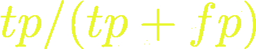
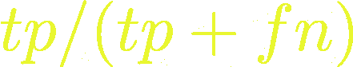
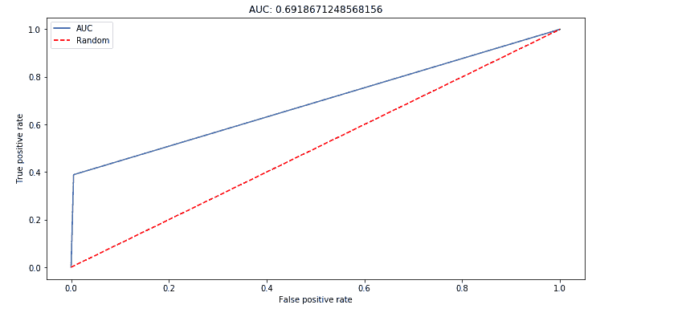
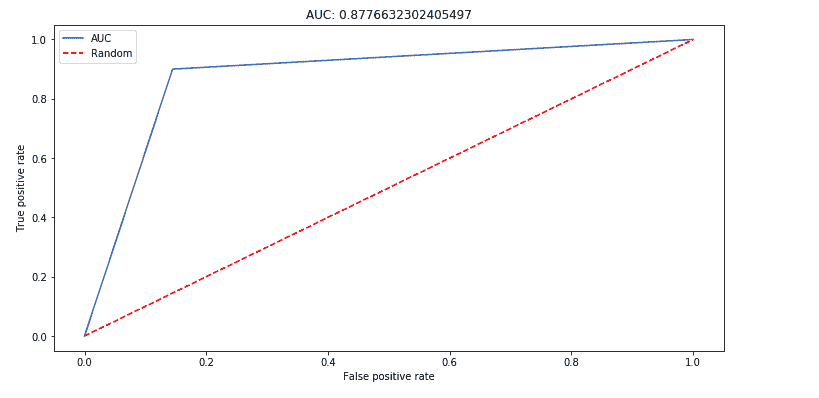

# 处理机器学习中的不平衡数据

> 原文：[`www.kdnuggets.com/2020/10/imbalanced-data-machine-learning.html`](https://www.kdnuggets.com/2020/10/imbalanced-data-machine-learning.html)

评论

作为机器学习工程师或数据科学家，有时你不可避免地会遇到一个类别标签有数百条记录而另一个类别标签有数千条记录的情况。

训练模型后，你获得了超过 90% 的准确率。然后你发现模型将所有预测都归入记录较多的类别。欺诈检测问题和流失预测问题就是这样的优秀例子，其中大多数记录都在负类中。在这种情况下你该怎么办？这将是本文的重点。

### 收集更多数据

最直接明显的做法是收集更多的数据，特别是关于少数类的数据点。这显然会改善模型的性能。然而，这并非总是可能的。除了需要承担的成本，有时收集更多数据并不现实。例如，在流失预测和欺诈检测的情况下，你不能仅仅等待更多事件发生以便收集更多数据。

### 考虑除准确率之外的指标

准确率不是衡量类别标签不平衡模型性能的好方法。在这种情况下，考虑其他指标是明智的，比如精确率、召回率、曲线下面积（AUC）——仅举几个例子。

**精确率** 测量了在所有被预测为真正例和假正例的样本中真正例的比例。例如，在我们模型预测的流失人群中，有多少人实际流失了？



**召回率** 测量了真正例在真正例和假负例之和中的比例。例如，我们模型预测会流失的人中，实际流失的百分比。



AUC 是通过接收器操作特性（ROC）曲线获得的。该曲线是通过将真正率与假正率绘制在图表上得到的。假正率是通过将假正例除以假正例与真正例之和得到的。

接近 1 的 AUC 更好，因为它表明模型能够找到真正例。

### 强调少数类

处理不平衡数据的另一种方法是让模型专注于少数类。这可以通过计算类别权重来完成。模型将专注于权重较高的类别。最终，模型将能够平等地从两个类别中学习。这些权重可以通过 scikit-learn 计算。

```py
from sklearn.utils.class_weight import compute_class_weight
weights = compute_class_weight(‘balanced’, y.unique(), y)
array([ 0.51722354, 15.01501502])
```

然后，你可以在训练模型时传递这些权重。例如，在逻辑回归的情况下：

```py
class_weights = {
 0:0.51722354,
 1:15.01501502
}lr = LogisticRegression(C=3.0, fit_intercept=True, warm_start = True, class_weight=class_weights)
```

或者，你可以将类权重设置为`balanced`，权重将会自动调整。

```py
lr = LogisticRegression(C=3.0, fit_intercept=True, warm_start = True, class_weight=’balanced’)
```

这是权重调整前的 ROC 曲线。



这是权重调整后的 ROC 曲线。注意 AUC 从 0.69 提高到了 0.87。



### 尝试不同的算法

当你关注于不平衡数据的正确指标时，你也可以尝试不同的算法。一般来说，基于树的算法在不平衡数据上表现更好。此外，一些算法如[LightGBM](https://heartbeat.fritz.ai/lightgbm-a-highly-efficient-gradient-boosting-decision-tree-53f62276de50)具有可以调节的超参数，以指示数据不平衡。

### 生成合成数据

你也可以生成[合成数据](https://heartbeat.fritz.ai/synthetic-data-a-bridge-over-the-data-moat-29f392a52f27)来增加少数类的记录数量——通常称为过采样。这通常在训练集进行训练-测试拆分后完成。在 Python 中，可以使用[Imblearn](https://github.com/scikit-learn-contrib/imbalanced-learn)包来实现。包中的一种策略是[Synthetic Minority Over-sampling Technique (SMOTE)](https://imbalanced-learn.readthedocs.io/en/stable/generated/imblearn.over_sampling.SMOTE.html)，该技术基于 k 最近邻算法。

使用 SMOTE 时：

+   第一个参数是`float`类型，表示在重新采样完成后，少数类样本与多数类样本的比例。

+   生成合成样本时使用的邻居数量可以通过`k_neighbors`参数指定。

```py
from imblearn.over_sampling import SMOTEsmote = SMOTE(0.8)X_resampled,y_resampled = smote.fit_resample(X.values,y.values)pd.Series(y_resampled).value_counts()0    9667
1    7733 
dtype: int64
```

然后，你可以将重新采样的数据拟合到你的模型中。

```py
model = LogisticRegression()model.fit(X_resampled,y_resampled)predictions = model.predict(X_test)
```

### 对多数类进行欠采样

你也可以尝试减少多数类的样本数量。可以实现的一种策略是`[NearMiss](https://imbalanced-learn.readthedocs.io/en/stable/generated/imblearn.under_sampling.NearMiss.html)`方法。你也可以像 SMOTE 一样指定比例，以及通过`n_neighbors`指定邻居数量。

```py
from imblearn.under_sampling import NearMissunderSample = NearMiss(0.3,random_state=1545)pd.Series(y_resampled).value_counts()0  1110 1  333 dtype: int64
```

### 最终思考

其他可用的技术包括使用[集成学习](https://heartbeat.fritz.ai/a-guide-to-ensemble-learning-390027fe38b8)将多个弱学习器组合成一个强分类器。对于最重要的正类，精确度-召回曲线和曲线下面积（PR、AUC）也是值得尝试的指标。

一如既往，你应该尝试不同的技术，并选择那些能为你的具体问题提供最佳结果的技术。希望这篇文章能提供一些入门的见解。

**[代码可在这里找到](https://github.com/mwitiderrick/imbalanced-data)**。

**个人简介：德里克·姆维蒂**是一位数据科学家，热衷于分享知识。他通过诸如 Heartbeat、Towards Data Science、Datacamp、Neptune AI、KDnuggets 等博客积极贡献于数据科学社区，仅这些博客上的内容就已在互联网上被浏览超过一百万次。德里克还是一位作者和在线讲师。他还与各种机构合作，实施数据科学解决方案并提升员工技能。德里克在多媒体大学学习了数学和计算机科学，还曾是梅尔特沃特创业技术学院的校友。如果你对数据科学、机器学习和深度学习感兴趣，可以查看他的[Python 完整数据科学与机器学习训练营课程](https://www.udemy.com/course/data-science-bootcamp-in-python/?referralCode=9F6DFBC3F92C44E8C7F4)。

[原文](https://heartbeat.fritz.ai/dealing-with-imbalanced-data-in-machine-learning-18e45fea7bb5)。经授权转载。

**相关：**

+   如何修复不平衡的数据集

+   处理不平衡数据集的 5 种最有用技术

+   专家提示：如何处理类别不平衡和缺失标签

* * *

## 我们的前三名课程推荐

 1\. [Google 网络安全证书](https://www.kdnuggets.com/google-cybersecurity) - 快速进入网络安全职业的快车道。

 2\. [Google 数据分析专业证书](https://www.kdnuggets.com/google-data-analytics) - 提升你的数据分析能力

 3\. [Google IT 支持专业证书](https://www.kdnuggets.com/google-itsupport) - 为你的组织提供 IT 支持

* * *

### 更多相关话题

+   [处理文本数据中的噪声标签](https://www.kdnuggets.com/2023/04/dealing-noisy-labels-text-data.html)

+   [处理推荐和搜索中的位置偏差](https://www.kdnuggets.com/2023/03/dealing-position-bias-recommendations-search.html)

+   [无监督解缠表示学习中的类别不平衡数据集…](https://www.kdnuggets.com/2023/01/unsupervised-disentangled-representation-learning-class-imbalanced-dataset-elastic-infogan.html)

+   [KDnuggets 新闻，8 月 31 日：完整的数据科学学习路线图…](https://www.kdnuggets.com/2022/n35.html)

+   [7 种处理不平衡数据的技术](https://www.kdnuggets.com/2017/06/7-techniques-handle-imbalanced-data.html)

+   [在真实场景中克服数据不平衡挑战](https://www.kdnuggets.com/2023/07/overcoming-imbalanced-data-challenges-realworld-scenarios.html)
