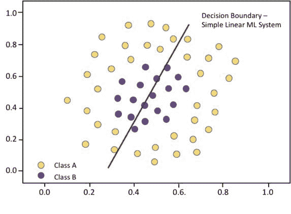
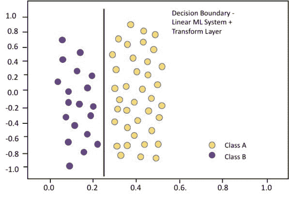
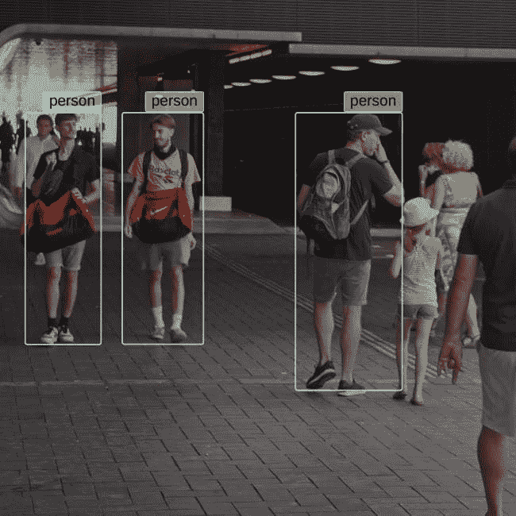

# 三种边缘案例罪魁祸首：偏差、方差和不可预测性

> 原文：[`www.kdnuggets.com/2021/04/imerit2-bias-variance-unpredictability.html`](https://www.kdnuggets.com/2021/04/imerit2-bias-variance-unpredictability.html)

赞助帖子。

[**iMerit 是提供高质量数据的领先者**](https://go.imerit.net/annotation-services?latest_sfdc_campaign=7011Y000002WKAb&latest_sfdc_campaign_status=Responded&utm_campaign=edgecases&utm_medium=blogpost&utm_source=kdnuggets&utm_content=toplink)用于训练数据集。在我们最新的博客帖子中，我们为您带来识别和处理 ML 系统中边缘案例的最新方法。如果您希望与专家交谈并了解更多关于克服边缘案例的信息，[请联系我们](https://go.imerit.net/annotation-services?latest_sfdc_campaign=7011Y000002WKAb&latest_sfdc_campaign_status=Responded&utm_campaign=edgecases&utm_medium=blogpost&utm_source=kdnuggets&utm_content=toplink)。

通过训练，机器学习（ML）系统通过将输入（例如，像素值、音频样本、文本）与类别（例如，物体身份、单词、情感）关联来学习识别模式。这种关联可以被认为是将可能输入的多维空间划分为表示类别的区域，这些区域由决策边界定义。当在测试或操作过程中，输入落在分配给其类别的区域边缘之外时，输入会被错误分类。这种情况称为边缘案例。

边缘案例发生的三个基本原因：

+   偏差 – ML 系统过于“简单”

+   方差 – ML 系统过于“经验不足”

+   不可预测性 – ML 系统在充满惊喜的环境中运行。

我们如何识别这些边缘案例情况，以及我们可以做些什么？

### **偏差**

偏差表现为 ML 系统在其训练数据集上的表现不佳。这表明 ML 系统的架构，其模型，无法表示训练数据中的细微差别。下面是一个非常简单的例子：

该图表展示了一个具有两个输入、单层、两个神经元的神经网络实现的线性决策边界。由于其简单的线性决策边界不足以分离这些类别，它在尝试区分紫色和黄色点时表现不佳。

如果我们通过添加一个预处理层，将原始输入转换为极坐标，使机器学习系统变得稍微复杂一点，紫色和黄色的点在呈现给机器学习系统线性部分的新输入空间中对齐方式会有所不同，我们得到的决策边界看起来是这样的。这个更复杂的机器学习系统在训练数据上表现良好。

*“层的结构本身也可以产生很大的影响。”*

通常，克服机器学习系统偏差所需的额外复杂性可以通过简单地增加处理单元和层来实现。然而，层的结构本身也可以产生很大的影响。自 2010 年以来，ImageNet 视觉数据库已被用来基准测试对象识别机器学习系统的性能。在[2012](https://en.wikipedia.org/wiki/ImageNet)年，最佳性能在这个数据集上跃升了 10.8 个百分点，当时卷积神经网络取代了使用预处理和支持向量机的早期架构，实际上是上述简单机器学习系统的更复杂版本。

### **方差**

当一个机器学习系统在其训练数据上表现良好，但在测试中表现较差时，问题往往在于训练数据集过小，无法充分反映机器学习系统操作环境中的变异范围。

减少由于方差引起的边缘情况的主要方法是收集更多的训练数据。

例如，所示的对象识别 [系统](https://users.ece.cmu.edu/~koopman/lectures/Koopman19_SSS_slides.pdf) 在成人面前表现良好，但显然在儿童方面经验不足。

方差问题引起的边缘情况对于自动面部识别系统是一个大问题。例如，虽然这些系统在识别智能手机用户方面可以非常准确，但在用于执法时可能会产生不准确且令人担忧的结果。在 2018 年的一项 [测试](https://www.nytimes.com/2018/07/26/technology/amazon-aclu-facial-recognition-congress.html) 中，28 名美国国会议员被错误地匹配到一个包含 25,000 名罪犯的数据库中的照片。

减少由于方差引起的边缘情况的主要方法是收集更多的训练数据。 [研究](https://arxiv.org/abs/1707.02968)表明，随着训练数据集大小的增加，即使对于已经非常大的数据集，机器学习系统的性能也会持续改善。

在某些情况下，[数据增强](https://en.wikipedia.org/wiki/Data_augmentation) 可以通过对原始数据进行小的变化来增加训练数据集的大小，以表示诸如物体旋转、光照或姿态等变异。然而，特别重要的是确保训练数据能够代表操作环境中遇到的重要但可能较少见的情况，例如儿童的出现或极端天气条件。

### **不可预测性**

机器学习依赖于在输入数据中找到规律模式。数据中总是存在统计变异，但通过适当的架构和足够的训练数据，机器学习系统通常可以找到足够的数据规律（实现足够小的偏差和方差），以做出可靠的决策并最小化边缘情况。

然而，自动驾驶是一个例子，它为机器学习系统提供了如此高的变异性，以至于可能的情况几乎是无穷无尽的。训练数据可以通过数百万英里的驾驶收集，但可能无法遇到重要的边缘情况。例如，2018 年一名女性被[撞击](https://www.nbcnews.com/tech/tech-news/self-driving-uber-car-hit-killed-woman-did-not-recognize-n1079281)并且被自驾车撞死，因为机器学习系统从未被训练去识别和应对带自行车的过马路行人。

处理在不可预测的自动驾驶应用中遇到的几乎无限数量的边缘情况是一项特别困难的挑战。为应对这一问题，正在采取两条途径。一种方法是开发专门训练以识别危险或可疑系统并采取覆盖措施以维护安全的[“检查员”](https://users.ece.cmu.edu/~koopman/lectures/Koopman19_SSS_slides.pdf)机器学习系统。

另一种方法是训练自动驾驶车辆的机器学习系统，以更好地处理边缘情况。一个方法是使用虚拟道路训练[环境](https://www.cognata.com/edge-cases-predicting-the-unpredictable/)来扩展训练情况的范围。另一种方法使用[对抗性](https://techhq.com/2020/07/how-deepfake-tech-is-speeding-up-autonomous-vehicle-development/)训练，这项技术因创建“深度伪造”而闻名，以大幅扩展训练集，使机器学习系统能更好地处理新情况。

### **克服边缘情况**

下表总结了如何识别和处理由于机器学习偏差、方差和不可预测性引起的边缘情况：

| 元凶 | 表现形式 | 解决方法 |
| --- | --- | --- |
| 偏差 | 训练表现差 | 更好的机器学习系统模型 |
| 方差 | 测试表现差 | 更多的训练数据 |
| 不可预测性 | 操作惊喜 | 仿真对抗性训练 |

### **关键要点**

+   确保你的训练和测试数据集足够大且多样化（当然也要准确标记！），以暴露机器学习设计中的弱点，并充分表征操作环境的多样性。

+   对于具有高不可预测性的操作环境，考虑通过仿真和对抗性训练生成的示例来增强训练数据。

+   监控操作并应对新出现的边缘情况。

* * *

## 我们的前三个课程推荐

 1\. [谷歌网络安全证书](https://www.kdnuggets.com/google-cybersecurity) - 快速进入网络安全职业

 2\. [谷歌数据分析专业证书](https://www.kdnuggets.com/google-data-analytics) - 提升您的数据分析技能

 3\. [谷歌 IT 支持专业证书](https://www.kdnuggets.com/google-itsupport) - 支持您的组织 IT

* * *

### 更多相关话题

+   [3 分钟理解偏差-方差权衡](https://www.kdnuggets.com/2020/09/understanding-bias-variance-trade-off-3-minutes.html)

+   [偏差-方差权衡](https://www.kdnuggets.com/2022/08/biasvariance-tradeoff.html)

+   [每个数据科学家都应了解的三个 R 库（即使你使用 Python）](https://www.kdnuggets.com/2021/12/three-r-libraries-every-data-scientist-know-even-python.html)

+   [处理推荐和搜索中的位置偏差](https://www.kdnuggets.com/2023/03/dealing-position-bias-recommendations-search.html)

+   [Chip Huyen 分享了实施 ML 系统的框架和案例研究](https://www.kdnuggets.com/2023/02/sphere-chip-huyen-shares-frameworks-case-studies-implementing-ml-systems.html)

+   [边缘 AI 的前景及有效采用的方法](https://www.kdnuggets.com/the-promise-of-edge-ai-and-approaches-for-effective-adoption)
