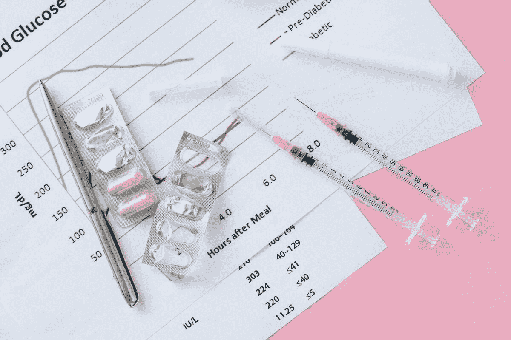

# 如何实现一个联邦学习项目与医疗数据

> 原文：[`www.kdnuggets.com/2023/02/implement-federated-learning-project-healthcare-data.html`](https://www.kdnuggets.com/2023/02/implement-federated-learning-project-healthcare-data.html)

图片由 [Nataliya Vaitkevich](https://www.pexels.com/photo/food-healthy-sugar-business-8965129/) 提供

联邦学习（FL）是一种机器学习方法，它允许在多个分散的设备或机构上训练模型，而无需将数据集中到单一服务器上。它已被应用于多个行业，从移动设备键盘到自动驾驶车辆再到石油平台。在医疗行业中尤为有用，因为涉及到敏感的患者数据，需要遵循严格的法规来保护个人隐私。在这篇博客中，我们将讨论一些实施医疗数据联邦学习项目的实际步骤。

* * *

## 我们的前三大课程推荐

 1\. [谷歌网络安全证书](https://www.kdnuggets.com/google-cybersecurity) - 快速进入网络安全职业生涯

 2\. [谷歌数据分析专业证书](https://www.kdnuggets.com/google-data-analytics) - 提升你的数据分析技能

 3\. [谷歌 IT 支持专业证书](https://www.kdnuggets.com/google-itsupport) - 支持你的组织的 IT 需求

* * *

首先，理解项目的要求和限制非常重要。这包括了解你将处理的数据类型以及必须遵循的法规，以保护个人隐私。可能还需要获得必要的批准和许可，以便将数据用于你的项目，例如机构审查委员会（IRB）批准。

接下来，你需要准备数据。这包括从不同的临床系统中提取数据，协调不同站点的数据（因为数据可能以不同的方式编码、格式不同，并且每个站点的数据分布也不同），注释数据（有时需要医生审查和注释数据），以及将数据划分为训练、测试和验证的部分。确保数据正确平衡并且能够代表整体人群，以确保结果的准确性是非常重要的。

一旦你的数据准备好后，你需要选择一个联邦学习框架。现有几个可供选择的选项，包括[NVIDIA FLARE](https://developer.nvidia.com/flare)、[TensorFlow Federated](https://www.tensorflow.org/federated)、[PySyft](https://blog.openmined.org/tag/pysyft/)、[OpenFL](https://github.com/intel/openfl)和[Flower](https://flower.dev/)。这些框架各有其特性和能力，因此选择最适合你项目需求的框架非常重要。我们发现 NVIDIA FLARE 提供了一个强大的框架，可以与任何底层机器学习框架（如 PyTorch、TensorFlow、sklearn 等）兼容使用。

接下来，你需要为你的联邦学习项目建立基础设施。这包括选择一个云服务器来托管最终模型并协调联邦学习过程，以及在每个参与站点设置服务器，安装所需的软件，使本地数据集对该服务器可用，并确保服务器能够与云服务器通信。根据你选择的联邦学习框架，你可能还需要在每个站点的本地服务器和云服务器之间设置一个安全的通信通道，以确保数据的隐私和安全。

一旦基础设施搭建完毕，你可以开始训练过程。这包括将你的模型架构提供给云服务器，云服务器将协调联邦学习训练——将模型发送到参与的设备或机构，在那里本地数据将用于训练本地模型。本地模型随后被发送回服务器，在服务器上进行汇总并用于更新全局模型。这个过程会重复进行，直到全局模型收敛到一个可接受的准确度水平。

最后，评估模型的性能并确保其符合项目要求是非常重要的。这涉及在一组独立的数据上测试模型或使用其对真实世界数据进行预测。在许多情况下，这还包括对模型架构、底层数据集和/或预处理进行迭代，以优化模型性能。

这些步骤可能看起来很复杂，但幸运的是，有像[Rhino Health](https://www.rhinohealth.com/)这样的联邦学习平台，可以使整个过程变得简单而无缝。强大的端到端联邦学习平台将负责基础设施的配置，提供强大的安全功能，并支持从数据预处理到模型训练和结果分析的所有联邦项目步骤，具备最大灵活性——允许数据科学家使用他们选择的数据分析/处理工具和机器学习/联邦学习框架。它们使得联邦项目更像是使用集中式数据的项目。

医疗保健创新的未来依赖于能够访问大量数据以进行分析和模型训练。联邦学习是一种强大的工具，它可以在不冒数据隐私风险的情况下访问数据，使其成为提高患者护理和推动医疗保健领域发展的有前景的方法。通过遵循这些步骤并采取必要的预防措施来保护患者隐私，你可以成功实施联邦学习项目，并在医疗保健行业中产生积极的影响。

**[Yuval Baror](https://il.linkedin.com/in/yuvalbaror)** 是 Rhino Health 的首席技术官及联合创始人。他在软件工程、管理和初创公司方面有近 20 年的经验（包括创办了一家成功被收购的初创公司）。在过去十年中，他在 3 家不同的公司从事基于 AI 的生产系统的构建工作。我喜欢人工智能的深度挑战，享受构建对客户产生实质性影响的生产系统的兴奋，以及在实际系统中使 AI 工作的独特交叉点。

### 更多相关话题

+   [联邦学习：协作机器学习及教程…](https://www.kdnuggets.com/2021/12/federated-learning-collaborative-machine-learning-tutorial-get-started.html)

+   [使用 HuggingFace 实现一个简单的端到端项目](https://www.kdnuggets.com/a-simple-to-implement-end-to-end-project-with-huggingface)

+   [了解数据隐私，学习实施技术隐私解决方案…](https://www.kdnuggets.com/2022/04/manning-data-privacy-learn-implement-technical-privacy-solutions-tools-scale.html)

+   [学习如何设计、测量和实施可信的 A/B 测试…](https://www.kdnuggets.com/2023/01/sphere-design-measure-implement-trustworthy-ab-tests-ronny-kohavi.html)

+   [如何使用 LangChain 实现自主 RAG：第一部分](https://www.kdnuggets.com/how-to-implement-agentic-rag-using-langchain-part-1)

+   [介绍来自 John Snow Labs 的医疗保健专用大语言模型](https://www.kdnuggets.com/2023/04/john-snow-introducing-healthcare-specific-large-language-models-john-snow-labs.html)
