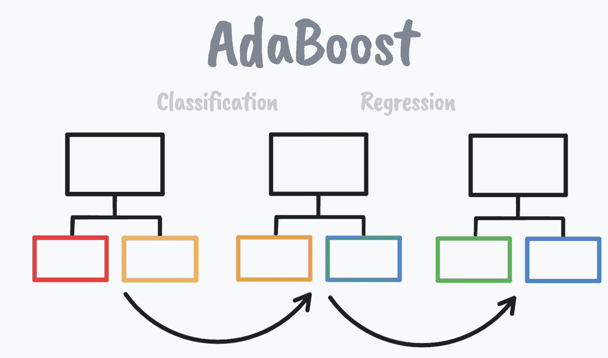

# 在 Scikit-learn 中实现 Adaboost

> 原文：[`www.kdnuggets.com/2022/10/implementing-adaboost-scikitlearn.html`](https://www.kdnuggets.com/2022/10/implementing-adaboost-scikitlearn.html)



来源：作者图片

# 什么是 AdaBoost？

* * *

## 我们的前三大课程推荐

 1\. [Google 网络安全证书](https://www.kdnuggets.com/google-cybersecurity) - 快速进入网络安全领域的职业生涯。

 2\. [Google 数据分析专业证书](https://www.kdnuggets.com/google-data-analytics) - 提升你的数据分析技能

 3\. [Google IT 支持专业证书](https://www.kdnuggets.com/google-itsupport) - 支持你的组织的 IT

* * *

AdaBoost 算法，简称为自适应提升，是一种用于机器学习中的集成方法的 Boosting 技术。由于权重会重新分配给每个实例，其中更高的权重分配给那些**未**被正确分类的实例，因此它被称为自适应提升。

*如果你想了解更多关于集成方法及其使用时机的信息，请阅读这篇文章：* *何时使用集成技术会是一个好选择？*

Boosting 是一种集成机器学习算法的方法，用于减少预测数据分析中的错误。它通过结合弱学习者的预测来实现这一点。在成为一个实际概念之前，Boosting 更多是一个理论概念。

*如果你想了解更多关于 Boosting 的信息，请阅读这篇文章：* *Boosting 机器学习算法概述*

## 术语

**什么是弱学习者？** 弱学习者是指一种简单模型，其技能水平较低，但表现稍微优于随机机会。

**什么是 Stump？** 在基于树的算法中，一个有两个叶子的节点被称为 Stump。弱学习者几乎总是 Stumps。

## AdaBoost 如何工作？

AdaBoost 算法在数据训练期间使用短的决策树。被错误分类的实例会被优先考虑，并作为第二个模型的输入 - 被称为弱学习者。这个过程会一次又一次地重复，直到模型尝试纠正之前模型做出的预测。

AdaBoost 背后的思想：

1.  弱学习者的组合用于分类

1.  一些 Stumps 在分类中的影响力大于其他 Stumps

1.  每个 Stump 考虑到之前 Stumps 的错误

# AdaBoost 和 Scikit-Learn

[Scikit-Learn](https://scikit-learn.org/stable/modules/classes.html#module-sklearn.ensemble) 提供了使用 Python 机器学习库实现 AdaBoost 的集成方法。AdaBoost 可用于分类和回归问题，因此让我们看看如何使用 Scikit-Learn 解决这些类型的问题。

## 分类

```py
sklearn.ensemble.AdaBoostClassifier
```

AdaBoost 分类器的目标是首先在原始数据集上拟合一个分类器，然后拟合额外的分类器，其中错误分类实例的权重会被调整。

这些是参数：

```py
sklearn.ensemble.AdaBoostClassifier(base_estimator = None, * ,
    n_estimators = 50, learning_rate = 1.0, algorithm = 'SAMME.R',
    random_state = None)
```

你可以在 [这里](https://scikit-learn.org/stable/modules/generated/sklearn.ensemble.AdaBoostClassifier.html#sklearn.ensemble.AdaBoostClassifier) 了解更多关于它们及其属性的信息。

让我们来看一个例子：

导入：

```py
from sklearn.ensemble import AdaBoostClassifier
from sklearn.tree import DecisionTreeClassifier
from sklearn.datasets import load_breast_cancer
import pandas as pd
import numpy as np
from sklearn.model_selection import train_test_split
from sklearn.metrics import confusion_matrix
from sklearn.preprocessing import LabelEncoder
```

加载数据集：

```py
breast_cancer = load_breast_cancer()
X = pd.DataFrame(breast_cancer.data, columns=breast_cancer.feature_names)
y = pd.Categorical.from_codes(breast_cancer.target, breast_cancer.target_names)
```

将恶性编码为 1，将良性编码为 0：

```py
encoder = LabelEncoder()
binary_encoded_y = pd.Series(encoder.fit_transform(y))
```

训练/测试集：

```py
train_X, test_X, train_y, test_y = train_test_split(X,
    binary_encoded_y, random_state = 1)
```

拟合我们的模型：

```py
classifier = AdaBoostClassifier(
    DecisionTreeClassifier(max_depth = 1),
    n_estimators = 200
)
classifier.fit(train_X, train_y)
```

进行预测：

```py
​​predictions = classifier.predict(test_X)
```

评估模型：

```py
confusion_matrix(test_y, predictions)
```

输出：

```py
array([[86,  2],
       [ 3, 52]])

```

代码来源：[Cory Maklin](https://github.com/corymaklin/adaboost/blob/master/adaboost.ipynb)

## 回归

```py
sklearn.ensemble.AdaBoostRegressor
```

AdaBoost 回归器的目标是首先在原始数据集上拟合一个回归器，然后拟合额外的回归器，其中权重根据当前预测误差进行了调整。

这些是参数：

```py
sklearn.ensemble.AdaBoostRegressor(base_estimator = None, * ,
    n_estimators = 50, learning_rate = 1.0, loss = 'linear',
    random_state = None)
```

如果你想了解更多关于它们及其属性的信息，请点击 [这里](https://scikit-learn.org/stable/modules/generated/sklearn.ensemble.AdaBoostRegressor.html)。

让我们来看一个例子：

```py
#evaluate adaboost ensemble
for regression
from numpy
import mean
from numpy
import std
from sklearn.datasets
import make_regression
from sklearn.model_selection
import cross_val_score
from sklearn.model_selection
import RepeatedKFold
from sklearn.ensemble
import AdaBoostRegressor

# define dataset
X, y = make_regression(n_samples = 1000, n_features = 20,
    n_informative = 15, noise = 0.1, random_state = 6)

# define the model
model = AdaBoostRegressor()

# evaluate the model
cv = RepeatedKFold(n_splits = 10, n_repeats = 3, random_state = 1)
n_scores = cross_val_score(model, X, y, scoring =
    'neg_mean_absolute_error', cv = cv, n_jobs = -1, error_score =
    'raise')

# report performance
print('MAE: %.3f (%.3f)' % (mean(n_scores), std(n_scores)))
```

代码来源：[MachineLearningMastery](https://machinelearningmastery.com/adaboost-ensemble-in-python/)

# 总结

如果你想了解更多关于集成方法以及如何使用技术：装袋、提升和堆叠来提高预测准确性的信息，请查看 MachineLearningMastery 书籍：[Python 中的集成学习算法](https://machinelearningmastery.com/ensemble-learning-algorithms-with-python/)

[Josh Starmer](https://www.youtube.com/c/joshstarmer)，统计和机器学习专家，通过这个视频帮助我更好地理解 AdaBoost：[AdaBoost 清晰解释](https://www.youtube.com/watch?v=LsK-xG1cLYA&t=679s)

**[Nisha Arya](https://www.linkedin.com/in/nisha-arya-ahmed/)** 是一位数据科学家和自由撰稿人。她特别关注提供数据科学职业建议或教程以及围绕数据科学的理论知识。她还希望探索人工智能如何及如何可以惠及人类寿命的不同方式。她是一个热衷学习者，寻求拓宽技术知识和写作技能，同时帮助指导他人。

### 更多相关话题

+   [通过实现理解：决策树](https://www.kdnuggets.com/2023/02/understanding-implementing-decision-tree.html)

+   [在业务中实施推荐系统的十个关键经验教训](https://www.kdnuggets.com/2022/07/ten-key-lessons-implementing-recommendation-systems-business.html)

+   [在 Python 中实现 DBSCAN](https://www.kdnuggets.com/2022/08/implementing-dbscan-python.html)

+   [Chip Huyen 分享了实施机器学习系统的框架和案例研究](https://www.kdnuggets.com/2023/02/sphere-chip-huyen-shares-frameworks-case-studies-implementing-ml-systems.html)

+   [KDnuggets 新闻，8 月 24 日：在 Python 中实现 DBSCAN • 如何…](https://www.kdnuggets.com/2022/n34.html)

+   [理解和实现 Python 中的遗传算法](https://www.kdnuggets.com/understanding-and-implementing-genetic-algorithms-in-python)
