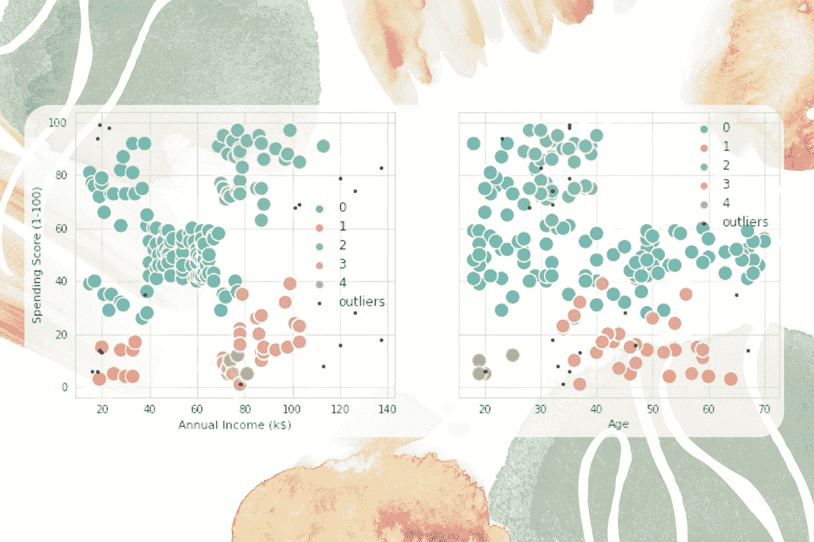
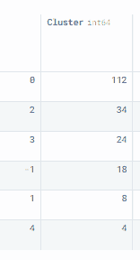
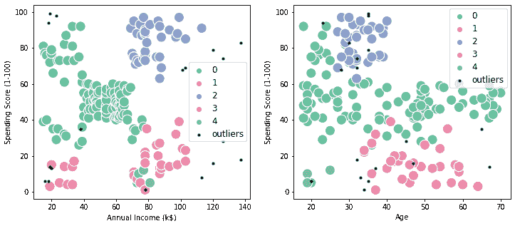

# 在 Python 中实现 DBSCAN

> 原文：[`www.kdnuggets.com/2022/08/implementing-dbscan-python.html`](https://www.kdnuggets.com/2022/08/implementing-dbscan-python.html)



图片由作者提供

聚类应用于数据集，以将相似的数据点分组。它查找数据点之间的相似性和差异性，并将它们聚集在一起。聚类没有标签。聚类是一种无监督学习，用于发现数据集的潜在结构。

* * *

## 我们的前三大课程推荐

 1\. [谷歌网络安全证书](https://www.kdnuggets.com/google-cybersecurity) - 快速进入网络安全职业道路。

 2\. [谷歌数据分析专业证书](https://www.kdnuggets.com/google-data-analytics) - 提升您的数据分析能力

 3\. [谷歌 IT 支持专业证书](https://www.kdnuggets.com/google-itsupport) - 支持您的组织的 IT 需求

* * *

**聚类算法的类型：**

+   基于分区的聚类

+   模糊聚类

+   层次聚类

+   基于网格的聚类

+   排他性聚类

+   重叠聚类

+   基于密度的聚类

在这篇博客中，我们将重点关注基于密度的聚类方法，特别是使用 scikit-learn 的 DBSCAN 算法。基于密度的算法擅长发现高密度区域和离群点。它通常用于异常检测和聚类非线性数据集。

# 什么是 DBSCAN？

DBSCAN（基于密度的空间聚类算法，带噪声）是一种基于密度的无监督学习算法。它计算最近邻图以找到任意形状的簇和离群点。而 K-means 聚类生成的是球形簇。

DBSCAN 最初不需要**K**个簇。相反，它需要两个参数：eps 和 minPts。

+   **eps**：这是特定邻域的半径。如果两个点之间的距离小于或等于 eps，它们将被视为邻居。

+   **minPts**：在给定邻域中形成簇所需的最小数据点数量。

DBSCAN 使用这两个参数来定义核心点、边界点或离群点。


图片来自 [维基百科](https://en.wikipedia.org/wiki/DBSCAN)

## DBSCAN 聚类算法是如何工作的？

1.  随机选择任何点**p**。如果在邻域中有比**minPts**更多的数据点，它也被称为**核心点**。

1.  它将使用**eps**和**minPts**来识别所有密度可达点。

1.  如果**p**是核心点，它将使用**eps**和**minPts**来创建一个簇。

1.  如果**p**是**边界点**，它将移动到下一个数据点。一个数据点被称为边界点，如果在邻域中有的点少于**minPts**。

1.  算法将继续进行，直到所有点都被访问。

# Python 中的 DBSCAN 聚类

我们将使用 Deepnote 笔记本来运行示例。它附带了预装的 Python 包，因此我们只需导入 NumPy、pandas、seaborn、matplotlib 和 sklearn。

```py
import numpy as np
import pandas as pd
import seaborn as sns
import matplotlib.pyplot as plt
from sklearn.cluster import DBSCAN
```

我们使用的是来自 Kaggle 的 [Mall Customer Segmentation Data](https://www.kaggle.com/datasets/vjchoudhary7/customer-segmentation-tutorial-in-python)。它包含客户的年龄、性别、收入和消费评分。我们将使用这些特征来创建各种簇。

首先，我们将使用 pandas `read_csv` 加载数据集。然后，我们将选择三列（‘Age'，'Annual Income (k$)'，'Spending Score (1-100)'）来创建**X_train**数据框。

```py
df = pd.read_csv('Mall_Customers.csv')
X_train = df[['Age', 'Annual Income (k$)', 'Spending Score (1-100)']]
```

我们将使用**eps** 12.5 和**min_sample** 4 来拟合**X_train** 到 DBSCAN 算法中。之后，我们将从**X_train** 创建一个**DBSCAN_dataset**，并使用*clustering.labels_* 创建一个‘Cluster’列。

```py
clustering = DBSCAN(eps=12.5, min_samples=4).fit(X_train)
DBSCAN_dataset = X_train.copy()
DBSCAN_dataset.loc[:,'Cluster'] = clustering.labels_ 
```

为了可视化簇的分布，我们将使用 value_counts() 并将其转换为数据框。

如你所见，我们有 5 个簇和 1 个离群点。`0` 簇的大小最大，共有 112 行。

```py
DBSCAN_dataset.Cluster.value_counts().to_frame()
```



在本节中，我们将使用上述信息并可视化散点图。

有两个图： “年收入与消费评分” 和 “年收入与年龄”。簇通过颜色定义，离群点被定义为小黑点。

可视化清楚地显示了每个客户如何属于 5 个簇中的一个，我们可以利用这些信息向紫色簇的客户提供高端优惠，而向深绿色簇的客户提供便宜的优惠。

```py
outliers = DBSCAN_dataset[DBSCAN_dataset['Cluster']==-1]

fig2, (axes) = plt.subplots(1,2,figsize=(12,5))

sns.scatterplot('Annual Income (k$)', 'Spending Score (1-100)',

                data=DBSCAN_dataset[DBSCAN_dataset['Cluster']!=-1],

                hue='Cluster', ax=axes[0], palette='Set2', legend='full', s=200)

sns.scatterplot('Age', 'Spending Score (1-100)',

                data=DBSCAN_dataset[DBSCAN_dataset['Cluster']!=-1],

                hue='Cluster', palette='Set2', ax=axes[1], legend='full', s=200)

axes[0].scatter(outliers['Annual Income (k$)'], outliers['Spending Score (1-100)'], s=10, label='outliers', c="k")

axes[1].scatter(outliers['Age'], outliers['Spending Score (1-100)'], s=10, label='outliers', c="k")
axes[0].legend()
axes[1].legend()

plt.setp(axes[0].get_legend().get_texts(), fontsize='12')
plt.setp(axes[1].get_legend().get_texts(), fontsize='12')

plt.show()
```



# 结论

DBSCAN 是用于客户细分的众多算法之一。你可以使用 K-means 或层次聚类来获得更好的结果。这些聚类算法通常用于推荐引擎、市场和客户细分、社交网络分析和文档分析。

在本博客中，我们了解了基于密度的算法 DBSCAN 的基础知识，以及如何使用它通过 scikit-learn 创建客户细分。你可以通过使用**silhouette score**和热图来寻找最佳的**eps**和**min_samples**，从而改进算法。

## 参考资料

+   [DBSCAN 聚类 — 解释详尽的理论说明](https://towardsdatascience.com/dbscan-clustering-explained-97556a2ad556)

+   [Python 中的 DBSCAN（带示例数据集）](https://www.reneshbedre.com/blog/dbscan-python.html)

+   [客户聚类：K-Means，DBSCAN 和 AP](https://www.kaggle.com/code/datark1/customers-clustering-k-means-dbscan-and-ap)

+   [DBSCAN 聚类算法演示 — scikit-learn 1.1.1 文档](https://scikit-learn.org/stable/auto_examples/cluster/plot_dbscan.html#sphx-glr-auto-examples-cluster-plot-dbscan-py)

**[Abid Ali Awan](https://www.polywork.com/kingabzpro)** ([@1abidaliawan](https://twitter.com/1abidaliawan)) 是一位认证的数据科学专业人士，喜欢构建机器学习模型。目前，他专注于内容创作，并撰写关于机器学习和数据科学技术的技术博客。Abid 拥有技术管理硕士学位和电信工程学士学位。他的愿景是使用图神经网络构建一个 AI 产品，帮助那些与心理疾病作斗争的学生。

### 了解更多主题

+   [KDnuggets 新闻，8 月 24 日：在 Python 中实现 DBSCAN • 如何…](https://www.kdnuggets.com/2022/n34.html)

+   [机器学习中的 DBSCAN 聚类算法](https://www.kdnuggets.com/2020/04/dbscan-clustering-algorithm-machine-learning.html)

+   [在 Python 中理解和实现遗传算法](https://www.kdnuggets.com/understanding-and-implementing-genetic-algorithms-in-python)

+   [通过实现理解：决策树](https://www.kdnuggets.com/2023/02/understanding-implementing-decision-tree.html)

+   [在业务中实现推荐系统的十个关键经验](https://www.kdnuggets.com/2022/07/ten-key-lessons-implementing-recommendation-systems-business.html)

+   [在 Scikit-learn 中实现 Adaboost](https://www.kdnuggets.com/2022/10/implementing-adaboost-scikitlearn.html)
