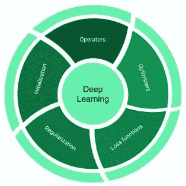
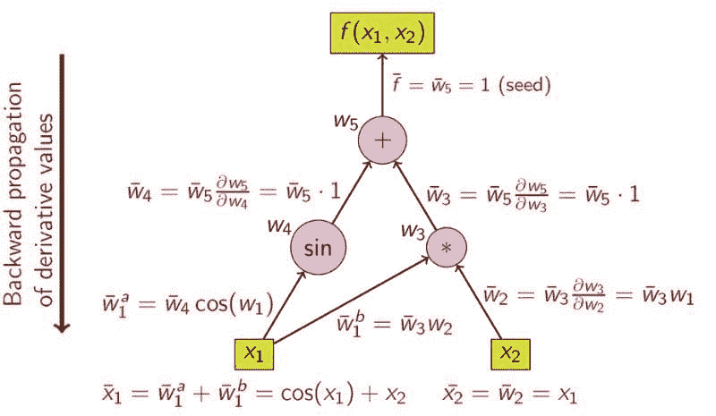
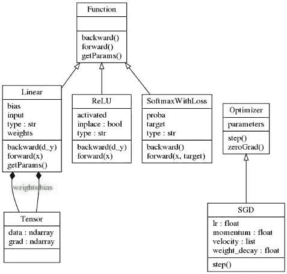
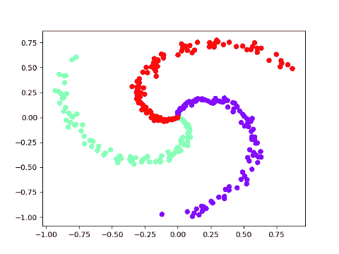
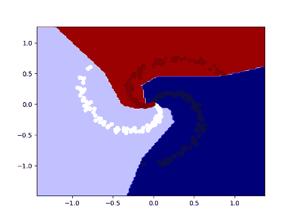

# 从零开始用 Python 实现深度学习库

> 原文：[`www.kdnuggets.com/2020/09/implementing-deep-learning-library-scratch-python.html`](https://www.kdnuggets.com/2020/09/implementing-deep-learning-library-scratch-python.html)

评论

**由 [Parmeet Bhatia](https://www.linkedin.com/in/parmeet-bhatia-616b0923/)，机器学习从业者和深度学习爱好者**

深度学习在短时间内从简单的神经网络演变为相当复杂的架构。为了支持这一快速扩展，沿途开发了许多不同的深度学习平台和库。这些库的主要目标之一是提供易于使用的接口来构建和训练深度学习模型，以便用户可以更多地专注于手头的任务。为实现这一目标，可能需要在几个抽象层后隐藏核心实现单元，这使得理解深度学习库所基于的基本原理变得困难。因此，本文的目标是提供对深度学习库构建块的见解。我们首先回顾一下深度学习的背景，以了解功能需求，然后使用 NumPy 在 Python 中实现一个简单而完整的库，该库能够对神经网络模型（非常简单的类型）进行端到端的训练。在这个过程中，我们将学习深度学习框架的各种组件。该库代码不到 100 行，因此应该相对容易跟随。完整的源代码可以在 [`github.com/parmeet/dll_numpy`](https://github.com/parmeet/dll_numpy) 找到。

* * *

## 我们的前三大课程推荐

 1\. [谷歌网络安全证书](https://www.kdnuggets.com/google-cybersecurity) - 快速进入网络安全职业生涯

 2\. [谷歌数据分析专业证书](https://www.kdnuggets.com/google-data-analytics) - 提升您的数据分析技能

 3\. [谷歌 IT 支持专业证书](https://www.kdnuggets.com/google-itsupport) - 支持您的组织 IT

* * *

### 背景

通常，一个深度学习计算库（如 TensorFlow 和 PyTorch）由下图所示的组件组成。



深度学习框架的组件

**操作符**

也常与层互换使用，它们是任何神经网络的基本构建块。操作符是将数据转换的向量值函数。一些常用的操作符包括线性层、卷积层、池化层和 ReLU、Sigmoid 等激活函数。

**优化器**

它们是任何深度学习库的基础。它们提供了使用梯度来更新模型参数的必要配方，以实现优化目标。一些著名的优化器有 SGD、RMSProp 和 Adam。

**损失函数**

它们是闭式和可微分的数学表达式，用作当前问题优化目标的代理。例如，交叉熵损失和铰链损失是分类任务中常用的损失函数。

**初始化器**

它们提供了模型参数在训练开始时的初始值。初始化在训练深度神经网络中起着重要作用，因为不良的参数初始化可能导致收敛缓慢或无法收敛。有很多方法可以初始化网络权重，例如，从正态分布中抽取的小随机权重。你可以查看[`keras.io/initializers/`](https://keras.io/initializers/)以获取全面的列表。

**正则化器**

它们提供了必要的控制机制，以避免过拟合并促进泛化。可以通过显式或隐式措施来调节过拟合。显式方法对权重施加结构性约束，例如，通过最小化其 L1-范数和 L2-范数，使权重变得更稀疏或更均匀。隐式措施则是专门的操作符，通过显式归一化（例如，BatchNorm）或通过改变网络连接性（例如，DropOut 和 DropConnect）来对中间表示进行变换。

> 上述组件基本上属于库的前端部分。前端指的是那些暴露给用户的组件，使他们能够高效地设计神经网络架构。在后端，这些库提供了自动计算模型中各种参数的损失函数梯度的支持。这种技术通常被称为自动微分（AD）。

**自动微分（AD）**

每个深度学习库都提供了一种 AD 的实现，使用户可以专注于定义模型结构（计算图），并将梯度计算的任务委托给 AD 模块。让我们通过一个例子来看它是如何工作的。假设我们要计算以下函数相对于输入变量*X₁*和*X₂*的偏导数：

```py
***Y =* sin(*x₁*)*+X₁*X₂***
```

以下图表来自[`en.wikipedia.org/wiki/Automatic_differentiation`](https://en.wikipedia.org/wiki/Automatic_differentiation)，展示了计算图及通过链式法则计算导数的过程。



计算图和通过链式法则计算导数

上图展示了反向模式自动微分（AD）的一个示例。众所周知的反向传播算法是上述算法的一个特殊情况，其中顶部的函数是损失函数。AD 利用了每个复合函数由基本算术操作和基本函数组成的事实，因此可以通过递归应用链式法则来计算这些操作的导数。

### 实现

在前一节中，我们已经介绍了所有必要的组件，以构建第一个可以进行端到端训练的深度学习库。为了简单起见，我将模仿[Caffe](https://github.com/BVLC/caffe)库的设计模式。在这里我们定义了两个抽象类：“Function”类和“Optimizer”类。此外，还有一个“Tensor”类，它是一个简单的结构，包含两个 NumPy 多维数组，一个用于保存参数的值，另一个用于保存它们的梯度。各种层/运算符中的所有参数将是“Tensor”类型。在我们深入之前，以下图提供了库的高层次概述。



图书馆的 UML 图

在撰写本文时，该库包含线性层、ReLU 激活函数和 SoftMaxLoss 层的实现，以及 SGD 优化器。因此，该库可以用于训练包含全连接层和 ReLU 非线性的分类模型。现在让我们来看看我们拥有的两个抽象类的细节。

“Function”抽象类提供了运算符的接口，其定义如下：

抽象 Function 类

所有的运算符都是通过继承“Function”抽象类来实现的。每个运算符必须提供**forward(…)**和**backward(…)**方法的实现，并可选地实现**getParams**函数以提供对其参数（如果有的话）的访问。**forward(…)**方法接收输入并返回运算符的变换结果。它还会进行必要的维护，以计算梯度。**backward(…)**方法接收损失函数相对于运算符输出的偏导数，并实现损失函数相对于运算符输入和参数（如果有的话）的偏导数。请注意，**backward(…)**函数本质上为我们的库提供了执行自动微分的能力。

为了使事情具体化，让我们看看下面代码片段中线性函数的实现：

线性函数的实现

**forward(…)**函数实现了形式为**Y = X*W+b**的转换并返回它。它还存储输入 X，因为在反向函数中计算**W**的梯度时需要它。**backward(…)**函数接收损失相对于输出**Y**的偏导数**dY**，并实现相对于输入**X**以及参数**W**和**b**的偏导数。此外，它返回相对于输入**X**的偏导数，这些偏导数将传递给前一层。

抽象的“Optimizer”类提供了优化器的接口，定义如下：

抽象优化器类

所有优化器都是通过继承“Optimizer”基类实现的。具体的优化类必须提供**step()**函数的实现。该方法使用相对于我们正在优化的损失的偏导数来更新模型参数。各种模型参数的引用在**__init__(…)**函数中提供。注意，重置梯度的公共功能是在基类中实现的。

为了使事情具体化，我们来看看具有动量和权重衰减的随机梯度下降（SGD）的实现。

### 进入实质内容

为此，我们拥有了使用我们的库训练（深度）神经网络模型的所有组成部分。为此，我们需要以下内容：

+   **模型：** 这是我们的计算图

+   **数据和目标：** 这是我们的训练数据

+   **损失函数：** 这是我们优化目标的替代指标

+   **优化器：** 更新模型参数

以下伪代码描绘了一个典型的训练周期：

```py
**model** *#computation graph*
**data,target** #*training data*
**loss_fn** *#optimization objective*
**optim** *#optimizer to update model parameters to minimize loss***Repeat:**#until convergence or for predefined number of epochs
   **optim.zeroGrad()** *#set all gradients  to zero*
   **output = model.forward(data)** *#get output from  model*
   **loss   = loss_fn(output,target)** *#calculate loss*
   **grad   = loss.backward()** *#calculate gradient of loss w.r.t output*
   **model.backward(grad)** *#calculate gradients for all the parameters*
   **optim.step()** *#update model parameters*
```

虽然这不是深度学习库的必要组成部分，但将上述功能封装在一个类中可能是个好主意，这样我们在训练新模型时就无需重复这些步骤（这与像[Keras](https://keras.io/)这样的高层抽象框架的理念是一致的）。为此，我们可以定义一个“Model”类，如以下代码片段所示：

这个类提供了以下功能：

+   **计算图：** 通过**add(…)**函数，可以定义一个顺序模型。在内部，该类将所有操作符存储在名为**computation_graph**的列表中。

+   **参数初始化：** 该类将在训练开始时自动用从均匀分布中抽取的小随机值初始化模型参数。

+   **模型训练：** 通过**fit(…)**函数，该类提供了一个通用接口来训练模型。此函数需要训练数据、优化器和损失函数。

+   **模型推断：** 通过**predict(…)**函数，该类提供了一个通用接口来使用训练好的模型进行预测。

由于这个类不作为深度学习的基本构建块，我将其实现放在了一个名为 utilities.py 的单独模块中。请注意，**fit(…)**函数利用了**DataGenerator**类，该类的实现也提供在 utilities.py 模块中。这个类只是我们训练数据的一个包装器，为每次训练迭代生成小批量数据。

### 训练我们的第一个模型

现在让我们来看一下使用所提出的库训练神经网络模型的最终代码。受到[Andrej Karapathy](https://cs.stanford.edu/people/karpathy/)的[博客文章](http://cs231n.github.io/neural-networks-case-study/)的启发，我将对螺旋数据训练一个隐藏层神经网络模型。生成数据和可视化的代码可在 utilities.py 文件中找到。



三类螺旋数据

上图展示了三类螺旋数据。数据是非线性可分的。因此，我们希望我们的一个隐藏层神经网络能够学习非线性决策边界。将所有内容汇总，以下代码片段将训练我们的模型。

用于训练神经网络模型的端到端代码

下图展示了相同的螺旋数据及其训练模型的决策边界。



训练模型的螺旋数据及其对应的决策边界

### 总结性 remarks

随着深度学习模型复杂性的不断增加，这些库的功能和底层实现也以指数级增长。尽管如此，核心功能仍可以用相对少量的代码行实现。虽然该库可以用来训练端到端的神经网络模型（简单类型），但它仍然在许多方面受到限制，这使得深度学习框架可以用于包括（但不限于）视觉、语音和文本等各种领域。尽管如此，我认为这也是一个分支基本实现并添加缺失功能以获得实际操作经验的机会。你可以尝试实现的一些功能包括：

+   **运算符：**卷积 池化等。

+   **优化器：**Adam RMSProp 等。

+   **正则化器：**BatchNorm DropOut 等。

我希望这篇文章能让你了解在使用任何深度学习库训练模型时，背后发生了什么。感谢你的关注，期待你在评论区提出意见或问题。

**简历：[Parmeet Bhatia](https://www.linkedin.com/in/parmeet-bhatia-616b0923/)** 是一位机器学习从业者和深度学习爱好者。他是一位经验丰富的机器学习工程师和研发专业人士，拥有开发和产品化 ML 及数据驱动产品的丰富经验。他对大规模构建端到端智能系统充满热情。

[原文](https://towardsdatascience.com/on-implementing-deep-learning-library-from-scratch-in-python-c93c942710a8)。经允许转载。

**相关：**

+   Autograd：你没在用的最佳机器学习库？

+   你不知道的 10 个关于 Scikit-Learn 的事

+   信号处理中的深度学习：你需要知道的

### 更多相关内容

+   [每个数据科学家都应该了解的三个 R 库（即使你使用 Python）](https://www.kdnuggets.com/2021/12/three-r-libraries-every-data-scientist-know-even-python.html)

+   [是什么让 Python 成为初创公司理想的编程语言](https://www.kdnuggets.com/2021/12/makes-python-ideal-programming-language-startups.html)

+   [停止学习数据科学去寻找目标，并且去寻找目标...](https://www.kdnuggets.com/2021/12/stop-learning-data-science-find-purpose.html)

+   [数据科学学习统计学的顶级资源](https://www.kdnuggets.com/2021/12/springboard-top-resources-learn-data-science-statistics.html)

+   [一个 90 亿美元的 AI 失败，深度剖析](https://www.kdnuggets.com/2021/12/9b-ai-failure-examined.html)

+   [成功数据科学家的 5 个特征](https://www.kdnuggets.com/2021/12/5-characteristics-successful-data-scientist.html)
