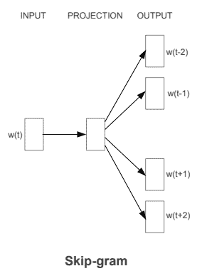
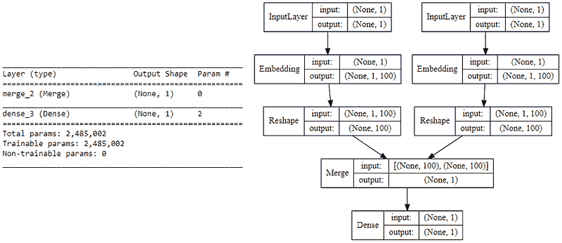
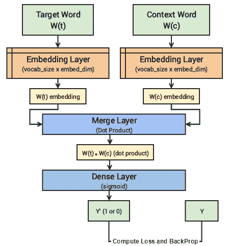
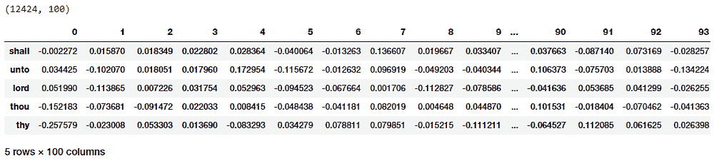
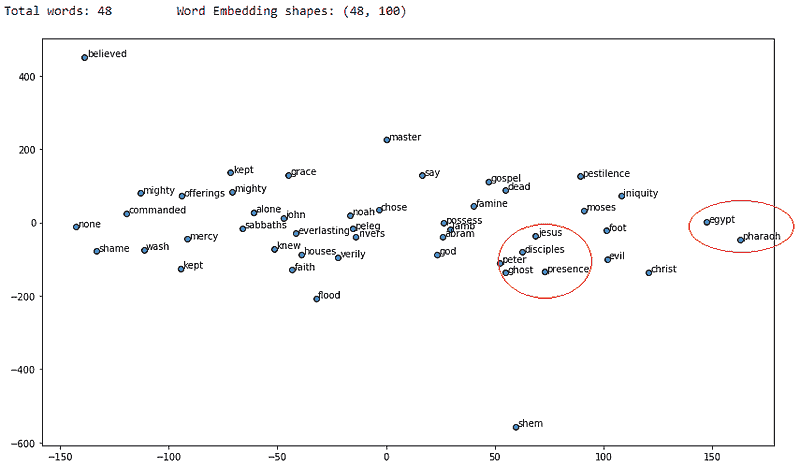

# 实现深度学习方法和文本数据的特征工程：跳词模型

> 原文：[`www.kdnuggets.com/2018/04/implementing-deep-learning-methods-feature-engineering-text-data-skip-gram.html`](https://www.kdnuggets.com/2018/04/implementing-deep-learning-methods-feature-engineering-text-data-skip-gram.html)

评论

> **编辑注释：** 本文只是一个更全面和深入的原始内容的一部分，[可以在这里找到](https://towardsdatascience.com/understanding-feature-engineering-part-4-deep-learning-methods-for-text-data-96c44370bbfa)，涵盖了比这里包含的内容更多的内容。

### 跳词模型

跳词模型的架构通常试图实现与 CBOW 模型相反的目标。它试图根据目标词（中心词）预测源上下文词（周围词）。考虑到我们之前的简单句子，***“the quick brown fox jumps over the lazy dog”。*** 如果我们使用 CBOW 模型，我们会得到***(context_window, target_word)***的配对，例如考虑上下文窗口大小为 2 时，我们会得到类似于***([quick, fox], brown), ([the, brown], quick), ([the, dog], lazy)***的例子。现在考虑到跳词模型的目标是根据目标词预测上下文，模型通常会反转上下文和目标，并试图从目标词预测每个上下文词。因此，任务变成了预测上下文***[quick, fox]***给定目标词***‘brown’***，或***[the, brown]***给定目标词***‘quick’***，等等。因此，该模型试图根据目标词预测上下文窗口中的词汇。

* * *

## 我们的前三大课程推荐

 1\. [谷歌网络安全证书](https://www.kdnuggets.com/google-cybersecurity) - 快速进入网络安全职业生涯。

 2\. [谷歌数据分析专业证书](https://www.kdnuggets.com/google-data-analytics) - 提升您的数据分析技能

 3\. [谷歌 IT 支持专业证书](https://www.kdnuggets.com/google-itsupport) - 支持您的组织在 IT 领域

* * *



跳词模型架构（来源：[`arxiv.org/pdf/1301.3781.pdf`](https://arxiv.org/pdf/1301.3781.pdf) Mikolov 等）

就像我们在 CBOW 模型中讨论的那样，我们现在需要将这个 Skip-gram 架构建模为一个深度学习分类模型，以便我们以 *目标词作为输入* 并尝试 *预测上下文词*。这变得稍微复杂，因为我们的上下文中有多个词。我们通过将每个 ***(目标, 上下文 _ 词) 对*** 拆分为 ***(目标, 上下文) 对*** 来进一步简化这一点，其中每个上下文仅包含一个词。因此，我们之前的数据集被转换为像 ***(brown, quick), (brown, fox), (quick, the), (quick, brown)*** 等对。但如何监督或训练模型以了解哪些是上下文相关的，哪些是不相关的呢？

为此，我们将 ***(X, Y)*** 对馈入 skip-gram 模型，其中 ***X*** 是我们的 ***输入***，***Y*** 是我们的 ***标签***。我们通过使用 ***[(目标, 上下文), 1]*** 对作为 ***正输入样本***，其中 ***目标*** 是我们感兴趣的词，***上下文*** 是出现在目标词附近的上下文词，而 ***正标签 1*** 表示这是一个在上下文中相关的对。我们还将 ***[(目标, 随机), 0]*** 对作为 ***负输入样本***，其中 ***目标*** 仍然是我们感兴趣的词，但 ***随机*** 只是从词汇表中随机选择的一个词，与目标词没有上下文或关联。因此，***负标签 0*** 表示这是一个在上下文中不相关的对。我们这样做是为了让模型学习哪些词对在上下文中是相关的，哪些是不相关的，并为语义相似的词生成相似的嵌入。

### 实现 Skip-gram 模型

现在让我们尝试从头开始实现这个模型，以了解幕后工作原理，并与我们的 CBOW 模型实现进行比较。我们将像往常一样利用我们的圣经语料库，该语料库包含在 `**norm_bible**` 变量中用于训练我们的模型。实现将集中于五个部分

+   **构建语料库词汇表**

+   **构建一个 skip-gram [(目标, 上下文), 相关性] 生成器**

+   **构建 skip-gram 模型架构**

+   **训练模型**

+   **获取词嵌入**

让我们开始动手构建我们的 skip-gram Word2Vec 模型吧！

**构建语料库词汇表**

首先，我们将遵循构建语料库词汇表的标准流程，从中提取每个独特的词，并分配一个唯一的标识符，类似于我们在 CBOW 模型中所做的。我们还维护映射关系，以便将词转换为其唯一标识符，反之亦然。

```py
Vocabulary Size: 12425
Vocabulary Sample: [('perceived', 1460), ('flagon', 7287), ('gardener', 11641), ('named', 973), ('remain', 732), ('sticketh', 10622), ('abstinence', 11848), ('rufus', 8190), ('adversary', 2018), ('jehoiachin', 3189)]
```

正如我们所期望的，语料库中的每个独特词汇现在都是我们词汇表的一部分，并且拥有一个唯一的数字标识符。

**构建一个 skip-gram [(目标, 上下文), 相关性] 生成器**

现在是时候构建我们的 skip-gram 生成器，它将像我们之前讨论的那样给出词对及其相关性。幸运的是，`keras`提供了一个方便的`skipgrams`工具，我们不需要像在 CBOW 中那样手动实现这个生成器。

> **注意：** 函数`[**skipgrams(…)**](https://keras.io/preprocessing/sequence/#skipgrams)`存在于`[**keras.preprocessing.sequence**](https://keras.io/preprocessing/sequence)`
> 
> 这个函数将词索引的序列（整数列表）转换为如下形式的词对：
> 
> - （词，同一窗口中的词），标签为 1（正样本）。
> 
> - （词，词汇中的随机词），标签为 0（负样本）。

```py
(james (1154), king (13)) -> 1
(king (13), james (1154)) -> 1
(james (1154), perform (1249)) -> 0
(bible (5766), dismissed (6274)) -> 0
(king (13), alter (5275)) -> 0
(james (1154), bible (5766)) -> 1
(king (13), bible (5766)) -> 1
(bible (5766), king (13)) -> 1
(king (13), compassion (1279)) -> 0
(james (1154), foreskins (4844)) -> 0
```

因此，你可以看到我们已经成功生成了所需的 skip-grams，并且基于前面输出的样本 skip-grams，你可以清楚地看到基于标签（0 或 1）哪些是相关的，哪些是无关的。

**构建 skip-gram 模型架构**

我们现在在`tensorflow`之上利用`keras`构建 skip-gram 模型的深度学习架构。为此，我们的输入将是目标词和上下文或随机词对。每个输入都会传递到一个自己的嵌入层（初始化时权重随机）。一旦我们获得目标词和上下文词的词嵌入，我们将其传递到一个合并层，在那里计算这两个向量的点积。然后，我们将这个点积值传递到一个密集的 sigmoid 层，该层根据词对的上下文相关性预测 1 或 0（***Y’***）。我们将其与实际相关性标签（***Y***）进行匹配，通过利用`mean_squared_error`损失计算损失，并在每个周期中执行反向传播，以更新嵌入层。以下代码展示了我们的模型架构。



Skip-gram 模型总结和架构

理解上述深度学习模型相当简单。然而，我将尝试用简单的术语总结该模型的核心概念，以便于理解。对于每个训练示例，我们有一对输入词，其中包含***一个输入目标词***，具有唯一的数字标识符，以及***一个上下文词***，也具有唯一的数字标识符。如果它是***正样本***，则该词具有上下文意义，是***上下文词***，我们的***标签 Y=1***；如果是***负样本***，则该词没有上下文意义，仅是***随机词***，我们的***标签 Y=0***。我们将每个词传递到各自的***嵌入层***，其大小为`**(vocab_size x embed_size)**`，这将为这两个词提供***密集词嵌入***，`**(每个词 1 x embed_size)**`。接下来，我们使用***合并层***来计算这两个嵌入的***点积***并获得点积值。然后将其发送到***密集 sigmoid 层***，输出 1 或 0。我们将其与实际标签 Y（1 或 0）进行比较，计算损失，反向传播误差以调整权重（在嵌入层中），并对所有***(目标词, 上下文词)***对重复此过程多次。下图尝试解释相同内容。



Skip-gram 深度学习模型的视觉表示

现在让我们开始训练我们的 Skip-gram 模型。

**训练模型**

在完整语料库上运行模型需要相当多的时间，但比 CBOW 模型少。因此，我只运行了 5 个周期。你可以利用以下代码并根据需要增加更多周期。

```py
Epoch: 1 Loss: 4529.63803683
Epoch: 2 Loss: 3750.71884749
Epoch: 3 Loss: 3752.47489296
Epoch: 4 Loss: 3793.9177565
Epoch: 5 Loss: 3716.07605051
```

一旦训练完成，这个模型中相似的词应该会基于嵌入层具有相似的权重，我们可以进行测试。

**获取词嵌入**

要获取我们整个词汇表的词嵌入，我们可以通过以下代码从嵌入层中提取相同的内容。请注意，我们仅对目标词嵌入层感兴趣，因此我们将从`**word_model**`嵌入层中提取嵌入。我们不取位置 0 的嵌入，因为我们词汇中的词没有数字标识符 0，我们将其忽略。



基于 Skip-gram 模型的词汇表词嵌入

因此，你可以清楚地看到每个词都有一个大小为`**(1x100)**`的密集嵌入，如之前的输出所示，与我们从 CBOW 模型获得的相似。现在，让我们对这些密集嵌入向量应用欧氏距离度量，以生成词汇中每个词的成对距离度量。然后，我们可以根据最短的（欧氏）距离找出每个感兴趣的词的 n 个最近邻，类似于我们在 CBOW 模型的嵌入上所做的。

```py
(12424, 12424)

{'egypt': ['pharaoh', 'mighty', 'houses', 'kept', 'possess'],
 'famine': ['rivers', 'foot', 'pestilence', 'wash', 'sabbaths'],
 'god': ['evil', 'iniquity', 'none', 'mighty', 'mercy'],
 'gospel': ['grace', 'shame', 'believed', 'verily', 'everlasting'],
 'jesus': ['christ', 'faith', 'disciples', 'dead', 'say'],
 'john': ['ghost', 'knew', 'peter', 'alone', 'master'],
 'moses': ['commanded', 'offerings', 'kept', 'presence', 'lamb'],
 'noah': ['flood', 'shem', 'peleg', 'abram', 'chose']}
```

从结果中可以清楚地看到，每个感兴趣的单词的许多相似单词是有意义的，并且我们相比于 CBOW 模型获得了更好的结果。现在让我们使用[**t-SNE**](https://en.wikipedia.org/wiki/T-distributed_stochastic_neighbor_embedding)来可视化这些单词嵌入，它代表了[***t-distributed stochastic neighbor embedding***](https://en.wikipedia.org/wiki/T-distributed_stochastic_neighbor_embedding)，这是一个流行的[降维](https://en.wikipedia.org/wiki/Dimensionality_reduction)技术，用于将高维空间可视化到低维空间（例如 2-D）。



使用 t-SNE 可视化 skip-gram word2vec 单词嵌入

我在一些圆圈中标记了红色，这些圆圈似乎显示了在向量空间中彼此靠近的不同上下文相似单词。如果你发现任何其他有趣的模式，请随时告诉我！

**个人简介： [Dipanjan Sarkar](https://www.linkedin.com/in/dipanzan)** 是 Intel 的数据科学家、作者、Springboard 的导师、作家以及体育和情景喜剧爱好者。

[原文](https://towardsdatascience.com/understanding-feature-engineering-part-4-deep-learning-methods-for-text-data-96c44370bbfa)。经许可转载。

**相关：**

+   文本数据预处理：Python 实践指南

+   文本数据预处理的一般方法

+   处理文本数据科学任务的框架

### 更多相关话题

+   [Feature Store Summit 2022：一场免费的特征工程会议](https://www.kdnuggets.com/2022/10/hopsworks-feature-store-summit-2022-free-conference-feature-engineering.html)

+   [机器学习中的替代特征选择方法](https://www.kdnuggets.com/2021/12/alternative-feature-selection-methods-machine-learning.html)

+   [机器学习中实用的特征工程方法](https://www.kdnuggets.com/2023/07/practical-approach-feature-engineering-machine-learning.html)

+   [为多变量时间序列构建一个可操作的特征工程管道](https://www.kdnuggets.com/2022/03/building-tractable-feature-engineering-pipeline-multivariate-time-series.html)

+   [使用 RAPIDS cuDF 利用 GPU 进行特征工程](https://www.kdnuggets.com/2023/06/rapids-cudf-leverage-gpu-feature-engineering.html)

+   [特征工程入门](https://www.kdnuggets.com/feature-engineering-for-beginners)
