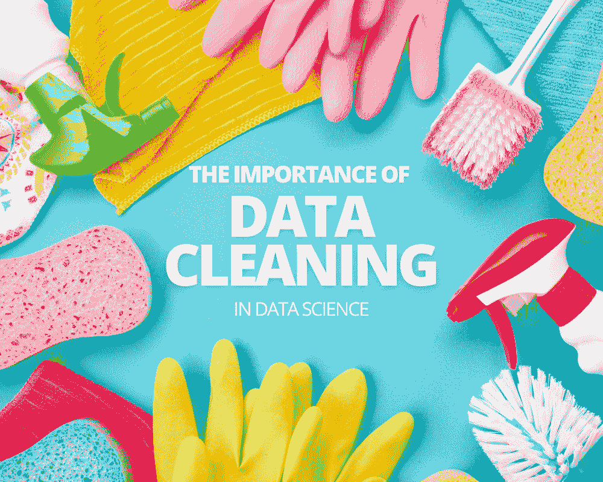
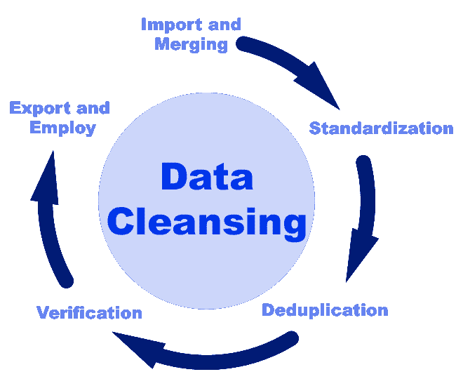

# 数据科学中数据清洗的重要性

> 原文：[`www.kdnuggets.com/2023/08/importance-data-cleaning-data-science.html`](https://www.kdnuggets.com/2023/08/importance-data-cleaning-data-science.html)

编辑者提供的图片

在 数据科学中，预测模型的准确性至关重要，以确保避免任何高昂的错误，并且每个方面都能达到其**最佳水平**。数据在选择和格式化后，需要进行清洗，这是模型开发过程中的一个关键阶段。

* * *

## 我们的前三大课程推荐

 1\. [谷歌网络安全证书](https://www.kdnuggets.com/google-cybersecurity) - 快速进入网络安全职业生涯。

 2\. [谷歌数据分析专业证书](https://www.kdnuggets.com/google-data-analytics) - 提升你的数据分析技能

 3\. [谷歌 IT 支持专业证书](https://www.kdnuggets.com/google-itsupport) - 支持你的组织的 IT 需求

* * *

在这篇文章中，我们将概述数据清洗在数据科学中的重要性，包括它是什么、好处、数据清洗过程以及常用工具。

# 什么是数据清洗？

在数据科学中，数据清洗是识别错误数据并修复错误的过程，以使最终的数据集准备好使用。错误可能包括重复字段、格式不正确、不完整字段、无关或不准确的数据以及损坏的数据。

[来源](https://anchorcomputersoftware.com/solutions/data-quality/data-cleansing)

在数据科学项目中，清洗阶段 [在数据管道中优于验证](https://www.tableau.com/learn/articles/what-is-data-cleaning)。在管道中，每个阶段处理输入并生成输出，逐步改进数据。数据管道的好处在于每个步骤都有特定的目的并且自成一体，意味着数据经过彻底检查。

# 数据科学中数据清洗的重要性

数据很少以易于使用的形式到达；实际上，可以肯定地说数据从未是完美的。当从不同的来源和实际环境中收集数据时，数据必然包含大量错误，并采用不同的格式。因此，数据清洗的重要性便体现出来了——将数据变得无误、相关且易于模型吸收。

在处理来自多个来源的大型数据集时，可能会出现错误，包括重复或错误分类。这些错误严重影响算法的准确性。值得注意的是，数据清理和组织可能会消耗 [数据科学家高达 80%的时间](https://www.projectpro.io/article/why-data-preparation-is-an-important-part-of-data-science/242)，突显了其在数据处理流程中的关键作用。

## 数据清理的示例

以下是三个数据清理如何修复数据集错误的示例。

**数据格式化**

数据格式化涉及 [将数据转换为特定格式](https://guides.auraria.edu/datamanagement/dataformatting#:~:text=Data%20formatting%20is%20the%20decision,to%20the%20naming%20your%20files.) 或修改数据集的结构。确保数据集的一致性和良好的结构对于避免数据分析中的错误至关重要。因此，在清理过程中采用各种技术是必要的，以保证准确的数据格式化。这可能包括将分类数据转换为数值以及将多个数据源整合为统一的数据集。

**空值/缺失值**

数据清理技术在解决缺失或空值等数据问题中起着至关重要的作用。这些技术包括使用相关信息来估算和填补数据集中的空白。

例如，考虑位置字段。如果字段为空，科学家可以用数据集或类似数据集中的平均位置数据填充该字段。虽然不完美，但拥有最可能的位置总比没有位置信息要好。这种方法确保了数据质量的提升，并增强了数据集的整体可靠性。

**识别异常值**

在数据集中，某些数据点可能与其他数据点没有实质性的关联（例如，在数值或行为方面）。因此，在数据分析过程中，这些异常值有可能显著扭曲结果，导致误导性的预测和有缺陷的决策。然而，通过实施各种数据清理技术，可以识别并消除这些异常值，从而确保数据集的完整性和相关性。

[来源](https://medium.com/donato-story/improving-data-quality-with-outlier-detection-techniques-a-crisp-dm-approach-to-data-preparation-5a04a9eef844)

# 数据清理的好处

数据清理提供了一系列好处，对数据的准确性、相关性、可用性和分析具有显著影响。

+   **准确性** - 使用数据清理工具和技术可以显著减少数据集中的错误和不准确之处。这对于数据分析至关重要，有助于创建能够做出准确预测的模型。

+   **可用性** - 一旦数据被清理并正确格式化，它可以应用于多个用例，使其变得更加可访问，从而可以用于各种项目类型。

+   **分析** - 清洁的数据使得分析阶段更加有效，允许分析师获得更深入的见解并提供更可靠的结果。

+   **高效的数据存储** - 通过移除不必要和重复的数据，可以减少存储成本，因为只需保留相关的、有价值的数据，无论是存储在本地服务器还是云数据仓库。

+   **治理** - 数据清理可以帮助组织遵守严格的法规和数据治理，保护个人隐私并避免处罚。最近几个月出台了更多的数据合规法律。例如，最近的[德克萨斯州消费者隐私法（TDPSA）](https://www.ipvanish.com/blog/tdpsa-texas-consumer-privacy-law/)，禁止某些数据实践，如收集不为收集目的合理必要的个人客户数据。

# 数据清理过程：8 个步骤

数据管道的数据清理阶段由八个常见步骤组成：

+   重复数据的移除

+   不相关数据的移除

+   大小写标准化

+   数据类型转换

+   异常值的处理

+   错误的修正

+   语言翻译

+   处理任何缺失值

## 1\. 重复数据的移除

利用多个数据源的大型数据集很可能存在错误，包括重复数据，特别是在新条目没有经过质量检查时。重复数据是冗余的，占用不必要的存储空间，需要进行数据清理以提高效率。常见的重复数据包括重复的电子邮件地址和电话号码。

## 2\. 不相关数据的移除

为了优化数据集，[移除不相关的数据字段](https://segment.com/blog/data-cleaning/)是至关重要的。这将导致模型处理更快，并使得更加专注于实现特定目标。在数据清理阶段，将删除任何与项目范围不符的数据，只保留完成任务所需的必要信息。

## 3\. 大小写标准化

在数据集中文本的标准化对于确保一致性和便于分析至关重要。纠正大小写尤其重要，因为这可以防止创建虚假的类别，从而导致数据混乱和困惑。

## 4\. 数据类型转换

在使用 Python 处理 CSV 数据时，分析师通常依赖于 Pandas 这一数据分析库。然而，有时 Pandas 在有效处理数据类型方面会有所不足。为了保证数据转换的准确性，分析师采用清理技术。这确保了在应用于实际项目时，正确的数据能够被轻松识别。

## 5\. 异常值处理

异常值是[缺乏与其他点相关性的数据点](https://careerfoundry.com/en/blog/data-analytics/what-is-an-outlier/)，在数据集的整体背景中偏离显著。虽然异常值有时可以提供有趣的见解，但它们通常被视为应该删除的错误。

## 6\. 错误修正

确保模型的有效性至关重要，在数据分析阶段之前纠正错误是关键。这些错误通常源于手动数据输入而没有足够的检查程序。例如，包括数字错误的电话号码、没有“@”符号的电子邮件地址或没有标点的用户反馈。

## 7\. 语言翻译

数据集可以从不同语言的各种来源收集。然而，在使用这些数据进行机器翻译时，评估工具通常依赖于[单语自然语言处理（NLP）](https://nlpcloud.com/multilingual-nlp-how-to-perform-nlp-in-non-english-languages.html)模型，这些模型一次只能处理一种语言。幸运的是，在数据清理阶段，AI 工具可以通过将所有数据转换为统一语言来提供帮助。这确保了翻译过程中的更大连贯性和兼容性。

## 8\. 处理任何缺失值

数据清理的最后步骤之一涉及处理缺失值。这可以通过删除缺少值的记录或使用统计技术填补空白来实现。全面了解数据集对于做出这些决策至关重要。

# 总结

数据科学中数据清理的重要性不能被低估，因为它会显著影响数据模型的准确性和整体成功。经过彻底的数据清理，数据分析阶段更有可能输出有缺陷的结果和不正确的预测。

在数据清理阶段需要纠正的常见错误包括重复数据、缺失值、不相关数据、异常值以及将多种数据类型或语言转换为单一形式。

**[Nahla Davies](http://nahlawrites.com/)** 是一名软件开发人员和技术作家。在全职从事技术写作之前，她还曾担任过各种有趣的角色，包括在一家 Inc. 5,000 体验品牌机构担任首席程序员，该机构的客户包括三星、时代华纳、Netflix 和索尼。

### 更多相关主题

+   [实验设计在数据科学中的重要性](https://www.kdnuggets.com/2022/08/importance-experiment-design-data-science.html)

+   [概率在数据科学中的重要性](https://www.kdnuggets.com/2023/02/importance-probability-data-science.html)

+   [伯克森-杰克尔悖论及其对数据科学的重要性](https://www.kdnuggets.com/2023/03/berksonjekel-paradox-importance-data-science.html)

+   [庆祝对数据隐私重要性的认识](https://www.kdnuggets.com/2022/01/celebrating-awareness-importance-data-privacy.html)

+   [机器学习中预处理的重要性](https://www.kdnuggets.com/2023/02/importance-preprocessing-machine-learning.html)

+   [机器学习中可重复性的重要性](https://www.kdnuggets.com/2023/06/importance-reproducibility-machine-learning.html)
