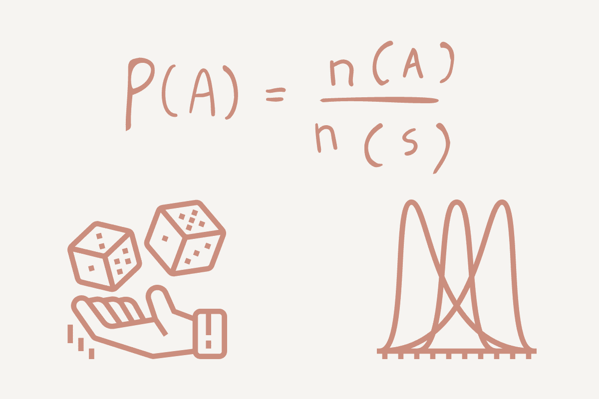

# 概率在数据科学中的重要性

> 原文：[`www.kdnuggets.com/2023/02/importance-probability-data-science.html`](https://www.kdnuggets.com/2023/02/importance-probability-data-science.html)

图片作者

作为一名数据科学家，你需要知道结果的准确性以确保有效性。数据科学工作流程是一个有计划的项目，具有控制条件。允许你评估每个阶段以及它如何影响你的输出。

* * *

## 我们的前三个课程推荐

 1. [Google 网络安全证书](https://www.kdnuggets.com/google-cybersecurity) - 快速进入网络安全职业轨道。

 2. [Google 数据分析专业证书](https://www.kdnuggets.com/google-data-analytics) - 提升你的数据分析水平

 3. [Google IT 支持专业证书](https://www.kdnuggets.com/google-itsupport) - 支持你的组织的 IT 工作

* * *

# 什么是概率？

概率是事件/事情发生的可能性的度量。它是预测分析中的一个重要元素，允许你探索结果背后的计算数学。

使用一个简单的例子，让我们看看抛硬币：要么是正面（H），要么是反面（T）。你的概率将是事件发生的方式数除以所有可能结果的总数。

+   如果我们想要找出正面的概率，那么它将是 1（正面）/ 2（正面和反面）= 0.5。

+   如果我们想要找出反面的概率，那么它将是 1（反面）/ 2（正面和反面）= 0.5。

但我们不希望混淆可能性和概率——它们是不同的。概率是指特定事件或结果发生的度量。可能性则用于当你想要增加特定事件或结果发生的机会时。

简而言之——概率是关于可能结果的，而可能性则是关于假设的。

另一个需要了解的术语是“**互斥事件**”。这些事件不会同时发生。例如，你不能同时向右和向左走。或者如果我们抛硬币，我们只能得到正面或反面，而不是两者。

## 概率的类型

+   **理论概率**：这关注于事件发生的可能性，并基于推理的基础。使用理论，结果是预期值。以抛硬币为例，理论概率为正面朝上的概率是 0.5 或 50%。

+   **实验概率**：这关注于在实验期间事件发生的频率。以抛硬币为例——如果我们抛硬币 10 次，正面朝上的次数为 6 次，则硬币正面朝上的实验概率为 6/10 或 60%。

# 条件概率

条件概率是基于已有事件/结果的事件/结果发生的可能性。例如，如果你在一家保险公司工作，你可能会想要根据一个人是否已办理房贷来计算他们能否支付保险的概率。

条件概率通过使用数据集中的其他变量，帮助数据科学家生成更准确的模型和输出。

# 分布

概率分布是一个统计函数，用来描述在给定范围内随机变量的可能值和概率。该范围将具有可能的最小值和最大值，这些值在分布图上的位置取决于统计测试。

根据项目中使用的数据类型，你可以确定使用了哪种类型的分布。我将它们分为两类：离散分布和连续分布。

## 离散分布

离散分布是指数据只能取特定值或具有有限数量的结果。例如，如果你掷一个骰子，有限值为 1、2、3、4、5 和 6。

离散分布有不同的类型。例如：

+   **离散均匀分布**是指所有结果的可能性相等。例如，在掷一个六面骰子的情况下，骰子落在 1、2、3、4、5 或 6 的概率是相等的——1/6。然而，离散均匀分布的问题在于它没有提供数据科学家可以使用和应用的相关信息。

+   **伯努利分布**是另一种离散分布，其中实验只有两个可能的结果，即“是”或“否”、1 或 2、真或假。这可以在掷硬币时使用，结果可能是正面或反面。使用伯努利分布时，我们有一个结果的概率（p），并可以从总概率（1）中扣除，表示为（1-p）。

+   **二项分布**是一系列伯努利事件的离散概率分布，它只能在实验中产生两种可能的结果，即成功或失败。例如，掷硬币时，每次实验中硬币正面朝上的概率总是 1/2。

+   **泊松分布**是描述一个事件在特定时间段或距离内发生次数的分布。它不是关注事件发生的具体情况，而是关注在特定区间内事件发生的频率。例如，如果每天上午 11 点有 12 辆车经过某条特定道路，我们可以使用泊松分布来计算每个月上午 11 点有多少辆车经过那条道路。

## 连续分布

与有限结果的离散分布不同，连续分布具有连续的结果。这些分布通常在图表上呈现为曲线或直线，因为数据是连续的。

+   **正态分布** 是你可能听说过的，因为它是使用最频繁的分布类型。它是围绕均值对称的分布，没有偏斜。绘制时，数据呈钟形分布，中间范围为均值。例如，身高和智商得分等特征遵循正态分布。

+   **T 分布** 是一种连续分布类型，用于当总体标准差（σ）未知且样本量较小时（n<30）。它的形状与正态分布相同，即钟形曲线。例如，如果我们查看一天内售出的巧克力棒数量，我们会使用正态分布。然而，如果我们想查看某一特定小时内售出的数量，我们会使用 t 分布。

+   **指数分布** 是一种连续概率分布，关注事件发生的时间。例如，我们可能想研究地震并使用指数分布。时间是从此时开始到地震发生的时间。指数分布绘制为一条曲线，表示概率的指数变化。

# 结论

从上述内容可以看出，数据科学家如何利用概率来更好地理解数据并回答问题。了解事件发生的概率对数据科学家来说非常有用，并且在决策过程中可以非常有效。

你将不断处理数据，在进行任何形式的分析之前，你需要更多地了解数据。查看数据分布可以为你提供大量信息，并可以利用这些信息来调整你的任务、过程和模型，以适应数据分布。

这减少了你花在理解数据上的时间，提供了更有效的工作流程，并产生了更准确的结果。

许多数据科学的概念基于概率学的基础。

**[Nisha Arya](https://www.linkedin.com/in/nisha-arya-ahmed/)** 是一名数据科学家和自由技术作家。她特别关注提供数据科学职业建议或教程，以及围绕数据科学的理论知识。她还希望探索人工智能在延长人类生命方面的不同方式。她是一个热衷于学习的人，寻求拓宽技术知识和写作技能，同时帮助指导他人。

### 更多相关主题

+   [数据清洗在数据科学中的重要性](https://www.kdnuggets.com/2023/08/importance-data-cleaning-data-science.html)

+   [数据科学中实验设计的重要性](https://www.kdnuggets.com/2022/08/importance-experiment-design-data-science.html)

+   [伯克森-杰克尔悖论及其对数据科学的重要性](https://www.kdnuggets.com/2023/03/berksonjekel-paradox-importance-data-science.html)

+   [庆祝对数据隐私重要性的认识](https://www.kdnuggets.com/2022/01/celebrating-awareness-importance-data-privacy.html)

+   [机器学习中预处理的重要性](https://www.kdnuggets.com/2023/02/importance-preprocessing-machine-learning.html)

+   [机器学习中可重复性的重视](https://www.kdnuggets.com/2023/06/importance-reproducibility-machine-learning.html)
