# 数据科学家需要了解的重要统计知识

> 原文：[`www.kdnuggets.com/2021/09/important-statistics-data-scientists.html`](https://www.kdnuggets.com/2021/09/important-statistics-data-scientists.html)

评论

**由 [Lekshmi S. Sunil](https://www.linkedin.com/in/lekshmi-s-sunil/), IIT Indore '23 | GHC '21 学者**。

* * *

## 我们的前三大课程推荐

 1\. [Google 网络安全证书](https://www.kdnuggets.com/google-cybersecurity) - 快速进入网络安全职业生涯。

 2\. [Google 数据分析专业证书](https://www.kdnuggets.com/google-data-analytics) - 提升您的数据分析水平

 3\. [Google IT 支持专业证书](https://www.kdnuggets.com/google-itsupport) - 支持您的组织进行 IT 工作

* * *

统计分析使我们能够从手头的数据中获得有价值的见解。掌握重要的统计概念和技术对于使用各种工具分析数据至关重要。

在深入细节之前，让我们看看本文涵盖的主题：

+   *描述性统计与推断统计*

+   *数据类型*

+   *概率与贝叶斯定理*

+   *集中趋势的度量*

+   *偏度*

+   *峰度*

+   *离散度的度量*

+   *协方差*

+   *相关性*

+   *概率分布*

+   *假设检验*

+   *回归分析*

### 描述性统计与推断统计

统计学整体涉及数据的收集、组织、分析、解释和展示。在统计学中，有两个主要分支：

1.  **描述性统计：**这涉及描述数据的特征，通过图表/图形或使用集中趋势、变异性和分布等数值计算来组织和展示数据。一个值得注意的点是，结论是基于已知的数据得出的。

1.  **推断统计：**这涉及从样本中得出推论和做出关于更大人群的一般化。因此，需要更复杂的计算。最终结果使用假设检验、相关性和回归分析等技术得出。预测的未来结果和得出的结论超出了现有数据的层面。

### 数据类型

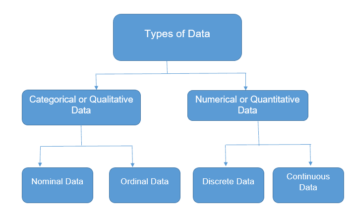

为了使用最合适的统计技术进行适当的探索性数据分析（EDA），我们需要了解我们正在处理的数据类型。

1.  **分类数据**

分类数据表示定性变量，如个人的性别、血型、母语等。分类数据也可以是没有数学意义的数值形式。例如，如果性别是变量，女性可以用 1 表示，男性用 0 表示。

+   **名义数据**：值用于标记变量，各类别之间没有定义的等级关系，即没有顺序或方向——例如，宗教、性别等。仅有两个类别的名义尺度称为“二分法”。

+   **有序数据**：类别之间存在顺序或等级关系——例如，质量评级、教育水平、学生成绩等级等。

1.  **数值数据**

数值数据表示用数字表达的定量变量。例如，个人的身高、体重等。

+   **离散数据**：值是可计数的，通常是整数（大多数情况下是整数）。例如，停车场的汽车数量、国家数量等。

+   **连续数据**：观察值可以被测量但不能被计数。数据在一个范围内可以取任何值——例如，体重、身高等。连续数据可以进一步分为区间数据（有序值之间具有相同的差异，但没有真实零点）和比率数据（有序值之间具有相同的差异，并且存在真实零点）。

### 概率与贝叶斯定理

概率是衡量事件发生可能性的指标。

+   P(A) + P(A’) = 1

+   P(A∪B) = P(A) + P(B) − P(A∩B)

+   独立事件：如果一个事件的发生不会影响另一个事件发生的概率，则两个事件是独立的。P(A∩B) = P(A)P(B)，其中 P(A) != 0 且 P(B) != 0。

+   互斥事件：如果两个事件不能同时发生，则它们是互斥的或不相交的。P(A∩B) = 0，且 P(A∪B) = P(A) + P(B)。

+   **条件概率**：事件 A 在另一事件 B 已经发生的情况下发生的概率。这由 P(A|B)表示。P(A|B) = P(A∩B)/P(B)，当 P(B)>0 时。

+   **贝叶斯定理**

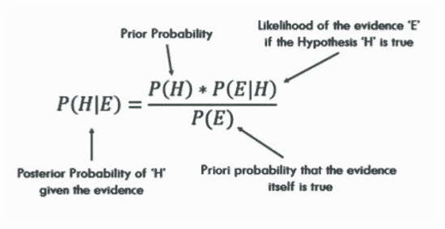

### 集中趋势的测量

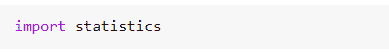

*导入统计模块。*

+   **均值**：数据集的平均值。

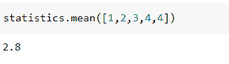

*numpy.mean( ) 也可以使用。*

+   **中位数**：数据集的中间值。

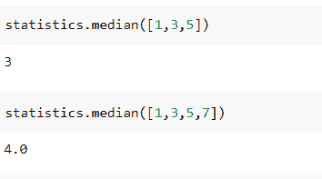

*numpy.median( ) 也可以使用。*

+   **众数**：数据集中最频繁出现的值。

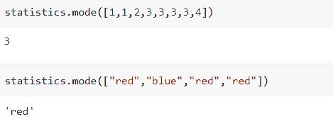

**何时使用均值、中位数和众数？**

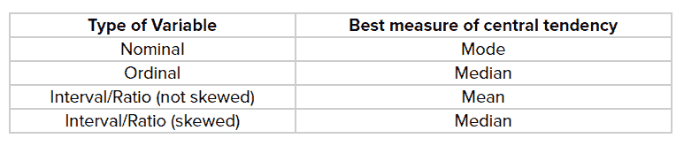

**均值、中位数和众数之间的关系：***众数 = 3 中位数 — 2 均值*

### 偏度

对称性的衡量，或更准确地说，缺乏对称性（偏斜）。

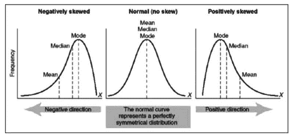

+   正态/对称分布：众数 = 中位数 = 均值

+   正偏（右偏）分布：众数 < 中位数 < 均值

+   负（左）偏态分布：均值 < 中位数 < 众数

### 峰度

衡量数据相对于正态分布是否为重尾或轻尾，即衡量分布的“尾部性”或“峰度”。

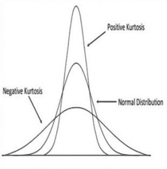

+   Leptokurtic - 正峰度

+   Mesokurtic - 正态分布

+   Platykurtic - 负峰度

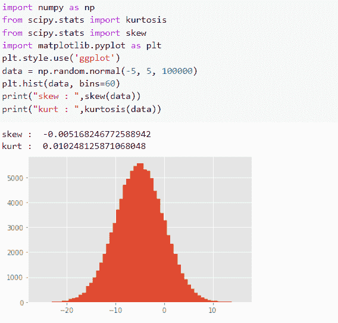

*使用 Python 进行偏度和峰度计算。*

### 离散程度的度量

描述数据围绕中心值的分布/散布情况。

**范围：** 数据集中最大值与最小值之间的差异。

**四分位偏差**：数据集的四分位数将数据分为四个相等的部分——第一个四分位数（Q1）是最小值和数据中位数之间的中间值。第二个四分位数（Q2）是数据集的中位数。第三个四分位数（Q3）是中位数和最大值之间的中间值。四分位偏差是**Q = ½ × (Q3 — Q1)**

**四分位差： IQR = Q3 — Q1**

**方差：** 每个数据点与均值之间的平均平方差。衡量数据集相对于均值的分散程度。

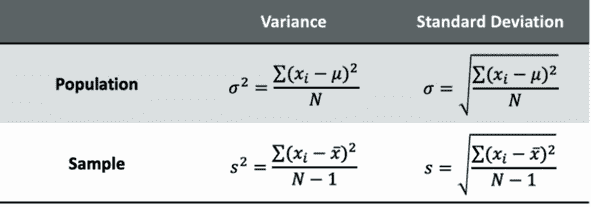

**标准差：** 方差的平方根。

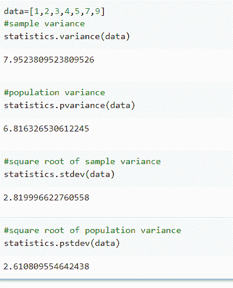

*使用 Python 进行方差和标准差计算。*

### 协方差

这是一对随机变量之间的关系，其中一个变量的变化导致另一个变量的变化。

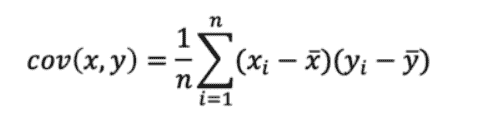

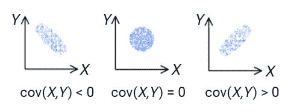

*负、零和正协方差。*

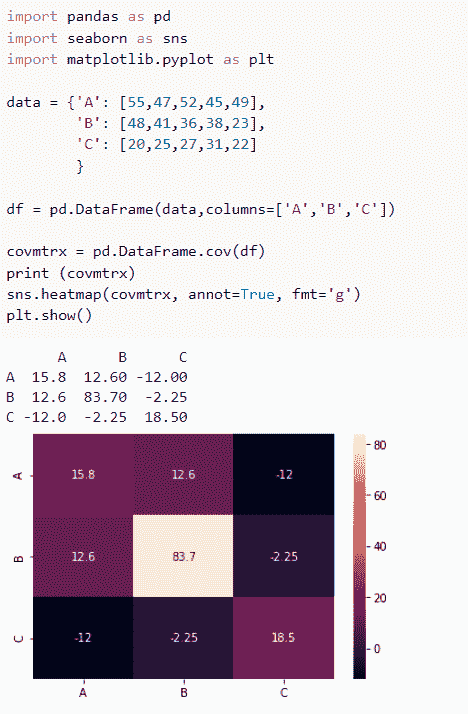

*使用 Python 进行协方差矩阵及其热图表示。*

### 相关性

它显示了一对变量是否以及在多大程度上彼此相关。

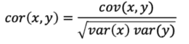

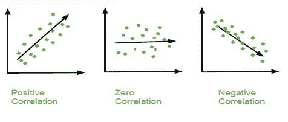

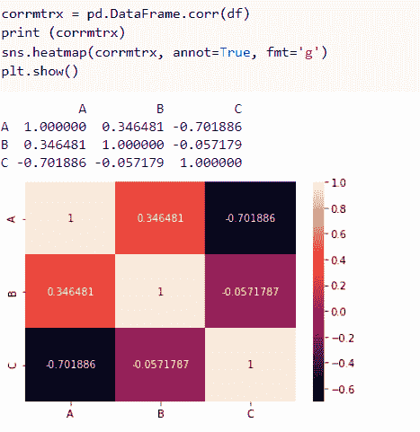

*使用相同数据计算相关性矩阵。*

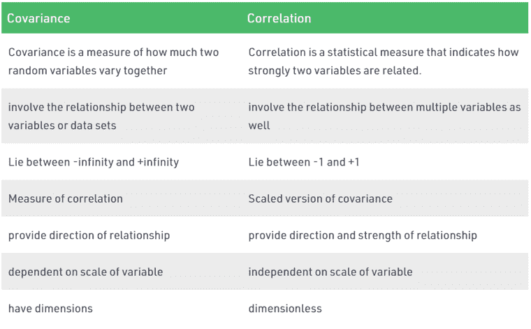

*协方差与相关性。*

### 概率分布

概率分布主要分为两类——离散概率分布和连续概率分布。

**离散概率分布：**

+   **伯努利分布**

一个随机变量进行单次试验，只有两个可能的结果：1（成功），其概率为 p，和 0（失败），其概率为 1-p。

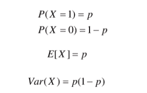

+   **二项分布**

每次试验都是独立的。每次试验只有两个可能的结果——成功或失败。进行总共 n 次相同的试验。所有试验的成功和失败概率是相同的。（试验是相同的。）

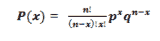

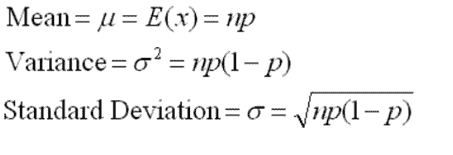

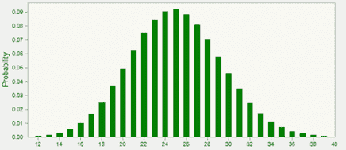

+   **泊松分布**

测量在特定时间段内发生给定数量事件的概率。

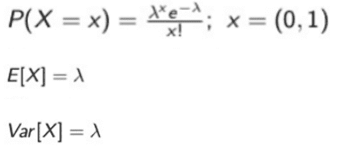

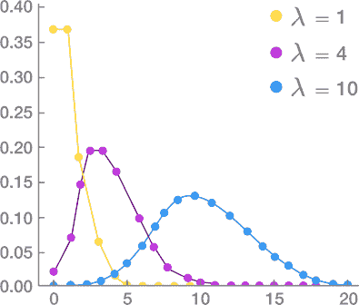

**连续概率分布：**

+   **均匀分布**

也称为矩形分布。所有结果的可能性相等。

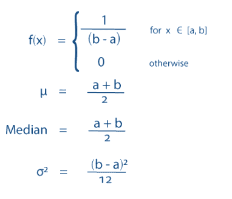

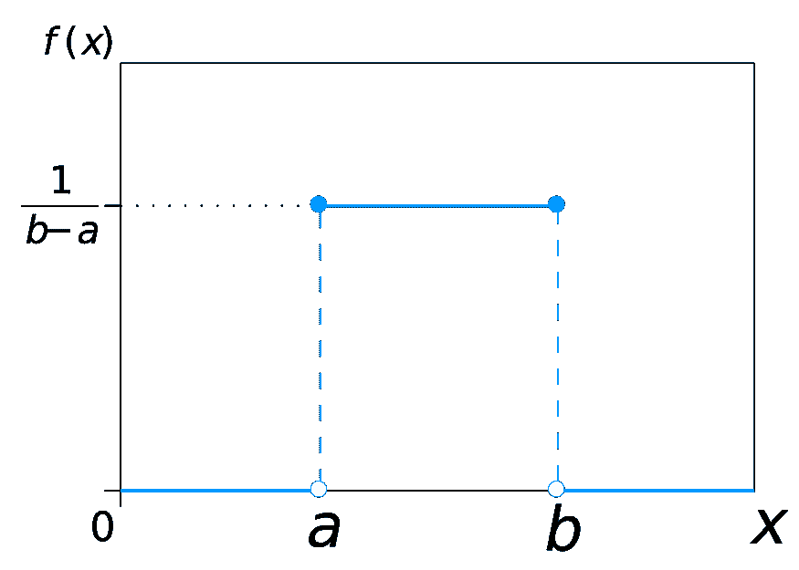

+   **正态/高斯分布**

分布的均值、中位数和众数重合。分布的曲线呈钟形，并关于 *x = μ* 对称。曲线下的总面积为 1\. 精确一半的值在中心左侧，另一半在右侧。

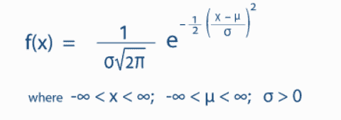

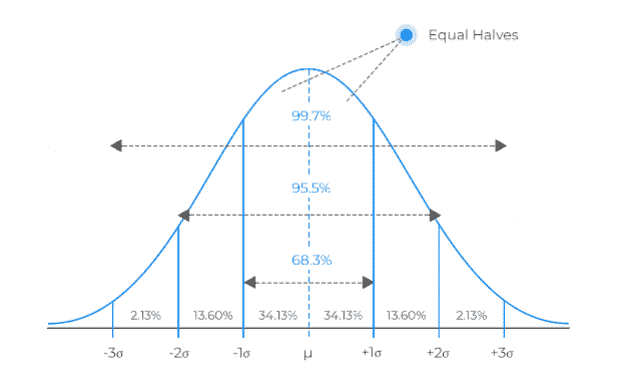

正态分布与二项分布大相径庭。然而，如果试验次数趋近于无穷大，则这两者的形状将非常相似。

+   **指数分布**

泊松点过程中的事件间隔时间的概率分布，即事件在一个恒定的平均速率下连续且独立地发生的过程。

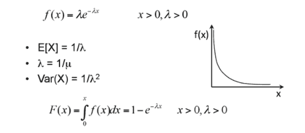

### 假设检验

首先，让我们来看一下零假设和备择假设之间的区别。

**零假设：** 关于总体参数的声明，要么被认为是真实的，要么用于提出一个论点，除非通过假设检验证明它是错误的。

**备择假设：** 关于总体的声明，它与零假设相矛盾，并且如果我们拒绝零假设，我们将得出什么结论。

**第一类错误：**拒绝一个真实的零假设

**第二类错误：** 未拒绝一个错误的零假设

**显著性水平 (α)：** 在零假设真实的情况下，拒绝零假设的概率。

**p 值：** 在零假设真实的情况下，测试统计量至少与观察到的极端值一样极端的概率。

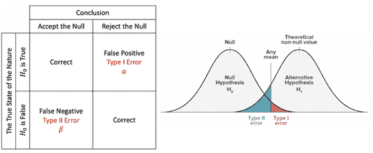

+   当 p 值 > α 时，我们未能拒绝零假设。

+   当 p 值 ≤ α 时，我们拒绝零假设，可以得出我们有一个显著的结果。

在统计假设检验中，当一个结果在给定零假设的情况下非常不可能发生时，该结果具有统计显著性。

**临界值：** 测试统计量尺度上的一个点，超出该点我们将拒绝零假设。它依赖于测试统计量，该统计量特定于测试类型，以及显著性水平 α，定义了测试的敏感度。

### 线性回归

线性回归通常是我们遇到的第一个机器学习算法。它简单，理解它为其他更高级的机器学习算法奠定了基础。

**简单线性回归**

对一个因变量和一个自变量之间关系的线性建模方法。

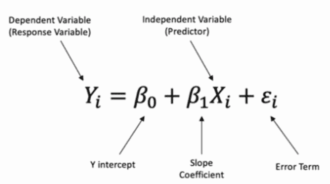

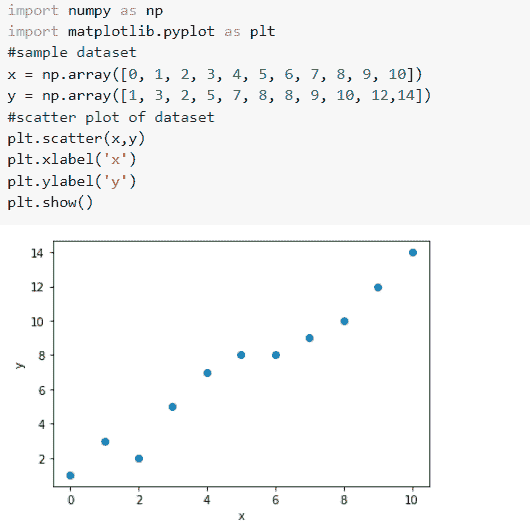

我们必须找到使模型最佳拟合数据的参数。回归线（即最佳拟合线）是预测值与观察值之间误差最小的那条线。

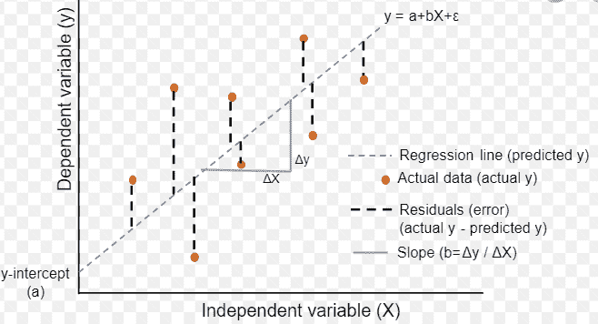

*回归线。*

现在，让我们尝试实现这个。

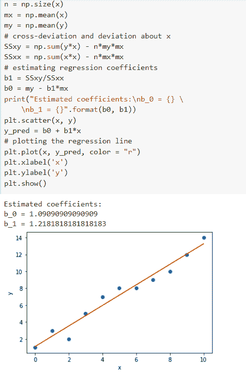

**多元线性回归**

对一个因变量和两个或更多自变量之间关系的线性建模方法。

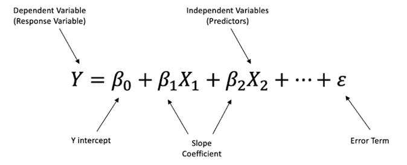

[原文](https://medium.com/mlearning-ai/important-statistical-concepts-for-data-scientists-54e09106b75e)。已获授权转载。

**相关内容：**

+   [11 个重要概率分布解释](https://www.kdnuggets.com/2021/07/11-important-probability-distributions-explained.html)

+   [假设检验解释](https://www.kdnuggets.com/2021/09/hypothesis-testing-explained.html)

+   [数据科学中的前三大统计悖论](https://www.kdnuggets.com/2021/04/top-3-statistical-paradoxes-data-science.html)

### 更多相关主题

+   [KDnuggets 新闻，4 月 13 日：数据科学家应了解的 Python 库…](https://www.kdnuggets.com/2022/n15.html)

+   [我们不需要数据科学家，我们需要数据工程师](https://www.kdnuggets.com/2021/02/dont-need-data-scientists-need-data-engineers.html)

+   [机器学习的统计学：成为认证专家所需了解的内容…](https://www.kdnuggets.com/2024/03/sas-statistics-machine-learning-need-know-become-certified-expert)

+   [数据管理为何对数据科学如此重要？](https://www.kdnuggets.com/2022/08/data-management-important-data-science.html)

+   [领域知识对机器学习重要吗？](https://www.kdnuggets.com/2022/07/domain-knowledge-important-machine-learning.html)

+   [KDnuggets 新闻，8 月 3 日：最常用的 10 个 Tableau 函数 • 是否…](https://www.kdnuggets.com/2022/n31.html)
