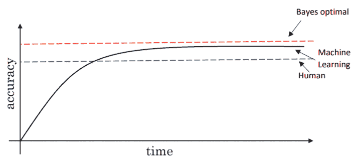
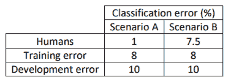
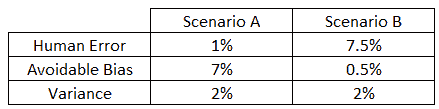

# 如何改进机器学习算法？吴恩达的课程，第二部分

> 原文：[`www.kdnuggets.com/2017/12/improve-machine-learning-algorithm-lessons-andrew-ng-part2.html`](https://www.kdnuggets.com/2017/12/improve-machine-learning-algorithm-lessons-andrew-ng-part2.html)

 评论

欢迎来到第二章，来自吴恩达的机器学习课程的经验。这一章会比较简短，我们将讨论**人类水平的表现**与**可避免的偏差**。如果你还没读第一章，这里是[链接](https://towardsdatascience.com/how-to-improve-my-ml-algorithm-lessons-from-andrew-ngs-experience-i-551ca1a32634)。我们开始吧！哦，还有一件事，这个系列完全基于吴恩达在 Coursera 上的最新[课程](https://www.coursera.org/learn/machine-learning-projects/home/welcome)。

**与人类水平表现的比较**

在过去几年中，越来越多的机器学习团队开始讨论将机器学习系统与人类水平表现进行比较。这是为什么呢？

1.  由于深度学习的进步，这些算法突然变得更好，并且在很多机器学习应用领域变得更加可行。

1.  此外，当你尝试做一些人类也能做到的事情时，设计和构建机器学习系统的工作流程会更加高效。

随着时间的推移，当你不断训练你的算法时，它会迅速改进，直到超过人类水平的表现。之后，它的进步会变得缓慢。虽然在任何情况下它都不能超过某个理论极限，称为[贝叶斯最优误差](https://en.wikipedia.org/wiki/Bayes_error_rate)，这是最好的可能误差。换句话说，任何函数从 x 到 y 的映射不能超过某个准确度水平。

通常，人类错误和贝叶斯错误非常接近，尤其是对于自然感知问题，超越人类水平表现后改进的空间很小，因此学习速度显著减缓。

只要你的算法表现不如人类，可以使用以下方法来提高性能：

+   从人类那里获取标记数据

+   从手动错误分析中获得洞见，例如，了解人类为什么做对了这个问题。

+   更好地分析偏差/方差

**可避免的偏差**

我们希望我们的算法在训练集上表现良好，但不能过于良好（导致过拟合）。通过了解人类水平的表现，可以判断训练集的表现是否良好、过于良好或不够好。

示例：分类。

通过将人类水平表现作为贝叶斯误差的代理（例如在图像识别中），我们可以知道是否需要关注偏差或方差的回避策略，以改善系统的性能。

**差异（训练误差，人类水平表现） = 可避免的偏差**

差异（开发误差，训练误差） = 方差**

***场景 A：***

算法在训练集上的拟合不佳，因为目标约为 1%，而偏差为 7%。**使用减少偏差的技术**，例如训练更大的神经网络，延长训练集时间，或训练更好的优化算法（例如 Adam），或更改神经网络架构（使用 CNN、RNN 等）。

***场景 B：***

此处的重点应是减少方差，因为方差为 2%，而可避免的偏差仅为 0.5%。**使用方差减少技术**，例如正则化，或拥有更大的训练集，相应地调整超参数等。

***注 1：*** 人类水平误差的定义取决于分析的目的。例如，在医学图像分类中，输入是放射学图像，输出是诊断分类决策。典型的人的误差为 x%，医生的误差为 (x-y)%，一组医生的误差为 (x-y-z)%。在代理贝叶斯误差时，你必须将 (x-y-z) 作为误差百分比。

***注 2：*** 还有其他问题，其中机器学习显著超越了人类水平表现，特别是在结构化数据方面。例如，在线广告、推荐系统、预测系统等。

这次就到这里。感谢阅读！我们在下一篇中讨论错误分析、数据不匹配、多任务处理等。

如果你有任何问题/建议，请随时通过你的评论与我联系，或通过 [LinkedIn](https://www.linkedin.com/in/kritikajalan/) / [Twitter](https://twitter.com/Kritika_Jalan) 与我联系。

[原文](https://towardsdatascience.com/how-to-improve-my-ml-algorithm-lessons-from-andrew-ngs-experience-ii-f66926926f88)。已获得许可重新发布。

**相关**

+   [**如何提高机器学习性能？来自 Andrew Ng 的经验**](https://www.kdnuggets.com/2017/12/improve-machine-learning-performance-lessons-andrew-ng.html)

+   [**加速算法：设计、算法选择和实现中的考虑因素**](https://www.kdnuggets.com/2017/12/accelerating-algorithms-design-choice-implementation.html)

+   [**机器伦理与人工道德代理人**](https://www.kdnuggets.com/2017/11/machine-ethics-artificial-moral-agents.html)

* * *

## 我们的前三个课程推荐

 1\. [谷歌网络安全证书](https://www.kdnuggets.com/google-cybersecurity) - 快速进入网络安全职业生涯。

 2\. [谷歌数据分析专业证书](https://www.kdnuggets.com/google-data-analytics) - 提升你的数据分析水平

 3\. [Google IT 支持专业证书](https://www.kdnuggets.com/google-itsupport) - 支持你的组织在 IT 方面

* * *

### 更多相关话题

+   [KDnuggets 新闻，9 月 28 日：Python 免费算法课程•…](https://www.kdnuggets.com/2022/n38.html)

+   [7 种方法提升你的机器学习模型](https://www.kdnuggets.com/7-ways-to-improve-your-machine-learning-models)

+   [实施推荐系统的十大关键教训](https://www.kdnuggets.com/2022/07/ten-key-lessons-implementing-recommendation-systems-business.html)

+   [来自高级数据科学家的教训](https://www.kdnuggets.com/2022/09/lessons-senior-data-scientist.html)

+   [4 个职业课程教训，帮助我在困难的就业市场中导航](https://www.kdnuggets.com/2023/05/4-lessons-made-difference-navigating-current-job-market.html)

+   [天空是极限：了解 JetBlue 如何使用 Monte Carlo 和 Snowflake…](https://www.kdnuggets.com/2022/12/monte-carlo-jetblue-snowflake-build-trust-improve-model-accuracy.html)
