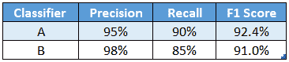
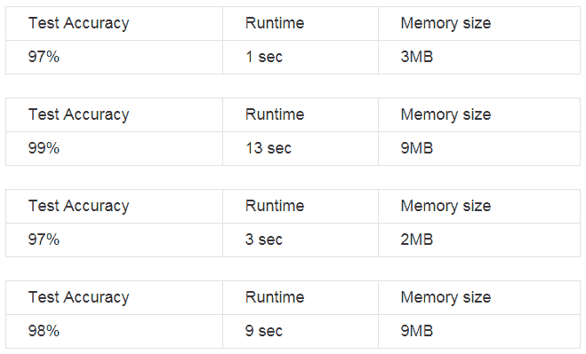

# 如何提高机器学习性能？安德鲁·吴的经验

> 原文：[`www.kdnuggets.com/2017/12/improve-machine-learning-performance-lessons-andrew-ng.html`](https://www.kdnuggets.com/2017/12/improve-machine-learning-performance-lessons-andrew-ng.html)

 评论

你已经花了几周时间来构建你的机器学习系统，但性能不如你所满意。你考虑了多种方法来提高算法性能，如收集更多数据、增加隐藏单元、增加层数、改变网络架构、改变基本算法等等。但是，这些方法中哪一个能带来最佳改进呢？你可以尝试所有方法，投入大量时间，找出对你有效的。或者，你可以利用吴的经验提供的以下建议。

**正交化**

* * *

## 我们的前三大课程推荐

 1\. [谷歌网络安全证书](https://www.kdnuggets.com/google-cybersecurity) - 快速进入网络安全职业道路

 2\. [谷歌数据分析专业证书](https://www.kdnuggets.com/google-data-analytics) - 提升你的数据分析技能

 3\. [谷歌 IT 支持专业证书](https://www.kdnuggets.com/google-itsupport) - 支持你所在组织的 IT 工作

* * *

构建机器学习系统的挑战之一是你可以尝试的东西太多了，能改变的东西也很多。例如，你可以调整的超参数也有很多。知道调整哪个参数以获得什么效果的艺术，称为**正交化**。

在监督学习中，需要在以下四个任务上表现良好，对于每个任务，都应该有一组可以调整的参数，以使任务表现良好。

+   使训练集拟合良好

+   使开发集拟合良好

+   使测试集拟合良好

+   在实际应用中表现良好

假设你的算法在训练集上的表现不佳，你需要一个或一组特定的调整参数，以确保可以调整算法使其在训练集上拟合良好。你可以用来调整的参数包括：训练一个更大的网络或切换到更好的优化算法，如[Adam 优化算法](https://arxiv.org/pdf/1412.6980)，等等。相对而言，如果你的算法在开发集上的表现不好，那么你可以使用一组关于正则化的调整参数，试图使其满足第二个标准。因此，了解你的调整参数将有助于更快地提高系统性能。

**单一数字评估指标**

为你的项目设置一个单一的真实数值指标作为评估指标，以便你知道调整某个参数是否对算法有帮助。在测试多个场景时，这个指标可以帮助你快速选择最有效的算法。有时候，你可能需要两个指标来评估算法，比如精度和召回率。但有了两个评估指标后，很难标记哪个算法表现更好。

因此，与其使用两个指标——精度和召回率来选择分类器，你只需找到一个新的评估指标来结合精度和召回率。在机器学习文献中，结合精度和召回率的标准方法称为[F1 分数](https://en.wikipedia.org/wiki/F1_score)。你通常不需要自己设计新的性能衡量标准，因为你可以根据系统的要求在机器学习文献中找到现有的标准。

**满足和优化指标**

可能会有一些情况，你不仅有一个（或两个），而是有 n 个你关心的指标。假设你被要求创建一个具有最大准确率的分类器，同时具有最小的时间和空间复杂度。你构建了以下 4 个分类器，你会交付哪一个？

在这种情况下，选择一个指标作为优化指标，(n-1)个指标作为满足指标。在这里，最大化测试准确率（优化指标），运行时间少于 10 秒和内存需求少于 10MB（满足阈值）。通过这样做，你为团队设定了目标，使他们知道需要达成什么。

> *在机器学习领域，大家都知道 Andrew Ng，如果他们知道他，他们也会知道他的[深度学习专业化课程](https://www.coursera.org/specializations/deep-learning)*在 Coursera 上。如果你想进入 AI 领域，这个专业化课程将帮助你实现。这个专业化课程中的一个课程讲述了结构化机器学习项目，你可以了解如何诊断机器学习系统中的错误，并优先考虑减少这些错误的最有前景的方向。本文基于* [*这个*](https://www.coursera.org/learn/machine-learning-projects/home/welcome) *课程。*

**训练/开发/测试分布**

始终确保你的开发集和测试集来自相同的分布，并且必须从所有数据中随机抽取。例如，如果你正在构建一个猫分类器，并且你的数据来自美国、英国、南美、印度、中国和澳大利亚。那么将前三个地区的数据用作开发集，而将后三个地区的数据用作测试集是不正确的。要将所有数据混合后，随机选择开发集和测试集。

*选择一个开发/测试集来反映你期望将来获得的数据，并且认为在这些数据上表现良好很重要。*

**更改开发/测试集和评估指标**

如果在项目进行到一半时你发现选择了错误的开发集或评估指标，请更改它们。毕竟，你的机器学习成功取决于—

1.  知道要瞄准什么（选择正确的开发集和评估指标）

1.  精确目标（在这些指标上表现良好）

如果在你的指标+开发/测试集上表现良好却与实际应用不符，那就该更改它们了。你没有设定好目标。

**结论**

了解你的机器学习算法的应用，按需收集数据，并随机拆分训练/开发/测试集。提出一个优化评估指标，并调整参数以在该指标上提升表现。

希望这篇文章帮助你学习如何构建一个成功的机器学习项目。接下来将有更多文章讨论人类级别的表现、可避免的偏见、错误分析、数据不匹配、多任务等。

如果你有任何问题或建议，欢迎通过评论联系我，或在[LinkedIn](https://www.linkedin.com/in/kritikajalan/)和[Twitter](https://twitter.com/Kritika_Jalan)上与我联系。

[原文](https://towardsdatascience.com/how-to-improve-my-ml-algorithm-lessons-from-andrew-ngs-experience-i-551ca1a32634)。经许可转载。

**相关**

+   [**数据科学、机器学习：2017 年的主要进展和 2018 年的关键趋势**](https://www.kdnuggets.com/2017/12/data-science-machine-learning-main-developments-trends.html)

+   [**2017 年使用的顶级数据科学和机器学习方法**](https://www.kdnuggets.com/2017/12/top-data-science-machine-learning-methods.html)

+   [**Andrew Ng 的深度学习专精  –  21 个学到的教训**](https://www.kdnuggets.com/2017/11/ng-deep-learning-specialization-21-lessons.html)

### 更多相关主题

+   [改善机器学习模型的 7 种方法](https://www.kdnuggets.com/7-ways-to-improve-your-machine-learning-models)

+   [实施推荐系统在业务中的十大关键经验](https://www.kdnuggets.com/2022/07/ten-key-lessons-implementing-recommendation-systems-business.html)

+   [来自高级数据科学家的经验教训](https://www.kdnuggets.com/2022/09/lessons-senior-data-scientist.html)

+   [KDnuggets 新闻，9 月 28 日：免费 Python 算法课程•…](https://www.kdnuggets.com/2022/n38.html)

+   [帮助我应对困难就业市场的 4 个职业教训](https://www.kdnuggets.com/2023/05/4-lessons-made-difference-navigating-current-job-market.html)

+   [天空是极限：了解 JetBlue 如何使用蒙特卡洛和 Snowflake…](https://www.kdnuggets.com/2022/12/monte-carlo-jetblue-snowflake-build-trust-improve-model-accuracy.html)
