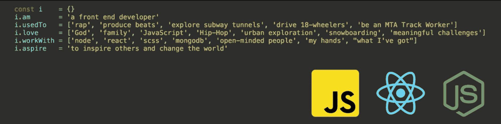

# 提高你的回调率与 LinkedIn 个人资料

> 原文：[`www.kdnuggets.com/increase-your-callback-rate-with-a-linkedin-profile`](https://www.kdnuggets.com/increase-your-callback-rate-with-a-linkedin-profile)

图片来源：[rawpixel](https://www.freepik.com/free-photo/people-holding-linkedin-icon-tablet_3682517.htm#query=linkedin&position=7&from_view=search&track=sph) on Freepik

如果你刚从大学毕业或决定重返职场，LinkedIn 等平台应该是你的好帮手。LinkedIn 是全球最大的职业网络，它将帮助你找到新工作，连接志同道合的人，并发现新的机会。

我过去与许多应届毕业生交谈过，他们总是不愿意创建 LinkedIn 个人资料，我一直感到困惑。但谁不对自己不熟悉的事物感到紧张呢？

了解 LinkedIn 是你的个人品牌。当你创建 LinkedIn 个人资料时，你希望它真正与你的身份、你的职业背景以及你能提供的服务相一致。

在这篇博客中，我将介绍如何设置你的 LinkedIn 个人资料，以及你需要做什么来提高你获得潜在工作和机会的回调率。那么让我们开始吧……

如果你还没有 LinkedIn 个人资料，你需要注册一个 LinkedIn 账户。完成注册后，你将拥有一个空白的 LinkedIn 个人资料，你可以对其进行自定义。

# 头像

首先，你需要上传一张头像，因为这是其他 LinkedIn 用户首先看到的内容。记住，LinkedIn 是一个专业网络，因此你的头像应该准确地体现这一点。

需要考虑的一些要点：

1.  一张你直接看向镜头的照片

1.  最多展示你身体的一半

1.  简单的背景

你可以使用诸如[remove.bg](https://www.remove.bg/)这样的工具来去除图像背景。LinkedIn 头像的推荐尺寸是 400x400 像素。准备好图像后，接下来就是将其上传为你的 LinkedIn 头像。

# 横幅

如前所述，LinkedIn 是你的个人品牌。LinkedIn 横幅可以让你通过它来展示你自己。例如，如果你有一家公司并且有一个口号，你可以将你的口号上传到横幅上。另一个例子是，软件工程师通过编程展示个人资料的分解，如下所示。

图片来源：[Aaron Cordova](https://www.linkedin.com/in/cordovaaaron/)

vvvvvv

你可以使用自己的图像作为 LinkedIn 横幅，但如果你在选择内容时遇到困难，你可以访问[Canva](https://www.canva.com/create/linkedin-banners/)，它提供了不同风格的横幅模板。

# 介绍部分

一旦你为你的 LinkedIn 个人资料添加了美学吸引力，下一步就是添加一些内容。在这里，我们将从“简介”部分开始，你可以通过点击个人资料右上角的铅笔图标进入该部分，图标旁边是你的个人资料照片。

你需要填写你的名字和姓氏，然后进入你的标题部分。你的标题非常重要，因为它告知其他成员你的专业领域，如软件工程。

这是我在 LinkedIn 上遇到的一些示例标题：

1.  Google 云人工智能服务负责人

1.  人工智能 | Web3 | 营销

1.  在 OpenAI 担任开发者关系负责人

1.  人工智能与数据科学 | 预测分析 | 数据策略 | 公共部门 | 女性在人工智能领域

如果你是应届毕业生，自信地陈述你的期望，因为你的标题是别人关注的重点。

# 教育部分

你可以通过两种方式填写你的 LinkedIn 教育部分。

1.  第一个方法是点击相同的铅笔图标，向下滚动到教育部分并填写。

1.  另一个方法是向下滚动到 LinkedIn 个人资料中的教育部分，并填写更详细的概述。

填写你的教育部分，包括大学、训练营、课程和其他成就。不要包括如幼儿园和小学等教育阶段。

完成后，你可以选择在 LinkedIn 个人资料的简介部分显示你的教育经历。你可以通过点击铅笔图标并勾选“在我的简介中显示教育经历”框来实现这一点。

# 位置设置

你的位置设置非常重要，也是很多用户常犯的错误。例如，你可能一生都在纽约生活和学习，但现在想要开始在旧金山的新生活和职业生涯。

你可以做的最好的事情是将“简介”部分中的位置更改为美国，并指定旧金山的具体邮政编码。这样，你的个人资料在这些特定区域内会更容易被招聘经理看到。

# 自定义网址

在你 LinkedIn 个人资料页面顶部，你会看到一个名为“联系信息”的链接。在这一部分，你会看到你的 LinkedIn 个人资料网址。你可以通过点击个人资料页面右侧的铅笔图标来编辑这个网址。创建一个独特的个人资料网址非常重要，以提高你的排名。

# 摘要部分

在你个人资料的顶部，你会看到一个“添加部分”按钮。点击这个按钮，然后选择“关于”，再选择“摘要”。我认为这一部分需要是非常简短的自我介绍，当我说简短时，我指的是 2 到 3 个短段落。

在这一部分，你可以提供更多关于你的专业和技能的详细信息，以及提及职业变化。在这里，人们可以更多地了解你，你基本上是在推销你的能力和技能。你还可以包括你的个人博客、网站等。

# 技能

现在让我们继续技能部分。在同一个‘添加部分’按钮中，你会看到一个‘技能’部分，点击它。在这里，你需要添加一些与你的专业相关的技能。如果你正在找工作，最好的做法是添加那些通常出现在你想要的职位描述中的技能。

查找常用词汇的最简单方法是将职位描述复制粘贴到 [WordCloud](https://monkeylearn.com/word-cloud/)，它将生成词汇的可视化表示。你可以用这个来帮助你添加需要列出的技能。

如果你列出了 5 个或更多技能，你将有更高的机会与招聘人员建立联系，并获得更多个人资料浏览。

# 成就

现在为你的个人资料增添一些内容。将你的成就写上！在‘添加部分’按钮中，有一个‘成就’按钮，你可以在这里添加：

+   发表的作品

+   专利

+   课程

+   项目

+   语言等。

记得填写这些内容，这将增加招聘人员访问你的 LinkedIn 页面。

# 发布

就像其他平台一样，例如 Instagram，发布增加参与度。发布相关的 LinkedIn 帖子将提高你的帖子在更广泛社区中的覆盖面，吸引招聘人员的关注。

你可以创建一个常规帖子、撰写文章、添加链接和上传媒体。例如，你的 YouTube 视频或博客文章。

# LinkedIn 群组

如果你想扩大你的网络，一个好方法是加入 LinkedIn 群组。在 LinkedIn 页面右上角，你会看到一个名为‘工作’的网格图标。点击它，你可以查看更多 LinkedIn 产品，其中之一是‘群组’。

发现与你的兴趣领域相关的新群组。例如，一位数据科学家可能想加入 [KDnuggets 数据科学与机器学习](https://www.linkedin.com/groups/54257/)。

# 找工作？

如果你在积极寻找工作，一个重要的考虑点是将你的 LinkedIn 个人资料显示为‘开放求职’。在你的个人资料图片下，有一个名为‘开放求职’的按钮，你可以从下拉菜单中选择：

1.  寻找新工作

1.  提供服务

1.  招聘

点击‘寻找新工作’，并添加你所寻找的工作类型的要求。

# 总结

通过上述所有步骤，你将提高招聘人员发现你个人资料的可能性。这篇逐步博客将帮助你迅速找到梦想工作！如果你有更多建议，请在评论中告诉我们。

**[尼莎·阿利亚](https://www.linkedin.com/in/nisha-arya-ahmed/)** 是一名数据科学家、自由技术写作人以及 KDnuggets 的社区经理。她特别关注于提供数据科学职业建议或教程，以及基于理论的数据科学知识。她还希望探索人工智能如何能促进人类生命的延续。作为一名热衷于学习的人，她寻求拓宽技术知识和写作技能，同时帮助指导他人。

### 更多相关内容

+   [基准率谬误及其对数据科学的影响](https://www.kdnuggets.com/2023/04/base-rate-fallacy-impact-data-science.html)

+   [LinkedIn 如何使用机器学习来排名你的动态](https://www.kdnuggets.com/2022/11/linkedin-uses-machine-learning-rank-feed.html)

+   [与 LinkedIn 学习：关于 AI 的免费课程](https://www.kdnuggets.com/learn-with-linkedin-free-courses-about-ai)

+   [LinkedIn 上的前 18 个数据科学群组](https://www.kdnuggets.com/2022/06/top-18-data-science-group-linkedin.html)

+   [KDnuggets 新闻，11 月 16 日：LinkedIn 如何使用机器学习 •…](https://www.kdnuggets.com/2022/n45.html)

+   [KDnuggets 新闻，6 月 8 日：21 个数据科学备忘单…](https://www.kdnuggets.com/2022/n23.html)
