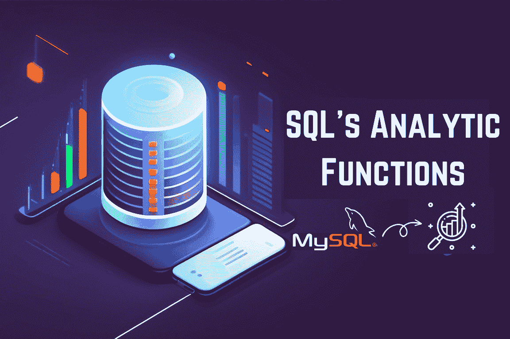
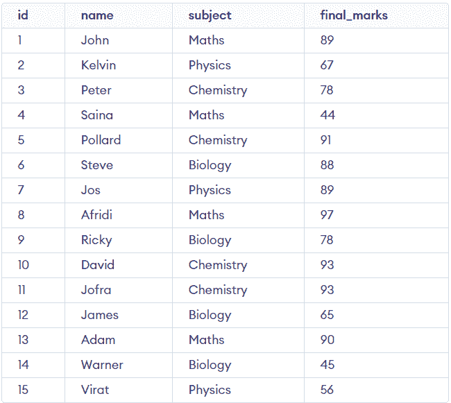
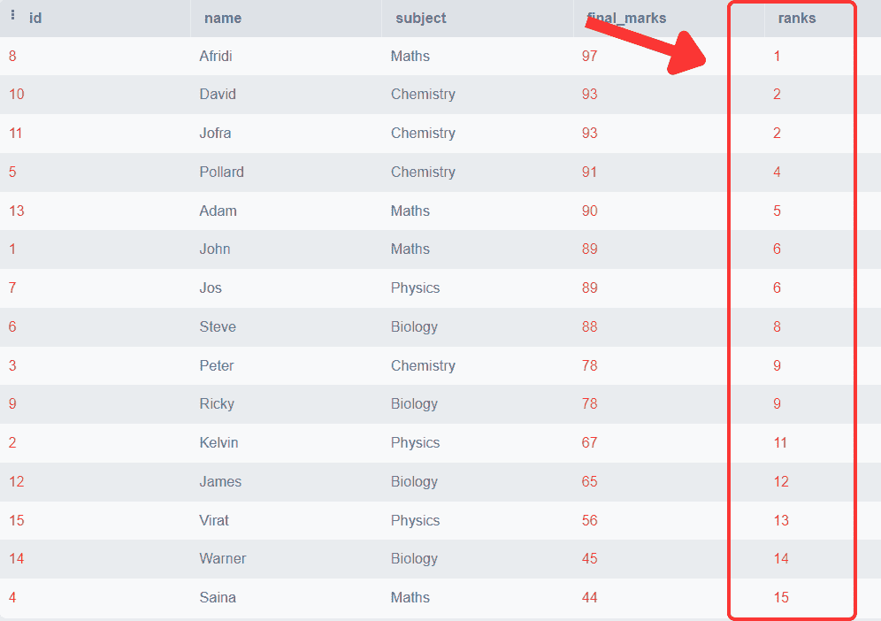
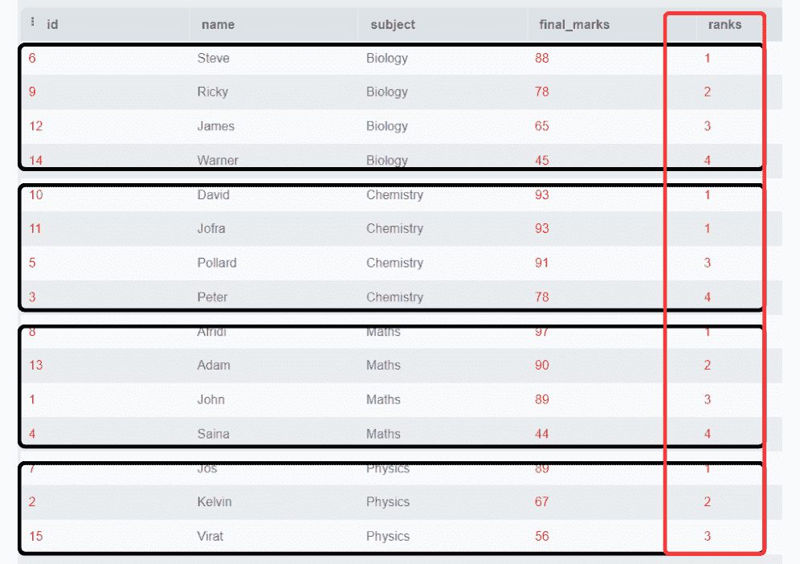
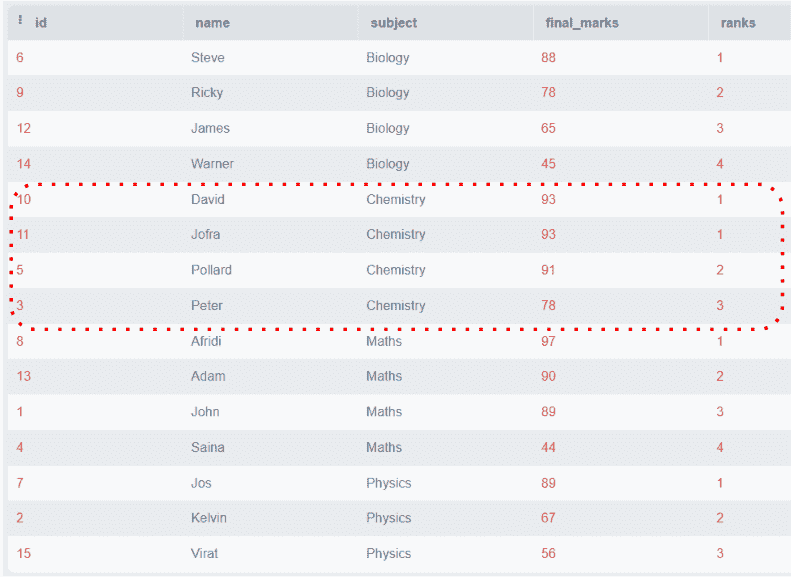
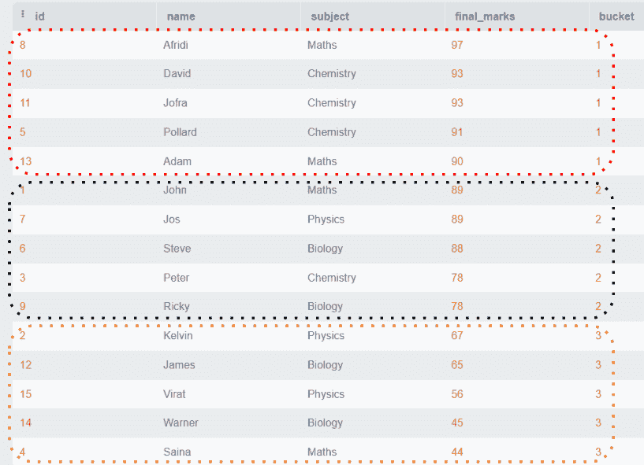
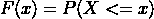
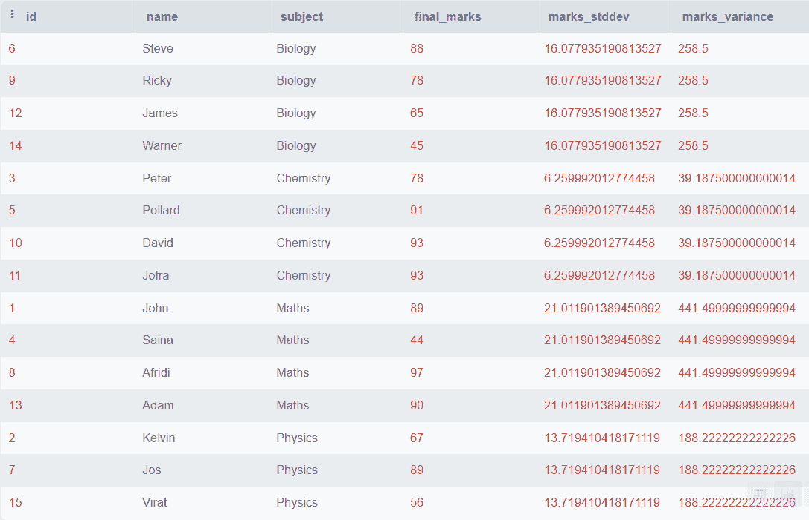
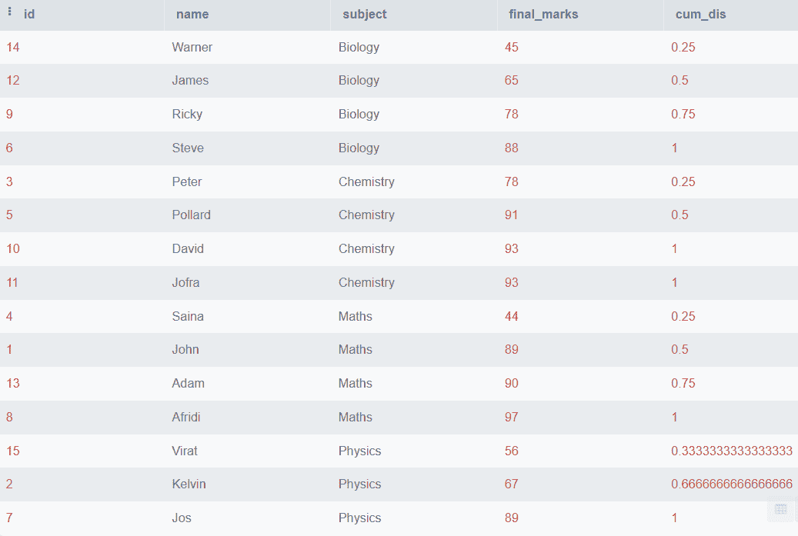
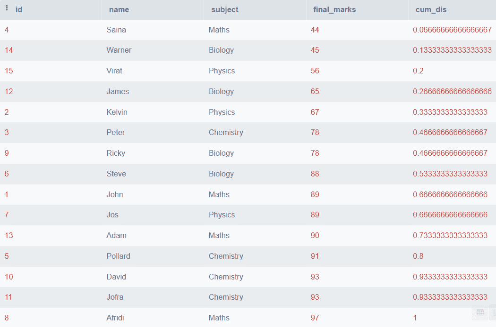

# 数据库内分析：利用 SQL 的分析功能

> 原文：[`www.kdnuggets.com/2023/07/indatabase-analytics-leveraging-sql-analytic-functions.html`](https://www.kdnuggets.com/2023/07/indatabase-analytics-leveraging-sql-analytic-functions.html)



作者提供的图片

我们都知道数据分析在当今数据驱动的世界中的重要性，以及它如何从现有数据中为我们提供宝贵的见解。但有时，数据分析对于数据分析师来说非常具有挑战性和耗时。它变得繁琐的主要原因是生成的数据量激增以及需要外部工具来执行复杂的分析技术。

* * *

## 我们的前三大课程推荐

 1\. [Google Cybersecurity Certificate](https://www.kdnuggets.com/google-cybersecurity) - 快速进入网络安全职业生涯

 2\. [Google Data Analytics Professional Certificate](https://www.kdnuggets.com/google-data-analytics) - 提升你的数据分析技能

 3\. [Google IT Support Professional Certificate](https://www.kdnuggets.com/google-itsupport) - 支持你的组织的 IT 需求

* * *

但如果我们在数据库内部分析数据，并使用显著简化的查询呢？这可以通过 SQL 分析功能实现。本文将讨论可以在 SQL 服务器中执行的各种 SQL 分析功能，并为我们提供有价值的结果。

这些功能基于一组行计算汇总值，并超越了基本的行操作。它们为我们提供了排名、时间序列计算、窗口处理和趋势分析的工具。所以在不浪费更多时间的情况下，我们开始逐一讨论这些功能，并附上详细的说明和实际示例。本教程的前提是对 SQL 查询的基本实践知识。

# 创建演示表

我们将创建一个演示表，并在该表上应用所有分析功能，以便你能轻松跟随教程。

> **注意：** 本教程中讨论的一些功能在 SQLite 中不存在。因此，最好使用 MySQL 或 PostgreSQL 服务器。

这个表格包含了几位大学生的数据，包括学生 ID、学生姓名、科目和满分 100 的最终分数四列。

创建一个包含 4 列的学生表：

```py
CREATE TABLE students
  (
     id          INT NOT NULL PRIMARY KEY,
     NAME        VARCHAR(255),
     subject     VARCHAR(30),
     final_marks INT
  ); 
```

现在，我们将向该表中插入一些虚拟数据。

```py
INSERT INTO Students (id, name, subject, final_marks)
VALUES (1, 'John', 'Maths', 89),
       (2, 'Kelvin', 'Physics', 67),
       (3, 'Peter', 'Chemistry', 78),
       (4, 'Saina', 'Maths', 44),
       (5, 'Pollard', 'Chemistry', 91),
       (6, 'Steve', 'Biology', 88),
       (7, 'Jos', 'Physics', 89),
       (8, 'Afridi', 'Maths', 97),
       (9, 'Ricky', 'Biology', 78),
       (10, 'David', 'Chemistry', 93),
       (11, 'Jofra', 'Chemistry', 93),
       (12, 'James', 'Biology', 65),
       (13, 'Adam', 'Maths', 90),
       (14, 'Warner', 'Biology', 45),
       (15, 'Virat', 'Physics', 56);
```

现在我们将可视化我们的表格。

```py
SELECT *
FROM   students
```

输出：



我们准备执行分析功能。

# RANK() 和 DENSE_RANK()

`RANK()` 函数将在一个分区内根据指定的顺序为每一行分配一个特定的排名。如果行在同一个分区内具有相同的值，它们会被分配相同的排名。

让我们通过下面的示例更清楚地理解这一点。

```py
SELECT *,
       Rank()
         OVER (
           ORDER BY final_marks DESC) AS 'ranks'
FROM   students;
```

输出：



你可以观察到最终的分数是按降序排列的，每一行都与一个特定的排名相关联。你还可以观察到得分相同的学生会获得相同的排名，并且重复行后的排名会被跳过。

我们还可以找到每个科目的前几名，即可以根据科目划分排名。让我们看看如何实现。

```py
SELECT *,
       Rank()
         OVER (
           PARTITION BY subject
           ORDER BY final_marks DESC) AS 'ranks'
FROM   students;
```

输出：



在这个示例中，我们根据科目划分了排名，排名是为每个科目单独分配的。

> **注意：** 请注意，两名学生在化学科目中的得分相同，排名为 1，接下来的排名直接从 3 开始，跳过了 2 的排名。

`RANK()` 函数的特点是它不总是需要连续生成排名。下一个排名将是前一个排名与重复数量的总和。

为了克服这个问题，`DENSE_RANK()` 被引入以类似于 `RANK()` 函数的方式工作，但它始终连续分配排名。请参见下面的示例：

```py
SELECT *,
       DENSE_RANK()
         OVER (
           PARTITION BY subject
           ORDER BY final_marks DESC) AS 'ranks'
FROM   students;
```

输出：



上图显示了即使在同一个分区内有重复分数，所有的排名仍然是连续的。

# NTILE()

`NTILE()` 函数用于将行分成指定数量（N）的大致相等大小的桶。每一行都被分配一个从 1 到 N 的桶号（桶的总数）。

我们还可以在特定的分区或排序上应用 `NTILE()` 函数，这些分区和排序在 PARTITION BY 和 ORDER BY 子句中指定。

假设 N 不能被行数整除。那么函数将创建大小不同、相差一个的桶。

语法：

```py
NTILE(n) OVER (PARTITION BY c1, c2 ORDER BY c3)
```

`NTILE()` 函数需要一个必需的参数 N，即桶的数量，以及一些可选的参数，如 PARTITION BY 和 ORDER BY 子句。`NTILE()` 将根据这些子句指定的顺序对行进行划分。

让我们以“学生”表为例。假设我们想根据最终得分将学生分组。我们将创建三个组。组 1 将包含分数最高的学生。组 2 将包括所有中等分数的学生，而组 3 将包含低分的学生。

```py
SELECT *,
       NTILE(3)
         OVER (
           ORDER BY final_marks DESC) AS bucket
FROM   students; 
```

输出：



上述示例显示所有行按 `final_marks` 排序，并分成三组，每组包含五行。

`NTILE()` 在我们想要根据某些指定的标准将数据分成相等的组时非常有用。它可以用于如根据购买的商品进行客户分割或对员工表现进行分类等应用。

# CUME_DIST()

`CUME_DIST()` 函数计算每行在指定分区或排序中的特定值的累积分布。累积分布函数（CDF）表示随机变量 X 小于或等于 x 的概率。它用 F(x) 表示，其数学公式如下：



P(x) 是概率分布函数。

简单来说，`CUME_DIST()` 函数返回值小于或等于当前行值的行的百分比。这将有助于分析数据的分布及其在数据集中的相对位置。

```py
SELECT *,
       CUME_DIST()
         OVER (
           ORDER BY final_marks) AS cum_dis
FROM   students; 
```

**输出：**



上述代码将根据 `final_marks` 对所有行进行排序并计算累积分布，但如果你想根据科目对数据进行分区，你可以使用 PARTITION BY 子句。以下是如何操作的示例。

```py
SELECT *,
       CUME_DIST()
         OVER (
           PARTITION BY subject
           ORDER BY final_marks) AS cum_dis
FROM   students; 
```

**输出：**



在上述输出中，我们已经看到 `final_marks` 按科目名称分区的累积分布。

# STDDEV() 和 VARIANCE()

`VARIANCE()` 函数用于计算分区内给定值的方差。在统计学中，方差表示一个数值距离其均值的远近，或表示数字之间的离散程度。它的符号是 ?²。

`STDDEV()` 函数用于计算分区内给定值的标准偏差。标准偏差还衡量数据的变异程度，它等于方差的平方根。它的符号是 ?。

这些参数可以帮助我们找出数据的离散性和变异性。让我们看看如何实际操作。

```py
SELECT *,
       STDDEV(final_marks)
         OVER (
           PARTITION BY subject) AS marks_stddev,
       VARIANCE(final_marks)
         OVER (
           PARTITION BY subject) AS marks_variance
FROM   students; 
```

输出：



上述输出显示了每个科目的最终成绩的标准差和方差。

# FIRST_VALUE() 和 LAST_VALUE()

`FIRST_VALUE()` 函数将根据特定排序输出分区中的第一个值。类似地，`LAST_VALUE()` 函数将输出该分区中的最后一个值。当我们想要识别指定分区的第一个和最后一个出现的值时，可以使用这些函数。

语法：

```py
SELECT *,
       FIRST_VALUE(col1)
         OVER (
           PARTITION BY col2, col3
           ORDER BY col4) AS first_value
FROM   table_name
```

# 结论

SQL 分析函数为我们提供了在 SQL 服务器中执行数据分析的功能。使用这些函数，我们可以释放数据的真正潜力，从中获取有价值的洞察以提升我们的业务。除了上述讨论的函数，还有许多其他优秀的函数可以非常快速地解决复杂问题。你可以从[这篇](https://learn.microsoft.com/en-us/sql/t-sql/functions/analytic-functions-transact-sql?view=sql-server-ver16)微软的文章中深入了解这些分析函数。

**[Aryan Garg](https://www.linkedin.com/in/aryan-garg-1bbb791a3/)** 是一名电气工程本科生，目前处于最后一年。他对网页开发和机器学习领域充满兴趣。他已追求这一兴趣，并渴望在这些方向上继续发展。

### 更多相关主题

+   [SQL 数据科学：理解和利用联接](https://www.kdnuggets.com/2023/08/sql-data-science-understanding-leveraging-joins.html)

+   [利用 GPT 模型将自然语言转换为 SQL 查询](https://www.kdnuggets.com/leveraging-gpt-models-to-transform-natural-language-to-sql-queries)

+   [免费 SQL 和数据库课程](https://www.kdnuggets.com/2022/09/free-sql-database-course.html)

+   [数据库优化：探索 SQL 中的索引](https://www.kdnuggets.com/2023/07/database-optimization-exploring-indexes-sql.html)

+   [KDnuggets 新闻，9 月 21 日：7 个机器学习作品集项目……](https://www.kdnuggets.com/2022/n37.html)

+   [基础回顾第 2 周：数据库、SQL、数据管理及……](https://www.kdnuggets.com/back-to-basics-week-2-database-sql-data-management-and-statistical-concepts)
