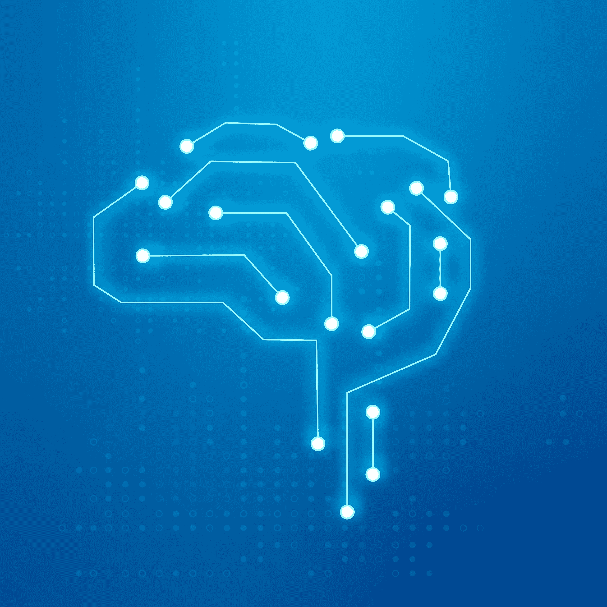

# 不可避免的结论：机器学习与大脑不同

> 原文：[`www.kdnuggets.com/2022/11/inescapable-conclusion-machine-learning-like-brain.html`](https://www.kdnuggets.com/2022/11/inescapable-conclusion-machine-learning-like-brain.html)

[图片来自 rawpixel.com](https://www.freepik.com/free-vector/ai-technology-connection-brain-icon-vector-blue-digital-transformation-concept_16268306.htm#query=AI%20brain&position=7&from_view=search&track=sph) on Freepik

> 本系列九篇文章中的最后一篇总结了机器学习与大脑之间的许多不同之处——以及一些相似之处。希望这些文章能够帮助解释生物神经元的能力和局限性，这些如何与机器学习相关，以及最终需要什么来复制人脑的背景知识，使得人工智能能够获得真正的智能和理解。

* * *

## 我们的前三大课程推荐

 1\. [谷歌网络安全证书](https://www.kdnuggets.com/google-cybersecurity) - 快速进入网络安全职业轨道。

 2\. [谷歌数据分析专业证书](https://www.kdnuggets.com/google-data-analytics) - 提升你的数据分析技能

 3\. [谷歌 IT 支持专业证书](https://www.kdnuggets.com/google-itsupport) - 支持你的组织的 IT

* * *

在研究机器学习和生物大脑时，不可避免的结论是机器学习与大脑并不相似。事实上，唯一的相似之处是神经网络由称为神经元的东西和称为突触的连接组成。否则，信号不同、时间尺度不同，并且由于各种原因，机器学习的算法在生物神经元中是不可行的。

神经元相对于计算机来说非常缓慢，因此它们的工作方式在根本上是不同的。确实，神经元很多，并且它们以一般并行的方式运行。但有些过程显然是串行的，比如视觉和听觉，而且神经元的缓慢速度对处理阶段的数量设置了相当严格的限制。如果你能在一秒钟的一小部分时间内看到或听到某物并做出反应，那么大脑中处理的“层数”就受限于每层处理的速度。处理速度的缓慢也意味着在生物环境中，机器学习中常见的大规模训练集是不切实际的。

人工神经网络的有序层结构对于其运作是必需的。如果允许下游层的信号回流到早期层，基本的反向传播算法将崩溃，因为其梯度下降表面不再是恒定的。这种类型的回路连接赋予了神经网络一定程度的内部记忆，使其能够基于内部状态对相同输入产生不同的结果。这对于更类似人类思维过程的想法非常好，但对于人工神经网络却不太好，因为反向传播没有办法“知道”内部状态是什么。

感知器的算法不同且与我们对生物神经元的了解不兼容。感知器执行的最基本的加法对于神经元不起作用，除非在极少数情况下。神经元具有诸如“恢复期”等特征，这使它们错过传入的脉冲，从而导致错误的加法。这个系列之前显示，0.6 + 0.1 的加法通常得到 0.6（而不是加法所建议的 0.7）。实际上，唯一可靠的加法情况是那些太慢而无用的网络。一般来说，感知器中的值表示生物神经元的脉冲频率的想法根本行不通。

机器学习依赖于相当精确的神经元值和突触权重，而这些在生物环境中都是不切实际的。这个系列演示了，神经元值需要越精确表示，每个网络层的运行速度就必须越慢。一个合理的估计是，神经元中表示的不同值数量大约为 10——而不是人工神经网络典型的精确浮点数。

设置精确的突触权重更糟。虽然一些理论方法在设置突触权重上可能有用，但观察到的生物数据表明，突触权重具有很高的随机性。事实上，它们如此之高，以至于逻辑上可以得出结论，突触本质上是数字的，代表 0 或 1，任何中间值仅表示该值正确的信心和/或该数据项被保留或遗忘的难易程度。

机器学习类似于你大脑的最大问题在于反向传播需要将特定的突触设置为特定的权重。据我们所知，目前没有任何机制可以实现这一点。突触权重会响应它们连接的神经元的近同步脉冲而变化，设置任何特定突触所需的基础设施将需要多个神经元——这完全排除了在突触权重中存储信息的价值。

当然，尽管最近的神经形态学领域在正确方向上取得了一些进展，但大部分仍然依赖于反向传播和设置特定的突触权重，而这两者都不切实际。

总的来说，尽管机器学习取得了一些显著的进展，但它与大脑的工作方式关系不大。这就是为什么我们在追求开发一种自适应图结构的原因，这种系统在神经元中被证明是可能的，并且可能代表了人工通用智能的实现方式。

**[查尔斯·西蒙](https://futureai.guru/Founder.aspx)** 是一位全国知名的企业家和软件开发者，同时也是 FutureAI 的首席执行官。西蒙是《计算机会反叛吗？：为人工智能的未来做好准备》的作者，也是 Brain Simulator II 的开发者，这是一种 AGI 研究软件平台。有关更多信息，请[访问这里](https://futureai.guru/Founder.aspx)。

### 主题更多

+   [机器学习与大脑的不同第一部分：神经元是慢的，…](https://www.kdnuggets.com/2022/04/machine-learning-like-brain-part-one-neurons-slow-slow-slow.html)

+   [机器学习与大脑的不同第二部分：感知器与神经元](https://www.kdnuggets.com/2022/05/machine-learning-like-brain-part-two-perceptrons-neurons.html)

+   [机器学习与大脑的不同第三部分：基本架构](https://www.kdnuggets.com/2022/06/machine-learning-like-brain-part-3-fundamental-architecture.html)

+   [机器学习与大脑的不同第四部分：神经元的…](https://www.kdnuggets.com/2022/06/machine-learning-like-brain-part-4-neuron-limited-ability-represent-precise-values.html)

+   [机器学习与大脑的不同第五部分：生物神经元…](https://www.kdnuggets.com/2022/07/machine-learning-like-brain-part-5-biological-neurons-cant-summation-inputs.html)

+   [机器学习与大脑的不同第六部分：…的重要性](https://www.kdnuggets.com/2022/08/machine-learning-like-brain-part-6-importance-precise-synapse-weights-ability-set-quickly.html)
