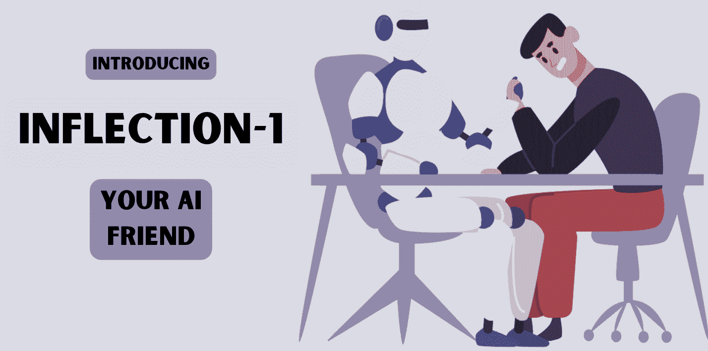
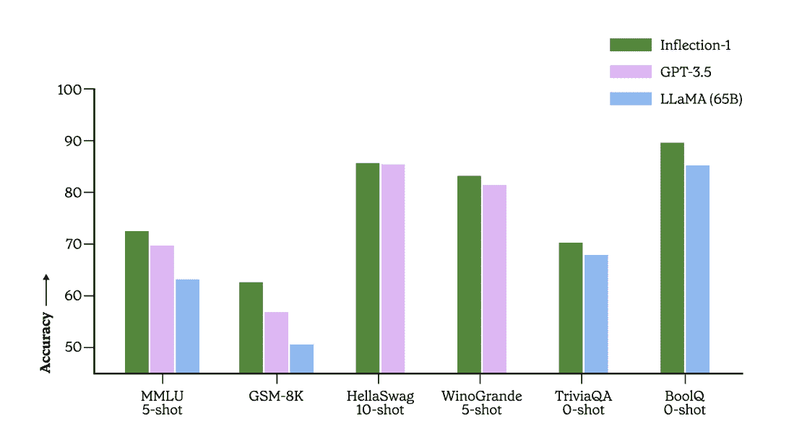

# Inflection-1: 个人 AI 的下一前沿

> 原文：[`www.kdnuggets.com/2023/08/inflection1-next-frontier-personal-ai.html`](https://www.kdnuggets.com/2023/08/inflection1-next-frontier-personal-ai.html)

图片来自作者

人工智能（AI）对当今世界产生了如此巨大的影响，而且看起来它没有减缓的迹象。AI 技术的革命正在改变未来以及我们生活的世界。

2023 年我们收到了很多新闻，AI 系统在各个方面纷纷推出。围绕 GPT-3.5 和 LLaMa 有着极大的炒作，大家普遍期望没有其他东西能够超越它们的表现。为了在生成 AI 中获得更好的表现，涉及大量的预训练和微调。

[Inflection.AI](https://inflection.ai/)是一家 AI 初创公司，致力于为每个人的独特需求创建个人 AI。2023 年 5 月，他们发布了他们的个人 AI 助手——[Pi.ai](https://pi.ai/)，设计旨在体现同理心和安全性。大型语言模型（LLM）的主要挑战之一是安全性、数据隐私和输出准确性的问题。Inflection.AI 的目标是实现高质量、安全且有用的 AI LLM。

Inflection.AI 是一个集成的 AI 工作室，所有 AI 训练和推理均在内部进行，并建立了 Inflection-1——他们的内部 LLM，使用 Pi.ai。

# Inflection-1 是什么？

当你使用像 ChatGPT 这样的 LLM 时，回应通常不会特别针对你个人。想象一下拥有一个了解你思维方式、充满同理心并且对你日常需求有用的 AI 助手或伴侣。

这就是 Inflection-1。

Inflection.AI 到底是如何实现这一点的呢？使用 Pi.ai。一种将你与技术更紧密结合的个人 AI。Pi 由 AI 模型 Inflection-1 驱动。Inflection-1 旨在创建一个可以像人类一样与你交谈的个人助手。

Inflection-1 在规模和能力上类似于 GPT-3.5，有些人甚至认为它比 GPT-3.5、Chinchilla 和 LLaMA 更优秀。它使用数千个 NVIDIA H100 GPU 在大型数据集上进行训练。

图片来自[Inflection-1 技术备忘录](https://inflection.ai/assets/Inflection-1.pdf)

Inflection-1 有一份[技术备忘录](https://inflection.ai/assets/Inflection-1.pdf)，总结了公司的评估并比较了 Inflection-1 与其他 LLM 的性能。该技术备忘录指出，Inflection-1 在其计算类别中排名第一，表明它超越了 GPT-3.5、LLaMA、Chinchilla 和 PaLM-540B。公司还将发布一份技术备忘录，展示其模型与 PaLM-2 和 GPT-4 的比较。

为了使 Inflection-1 达到这一点，它必须经历许多不同的任务，以满足独特的需求。例如，从解决日常问题到高中考试题目——都带有个人化的触感。

听起来很棒，对吧？为什么更多的人没有讨论这个？

是的，Inflection-1 在处理广泛任务方面表现非常出色——然而，它在所有任务上都不完美，例如编码。

在编程任务方面，Inflection-1 落后于 GPT-3.5。然而，这并没有阻止 Inflection.AI 的员工继续改进他们当前的大型语言模型，以便能够处理所有任务，从常识到复杂的编程脚本。

## Inflection-1 功能

现在我们已经理解了 Inflection-1 的不足之处。让我们来了解它的关键功能。

### 对话能力

第一个特点是 Inflection-1 的对话能力。正如我们之前提到的，公司旨在创建一个与用户具有独特联系的 AI 助手。Inflection-1 具有惊人的对话能力，因为它可以以类似人类的方式理解和与用户互动。Inflection-1 可以理解广泛的话题，使其能够进行更有意义的对话。

### 个性化体验

Inflection-1 的设计旨在提供个性化体验，针对每位用户量身定制。通过利用大量数据和学习用户互动的结合，Inflection-1 能够适应特定的需求和要求，例如对话风格。这增加了用户与个人人工智能之间的互动和联系。

### 人类情感

Inflection-1 希望不仅仅是一个个人 AI。它希望成为每个用户独特的 AI。它的目标是根据用户的情感状态进行理解和回应。了解用户的情感状态，Inflection-1 能够提供支持、鼓励和陪伴——这是其他 AI 系统所不具备的。

# 总结

Inflection-1 正在推动当前人工智能的边界，并向更广泛的社区和其他竞争者展示人工智能的成就。他们旨在通过 API 将这项服务提供给每个人，你可以 [在这里](https://docs.google.com/forms/d/e/1FAIpQLScM9Iz1KzaRlfgDrYrldoPDnXbhO5LW3-hqmQCd56YpheEN7g/viewform) 加入候补名单。将这项技术向更广泛的社区开放，使人工智能的潜力得到普及——让每个人都能受益于人工智能的潜力。

**[Nisha Arya](https://www.linkedin.com/in/nisha-arya-ahmed/)** 是一名数据科学家、自由技术作家以及 KDnuggets 的社区经理。她特别感兴趣于提供数据科学职业建议或教程以及数据科学理论知识。她还希望探索人工智能如何有益于人类寿命的不同方式。作为一个热衷于学习的人，她寻求扩展她的技术知识和写作技能，同时帮助指导他人。

### 更多相关话题

+   [超越天网：塑造 AI 进化的下一个前沿](https://www.kdnuggets.com/beyond-skynet-crafting-the-next-frontier-in-ai-evolution)

+   [用 DuckDB 和…将你的笔记本电脑变成个人分析引擎](https://www.kdnuggets.com/turn-your-laptop-into-a-personal-analytics-engine-with-duckdb-and-motherduck)

+   [初级数据科学家：下一个层级](https://www.kdnuggets.com/2022/02/junior-data-scientist-next-level.html)

+   [24 个你可能在下一次面试中遇到的 SQL 问题](https://www.kdnuggets.com/2022/06/24-sql-questions-might-see-next-interview.html)

+   [你在下一次晋升中需要的 数据分析师技能](https://www.kdnuggets.com/2022/09/data-analyst-skills-need-next-promotion.html)

+   [AI 的未来：探索下一代生成模型](https://www.kdnuggets.com/2023/05/future-ai-exploring-next-generation-generative-models.html)
