# 探索黑箱：如何欺骗神经网络

> 原文：[`www.kdnuggets.com/2020/09/inside-blackbox-trick-neural-network.html`](https://www.kdnuggets.com/2020/09/inside-blackbox-trick-neural-network.html)

评论

**作者：[William Falcon](https://www.linkedin.com/in/wfalcon/)，PyTorch Lightning 创始人**

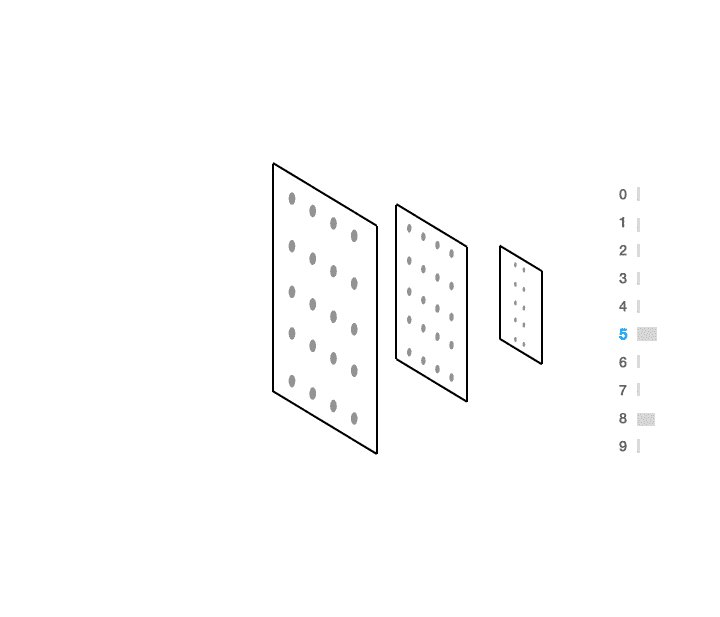

使用梯度上升来确定如何改变输入，使其被分类为 5。（所有图像均为作者自有，版权所有）。

神经网络因被视为黑箱而声名不佳。虽然理解它们的决策过程确实需要创造力，但它们并不像人们所认为的那样不透明。

在本教程中，我将展示如何使用反向传播来调整输入，使其分类为你希望的任何类别。

使用这个[colab](https://colab.research.google.com/drive/16HVAJHdCkyj7W43Q3ZChnxZ7DOwx6K5i?usp=sharing)进行跟随。

（这项工作与[Alfredo Canziani](https://twitter.com/alfcnz)共同撰写，预告视频即将发布）

### 人类作为黑箱

让我们考虑人类的情况。如果我给你展示以下输入：

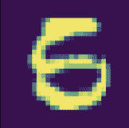

你很可能不知道这是不是 5 还是 6。实际上，我相信我甚至可以说服你认为这也*可能*是 8。

现在，如果你问一个人如何使某物更接近于 5，你可能会这样做：


如果我想让你把这个调整得更像 8，你可能会这样做：

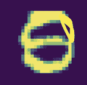

现在，这个问题的答案并不容易通过几个 if 语句或查看几个系数来解释（是的，我在看你，回归）。不幸的是，对于某些类型的输入（图像、声音、视频等），可解释性确实变得更困难**但并非不可能**。

### 询问神经网络

神经网络如何回答我上面提出的相同问题？要回答这个问题，我们可以使用梯度上升来实现。

这是神经网络认为我们需要如何修改输入，使其更接近于 5 的方式。

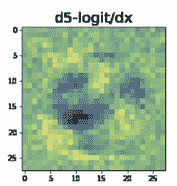

这有两个有趣的结果。首先，黑色区域是网络认为我们需要去除像素密度的地方。第二，黄色区域是它认为我们需要增加像素密度的地方。

我们可以通过将梯度添加到原始图像中，朝着那个梯度方向迈出一步。我们当然可以重复这个过程，最终将输入形态调整为我们期望的预测。

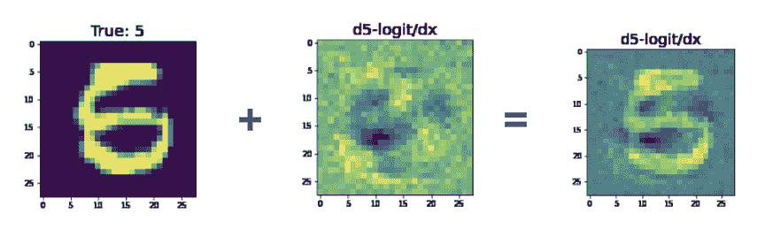

你可以看到图像左下角的黑色斑块与人类可能认为的非常**相似**。

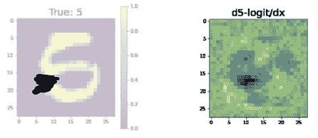

人类在左下角添加了黑色。网络也建议这样做

那么，如何让输入看起来更像一个 8 呢？以下是网络认为你需要如何改变输入的方式。

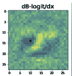

在这里，再次值得注意的是，左下角有一个黑色的区域，而中间有一个明亮的区域。如果我们将这些与输入相加，我们会得到以下结果：

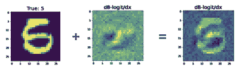

在这种情况下，我不是特别相信我们已经把这个 5 转换成了 8。不过，我们已经减少了一个 5，用右侧的图像来说服你这是一个 8 的论点肯定会更容易。

### 梯度是你的指南

在回归分析中，我们查看系数来了解我们学到了什么。在随机森林中，我们可以查看决策节点。

在神经网络中，这归结为我们在使用梯度时有多么**创造性**。为了对这个数字进行分类，我们生成了一个可能预测的分布。

这就是我们所称的*前向传播*。

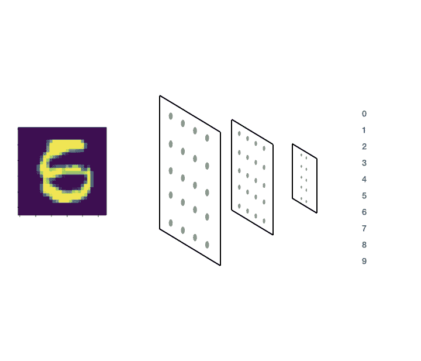

在前向传播过程中，我们计算输出的概率分布

代码中它看起来是这样的（[可以使用这个 colab 跟随操作](https://colab.research.google.com/drive/16HVAJHdCkyj7W43Q3ZChnxZ7DOwx6K5i?usp=sharing)）：

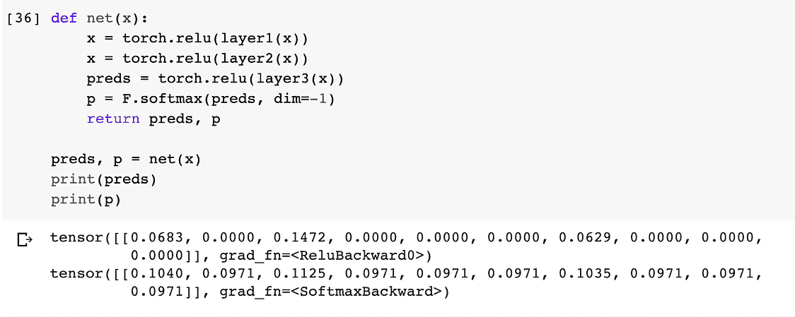

现在，想象一下我们想要欺骗网络，使其对输入 x 预测“5”。那么实现这一目标的方法是给它一个图像（x），计算图像的预测，然后**最大化**预测标签“5”的概率。

为了做到这一点，我们可以使用梯度上升来计算第 6 个索引（即：标签 = 5）（**p**）的预测梯度相对于输入**x**。

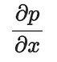

要在代码中做到这一点，我们将输入 x 作为参数传递给神经网络，选择第 6 个预测（因为我们有标签：0、1、2、3、4、5、……）第 6 个索引意味着标签“5”。

从视觉上看，这样：


预测“5”的梯度相对于输入的变化。

在代码中：

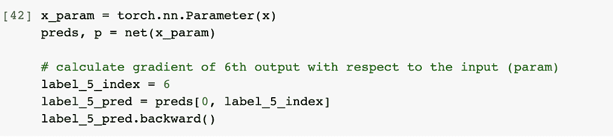

当我们调用 .backward() 时，发生的过程可以通过前面的动画进行可视化。

现在我们已经计算了梯度，我们可以对它们进行可视化和绘图：

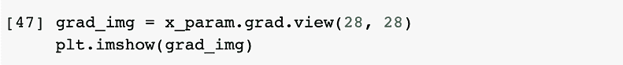

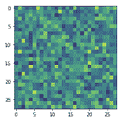

上述梯度看起来像随机噪声，因为网络尚未训练……然而，一旦我们对网络进行训练，梯度将会更具信息量：

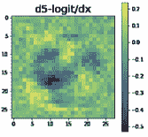

### 通过回调自动化这一过程

这是一个极其有用的工具，有助于揭示你的网络在训练过程中发生了什么。在这种情况下，我们希望自动化这个过程，使其在训练中自动发生。

为此，我们将使用 PyTorch Lightning 来实现我们的神经网络：

为了自动绘制我们在这里描述的内容，复杂的代码可以被抽象为 Lightning 中的一个回调。回调是一个在你可能关心的训练部分被调用的小程序。

在这种情况下，当一个训练批次被处理时，我们希望生成这些图像，以防一些输入出现混淆。

但... 我们通过 pytorch-lightning-bolts 使其变得更加简单，你只需安装它即可。

```py
pip install pytorch-lightning-bolts
```

并将回调导入你的训练代码中。

### 将所有内容汇总

最终，我们可以训练我们的模型，并在 logits 出现“混淆”时自动生成图像。

Tensorboard 将自动生成类似这样的图像：

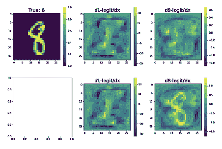

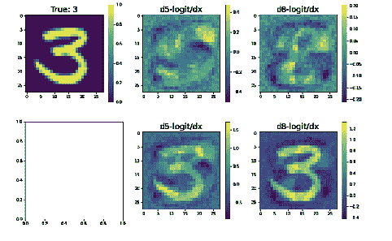

### 摘要

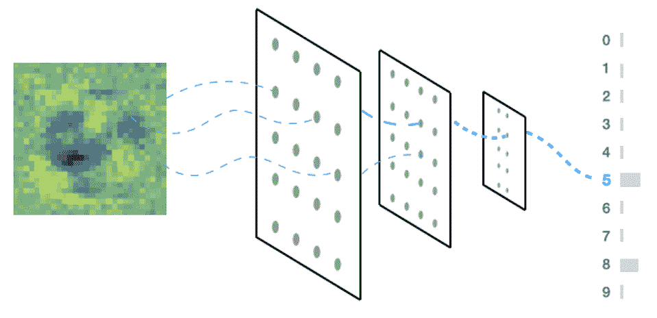

总结一下：你学会了如何使用 PyTorch 查看黑箱内部，了解了直觉，编写了一个 PyTorch Lightning 中的回调，并自动使你的 Tensorboard 实例绘制出可疑的预测。

亲自尝试一下 [PyTorch Lightning](https://github.com/PyTorchLightning/pytorch-lightning) 和 [PyTorch Lightning Bolts](https://github.com/PyTorchLightning/pytorch-lightning-bolts)。

（这篇文章是为了即将发布的视频而写的，在视频中我（威廉）和 [阿尔弗雷多·坎齐安](https://twitter.com/alfcnz) 将向你展示如何从零开始编写这些代码。）

**简介: [威廉·法尔肯](https://www.linkedin.com/in/wfalcon/)** 是一名 AI 研究员，且是 PyTorch Lightning 的创始人。他致力于理解大脑，构建 AI 并在大规模应用中使用它。

[原文](https://towardsdatascience.com/peering-inside-the-blackbox-how-to-trick-a-neural-network-757c90a88a73)。经许可转载。

**相关:**

+   PyTorch 多 GPU 指标库及 PyTorch Lightning 新版本中的更多内容

+   Pytorch Lightning 与 PyTorch Ignite 与 Fast.ai 比较

+   Lit BERT: NLP 转移学习的 3 个步骤

* * *

## 我们的前三个课程推荐

 1\. [Google 网络安全证书](https://www.kdnuggets.com/google-cybersecurity) - 快速进入网络安全职业生涯。

 2\. [Google 数据分析专业证书](https://www.kdnuggets.com/google-data-analytics) - 提升你的数据分析技能

 3\. [Google IT 支持专业证书](https://www.kdnuggets.com/google-itsupport) - 支持你的组织进行 IT

* * *

### 更多相关主题

+   [数据科学家招聘经理寻找的素质](https://www.kdnuggets.com/2022/04/qualities-hiring-managers-looking-data-scientists.html)

+   [深入了解 DeepMind 在利用深度学习推进数学领域的新努力](https://www.kdnuggets.com/2021/12/inside-deepmind-new-efforts-deep-learning-advance-mathematics.html)

+   [使用 AIMET 进行神经网络优化](https://www.kdnuggets.com/2022/04/qualcomm-neural-network-optimization-aimet.html)

+   [通过构建 15 个神经网络项目来学习深度学习（2022 年）](https://www.kdnuggets.com/2022/01/15-neural-network-projects-build-2022.html)

+   [使用 TensorFlow 和 Keras 构建和训练你的第一个神经网络](https://www.kdnuggets.com/2023/05/building-training-first-neural-network-tensorflow-keras.html)

+   [排列在神经网络预测中的重要性](https://www.kdnuggets.com/2022/12/importance-permutation-neural-network-predictions.html)
