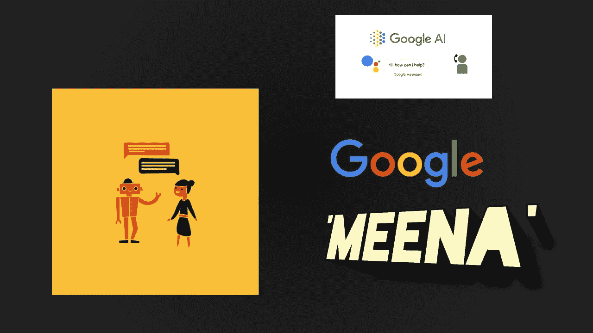
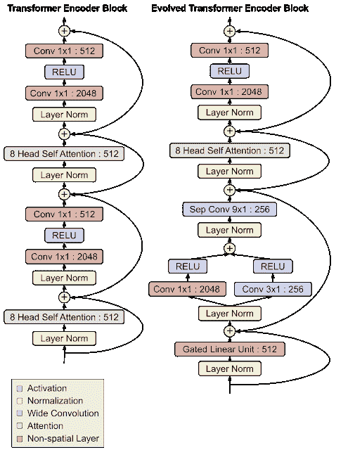
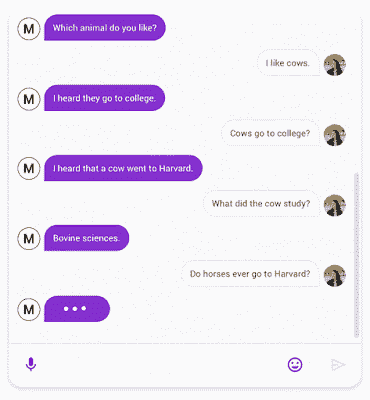

# 了解谷歌用于构建 Meena 的机器学习：一个可以讨论任何话题的聊天机器人

> 原文：[`www.kdnuggets.com/2020/02/inside-machine-learning-google-build-meena-chatbot.html`](https://www.kdnuggets.com/2020/02/inside-machine-learning-google-build-meena-chatbot.html)

评论

看起来每年谷歌都会计划通过在自然语言理解（NLU）系统方面取得新的惊人进展来震撼人工智能（AI）界。去年，[BERT 模型](https://ai.googleblog.com/2018/11/open-sourcing-bert-state-of-art-pre.html)无疑成为了 NLU 研究领域的头条新闻。2020 年刚开始几周，谷歌研究 [发布了一篇新论文介绍了 Meena，这是一种新的深度学习模型，可以支持与任何领域的对话的聊天机器人](https://arxiv.org/abs/2001.09977)。

NLU 是过去几年中最活跃的研究领域之一，迄今为止产生了一些最广泛采用的 AI 系统。然而，尽管取得了所有进展，大多数对话系统仍然高度限制于特定领域，这与我们作为人类能够自然地讨论不同话题的能力形成对比。在 NLU 理论中，这些专业化的对话代理被称为封闭域聊天机器人。另一种选择是一个新兴的研究领域，称为开放域聊天机器人，专注于构建可以讨论用户想聊的几乎任何话题的对话代理。如果有效，开放域聊天机器人可能是人性化计算机交互旅程中的一个关键部分。

尽管对开放域聊天机器人的兴奋不已，目前的实施尝试仍存在一些缺陷，这些缺陷阻碍了它们的普遍实用性：它们往往对开放式输入的回应不切实际，或给出模糊且通用的回答。通过 Meena，谷歌尝试解决这些挑战，构建一个可以讨论几乎任何话题的开放域聊天机器人。

在构建 Meena 之前，谷歌必须解决一个在开放域聊天机器人系统中经常被忽视的非平凡挑战。评估开放域聊天机器人质量的一个关键标准是其对话是否对人类感觉自然。这个想法似乎直观但也极其主观。我们如何测量对话的人类相似性？为了解决这个挑战，谷歌首先引入了一个新的指标，作为 Meena 聊天机器人的基石。

### Sensibleness and Specificity Average

Sensibleness and Specificity Average（SSA）是一种用于开放域聊天机器人的新指标，它捕捉了人类对话的一些基本但重要的属性。具体来说，SSA 试图量化人类对话的两个关键方面：

1.  讲得通。

1.  讲得具体。

合理性可以说涵盖了对话中类似人类的一些最基本的方面，如常识和逻辑连贯性。合理性还捕捉了聊天机器人的其他重要方面，如一致性。然而，仅仅合理是不够的。一个通用的回答（例如：“我不知道”）可能是合理的，但它也很无聊且不具体。这样的回答经常由仅依据合理性等度量标准进行评估的机器人生成。特异性是第二个有助于量化对话互动类似人类能力的度量标准。例如，A 说：“我喜欢网球”，而 B 回答：“那很好”，那么这个回答应该被标记为“不具体”。这个回答可以在几十种不同的上下文中使用。然而，如果 B 回答：“我也是，我对罗杰·费德勒爱不释手！”那么它被标记为“具体”，因为它与讨论的内容紧密相关。

***SSA →f（合理性，特异性）***

SSA 度量的实际数学公式相当复杂，但 Google 进行的初步实验显示了与聊天机器人类似度的强相关性。下图展示了不同聊天机器人（蓝点）的相关性。

在制定了一个可量化的度量标准来评估类似人类的能力之后，下一步是构建一个针对该度量标准优化的开放领域聊天机器人。

### Meena

Meena 是一个端到端的神经对话模型，能够学习对给定的对话上下文做出合理回应。令人惊讶的是，Meena 并不依赖全新的架构，而是利用了 Google 去年首创的进化 Transformer 架构（ET）。

### ET

正如其名称所示，ET 是对传统的[Transformer 架构](https://ai.googleblog.com/2017/08/transformer-novel-neural-network.html)的一种优化，这些架构在 NLU 任务中很常见。这些优化是通过对一系列在 NLU 场景中使用的 Transformer 模型应用神经架构搜索（NAS）得到的。

乍一看，ET 看起来与大多数 Transformer 神经网络架构相似。它有一个编码器，将输入序列编码为嵌入向量，还有一个解码器，使用这些嵌入向量来构建输出序列；在翻译的情况下，输入序列是待翻译的句子，输出序列是翻译结果。然而，ET 对 Transformer 模型做了一些有趣的改进。其中最有趣的是在编码器和解码器模块底部添加的卷积层，这些卷积层在两个地方以类似的分支模式添加。这种优化特别有趣，因为编码器和解码器架构在 NAS 过程中并不共享，因此这种架构被独立发现对编码器和解码器都有用，显示了这种设计的强大。原始 Transformer 完全依赖自注意力机制，而进化 Transformer 是一种混合架构，利用了自注意力和宽卷积的优点。

### Meena 和 ET

可以将 Meena 看作一个大规模的 ET 架构。Meena 具有一个 ET 编码器块和 13 个演化变换器解码器块，如下图所示。编码器负责处理对话上下文，以帮助 Meena 理解对话中已经说过的内容。然后，解码器利用这些信息来生成实际的回应。通过调整超参数，我们发现更强大的解码器是提高对话质量的关键。

Meena 展示的一个重要方面是，对于开放域聊天机器人而言，规模确实重要。几十年来，AI 研究界一直在争论，为了使模型能够与人类进行高质量的多轮对话，我们是否可以简单地将端到端模型扩大——通过增加更多的训练数据和提高参数数量——还是需要将这种模型与其他组件结合起来？Meena 显示，大规模的端到端模型可以在对话互动中实现类人的表现。

Meena 有多大？据报道，Meena 的第一个版本有 26 亿个参数，训练数据为 341 GB 的文本，这些文本来自公共领域的社交媒体对话。为了提供一个背景，与现有的最先进生成模型 [OpenAI GPT-2](https://openai.com/blog/better-language-models/) 相比，Meena 的模型容量大 1.7 倍，并且训练数据量是其 8.5 倍。

初步测试显示，Meena 能够在各种话题中进行对话，并达到了高水平的 SSA。

在 Meena 研究中最令人惊讶的发现之一是 SSA 量度与知名的 [困惑度](https://en.wikipedia.org/wiki/Perplexity) 在 NLU 模型中的性能指标之间存在的相关性。概念上，困惑度衡量语言模型的不确定性。困惑度越低，模型生成下一个令牌（字符、子词或单词）的信心就越高。在测试中，SSA 量度及其各个因素（特异性和合理性）与开放域聊天机器人的困惑度表现出强相关性。

鉴于其性能要求，Meena 对大多数组织来说都难以企及。然而，毫无疑问，Meena 代表了对话界面的一个重大里程碑。除了模型本身，Meena 还贡献了 SSA 量度，推动我们更接近评估聊天机器人互动的类人性。未来，我们应期待 SSA 量度中加入幽默或同理心等人类对话属性。同时，我们也应期待看到基于 Meena 一些原则的新开放域聊天机器人，推动下一代对话界面的发展。

[原文](https://towardsdatascience.com/inside-the-machine-learning-that-google-used-to-build-meena-a-chatbot-that-can-chat-about-anything-32e4d2242f79)。转载经许可。

**相关：**

+   让我们构建一个智能聊天机器人

+   NLP 与 NLU：从语言理解到处理

+   亚马逊利用自我学习教 Alexa 自我纠错

* * *

## 我们的前三个课程推荐

 1\. [谷歌网络安全证书](https://www.kdnuggets.com/google-cybersecurity) - 快速进入网络安全职业轨道

 2\. [谷歌数据分析专业证书](https://www.kdnuggets.com/google-data-analytics) - 提升你的数据分析技能

 3\. [谷歌 IT 支持专业证书](https://www.kdnuggets.com/google-itsupport) - 为你的组织提供 IT 支持

* * *

### 更多相关话题

+   [学习如何利用 ChatGPT 学习 Python（或其他任何东西）](https://www.kdnuggets.com/2023/02/learn-python-chatgpt.html)

+   [Segment Anything Model：图像分割的基础模型](https://www.kdnuggets.com/2023/07/segment-anything-model-foundation-model-image-segmentation.html)

+   [使用这些课程构建类似 ChatGPT 的聊天机器人](https://www.kdnuggets.com/2023/05/build-chatgptlike-chatbot-courses.html)

+   [使用 Hugging Face 和 Gradio 在 5 分钟内构建 AI 聊天机器人](https://www.kdnuggets.com/2023/06/build-ai-chatbot-5-minutes-hugging-face-gradio.html)

+   [深入了解 DeepMind 利用深度学习推进数学的新努力](https://www.kdnuggets.com/2021/12/inside-deepmind-new-efforts-deep-learning-advance-mathematics.html)

+   [聊天机器人转型：从失败到未来](https://www.kdnuggets.com/2021/12/chatbot-transformation-failure-future.html)
