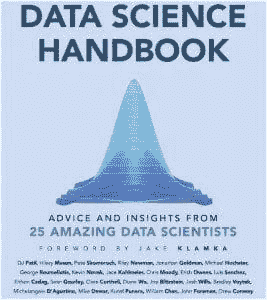

# 数据科学手册的见解

> 原文：[`www.kdnuggets.com/2015/05/insights-from-data-science-handbook.html`](https://www.kdnuggets.com/2015/05/insights-from-data-science-handbook.html)

**作者：瓦桑斯·戈帕尔。**

过去几年，我一直试图掌握包括分析、大数据、建模、预测、机器学习、算法、数据挖掘技术、规则、计算复杂性、延迟、数据产品、数据工程、统计推断、R 编程、数据整理、数据黑客、统计建模、监督学习/无监督学习、数据可视化、非结构化数据以及其他众多使数据科学世界丰富多彩的主题。有人说这个术语本身就是一个伞式术语。市面上有许多书籍详细讨论了上述某些主题，由各自的专家撰写。

* * *

## 我们的前三个课程推荐

 1\. [谷歌网络安全证书](https://www.kdnuggets.com/google-cybersecurity) - 快速进入网络安全职业轨道。

 2\. [谷歌数据分析专业证书](https://www.kdnuggets.com/google-data-analytics) - 提升数据分析技能

 3\. [谷歌 IT 支持专业证书](https://www.kdnuggets.com/google-itsupport) - 支持组织的 IT

* * *

当我拿起这本书……”数据科学手册”时，我感觉这会有所不同，并深刻地影响我。我必须承认，我对从数据中提取见解这一美丽艺术/科学的理解已经上升到了一个全新的水平。

**定义**

这本书对数据科学的定义有许多版本，例如乔什·威尔斯的定义，并且讨论从这里开始，他们如何从丰富的学术背景过渡到现实世界，在那里磨练技能，实践从复杂、顽固和嘈杂的数据集中提取信息、见解和信号的技艺，并创建能够吸引受众的数据产品，从而为进一步分析建立丰富的数据来源。

正是通过这些对话，我对这门科学的理解加深了，对继续追求这门技艺的渴望也得到增强。书中的每位艺术家对数据科学的定义都有自己的见解，但总体来看，他们似乎都同意数学/统计学、计算机科学和领域专业知识的交汇点。

**目标读者**

这本书的目标读者理想上可以是以下几类人

1.  一位有志成为数据科学家的

1.  一名实践型数据科学家

1.  一名数据科学家团队的领导者

1.  一位企业家或商业所有者

1.  一名对数据感兴趣的公民

正如我之前所说的，这 25 位艺术家来自不同领域，无法有比这份名单更好的背景代表。话虽如此，你会享受到一些深入的探讨，令人惊叹的是这些艺术家无缝地表演。无论是有志成为数据科学家的，还是精英，或者只是好奇者和鉴赏家，每个人都能找到适合自己的内容。

**过渡和升级**

这本书还涵盖了学习和升级实践数据科学所需技能的一个重要话题。从纯学术背景过渡到现实商业世界。像**由杰克·克拉姆卡创立的 Insight Data Science**这样的组织专门帮助博士后过渡到行业。另一方面，充满领域专业知识且热衷于追求这门艺术的有志数据科学家可以从**克莱尔·科瑟尔**的例子中获得启发，她通过在线学习 MOOCs 自主制定了数据科学的学习之旅。事实上，她还推出了一个数据科学课程——开放源代码数据科学硕士（OSDSM）计划。这些课程可以帮助你弥补学习和实践的差距。

OSDSM 是一个开源资源集合，将帮助你获得成为称职入门级数据科学家所需的技能。你可以在[这里](http://datasciencemasters.org/)访问课程。

你必须擅长在工作中和临时升级。

**Khan Academy 的数据科学家杰斯·科尔迈尔**在听完 Salman 的 TED 演讲后加入了公司，他在高频交易领域有金融背景，这为讨论学习新技能和在工作中了解数据科学的学习曲线提供了贡献……

> *学习新技术并应用它们的速度并不稳定；这确实是波动的。当我过渡到这个新的教育和互联网生成数据领域时，我经历了一段需要学习新建模技术的时期。我对概率图模型并不熟悉；这不是我在高频交易中使用的东西。一旦我克服了初始学习曲线，学习就很大程度上是波动的。会有一个非常具体和激励的需求或目标。*

最终，**哈佛大学教授乔·布利兹坦**在观察到……时一针见血。

> *你必须充满活力，努力工作，但不要因为不知道一切而感到灰心。*

**指标**

数据科学的指标取决于你的客户希望你解决的问题。正如**Palantir 的数据科学家黛安·吴**所说……

> *有些人可能需要流媒体解决方案，而另一些人则可能希望基于数据库中的信息建立静态模型。这些可以从一个到几个十几个不等。*

她说，在她的角色中，成功是非常可衡量的——*它是模型性能的准确性或精确度/召回率*。这也取决于你提出的问题，或是尝试找到正确的问题并用答案产生影响。

**勤奋**

这本书还触及了行业价值、辛勤工作和纪律的重要性。你必须准备好投入长时间的辛勤工作，不仅仅是在弥补数据科学理解上的空白，或是补充你工具箱中的某些缺失链接，也包括你正尝试解读的具体问题。**DJ Patil**，曾在 LinkedIn 领导数据科学团队，后来成为**美国首任首席数据科学家**——他在谈到这些问题时非常雄辩，他说……

> *当新数据科学家进入组织时，我首先告诉他们的是，他们最好是最早到达办公室的人，也是最后离开的人……你并不是因为某种神话般的“一万小时”理论而投入时间（我完全不认同这个观点，我认为这是错误的，因为它假设了线性序列学习，而不是加速的并行学习）。你投入时间是因为你可以了解很多拼凑在一起的不同事物。这就像炖菜，只有炖得久了才会变得美味。*

**找到相关问题和讲故事的艺术**

书中还强调了问题叙述的能力以及以故事形式传达解决方案的能力，同时保持激情和好奇心。这与通常的技能同样重要。**Hilary Mason**，纽约的科学家和**Fast Forward Labs**的创始人说……

> *对于你正在进行的每个数据项目，你需要问自己这些问题：你在做什么？我怎么知道什么时候完成？这会产生什么影响？*

她对有志成为数据科学家的人员提供了非常宝贵的建议……

> *尝试做一个能够发挥你优势的项目。一般来说，我将数据科学家的工作分为三类：统计、编码和讲故事/可视化。不论你最擅长哪一类，做一个能够突出这一优势的项目。然后，再做一个你最不擅长的项目。这能帮助你成长，学习新知识，并弄清楚你接下来需要学习的内容。从那里继续前进。*

**Mail Chimp 的数据科学家 John Foreman**在谈论……时提出了一个重要的观点。

> *对我来说，任何数据科学家应该具备的核心技能之一是与业务沟通的能力。依赖业务中的其他人积极识别问题并将其抛给数据科学家，而他或她被动等待接受工作是非常危险的。*

****摇滚明星****

**这些明星们…正如我在本文中已经提到的，你会发现这个名单是领域内谁是何人的激动人心的混合。*

*DJ Patil, Hilary Mason, Pete Skomoroch, Riley Newman, Jonathan Goldman, Michael Hochster, **George Roumeliotis, Kevin Novak, Jace Kohlmeier, Chris Moody, Erich Owens, Luis Sanchez, **Eithon Cadag, Sean Gourley, Clare Corthell, Diane Wu, Joe Blitzstein, Josh Wills, Bradley Voytek, **Michelangelo D’Agostino, Mike Dewar, Kunal Punera, William Chen, John Foreman, Drew Conway*

**结论**

这些艺术家的背景多样性使得这一领域非常有趣——无论是学术、职业还是领域方面，但将他们联系在一起的还是对满足饥饿状态的好奇心。这些艺术家让你思考和沉思。

为什么数据科学在今天的世界和经济中如此重要？

+   如何掌握编程、统计和领域专业知识这三大领域，成为一名有效的数据科学家？

+   如何从学术界或其他领域过渡到数据科学领域？

+   数据科学家的工作与统计学家和软件工程师有什么不同？他们如何协同工作？

+   评估公司数据科学职位时，你应该关注哪些方面？

+   建立一个有效的数据科学团队需要什么？

+   什么心态、技巧和能力将一位优秀的数据科学家与普通的区分开来？

+   数据科学的未来是什么样的？

除了上述的明星，你还可以关注那些在书中未被提及但同样为这个行业的发展辛勤工作的**大师**们。你可以通过谷歌搜索并通过推特或他们的网站跟随他们。

*Vincent Granville, Gregory Piatetsky, Kirk Borne, Eric Colson, Marck Vaisman, Milind Bhandarkar, Monica Rogati, Simon Zhang, Dean Abbot, Nate Silver*

你将永远不会错过他们的洞见和对你的点缀星光。

如果你的渴望还没有得到满足，你可以关注行业中前 50/100 名影响者和品牌的[list](http://www.onalytica.com/blog/posts/big-data-2015-top-100-influencers-and-brands/?utm_content=buffercd419&utm_medium=social&utm_source=twitter.com&utm_campaign=buffer)。

最后，我给你留下一颗来自[**书籍**](http://www.thedatasciencehandbook.com/)**的宝石…**这次来自**Sean Gourley，QUID 的联合创始人兼首席技术官**…**

> *我认为数据科学将真正成为一种产品设计过程；实际上是一种算法设计过程。算法获取信息并引导我们；无论是我们阅读的信息、听的音乐、喝咖啡的地方、遇见的朋友，还是我们生活中的更新。*

个人简介：[Vasanth Gopal](http://linkd.in/1HKTAdh) 是一位有志的数据科学家，拥有 25 年的制药行业销售经验以及 5 年的商业智能和高级分析经验。他目前正在通过 Coursera 攻读数据科学专业。

本文是经过修订的版本

[这篇文章](http://bit.ly/1FEeRI1)。

**相关**

+   数据科学中最常用、最令人困惑和最滥用的行话

+   真正的数据科学家请站出来

+   数据分析手册——与数据科学家和技术领袖的访谈，免费下载

### 更多相关主题

+   [LLM 手册：从业者的策略和技巧](https://www.kdnuggets.com/llm-handbook-strategies-and-techniques-for-practitioners)

+   [ChatGPT 驱动的数据探索：解锁数据集中的隐藏洞察](https://www.kdnuggets.com/2023/07/chatgptpowered-data-exploration-unlock-hidden-insights-dataset.html)

+   [CDC 数据复制：技术、权衡、洞察](https://www.kdnuggets.com/2023/08/cdc-data-replication-techniques-tradeoffs-insights.html)

+   [将非结构化数据转化为结构化洞察的 5 种方法](https://www.kdnuggets.com/5-ways-of-converting-unstructured-data-into-structured-insights-with-llms)

+   [解锁数据洞察：有效分析的关键 Pandas 函数](https://www.kdnuggets.com/unlocking-data-insights-key-pandas-functions-for-effective-analysis)

+   [影响洞察时间的关键因素](https://www.kdnuggets.com/2023/03/key-factors-affecting-time-insights.html)**
