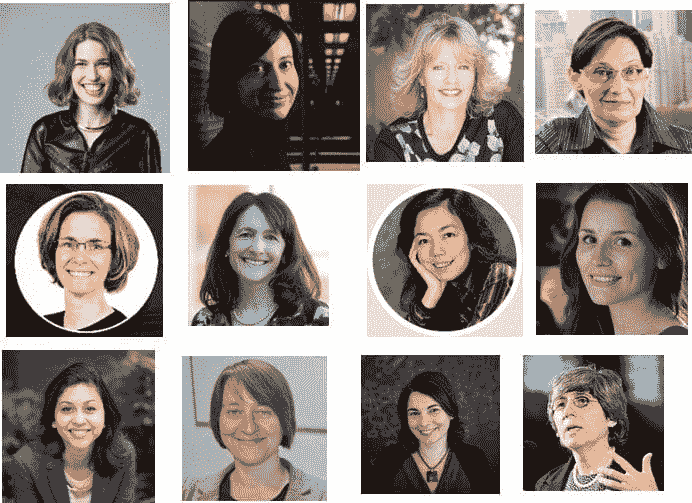

# 18 位令人鼓舞的 AI、大数据、数据科学、机器学习领域的女性

> 原文：[`www.kdnuggets.com/2018/03/inspiring-women-ai-big-data-science.html`](https://www.kdnuggets.com/2018/03/inspiring-women-ai-big-data-science.html)

 评论

女性在 STEM（科学、技术、工程和数学）领域中的代表性不足。例如，1960 年女性在计算机和数学职业中的比例为 27%。然而，尽管更多女性进入劳动力市场，经过几十年，这一比例在 2013 年下降到了 26%，根据[2015 年美国人口普查数据分析](http://www.aauw.org/research/solving-the-equation/)。

然而，我们希望 STEM 领域的女性数量能够增加，为了庆祝国际妇女节，以下是 18 位在 AI、分析、大数据、数据科学、机器学习和机器人技术领域的令人鼓舞的女性的简介。

* * *

## 我们的前三个课程推荐

 1\. [Google 网络安全证书](https://www.kdnuggets.com/google-cybersecurity) - 快速进入网络安全职业轨道。

 2\. [Google 数据分析专业证书](https://www.kdnuggets.com/google-data-analytics) - 提升您的数据分析技能

 3\. [Google IT 支持专业证书](https://www.kdnuggets.com/google-itsupport) - 支持您的组织的 IT 需求

* * *

1.  [Carrie Grimes Bostock](https://research.google.com/pubs/author31907.html)，谷歌的杰出工程师。Grimes 的职业生涯一直在谷歌，她目前在技术研究所小组中从事数据驱动的资源规划、成本分析和分布式集群管理软件的工作。Grimes 拥有斯坦福大学统计学博士学位和哈佛大学人类学学士学位。

1.  [Meta S. Brown](http://www.metabrown.com/)、[@metabrown312](https://twitter.com/metabrown312) 是一位顾问、演讲者和作家，致力于推广商业分析的使用。作为一名实操分析师，她曾处理过高达 9 亿美元的项目，是前沿商业分析领域的公认专家。

1.  [詹妮弗·查耶斯](https://www.linkedin.com/in/jennifer-chayes-6328145) [@jenniferchayes](https://twitter.com/jenniferchayes) 是微软研究院的杰出科学家和执行董事。查耶斯在女性大数据活动的职业面板讨论中表示：“你不应该让对自己能力的恐惧或担心自己可能是冒名顶替者的恐惧影响你所做的决策。你应该把大脑中的那部分放在一边，对它说谢谢你分享。我们都有这部分大脑，如果我听从了那部分大脑的声音，我的人生会非常无聊。”查耶斯拥有普林斯顿大学的数学物理学博士学位。

1.  [西尔维亚·基亚帕](http://silviac.yolasite.com/) [@csilviavr](https://twitter.com/csilviavr) 是 DeepMind 的高级研究科学家，工作领域包括概率建模和深度学习。在加入 DeepMind 之前，她曾在微软研究院剑桥分院、剑桥大学统计实验室和马克斯·普朗克生物控制理论研究所工作。

1.  [吉尔·戴奇](https://jilldyche.com/) [@jilldyche](https://twitter.com/jilldyche) 是 SAS 研究所最佳实践副总裁。她是几本书的作者，包括最近的一本《新 IT：技术领导者如何在数字时代推动商业战略》。戴奇目前正在进行一个副项目，撰写一本电子书，倡导简单改进动物收容所的做法，以提高宠物领养率。

1.  贾娜·埃格斯 [@jeggers](https://twitter.com/jeggers) 是 Nara Logics 的首席执行官，这是一家受神经科学启发的人工智能公司，提供推荐和决策支持平台。她的职业生涯从三人企业起步，发展到 50,000 人的大企业。她曾在美国航空公司开设欧洲物流软件办公室，1996 年在 Lycos 涉足互联网，创办了 Intuit 的企业创新实验室，帮助 Spreadshirt 定义了大规模定制，并在洛斯阿拉莫斯国家实验室研究导电聚合物。

1.  卡拉·金特里 [@data_nerd](https://twitter.com/data_nerd) 是社交媒体上顶尖的数据科学影响者之一。她目前是 Samtec 的数字营销经理。她曾与许多财富 500 强公司合作。她能够处理庞大复杂的数据库，解读业务需求，并提供量化支出、利润和趋势的情报。被称为数据狂人是这位好奇的数学家/经济学家的勇气象征，因为知识就是力量，而公司现在也开始认识到这一点。

1.  [Nikita Johnson](https://www.linkedin.com/in/nikitaljohnson/)，[@nikitaljohnson](https://twitter.com/nikitaljohnson)，是 RE•WORK 的创始人，该公司组织活动，将跨学科的行业、初创公司和学术界结合在一起，探讨新兴技术（特别是人工智能）的最新进展及其对解决社会挑战的影响。

1.  [李飞飞](http://vision.stanford.edu/feifeili/)，[@drfeifei](https://twitter.com/drfeifei)，是斯坦福大学计算机科学系副教授，斯坦福人工智能实验室和斯坦福视觉实验室的主任。在这些实验室中，她与来自世界各地的最杰出的学生和同事们一起工作，构建能够使计算机和机器人具备视觉和思维能力的智能算法，并开展认知和神经影像实验，以揭示大脑如何看待和思考问题。她获得了加州理工学院的博士学位。

1.  [Hilary Mason](https://www.linkedin.com/in/hilarymason/)，[@hmason](https://twitter.com/hmason)，是 Cloudera 的研究副总裁。她还是 Fast Forward Labs 的创始人，这是一家机器智能研究公司，并曾担任 Accel 的数据科学家驻场专家和 bitly 的首席科学家。她热爱数据和芝士汉堡。

1.  [Karen Matthys](https://profiles.stanford.edu/karen-matthys)，计算与数学工程研究所 (ICME) 的执行主任。她正在推进 30by30 活动，旨在到 2030 年，将计算机科学和工程领域各级组织中的女性比例提高到 30%。

1.  Neha Narkhede, [@nehanarkhede](https://twitter.com/nehanarkhede)，是 Confluent 的联合创始人兼首席技术官，该公司推动了一款流行的大数据工具——Apache Kafka，该技术是在所有联合创始人都在 LinkedIn 工作时开发的，支持实时流处理功能。

1.  Amy O'Connor，[@ImAmyO](https://twitter.com/ImAmyO)，是 Cloudera 的大数据布道者。她于 2013 年加入了 Hadoop 分销商 Cloudera，此前她在诺基亚担任大数据高级总监。在 Cloudera 的职位中，她为客户引入和采用大数据解决方案提供咨询。她拥有康涅狄格大学电气工程学士学位和东北大学 MBA 学位。

1.  [Megan Price](https://hrdag.org/people/megan-price-phd/)，人权数据分析集团的执行主任 [@hrdag](https://twitter.com/hrdag)。她的组织利用统计分析揭示证据，以推动行动和变革。该组织曾在包括危地马拉、哥伦比亚和叙利亚在内的多个项目中工作。在叙利亚项目中，Price 担任首席统计师，并撰写了联合国人权事务高级专员办公室委托的两份关于该国记录在案死亡的近期报告。她是卡内基梅隆大学人权科学中心的研究员，获得了生物统计学博士学位。

1.  莫妮卡·罗加蒂，[@mrogati](https://twitter.com/mrogati)，Data Collective 的股权合伙人，Insight Data Science 的顾问。莫妮卡曾是可穿戴设备公司 Jawbone 的数据副总裁，也曾是 LinkedIn 的数据科学家。如今，她专注于向 Data Collective 风险投资集团提供技术尽职调查和建议，并担任 Insight Data Science Fellows Program 的顾问，该项目是一个旨在弥合学术界与数据科学职业之间差距的博士后培训奖学金项目。

1.  [凯特琳·斯莫尔伍德](https://www.linkedin.com/in/caitlinsmallwood)，Netflix 的科学与算法副总裁。她领导着一个由数学家、数据科学家和统计学家组成的高级团队，该团队专注于预测建模、算法研究和原型设计以及公司内的其他深度分析。她的职业生涯包括在 Yahoo 担任数据解决方案总监以及在普华永道担任定量咨询高级经理的工作。

1.  [凯利·汤普森](https://www.linkedin.com/in/kelly-thompson-9836204)，沃尔玛电子商务全球品类发展与商品解决方案高级副总裁。汤普森负责指导沃尔玛的战略、结构和运营模式，将商品销售与数据和分析结合起来。尽管沃尔玛是世界上最大的公司之一，人们通常认为大公司行动缓慢，但汤普森表示，她的组织实际上正在这个大公司内部建立更具敏捷性的东西。

1.  [马努埃拉·玛利亚·维洛索](https://en.wikipedia.org/wiki/Manuela_M._Veloso) 是卡内基梅隆大学计算机科学学院的赫伯特·A·西蒙大学教授。她曾是 AAAI 的主席，直到 2014 年，并且是 RoboCup 联合会的共同创始人和前主席。她是 AAAI、IEEE、AAAS 和 ACM 的院士。她是人工智能和机器人技术领域的国际专家。

本文部分内容曾 在 KDnuggets 上发表。

**相关：**

+   停止招聘数据科学家，直到你为数据科学做好准备

+   我们为什么需要更多女性参与大数据的 4 个理由

+   女性分析师书籍作者 – 元数据列表

### 相关主题

+   [成为一名出色数据科学家所需的 5 项关键技能](https://www.kdnuggets.com/2021/12/5-key-skills-needed-become-great-data-scientist.html)

+   [每个初学数据科学者都应该掌握的 6 个预测模型](https://www.kdnuggets.com/2021/12/6-predictive-models-every-beginner-data-scientist-master.html)

+   [2021 年最佳 ETL 工具](https://www.kdnuggets.com/2021/12/mozart-best-etl-tools-2021.html)

+   [停止学习数据科学来寻找目标，而是寻找目标来…](https://www.kdnuggets.com/2021/12/stop-learning-data-science-find-purpose.html)

+   [学习数据科学统计的最佳资源](https://www.kdnuggets.com/2021/12/springboard-top-resources-learn-data-science-statistics.html)

+   [建立一个强大的数据团队](https://www.kdnuggets.com/2021/12/build-solid-data-team.html)
