# 启动 Python：在 Windows 上安装 Anaconda

> 原文：[`www.kdnuggets.com/2020/02/install-python-anaconda-windows.html`](https://www.kdnuggets.com/2020/02/install-python-anaconda-windows.html)

评论

**由 [Michael Galarnyk](https://www.linkedin.com/in/michaelgalarnyk/)，数据科学家**

这是 [更新视频](https://youtu.be/uOwCiZKj2rg) 的 [之前教程](https://medium.com/@GalarnykMichael/install-python-on-windows-anaconda-c63c7c3d1444)。

* * *

## 我们的前三大课程推荐

 1\. [谷歌网络安全证书](https://www.kdnuggets.com/google-cybersecurity) - 快速进入网络安全职业生涯

 2\. [谷歌数据分析专业证书](https://www.kdnuggets.com/google-data-analytics) - 提升你的数据分析技能

 3\. [谷歌 IT 支持专业证书](https://www.kdnuggets.com/google-itsupport) - 支持你的组织的 IT

* * *

Anaconda 是一个包管理器、环境管理器和 Python 发行版，包含了许多开源包（如 numpy、scikit-learn、scipy、pandas 等）。如果你在安装 Anaconda 后需要额外的包，可以使用 Anaconda 的包管理器 conda 或 pip 来安装这些包。这非常有利，因为你无需自己管理多个包之间的依赖关系。Conda 甚至可以轻松切换 Python 2 和 3（你可以在 [这里](https://towardsdatascience.com/environment-management-with-conda-python-2-3-b9961a8a5097) 了解更多）。事实上，安装 Anaconda 也是安装 Jupyter Notebooks 的一种常见方式。

本教程包括：

+   如何在 Windows 上下载和安装 Anaconda

+   如何测试你的安装

+   如何修复常见的安装问题

+   安装 Anaconda 后该做的事情。

如往常一样，欢迎在此处或在 [YouTube 视频页面](https://youtu.be/uOwCiZKj2rg) 上提问。好了，我们开始吧！

### 下载并安装 Anaconda

1\. 访问 [Anaconda 网站](https://www.anaconda.com/download/#windows) 并选择 Python 3.x 图形安装程序 (A) 或 Python 2.x 图形安装程序 (B)。如果你不确定要安装哪个 Python 版本，选择 Python 3\. 不要选择两个版本。

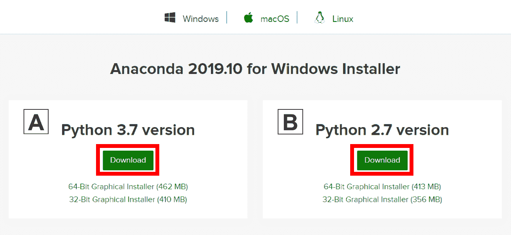

2\. 查找你的下载文件。

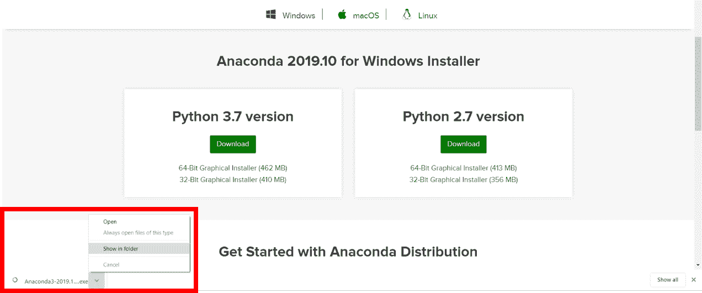

理想情况下，你应该以管理员身份打开/运行文件。

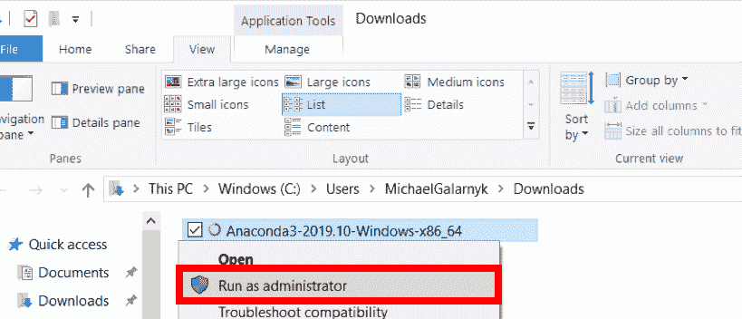

以管理员身份安装是为了在你没有权限在希望的位置安装 Anaconda 或将 Anaconda 添加到你的路径时使用。

当屏幕出现如下内容时，点击“下一步”。

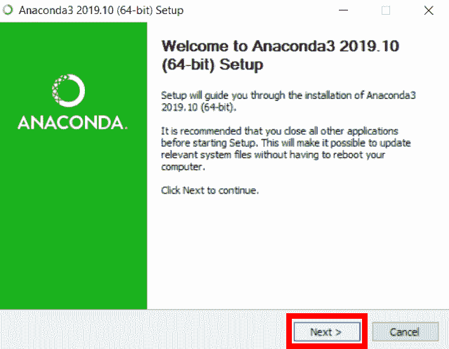

阅读许可协议并点击“我同意”。

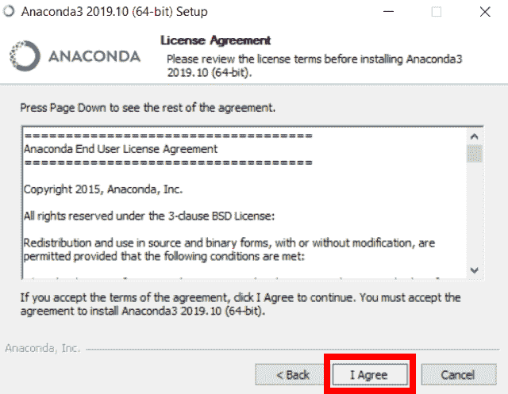

4\. 选择 Just Me（推荐）或 All Users。

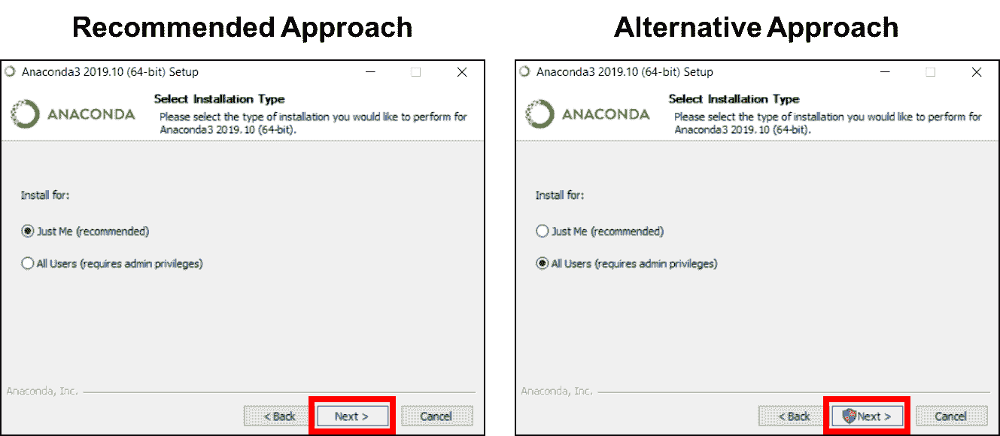

如果你不确定选择哪个，选择 Just Me，因为这样可以减轻没有管理员权限时可能出现的问题。

5\. 请记下你的安装位置（1），然后点击 Next（2）。


你的安装位置可能有所不同，因此请记住你安装了 Anaconda 的位置。在左侧示例图片中，路径类似于你在第 4 步中选择“Just Me”时的路径。在右侧示例图片中，路径类似于你在第 4 步中选择“All Users”时的路径。

6\. 这是安装过程中的一个重要部分。推荐的方法是不要勾选（1）将 Anaconda 添加到你的路径。这意味着你需要在需要使用 Anaconda 时使用 Anaconda Navigator 或 Anaconda Command Prompt（在“开始菜单”下的“Anaconda”中）。如果你想在命令提示符中使用 Anaconda，请使用另一种方法并勾选此框。点击 Install（2）。

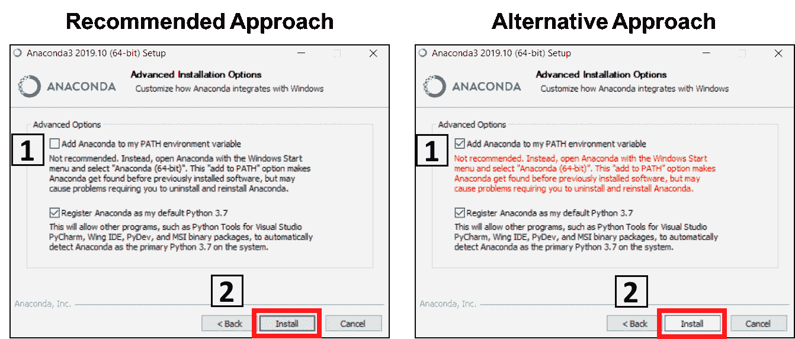

这很重要。考虑你在这一步中所做的事情。

7\. 点击 Next。

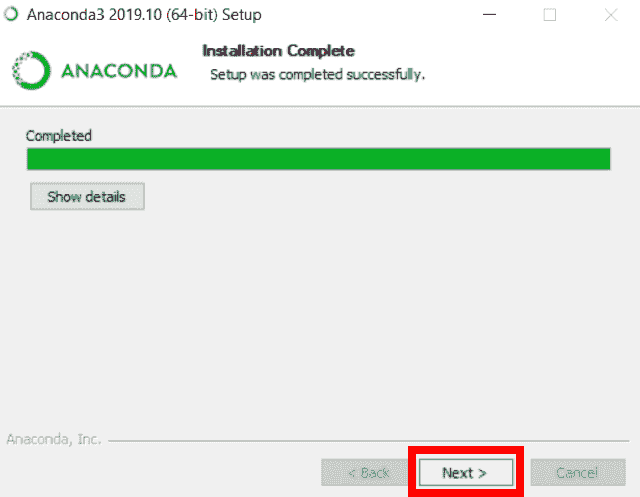

8\. 如果你愿意，可以安装 PyCharm，但这是可选的。点击 Next。

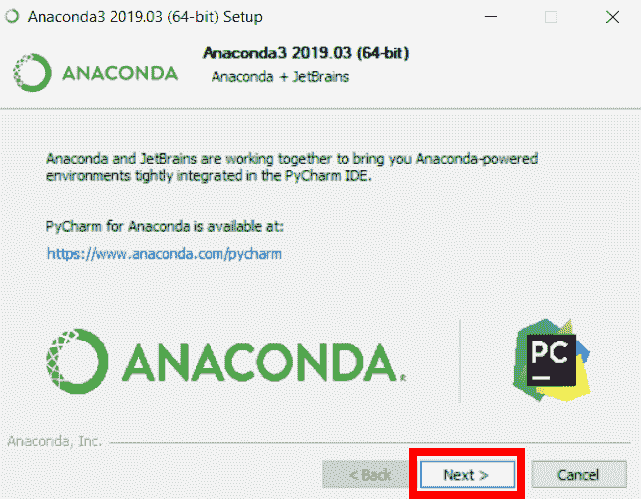

如果你想了解如何在 Anaconda 中使用 PyCharm，可以查看我在[这里](https://medium.com/@GalarnykMichael/setting-up-pycharm-with-anaconda-plus-installing-packages-windows-mac-db2b158bd8c)的旧教程。

9\. 点击 Finish。

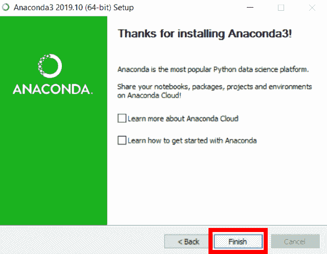

### 如何测试你的安装

测试安装的一个好方法是打开 Jupyter Notebook。你可以通过 Anaconda Prompt 或 Anaconda Navigator 完成。如果迷路了，我建议在另一个标签页中打开下面的[视频](https://youtu.be/uOwCiZKj2rg?t=200)。

### Anaconda Navigator

1\. 定位到 Anaconda Navigator 并点击 Anaconda Navigator。

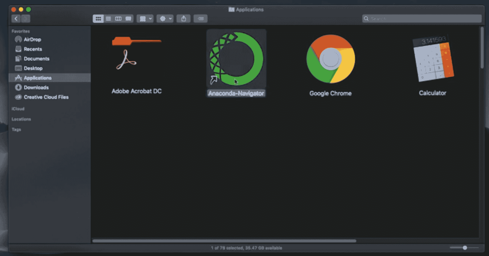

图片来源：[`www.linkedin.com/learning/python-for-data-visualization`](https://www.linkedin.com/learning/python-for-data-visualization/value-of-data-visualization)

2\. 在 Jupyter Notebook 下，点击 Launch。


图片来源：[`www.linkedin.com/learning/python-for-data-visualization`](https://www.linkedin.com/learning/python-for-data-visualization/value-of-data-visualization)

### Anaconda Prompt

1\. 定位到 Anaconda Prompt。

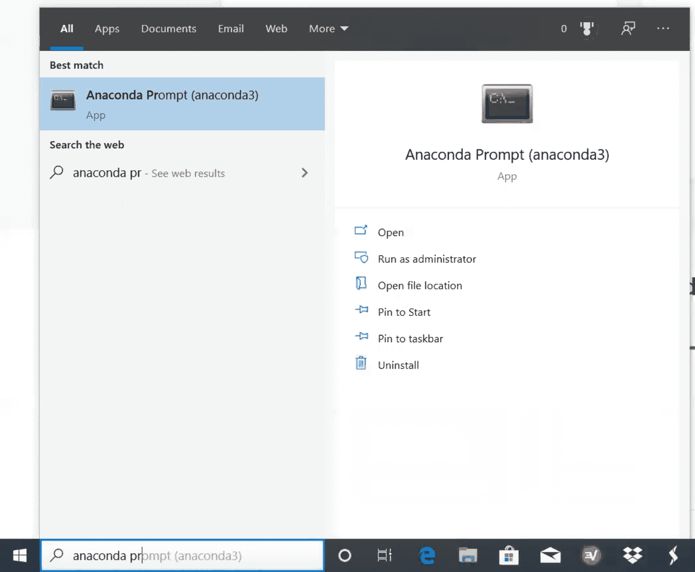

2\. 输入以下命令以查看你是否可以启动 Jupyter（IPython）Notebook。

```py
jupyter notebook
```

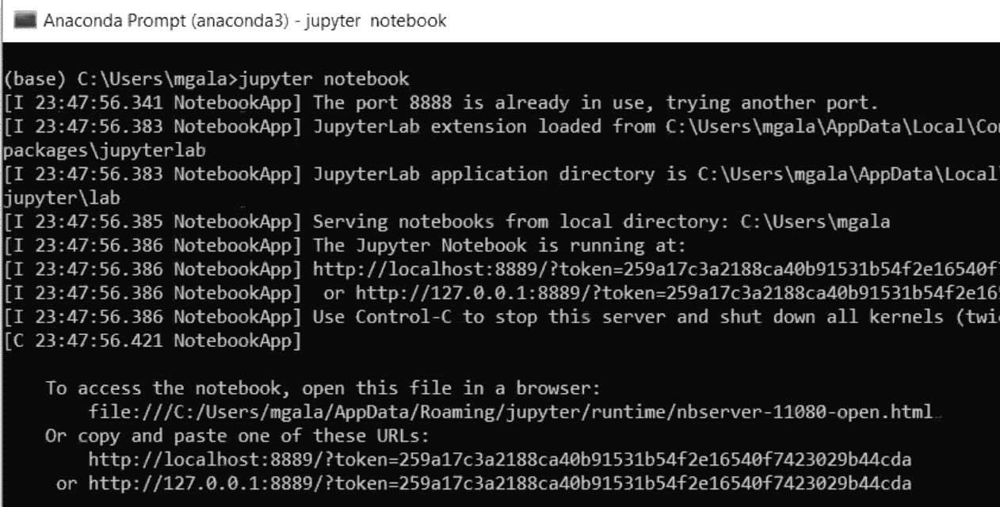

### 将 Anaconda 添加到 Path（可选）

这是一个 **可选** 步骤。这适用于你没有勾选第 6 步中的框，现在想要将 Anaconda 添加到你的 PATH 中的情况。这样做的好处是你可以在命令提示符中使用 Anaconda。

1. 打开命令提示符。

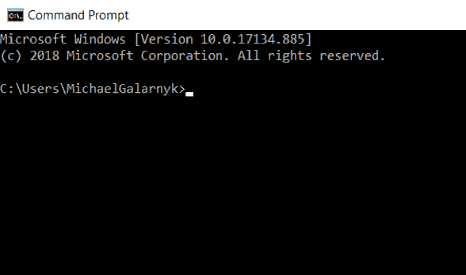

2. 检查你是否已经将 Anaconda 添加到你的路径中。将以下命令输入到你的 **命令提示符** 中。这是检查你是否已经将 Anaconda 添加到路径中的方法。如果你收到类似下图左侧的 **未识别的命令** 错误，请继续进行第 3 步。如果你得到类似下图右侧的输出，则表示你已经将 Anaconda 添加到路径中了。

```py
jupyter notebook
```


3. 如果你不知道你的 conda 和/或 python 的位置，打开一个 **Anaconda Prompt** 并输入以下命令。这可以告诉你 conda 和 python 在你计算机上的位置。

```py
where condawhere python
```

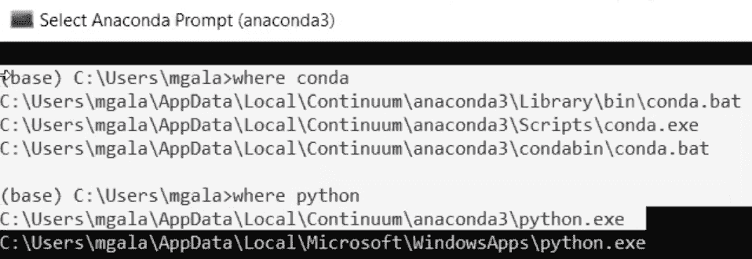

4. 将 conda 和 python 添加到你的 PATH 中。你可以通过进入系统或环境变量，将步骤 3 的输出添加到你的 PATH 中来完成这一操作。在操作过程中请参考视频（请注意，这可能会根据你的 Windows 版本有所不同）。

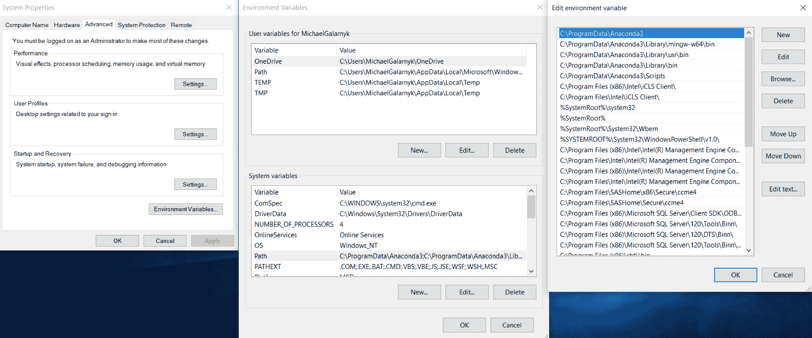

根据你使用的 Windows 版本，你的屏幕可能会有所不同。

5. 打开一个 **新的命令提示符**。尝试在 **命令提示符** 中输入 `conda --version` 和 `python --version` 以检查是否一切正常。你还可以尝试打开一个 Jupyter Notebook 进行检查。

### 其他常见问题

我已经尽力复制、解决了一些常见问题。以下是一些问题和我找到的一些解决方案。

### Jupyter 未被识别

如果你收到 jupyter 未被识别、python 未被识别或类似错误，则很可能是路径问题。请参见“添加 Anaconda 到路径（可选）”部分。

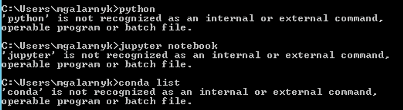

### EnvironmentNotWritableError：当前用户没有对目标环境的写权限。环境位置：C:\ProgramData\Anaconda3

虽然在安装 Anaconda 后安装库时出现了图像中的错误，但请记住，在安装 Anaconda 时（特别是如果你在下载和安装 Anaconda 的第 4 步中点击了“所有用户”），也有可能出现这种错误。如果你遇到了这个错误并且想要安装库，请以管理员身份打开你的命令提示符/Anaconda Prompt 或 Anaconda Navigator 来安装你的包。

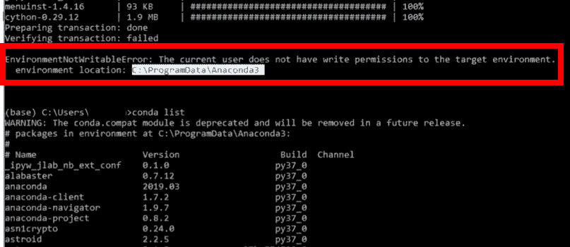

### DLL 加载失败：找不到指定的模块

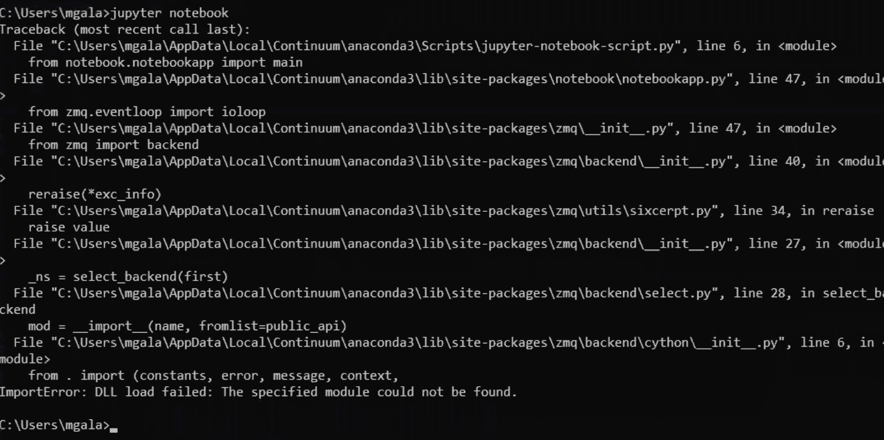

这是因为没有将所有内容添加到路径环境变量中。我猜测你可能没有将 condabin 或 bin 添加到你的路径中。

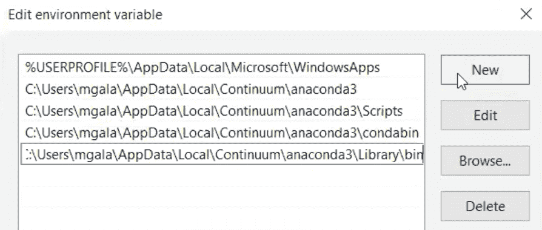

### 结论

本教程提供了一个关于如何在 Windows 上安装 Anaconda 以及如何处理常见安装问题的快速指南。如果你想了解更多关于 Anaconda 的信息，可以在 [这里](https://towardsdatascience.com/environment-management-with-conda-python-2-3-b9961a8a5097) 学习。如果你不确定如何开始在计算机上编程，这里有几个资源：

+   [字符串](https://codeburst.io/python-basics-1-hello-world-and-strings-de0d17857c93)，[列表](https://towardsdatascience.com/python-basics-6-lists-and-list-manipulation-a56be62b1f95)，[元组](https://medium.com/@GalarnykMichael/python-tuples-and-tuple-methods-4817a6bb6fff)，[字典](https://medium.com/@GalarnykMichael/python-basics-10-dictionaries-and-dictionary-methods-4e9efa70f5b9)

+   [使用 Python 的数据可视化课程（Pandas，Matplotlib，Seaborn）](https://www.linkedin.com/learning/python-for-data-visualization/value-of-data-visualization)

如果你对教程有任何问题或想法，欢迎在下面的评论中或通过 [Twitter](https://twitter.com/GalarnykMichael) 联系我。

**个人简介：[Michael Galarnyk](https://www.linkedin.com/in/michaelgalarnyk/)** 是一名数据科学家和企业培训师。他目前在斯克里普斯转化研究所工作。你可以在 Twitter (https://twitter.com/GalarnykMichael)、Medium (https://medium.com/@GalarnykMichael) 和 GitHub (https://github.com/mGalarnyk) 上找到他。

[原文](https://medium.com/@GalarnykMichael/install-python-anaconda-on-windows-2020-f8e188f9a63d)。经许可转载。

**相关：**

+   Python 元组及其方法

+   Python 列表及其操作

+   理解 Python 中的决策树分类

### 更多相关话题

+   [来自 Anaconda 的新消息！数据科学培训和云托管笔记本](https://www.kdnuggets.com/2022/11/anaconda-new-anaconda-data-science-training-cloud-hosted-notebooks.html)

+   [Snapdragon 上的 Windows 将混合 AI 带到边缘应用](https://www.kdnuggets.com/qualcomm-windows-on-snapdragon-brings-hybrid-ai-to-apps-at-the-edge)

+   [用 Anaconda 精通数据科学](https://www.kdnuggets.com/2023/01/anaconda-master-data-science-anaconda.html)

+   [如何入门 SQL - 免费学习资源列表](https://www.kdnuggets.com/2022/10/get-running-sql-list-free-learning-resources.html)

+   [在本地 CPU 上运行小型语言模型的 7 个步骤](https://www.kdnuggets.com/7-steps-to-running-a-small-language-model-on-a-local-cpu)

+   [在 Google Colab 上免费运行 Mixtral 8x7b](https://www.kdnuggets.com/running-mixtral-8x7b-on-google-colab-for-free)
