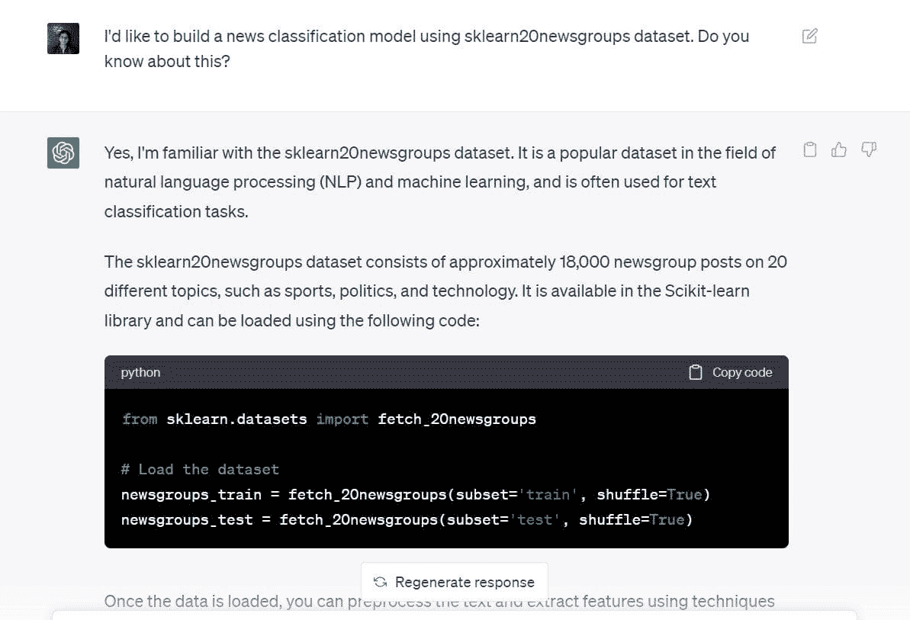
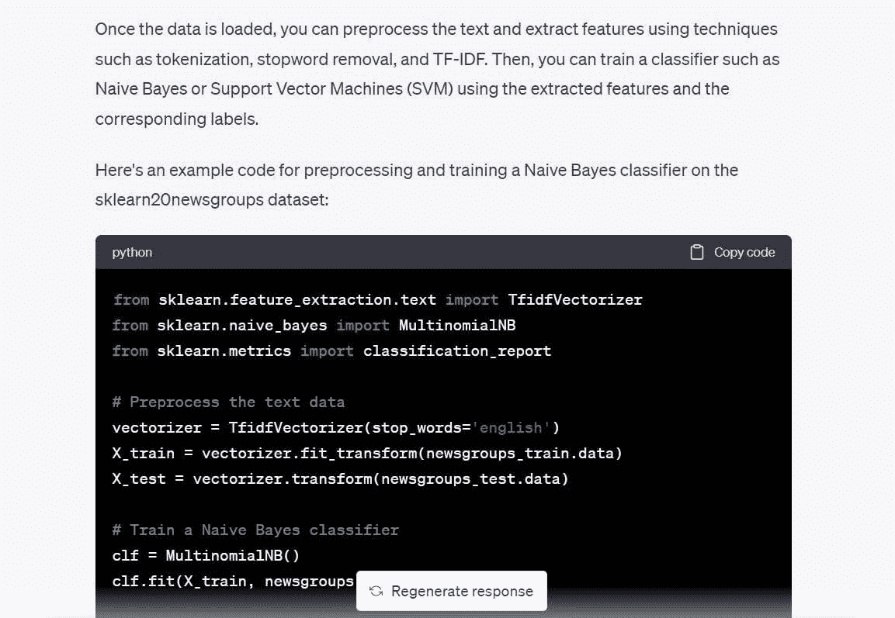
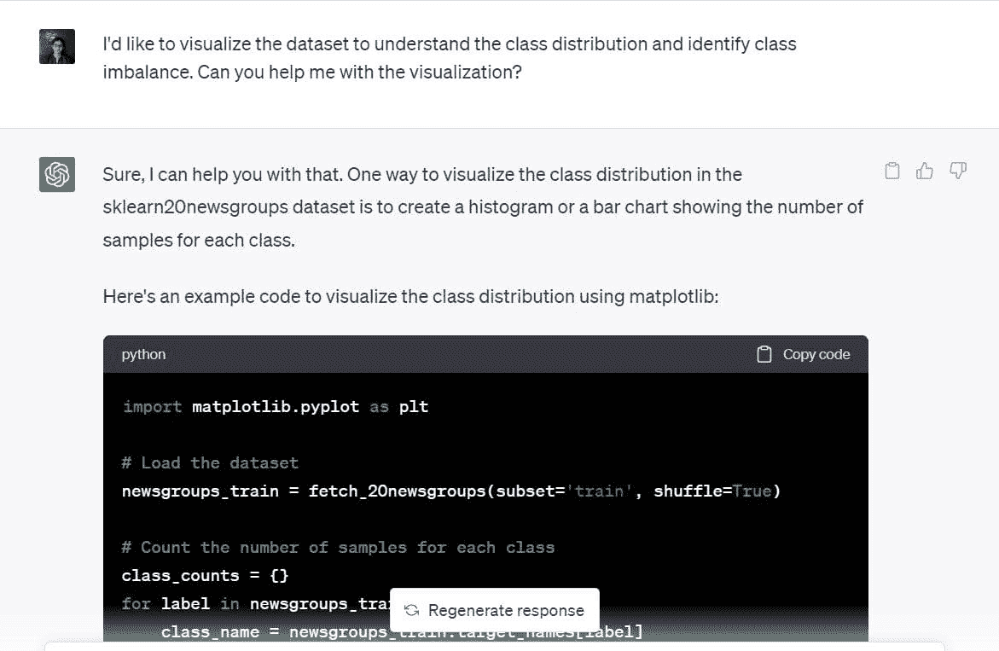
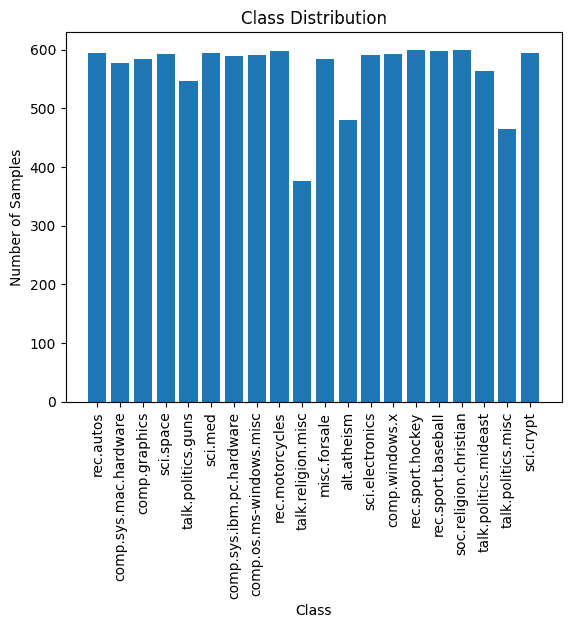
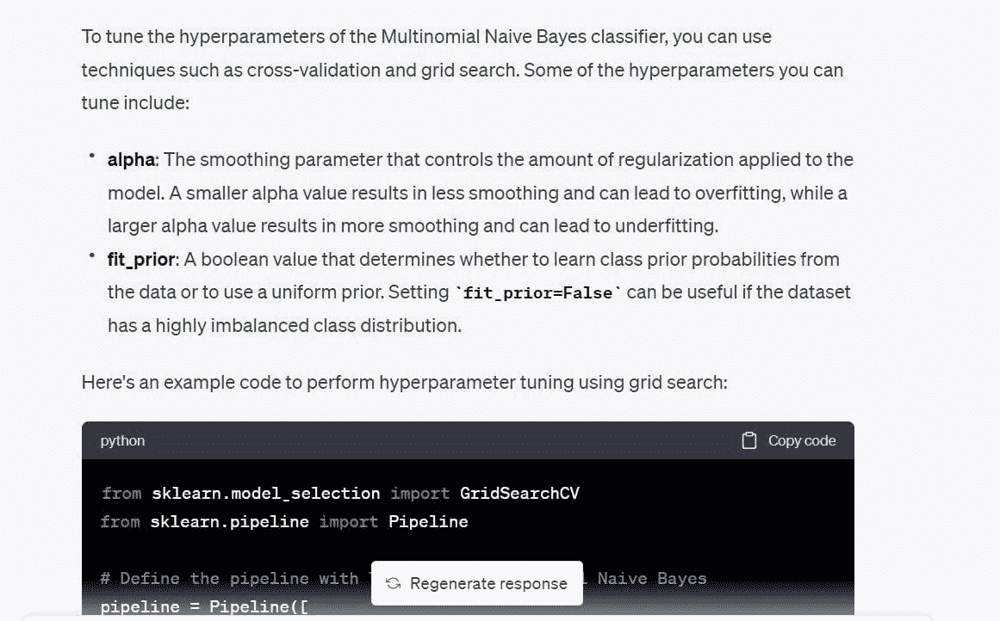
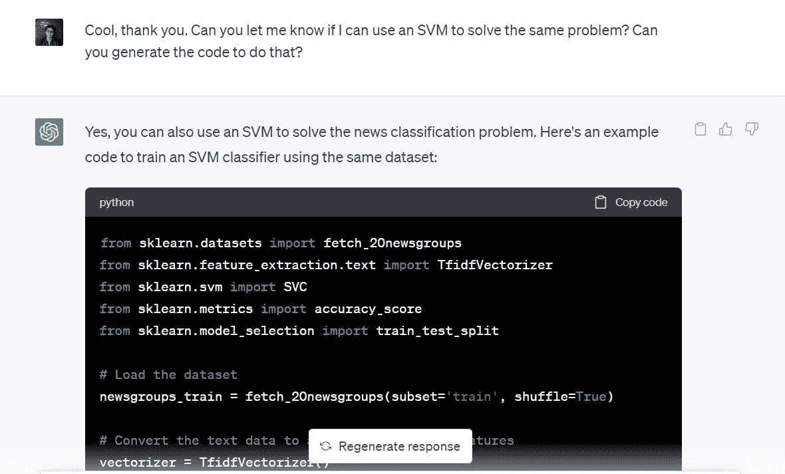
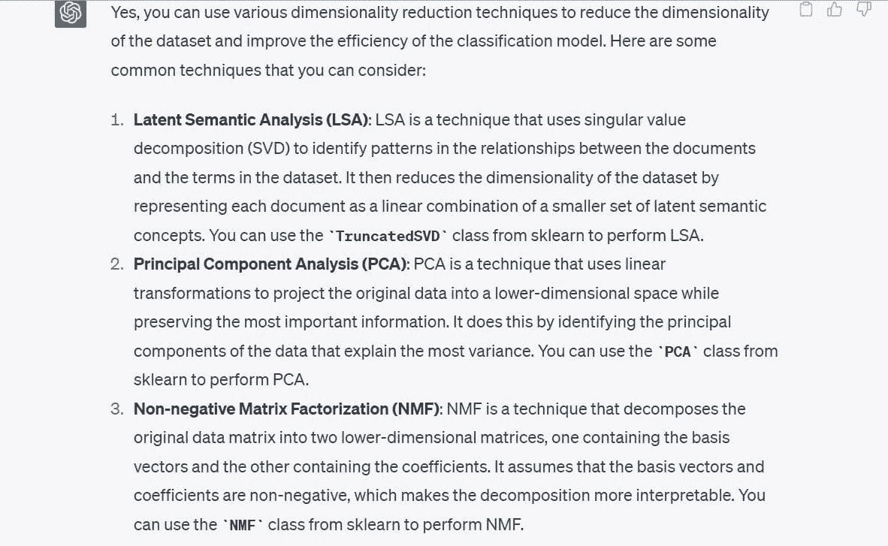

# 将 ChatGPT 集成到数据科学工作流程中：技巧和最佳实践

> 原文：[`www.kdnuggets.com/2023/05/integrating-chatgpt-data-science-workflows-tips-best-practices.html`](https://www.kdnuggets.com/2023/05/integrating-chatgpt-data-science-workflows-tips-best-practices.html)


作者提供的图片

ChatGPT、其继任者 GPT-4 以及它们的开源替代品都取得了极大的成功。开发者和数据科学家都希望提高生产力，并利用 ChatGPT 简化日常任务。

* * *

## 我们的前三个课程推荐

 1\. [谷歌网络安全证书](https://www.kdnuggets.com/google-cybersecurity) - 快速进入网络安全职业生涯。

 2\. [谷歌数据分析专业证书](https://www.kdnuggets.com/google-data-analytics) - 提升你的数据分析技能

 3\. [谷歌 IT 支持专业证书](https://www.kdnuggets.com/google-itsupport) - 支持你组织的 IT 需求

* * *

在这里，我们将通过与 ChatGPT 的配对编程会话来探讨如何使用 ChatGPT 进行数据科学。我们将建立一个文本分类模型，视觉化数据集，确定模型的最佳超参数，尝试不同的机器学习算法等——一切都使用 ChatGPT。

在过程中，我们还将查看一些结构化提示以获得有用结果的技巧。要跟随这个过程，你需要一个[免费的 OpenAI 账户](https://platform.openai.com/signup)。如果你是 GPT-4 用户，你也可以使用相同的提示进行跟随。

# 更快地建立一个可用模型

让我们尝试使用 ChatGPT 为[scikit-learn 中的 20 个新闻组数据集](https://scikit-learn.org/0.19/datasets/twenty_newsgroups.html)建立一个新闻分类模型。

这是我使用的提示：“我想用 sklearn 的 20 个新闻组数据集建立一个新闻分类模型。你知道这个吗？”

尽管我的提示目前还不够具体，但我已经说明了目标和数据集：

+   目标：建立一个新的分类模型

+   使用的数据集：来自 scikit-learn 的 20 个新闻组数据集

ChatGPT 的回应告诉我们要从加载数据集开始。



```py
# Load the dataset
newsgroups_train = fetch_20newsgroups(subset='train', shuffle=True)
newsgroups_test = fetch_20newsgroups(subset='test', shuffle=True)
```

既然我们已经明确了目标（建立一个文本分类模型），ChatGPT 告诉我们如何去做。

我们看到它给出了以下步骤：

+   使用`TfidfVectorizer`进行文本预处理并生成数值表示。这种使用 TF-IDF 分数的方法优于使用`CountVectorizer`的计数方式。

+   在数据集的数字表示上创建分类模型，使用朴素贝叶斯或支持向量机（SVM）分类器。



它还提供了一个多项式朴素贝叶斯分类器的代码，所以让我们使用它，看看是否能得到一个有效的模型。

```py
from sklearn.feature_extraction.text import TfidfVectorizer
from sklearn.naive_bayes import MultinomialNB
from sklearn.metrics import classification_report

# Preprocess the text data
vectorizer = TfidfVectorizer(stop_words='english')
X_train = vectorizer.fit_transform(newsgroups_train.data)
X_test = vectorizer.transform(newsgroups_test.data)

# Train a Naive Bayes classifier
clf = MultinomialNB()
clf.fit(X_train, newsgroups_train.target)

# Evaluate the performance of the classifier
y_pred = clf.predict(X_test)
print(classification_report(newsgroups_test.target, y_pred))
```

我继续运行了上述代码。它按预期工作——没有错误。我们从一个空白屏幕到一个文本分类模型——在几分钟内——只用了一个提示。

```py
Output >>
precision    recall  f1-score   support

           0       0.80      0.69      0.74       319
           1       0.78      0.72      0.75       389
           2       0.79      0.72      0.75       394
           3       0.68      0.81      0.74       392
           4       0.86      0.81      0.84       385
           5       0.87      0.78      0.82       395
           6       0.87      0.80      0.83       390
           7       0.88      0.91      0.90       396
           8       0.93      0.96      0.95       398
           9       0.91      0.92      0.92       397
          10       0.88      0.98      0.93       399
          11       0.75      0.96      0.84       396
          12       0.84      0.65      0.74       393
          13       0.92      0.79      0.85       396
          14       0.82      0.94      0.88       394
          15       0.62      0.96      0.76       398
          16       0.66      0.95      0.78       364
          17       0.95      0.94      0.94       376
          18       0.94      0.52      0.67       310
          19       0.95      0.24      0.38       251

    accuracy                           0.82      7532
   macro avg       0.84      0.80      0.80      7532
weighted avg       0.83      0.82      0.81      7532
```

尽管我们已经得到了一个能够解决当前问题的有效模型，但这里有一些提示可以帮助你进行提示优化。提示可以更好一些，并且分解为更小的步骤，例如：

+   请告诉我更多关于 scikit-learn 20 新组数据集的信息。

+   我可以对这个数据集执行哪些可能的任务？我可以构建一个文本分类模型吗？

+   你能告诉我哪种机器学习算法最适合这个应用吗？

# 可视化数据集

好的，我们已经建立了一个文本分类模型。但这个过程发生得非常快，所以让我们慢下来，尝试简单地可视化数据集。

尤其是，让我们尝试理解训练样本在 20 个新闻类别中的分布，并确定是否存在类别不平衡的情况。

这是我使用的提示：“我想可视化数据集，以理解类别分布并识别类别不平衡。你能帮我做可视化吗？”



ChatGPT 建议用每个类别的样本数量的条形图或直方图作为良好的可视化方式。这听起来很合理。

这是 ChatGPT 生成的用 matplotlib 创建简单条形图的代码：

```py
import matplotlib.pyplot as plt

# Load the dataset
newsgroups_train = fetch_20newsgroups(subset='train', shuffle=True)

# Count the number of samples for each class
class_counts = {}
for label in newsgroups_train.target:
    class_name = newsgroups_train.target_names[label]
    if class_name in class_counts:
        class_counts[class_name] += 1
    else:
        class_counts[class_name] = 1

# Plot the class distribution
plt.bar(class_counts.keys(), class_counts.values())
plt.xticks(rotation=90)
plt.xlabel('Class')
plt.ylabel('Number of Samples')
plt.title('Class Distribution')
plt.show()
```

这是绘图结果。很整洁，标签可读。我们还可以看到 20 个类别中的每一个样本数量。



训练样本在 20 个类别中的分布大致均匀，没有明显的类别不平衡。因此，我们在前一步获得的模型是有用的。我们不需要使用任何新颖的重新采样技术来解决类别不平衡问题。

# 超参数调优

接下来，我想调整模型的超参数。首先，我想了解可以调整的不同超参数。然后，如果超参数不多，我们可以进行简单的网格搜索。

这是提示：“有没有我可以调整的超参数来使分类器模型更好？”



在我们得到的代码中，`TfidfVectorizer` 的 `max_df` 也是可调的。我们知道 TF-IDF 评分通过为频繁出现的术语分配更高的权重，同时为在所有文档中频繁出现的术语分配大大更低的权重来工作。`max_df` 使用出现的百分比来忽略某个特定术语。

例如，`max_df` 为 0.5 表示在至少 50% 的文档中出现的所有术语将被忽略。如果你愿意，可以去掉这个设置。但我将保留它，只是为了看看可以使用什么 `max_df`。

代码使用了一个简单的网格搜索，并根据交叉验证得分选择了最佳值。

```py
from sklearn.model_selection import GridSearchCV
from sklearn.pipeline import Pipeline

# Define the pipeline with TF-IDF and Multinomial Naive Bayes
pipeline = Pipeline([
    ('tfidf', TfidfVectorizer(stop_words='english')),
    ('clf', MultinomialNB())
])

# Define the hyperparameter grid
param_grid = {
    'tfidf__max_df': [0.5, 0.75, 1.0],
    'clf__alpha': [0.1, 0.5, 1.0],
    'clf__fit_prior': [True, False],
}

# Perform grid search with cross-validation
grid_search = GridSearchCV(pipeline, param_grid, cv=5)
grid_search.fit(newsgroups_train.data, newsgroups_train.target)

# Print the best hyperparameters and cross-validation score
print("Best hyperparameters: ", grid_search.best_params_)
print("Cross-validation score: ", grid_search.best_score_)
```

```py
Output >>
Best hyperparameters:  {'clf__alpha': 0.1, 'clf__fit_prior': False, 'tfidf__max_df': 0.5}
Cross-validation score:  0.9088736147919108
```

插入这些超参数的值后，我在分类准确率上得到了大约 2% 的提升。

在这里，我们没有很多超参数需要调整。如果你有很多超参数，每个超参数都有一组可能的值，运行网格搜索可能会很昂贵。此时，运行随机搜索可能更合适。

# 更快地迭代不同模型

我们在第一步中看到，SVM 对这种分类问题也能很好地工作。

现在我想为同一数据集构建一个支持向量分类器。

我使用的提示是：“你能告诉我是否可以使用 SVM 解决相同的问题吗？你能生成解决此问题的代码吗？”



下面开始：

```py
from sklearn.datasets import fetch_20newsgroups
from sklearn.feature_extraction.text import TfidfVectorizer
from sklearn.svm import SVC
from sklearn.metrics import accuracy_score
from sklearn.model_selection import train_test_split

# Load the dataset
newsgroups_train = fetch_20newsgroups(subset='train', shuffle=True)

# Convert the text data to a matrix of TF-IDF features
vectorizer = TfidfVectorizer()
X = vectorizer.fit_transform(newsgroups_train.data)
y = newsgroups_train.target

# Split the data into training and testing sets
X_train, X_test, y_train, y_test = train_test_split(X, y, test_size=0.2, random_state=42)

# Define the SVM classifier
clf = SVC(kernel='linear')

# Train the SVM classifier
clf.fit(X_train, y_train)

# Predict the class labels for the test set
y_pred = clf.predict(X_test)

# Calculate the accuracy of the SVM classifier
accuracy = accuracy_score(y_test, y_pred)
print('Accuracy:', accuracy)
```

鉴于我们有超过 90% 的准确率，SVM 似乎是这个数据集的一个不错的选择。

```py
Output >> Accuracy: 0.9019001325673884
```

如上所示，你可以使用 ChatGPT 快速尝试不同的模型来解决相同的问题。

# 探索降维

一旦你决定了构建一个有效的模型，你也可以探索其他可用的方向。以降维为例。

此时，我对运行降维算法不感兴趣，因为我已经有了一个有效的模型。而且特征空间的维度并不是很高。因此，在模型构建之前，我们不需要减少维度。

不过，让我们看一下针对这个特定数据集的降维方法。

我使用的提示是：“你能告诉我可以为这个数据集使用哪些降维技术吗？”



ChatGPT 提出了以下技术建议：

+   潜在语义分析或 SVD

+   主成分分析（PCA）

+   非负矩阵分解（NMF）

让我们通过列举使用 ChatGPT 的最佳实践来结束我们的讨论。

# 使用 ChatGPT 进行数据科学的最佳实践

使用 ChatGPT 进行数据科学时需要记住的一些最佳实践如下：

+   **不要输入敏感数据和源代码**：不要将任何敏感数据输入到 ChatGPT 中。当你在组织的数据团队中工作时，你通常会在客户数据上构建模型——这些数据应该保密。你可以尝试为类似的公开数据集构建原型，并将其转移到你的数据集或问题上。同样，请避免输入敏感的源代码或任何不应公开的信息。

+   **对你的提示要具体**：没有具体的提示，从 ChatGPT 获得有用答案是相当困难的。因此，结构化你的提示，使其足够具体。提示至少应该清晰地传达目标，一次一步。

+   **将较长的提示分解为较小的提示**：如果你有一个完成特定任务的思路链，尝试将其分解为更简单的步骤，并提示 ChatGPT 执行每个步骤。

+   **使用 ChatGPT 进行有效调试**：在这个例子中，我们得到的所有代码都没有错误；但这可能并不总是如此。你可能会遇到由于弃用特性、无效 API 引用等原因导致的错误。当你遇到错误时，可以将错误信息和相关的 traceback 传入你的提示中。然后查看提供的解决方案，再继续调试你的代码。

+   **跟踪提示**：如果你在日常的数据科学工作流程中经常使用（或计划使用）ChatGPT，保持对提示的跟踪可能是个好主意。这可以帮助随着时间的推移改进提示，并识别提示工程技术，从而获得更好的 ChatGPT 结果。

# 结论

在使用 ChatGPT 进行数据科学应用时，理解业务问题是第一步，也是最重要的一步。因此，ChatGPT 只是一个简化和自动化某些任务的工具，并且*不是*开发者技术专长的替代品。

然而，它仍然是一个宝贵的工具，通过帮助快速构建和测试不同的模型和算法来提高生产力。所以，让我们利用 ChatGPT 来磨练我们的技能，成为更好的开发者吧！

**[Bala Priya C](https://www.linkedin.com/in/bala-priya/)** 是一位来自印度的开发者和技术作家。她喜欢在数学、编程、数据科学和内容创作的交集上工作。她的兴趣和专长领域包括 DevOps、数据科学和自然语言处理。她喜欢阅读、写作、编程和喝咖啡！目前，她正在通过撰写教程、使用指南、观点文章等来学习和分享她的知识，服务于开发者社区。

### 更多相关内容

+   [掌握与 ChatGPT 的数据科学工作流程](https://www.kdnuggets.com/mastering-data-science-workflows-with-chatgpt)

+   [通过集成 Jupyter 和 KNIME 减少实施时间](https://www.kdnuggets.com/2021/12/cutting-implementation-time-integrating-jupyter-knime.html)

+   [优化数据分析：在 Databricks 中集成 GitHub Copilot](https://www.kdnuggets.com/optimizing-data-analytics-integrating-github-copilot-in-databricks)

+   [将生成性 AI 集成到内容创作中](https://www.kdnuggets.com/integrating-generative-ai-in-content-creation)

+   [ChatGPT CLI：将您的命令行界面转变为 ChatGPT](https://www.kdnuggets.com/2023/07/chatgpt-cli-transform-commandline-interface-chatgpt.html)

+   [数据科学工作流中的自动化](https://www.kdnuggets.com/2023/03/automation-data-science-workflows.html)
