# 交互式机器学习实验

> 原文：[`www.kdnuggets.com/2020/05/interactive-machine-learning-experiments.html`](https://www.kdnuggets.com/2020/05/interactive-machine-learning-experiments.html)

评论

**由 [Oleksii Trekhleb](https://github.com/trekhleb)，Uber 的软件工程师**。

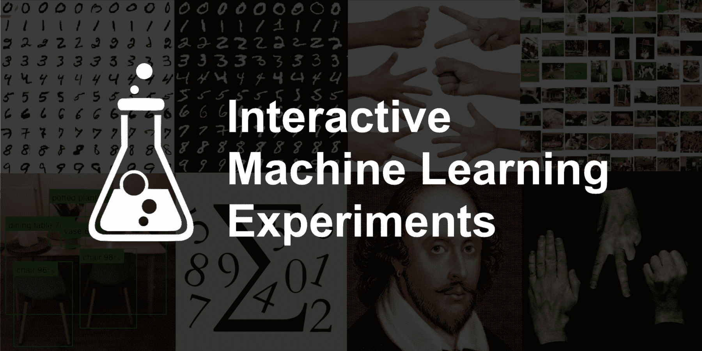

我在 GitHub 上开源了一个新的 [**交互式机器学习实验**](https://github.com/trekhleb/machine-learning-experiments) 项目。每个实验包括*Jupyter/Colab 笔记本*（查看模型如何训练）和*演示页面*（直接在浏览器中查看模型的实际效果）。

尽管模型可能有些笨拙（记住，这些只是实验，并不是生产就绪的代码），它们会尽力做到以下几点：

+   识别你在浏览器中绘制的数字或草图

+   检测和识别你展示给相机的物体

+   对上传的图像进行分类

+   和你一起写一首莎士比亚的诗

+   和你一起玩石头剪子布游戏

我已经在*Python*上使用*TensorFlow 2* 和 *Keras* 支持训练了这些模型，然后用*React*和*JavaScript*版本的*TensorFlow*在浏览器中进行演示。

### 模型性能

首先，让我们设定期望值。️ 这个仓库包含了机器学习的**实验**，**而不是**生产就绪、可重用、优化和微调的代码和模型。这更像是一个沙箱或游乐场，用于学习和尝试不同的机器学习方法、算法和数据集。模型可能表现不佳，并且存在过拟合/欠拟合的可能。

因此，有时你可能会看到如下内容：

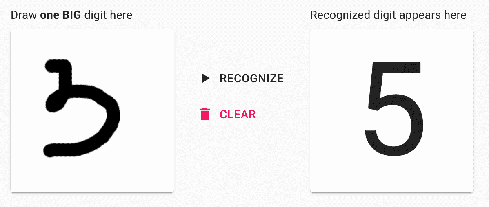

但请耐心等待，有时模型可能会变得更聪明，并给出如下结果：

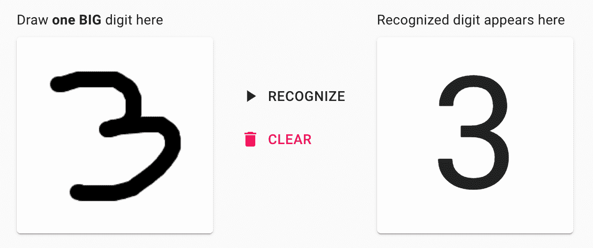

### 背景

我是一名 [软件工程师](https://www.linkedin.com/in/trekhleb/)，在过去的几年里，我主要从事前端和后端编程。在闲暇时间，作为一种爱好，我决定深入了解机器学习主题，以使其对我来说不再*像魔法*，而*更像数学*。

1.  由于**Python**可能是开始尝试机器学习的一个好选择，我决定先学习其基本语法。结果，诞生了一个 [Python 学习游乐场和备忘单](https://github.com/trekhleb/learn-python) 项目。这只是为了练习 Python，同时在需要时能有一个基本语法的备忘单（例如 dict_via_comprehension = {x: x**2 for x in (2, 4, 6)}，等等）。

1.  在学习了一点 Python 之后，我想深入了解机器学习背后的基本**数学**。所以，在通过了 Coursera 上由 Andrew Ng 教授讲授的精彩[机器学习课程](https://www.coursera.org/learn/machine-learning)之后，出现了[自制机器学习](https://github.com/trekhleb/homemade-machine-learning)项目。这次是创建一个针对基本机器学习数学算法（如线性回归、逻辑回归、k 均值、多层感知机等）的备忘单。

1.  下一步尝试玩转基本的机器学习数学是关于[NanoNeuron](https://github.com/trekhleb/nano-neuron)的。这是关于 7 个简单的 JavaScript 函数，旨在让你感受机器如何实际“学习”。

1.  在完成了 Coursera 上 Andrew Ng 教授讲授的另一个精彩[深度学习专项课程](https://www.coursera.org/specializations/deep-learning)之后，我决定进一步练习**多层感知机**、**卷积**和**递归神经网络**（CNNs 和 RNNs）。这一次，我决定不再从头开始实现所有内容，而是开始使用一些机器学习框架。我最终选择了[TensorFlow 2](https://www.tensorflow.org/)和[Keras](https://www.tensorflow.org/guide/keras/overview)。我也不想过多关注数学（让框架为我处理），而是希望做一些更实际、适用的事情，并且可以在浏览器中直接尝试。结果，新的[互动机器学习实验](https://github.com/trekhleb/machine-learning-experiments)出现了，我想在这里详细描述一下。

### 技术栈

**模型训练**

+   我在 TensorFlow 2 中使用了 Keras 进行建模和训练。由于我对机器学习框架没有任何经验，我需要从某些东西开始。TensorFlow 的一个卖点是它同时提供了 Python 和[JavaScript 版本](https://www.tensorflow.org/js)的库，API 类似。因此，我最终使用了 Python 版本进行训练，用 JavaScript 版本进行演示。

+   我在本地的[Jupyter](https://jupyter.org/)笔记本中使用 Python 训练了 TensorFlow 模型，有时使用[Colab](https://colab.research.google.com/)来加快 GPU 上的训练速度。

+   大多数模型是在老款 MacBook Pro 的 CPU（2.9 GHz 双核 Intel Core i5）上训练的。

+   当然，你不可能逃避[NumPy](https://numpy.org/)用于矩阵/张量操作。

**模型演示**

+   我使用了 TensorFlow.js 来用之前训练的模型进行预测。

+   为了将 *Keras HDF5* 模型转换为 *TensorFlow.js Layers* 格式，我使用了 [TensorFlow.js 转换器](https://github.com/tensorflow/tfjs/tree/master/tfjs-converter)。将整个模型（数兆字节的数据）传输到浏览器可能效率低下，不如通过 HTTP 请求进行预测，但请记住，这些只是实验，而不是生产就绪的代码和架构。我希望避免拥有专门的后台服务以简化架构。

+   [演示应用](http://trekhleb.github.io/machine-learning-experiments) 是在 [React](https://reactjs.org/) 上使用 [create-react-app](https://github.com/facebook/create-react-app) 启动程序创建的，默认使用 [Flow](https://flow.org/en/) 类型检查。

+   对于样式，我使用了 [Material UI](https://material-ui.com/)。正如他们所说的，“一箭双雕”，同时尝试一个新的样式框架（对不起，[Bootstrap](https://getbootstrap.com/)）。

**实验**

简而言之，你可以通过以下链接访问演示页面和 Jupyter 笔记本：

+   [**启动机器学习实验演示**](http://trekhleb.github.io/machine-learning-experiments)

+   [**查看机器学习实验 Jupyter 笔记本**](https://github.com/trekhleb/machine-learning-experiments)

### 多层感知器（MLP）实验

[多层感知器（MLP）](https://en.wikipedia.org/wiki/Multilayer_perceptron) 是一种前馈人工神经网络（ANN）。多层感知器有时被称为“普通”神经网络（由多个感知器层组成），尤其是当它们只有一个隐藏层时。

**手写数字识别**

你绘制一个数字，模型尝试识别它。

+   [演示](https://trekhleb.github.io/machine-learning-experiments/#/experiments/DigitsRecognitionMLP)

+   [Jupyter 中的训练](https://nbviewer.jupyter.org/github/trekhleb/machine-learning-experiments/blob/master/experiments/digits_recognition_mlp/digits_recognition_mlp.ipynb)

+   [Colab 中的训练](https://colab.research.google.com/github/trekhleb/machine-learning-experiments/blob/master/experiments/digits_recognition_mlp/digits_recognition_mlp.ipynb)

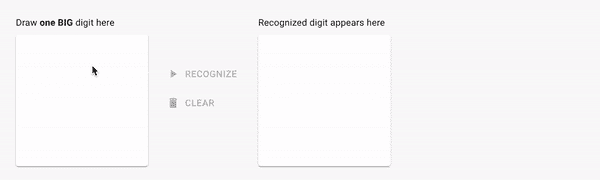

**手写草图识别**

你绘制一个草图，模型尝试识别它。

+   [演示](https://trekhleb.github.io/machine-learning-experiments/#/experiments/SketchRecognitionMLP)

+   [Jupyter 中的训练](https://nbviewer.jupyter.org/github/trekhleb/machine-learning-experiments/blob/master/experiments/sketch_recognition_mlp/sketch_recognition_mlp.ipynb)

+   [Colab 中的训练](https://colab.research.google.com/github/trekhleb/machine-learning-experiments/blob/master/experiments/sketch_recognition_mlp/sketch_recognition_mlp.ipynb)

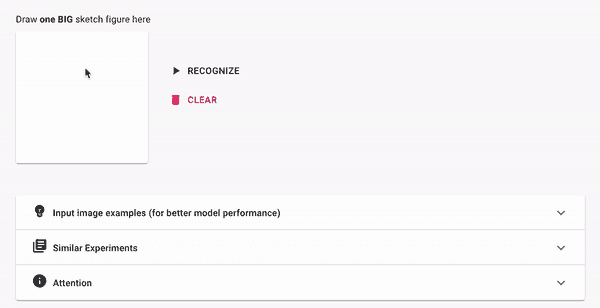

### 卷积神经网络（CNN）实验

[卷积神经网络（CNN 或 ConvNet）](https://en.wikipedia.org/wiki/Convolutional_neural_network)是一类深度神经网络，最常用于分析视觉图像（照片、视频）。它们用于检测和分类照片和视频中的物体，风格迁移，人脸识别，姿态估计等。

**手写数字识别（CNN）**

你画一个数字，模型尝试识别它。这个实验类似于 MLP 部分的实验，但它使用了底层的 CNN。

+   [演示](https://trekhleb.github.io/machine-learning-experiments/#/experiments/DigitsRecognitionCNN)

+   [Jupyter 中的训练](https://nbviewer.jupyter.org/github/trekhleb/machine-learning-experiments/blob/master/experiments/digits_recognition_cnn/digits_recognition_cnn.ipynb)

+   [Colab 中的训练](https://colab.research.google.com/github/trekhleb/machine-learning-experiments/blob/master/experiments/digits_recognition_cnn/digits_recognition_cnn.ipynb)

**手写草图识别（CNN）**

你画一幅草图，模型尝试识别它。这个实验类似于 MLP 部分的实验，但它使用了底层的 CNN。

+   [演示](https://trekhleb.github.io/machine-learning-experiments/#/experiments/SketchRecognitionCNN)

+   [Jupyter 中的训练](https://nbviewer.jupyter.org/github/trekhleb/machine-learning-experiments/blob/master/experiments/sketch_recognition_cnn/sketch_recognition_cnn.ipynb)

+   [Colab 中的训练](https://colab.research.google.com/github/trekhleb/machine-learning-experiments/blob/master/experiments/sketch_recognition_cnn/sketch_recognition_cnn.ipynb)

**猜拳游戏（CNN）**

你与模型玩一个猜拳游戏。这个实验使用从零开始训练的 CNN。

+   [演示](https://trekhleb.github.io/machine-learning-experiments/#/experiments/RockPaperScissorsCNN)

+   [Jupyter 中的训练](https://nbviewer.jupyter.org/github/trekhleb/machine-learning-experiments/blob/master/experiments/rock_paper_scissors_cnn/rock_paper_scissors_cnn.ipynb)

+   [Colab 中的训练](https://colab.research.google.com/github/trekhleb/machine-learning-experiments/blob/master/experiments/rock_paper_scissors_cnn/rock_paper_scissors_cnn.ipynb)

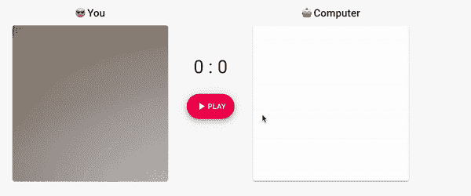

**猜拳游戏（MobilenetV2）**

你与模型玩一个猜拳游戏。这个模型使用了迁移学习，基于[MobilenetV2](https://www.tensorflow.org/api_docs/python/tf/keras/applications/MobileNetV2)。

+   [演示](https://trekhleb.github.io/machine-learning-experiments/#/experiments/RockPaperScissorsMobilenetV2)

+   [Jupyter 中的训练](https://nbviewer.jupyter.org/github/trekhleb/machine-learning-experiments/blob/master/experiments/rock_paper_scissors_mobilenet_v2/rock_paper_scissors_mobilenet_v2.ipynb)

+   [在 Colab 中训练](https://colab.research.google.com/github/trekhleb/machine-learning-experiments/blob/master/experiments/rock_paper_scissors_mobilenet_v2/rock_paper_scissors_mobilenet_v2.ipynb)

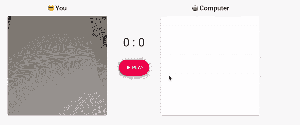

**对象检测（MobileNetV2）**

你通过相机向模型展示你的环境，它会尝试检测和识别物体。该模型使用迁移学习，基于 MobilenetV2。

+   [演示](https://trekhleb.github.io/machine-learning-experiments/#/experiments/ObjectsDetectionSSDLiteMobilenetV2)

+   [在 Jupyter 中训练](https://nbviewer.jupyter.org/github/trekhleb/machine-learning-experiments/blob/master/experiments/objects_detection_ssdlite_mobilenet_v2/objects_detection_ssdlite_mobilenet_v2.ipynb)

+   [在 Colab 中训练](https://colab.research.google.com/github/trekhleb/machine-learning-experiments/blob/master/experiments/objects_detection_ssdlite_mobilenet_v2/objects_detection_ssdlite_mobilenet_v2.ipynb)

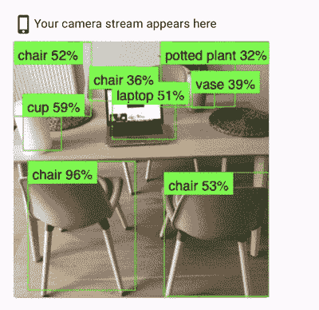

**图像分类（MobileNetV2）**

你上传一张图片，模型尝试根据它“看到”的内容对图片进行分类。该模型使用迁移学习，基于 MobilenetV2。

+   [演示](https://trekhleb.github.io/machine-learning-experiments/#/experiments/ImageClassificationMobilenetV2)

+   [在 Jupyter 中训练](https://nbviewer.jupyter.org/github/trekhleb/machine-learning-experiments/blob/master/experiments/image_classification_mobilenet_v2/image_classification_mobilenet_v2.ipynb)

+   [在 Colab 中训练](https://colab.research.google.com/github/trekhleb/machine-learning-experiments/blob/master/experiments/image_classification_mobilenet_v2/image_classification_mobilenet_v2.ipynb)

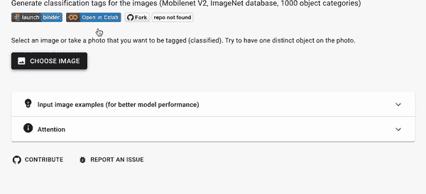

### 循环神经网络（RNN）实验

一个[循环神经网络（RNN）](https://en.wikipedia.org/wiki/Recurrent_neural_network)是深度神经网络的一类，最常应用于序列数据，如语音、文本或音乐。它们用于机器翻译、语音识别、语音合成等。

**数字求和**

你输入一个求和表达式（即`17+38`），模型预测结果（即`55`）。有趣的是，模型将输入视作一个*序列*，意味着它学会了当你输入一个序列`1 → 17 → 17+ → 17+3 → 17+38`时，它会将其“翻译”为另一个序列`55`。你可以将其理解为将西班牙语的 Hola 序列翻译成英语的 Hello。

+   [演示](https://trekhleb.github.io/machine-learning-experiments/#/experiments/NumbersSummationRNN)

+   [在 Jupyter 中训练](https://nbviewer.jupyter.org/github/trekhleb/machine-learning-experiments/blob/master/experiments/numbers_summation_rnn/numbers_summation_rnn.ipynb)

+   [在 Colab 中训练](https://colab.research.google.com/github/trekhleb/machine-learning-experiments/blob/master/experiments/numbers_summation_rnn/numbers_summation_rnn.ipynb)

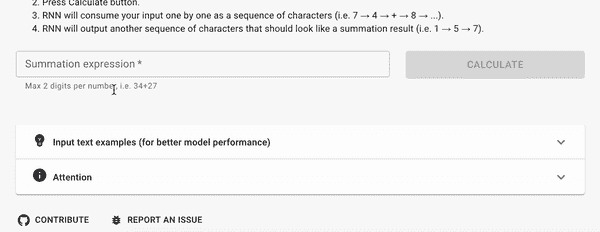

**莎士比亚文本生成**

你开始输入一首像莎士比亚那样的诗歌，模型将继续像莎士比亚一样创作。至少它会尝试这样做。

+   [演示](https://trekhleb.github.io/machine-learning-experiments/#/experiments/TextGenerationShakespeareRNN)

+   [在 Jupyter 中训练](https://nbviewer.jupyter.org/github/trekhleb/machine-learning-experiments/blob/master/experiments/text_generation_shakespeare_rnn/text_generation_shakespeare_rnn.ipynb)

+   [在 Colab 中训练](https://colab.research.google.com/github/trekhleb/machine-learning-experiments/blob/master/experiments/text_generation_shakespeare_rnn/text_generation_shakespeare_rnn.ipynb)

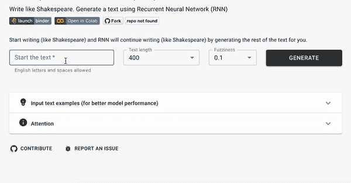

**维基百科文本生成**

你开始输入一篇 Wiki 文章，模型尝试继续创作。

+   [演示](https://trekhleb.github.io/machine-learning-experiments/#/experiments/TextGenerationWikipediaRNN)

+   [在 Jupyter 中训练](https://nbviewer.jupyter.org/github/trekhleb/machine-learning-experiments/blob/master/experiments/text_generation_wikipedia_rnn/text_generation_wikipedia_rnn.ipynb)

+   [在 Colab 中训练](https://colab.research.google.com/github/trekhleb/machine-learning-experiments/blob/master/experiments/text_generation_wikipedia_rnn/text_generation_wikipedia_rnn.ipynb)

### 未来计划

正如我上面提到的，[这个代码库](https://github.com/trekhleb/machine-learning-experiments)的主要目的是作为一个学习的游乐场，而不是用于生产就绪的模型。因此，主要计划是**继续学习和实验**深度学习挑战和方法。接下来可能会有趣的挑战包括：

+   情感检测

+   风格迁移

+   语言翻译

+   生成图像（即手写数字）

另一个有趣的机会是**调整现有模型以提高性能**。我相信这可以更好地理解如何克服过拟合和欠拟合，以及当模型在训练和验证集上的准确率停留在 60%并且不再提升时应该怎么做。

希望你能从[这个代码库](https://github.com/trekhleb/machine-learning-experiments)中找到一些有用的模型训练见解，或者至少在尝试演示时玩得开心！

[原文](https://github.com/trekhleb/machine-learning-experiments/blob/master/assets/story.en.md)。经许可转载。

**相关：**

+   [构建并部署你的第一个机器学习 Web 应用](https://www.kdnuggets.com/2020/05/build-deploy-machine-learning-web-app.html)

+   [机器学习初学者学习路径](https://www.kdnuggets.com/2020/05/beginners-learning-path-machine-learning.html)

+   [5 个 Google Colaboratory 小贴士](https://www.kdnuggets.com/2020/03/5-google-colaboratory-tips.html)

* * *

## 我们的前三名课程推荐

 1\. [Google 网络安全证书](https://www.kdnuggets.com/google-cybersecurity) - 快速进入网络安全职业轨道

 2\. [Google 数据分析专业证书](https://www.kdnuggets.com/google-data-analytics) - 提升你的数据分析技能

 3\. [Google IT 支持专业证书](https://www.kdnuggets.com/google-itsupport) - 支持你的组织的 IT 需求

* * *

### 了解更多相关话题

+   [机器学习实验的版本控制与跟踪](https://www.kdnuggets.com/2021/12/versioning-machine-learning-experiments-tracking.html)

+   [用于深度学习实验的 Hydra 配置](https://www.kdnuggets.com/2023/03/hydra-configs-deep-learning-experiments.html)

+   [如何为数据收集设计实验](https://www.kdnuggets.com/2022/04/design-experiments-data-collection.html)

+   [使用 Pandas 制作美观的交互式可视化的最简单方法](https://www.kdnuggets.com/2021/12/easiest-way-make-beautiful-interactive-visualizations-pandas.html)

+   [每位机器学习工程师都应具备的 5 项机器学习技能](https://www.kdnuggets.com/2023/03/5-machine-learning-skills-every-machine-learning-engineer-know-2023.html)

+   [KDnuggets 新闻，12 月 14 日：3 个免费的机器学习课程](https://www.kdnuggets.com/2022/n48.html)
