# 直接使用 Pandas 获取交互式图表

> 原文：[`www.kdnuggets.com/2021/06/interactive-plots-directly-pandas.html`](https://www.kdnuggets.com/2021/06/interactive-plots-directly-pandas.html)

评论

**由 [Parul Pandey](https://pandeyparul.medium.com/) 撰写，H2O.ai 数据科学家 | @wicds 编辑**。

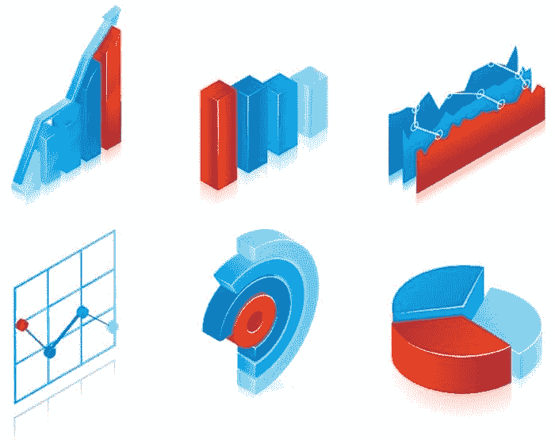

* * *

## 我们的前三名课程推荐

 1\. [Google 网络安全证书](https://www.kdnuggets.com/google-cybersecurity) - 快速开启网络安全职业生涯。

 2\. [Google 数据分析专业证书](https://www.kdnuggets.com/google-data-analytics) - 提升你的数据分析技能

 3\. [Google IT 支持专业证书](https://www.kdnuggets.com/google-itsupport) - 支持你的组织进行 IT 工作

* * *

*[信息图矢量图由 macrovector 创建 — www.freepik.com](https://www.freepik.com/vectors/infographic)。*

数据探索是任何数据分析任务中最重要的方面之一。我们进行的初步探查和检查，通过各种可视化工具的广泛目录，给予我们对数据性质的可操作性见解。然而，有时选择可视化工具比任务本身更为复杂。一方面，我们有一些易于使用的库，但在展示数据中的复杂关系时并不太有用。另一方面，还有一些提供交互性的库，但学习曲线相当陡峭。幸运的是，一些开源库已经被创建出来，试图有效地解决这个痛点。

在这篇文章中，我们将讨论两个这样的库，即 **pandas_bokeh** 和 **cufflinks**。我们将学习如何使用基本的 pandas 绘图语法创建 plotly 和 bokeh 图表，这种语法我们都很熟悉。由于文章的重点是语法而非图表类型，我们将限制在五种基本图表，即折线图、柱状图、直方图、散点图和饼图。我们将首先使用 pandas 绘图库创建这些图表，然后再在 plotly 和 bokeh 中重建这些图表，但会有一些变化。

### 导入数据集

我们将使用**NIFTY-50 数据集**。NIFTY 50 指数是 [印度国家证券交易所](https://en.wikipedia.org/wiki/National_Stock_Exchange_of_India) 对印度股票市场的基准。该数据集在 [Kaggle](https://www.kaggle.com/sudalairajkumar/nifty-indices-dataset) 上公开提供，但我们将使用包含四个行业股票价值的子集，即银行、制药、IT 和快速消费品（FMCG）。

> *你可以从*[*这里*](https://github.com/parulnith/Data-Science-Articles/tree/main/Get%20Interactive%20plots%20directly%20with%C2%A0pandas.)*下载示例数据集。*

让我们导入所需的库和数据集以进行可视化：

```py
# Importing required modules
import pandas as pd
import numpy as np
import matplotlib.pyplot as plt
%matplotlib inline

# Reading in the data
nifty_data = pd.read_csv('NIFTY_data_2020.csv',parse_dates=["Date"],index_col='Date')
nifty_data.head()

```

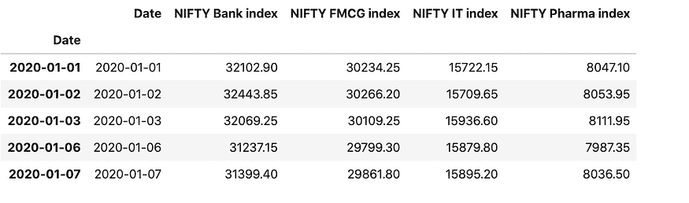

*包含银行、制药、IT 和快速消费品部门的 NIFTY 指数的合并数据框。*

我们还可以按月末重新采样/聚合数据。pandas 库具有一个 * [resample()](https://pandas.pydata.org/docs/reference/api/pandas.Series.resample.html)* 函数，用于重新采样时间序列数据。

```py
nifty_data_resample = nifty_data.resample(rule = 'M').mean()
nifty_data_resample

```

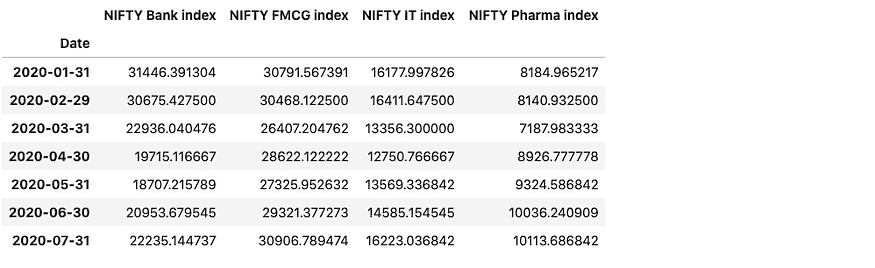

现在我们已经准备好了数据框，是时候通过不同的图表来可视化它们了。

### 直接使用 Pandas 绘图

让我们从最简单的绘图技术开始 — pandas 的 [绘图函数](https://pandas.pydata.org/pandas-docs/stable/user_guide/visualization.html#plotting-tools)。要使用 pandas 绘制图表，我们将调用 * .plot() * 方法。

**语法**：*dataframe.plot()*

*plot* 方法只是 matplotlib 的一个简单封装，* [plt.plot()](https://matplotlib.org/api/_as_gen/matplotlib.axes.Axes.plot.html#matplotlib.axes.Axes.plot) *。我们还可以指定一些额外的参数，如下所述：

```py
Some of the important Parameters
--------------------------------

x : label or position, default None
    Only used if data is a DataFrame.
y : label, position or list of label, positions, default None

title: title to be used for the plot

X and y label: Name to use for the label on the x-axis and y-axis.

figsize : specifies the size of the figure object.    
kind : str
    The kind of plot to produce:

    - 'line' : line plot (default)
    - 'bar' : vertical bar plot
    - 'barh' : horizontal bar plot
    - 'hist' : histogram
    - 'box' : boxplot
    - 'kde' : Kernel Density Estimation plot
    - 'density' : same as 'kde'
    - 'area' : area plot
    - 'pie' : pie plot
    - 'scatter' : scatter plot
    - 'hexbin' : hexbin plot.

```

有关参数及其用法的完整列表，请参考 [文档](https://pandas.pydata.org/pandas-docs/stable/user_guide/visualization.html#basic-plotting-plot)。现在我们来看一下创建不同图表的方法。在本文中，我们不会详细解释每种图表。我们只关注语法，如果你有一些 pandas 经验，这些语法是自解释的。要详细了解 pandas 图表，[这篇文章](https://neptune.ai/blog/pandas-plot-deep-dive-into-plotting-directly-with-pandas) 将很有帮助。

1.  **折线图**

```py
nifty_data.plot(title='Nifty Index values in 2020', 
                xlabel = 'Values',
                figsize=(10,6);

```


*使用 pandas 绘制的折线图。*

1.  **散点图**

```py
nifty_data.plot(kind='scatter',
        x='NIFTY FMCG index', 
        y='NIFTY Bank index',
        title = 'Scatter Plot for NIFTY Index values in 2020',
        figsize=(10,6));

```

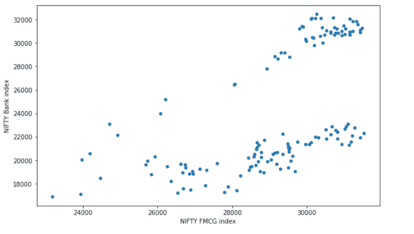

*使用 pandas 绘制的散点图。*

1.  **直方图**

```py
nifty_data[['NIFTY FMCG index','NIFTY Bank index']].plot(kind='hist',figsize=(9,6), bins=30);

```

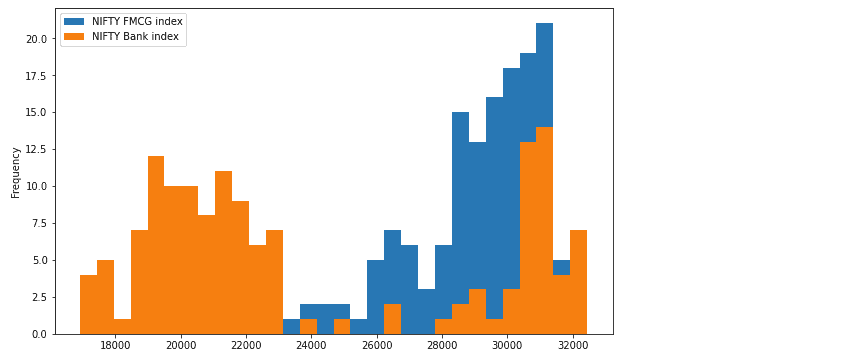

*使用 pandas 绘制的直方图。*

1.  **柱状图**

```py
nifty_data_resample.plot(kind='bar',figsize=(10,6));

```

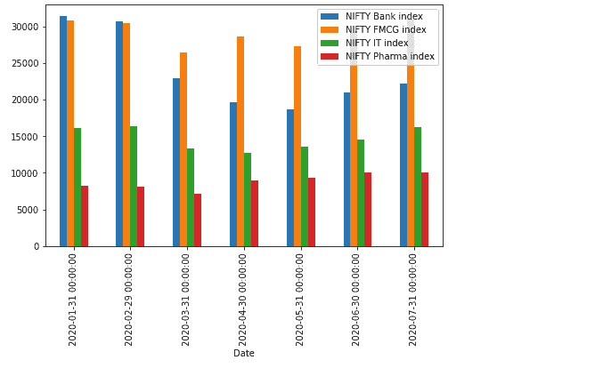

*使用 pandas 绘制的柱状图。*

+   **堆叠柱状图**

```py
nifty_data_resample.plot(kind='barh',figsize=(10,6));

```

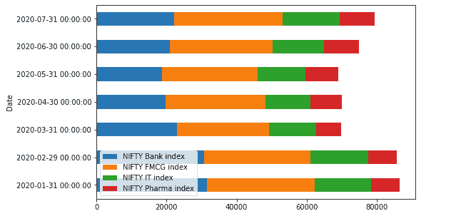

*使用 pandas 绘制的堆叠柱状图。*

1.  **饼图**

```py
nifty_data_resample.index=['Jan','Feb','March','Apr','May','June','July']
nifty_data_resample['NIFTY Bank index'].plot.pie(legend=False, figsize=(10,6),autopct='%.1f');

```

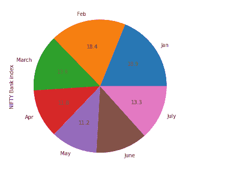

*使用 pandas 绘制的饼图。*

这些是可以直接使用 pandas 数据框创建的一些图表。然而，这些图表缺乏交互性和缩放、平移等功能。现在，让我们将这些现有图表的语法稍微修改一下，使其变成完全互动的图表。

### Pandas 的 Bokeh 后端 — 使用 Pandas-Bokeh 绘图。

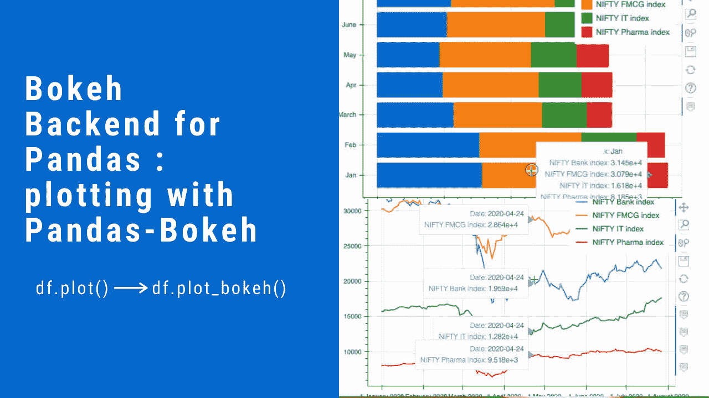

*作者提供的图片。*

[bokeh](https://docs.bokeh.org/en/latest/) 库在数据可视化方面明显突出。*[Pandas-Bokeh](https://github.com/PatrikHlobil/Pandas-Bokeh)* 为 [Pandas](https://pandas.pydata.org/)、[GeoPandas](http://geopandas.org/) 和 [Pyspark](https://spark.apache.org/docs/latest/api/python/index.html) DataFrames 提供了 bokeh 绘图后端。该后端向 DataFrames 和 Series 添加了 plot_bokeh() 方法。

**安装**

Pandas-Bokeh 可以通过 [PyPI](https://pypi.org/project/pandas-bokeh/) 使用 *pip* 或 *conda* 安装：

```py
pip install pandas-bokeh

or

conda install -c patrikhlobil pandas-bokeh

```

**用法**

Pandas-Bokeh 库应在 Pandas、GeoPandas 或 Pyspark 之后导入。

```py
import pandas as pd
import pandas_bokeh

```

然后需要定义绘图输出，这可以是以下两者之一：

```py
pandas_bokeh.output_notebook() # for embedding plots in Jupyter Notebooks.
pandas_bokeh.output_file(filename) # for exporting plots as HTML.

```

**语法**

现在，绘图 API 通过 *dataframe.plot_bokeh()* 可用于 Pandas DataFrame。

有关绘图输出的更多详细信息，请参见此处的参考资料或 Bokeh 文档。现在，我们将绘制上节中绘制的五种图表。我们将使用与上面相同的数据集。

```py
import pandas as pd
import pandas_bokeh
pandas_bokeh.output_notebook()

```


1.  **折线图**

```py
nifty_data.plot_bokeh(kind='line') #equivalent to nifty_data.plot_bokeh.line()

```

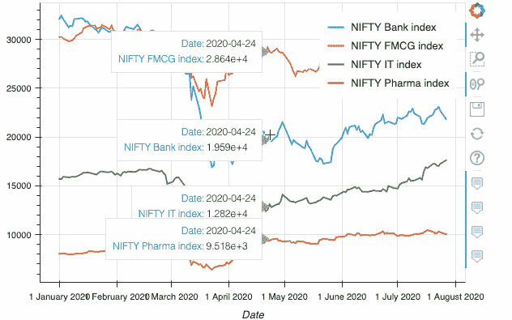

*使用 pandas_bokeh 绘制的折线图。*

1.  **散点图**

```py
nifty_data.plot_bokeh.scatter(x='NIFTY FMCG index', y='NIFTY Bank index');

```

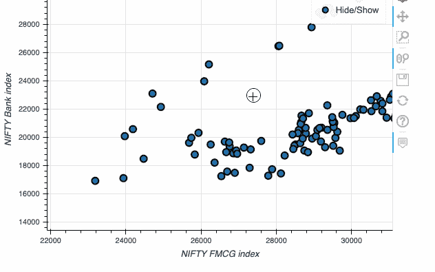

*使用 pandas_bokeh 绘制的散点图。*

1.  **直方图**

```py
nifty_data[['NIFTY FMCG index','NIFTY Bank index']].plot_bokeh(kind='hist', bins=30);

```

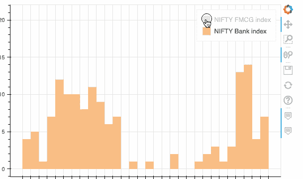

*使用 pandas_bokeh 绘制的直方图。*

1.  **条形图**

```py
nifty_data_resample.plot_bokeh(kind='bar',figsize=(10,6));

```


*使用 pandas_bokeh 绘制的条形图。*

+   **堆叠条形图**

```py
nifty_data_resample.plot_bokeh(kind='barh',stacked=True);

```

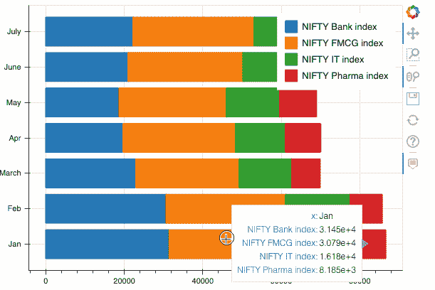

*使用 pandas_bokeh 绘制的堆叠条形图。*

1.  **饼图**

```py
nifty_data_resample.index=['Jan','Feb','March','Apr','May','June','July']
nifty_data_resample.plot_bokeh.pie(y ='NIFTY Bank index')

```

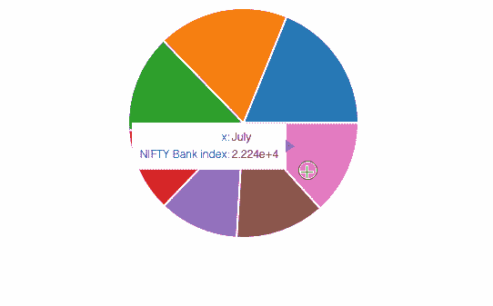

*使用 pandas_bokeh 绘制的饼图。*

此外，你还可以在同一图表中创建多个嵌套的饼图：

```py
nifty_data_resample.plot_bokeh.pie()

```

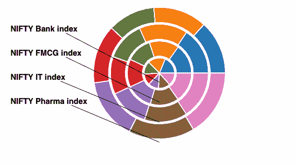

*使用 pandas_bokeh 绘制的嵌套饼图。*

本节展示了如何在不显著改变 pandas 绘图语法的情况下无缝创建 bokeh 图表。现在，我们可以在不需要学习任何新格式的情况下享受两者的最佳结合。

### Plotly 后端用于 Pandas — 使用 Cufflinks 绘图。

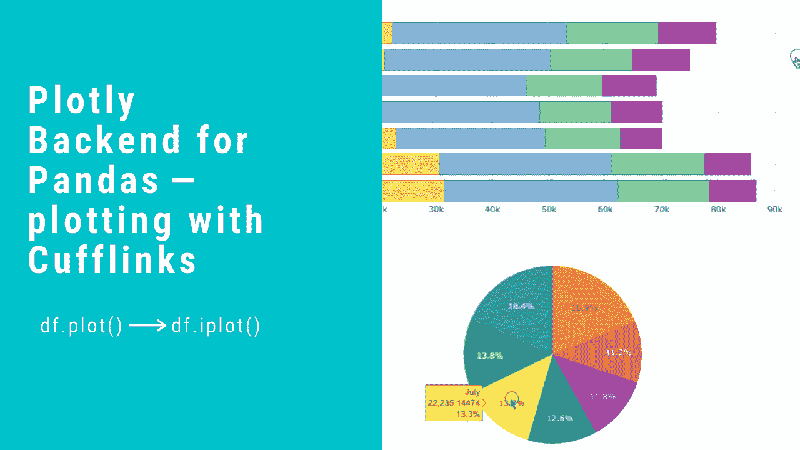

*作者提供的图片。*

另一个常用的数据可视化库是 [Plotly](https://plotly.com/graphing-libraries/)。使用 Plotly，你可以在 Python、R 和 JavaScript 中创建交互式图表。从 4.8 版本开始，Plotly 推出了一个 [Plotly Express 驱动的](https://plotly.com/python/plotly-express/) Pandas 绘图后端，这意味着即使不导入 plotly，也可以创建类似 plotly 的可视化。

然而，我在这里要提到的库不是 plotly express，而是围绕 Plotly 的一个独立第三方包装库 [**Cufflinks**](https://github.com/santosjorge/cufflinks)**。** Cufflinks 的优势在于它更加灵活，功能更多，并且 API 类似于 pandas 绘图。这意味着你只需向 Pandas 数据框添加一个 *.iplot()* 方法即可绘制图表。

**安装**

确保在安装 cufflinks 之前已安装 plotly。阅读 [这篇](https://plotly.com/python/getting-started/) 指南以获取说明。

```py
pip install cufflinks

```

**使用**

[代码库](https://nbviewer.jupyter.org/gist/santosjorge/aba934a0d20023a136c2) 提供了许多有用的示例和笔记本以供入门。

```py
import pandas as pd
import cufflinks as cf
from IPython.display import display,HTML
#making all charts public and setting a global theme
cf.set_config_file(sharing='public',theme='white',offline=True)

```

就这些了。我们现在可以利用 plotly 的强大功能，但使用 pandas 的简便性。唯一的语法变化是*dataframe.iplot()*。

1.  **折线图**

```py
nifty_data.iplot(kind='line')

```

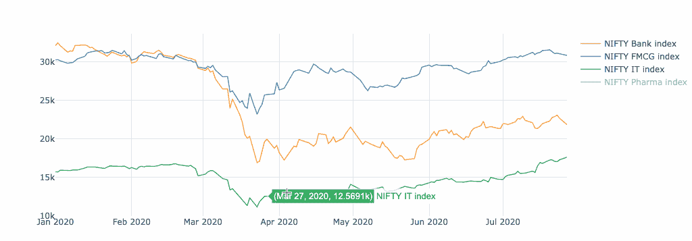

*带有 cufflinks 的折线图。*

1.  **散点图**

创建散点图时，你需要提及散点轨迹的 **模式**。模式可以是线条、标记、文本或它们的组合。

```py
nifty_data.iplot(kind='scatter',x='NIFTY FMCG index', y='NIFTY Bank index',mode='markers');

```

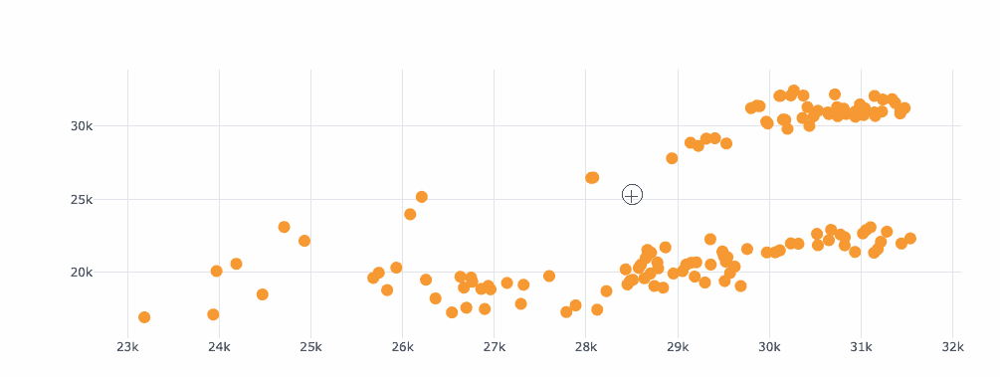

*带有 cufflinks 的散点图。*

1.  **直方图**

```py
nifty_data[['NIFTY FMCG index','NIFTY Bank index']].iplot(kind='hist', bins=30);

```

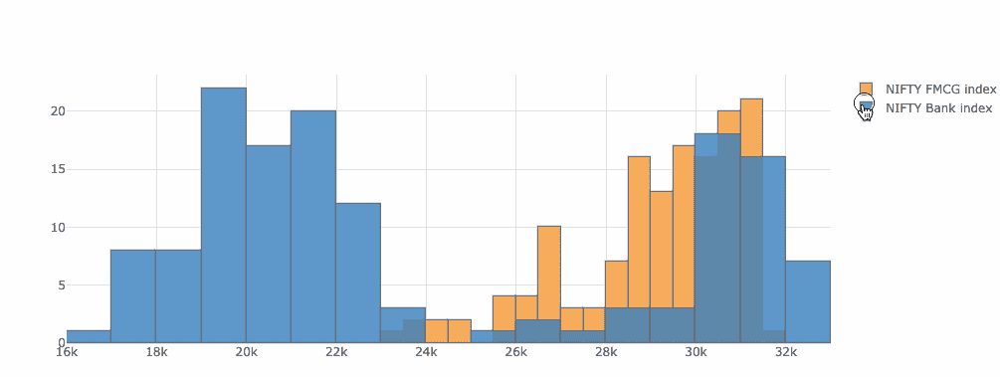

*带有 cufflinks 的直方图。*

1.  **条形图**

```py
nifty_data_resample.iplot(kind='bar');

```

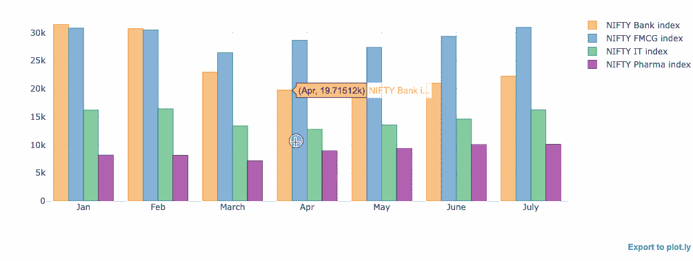

*带有 cufflinks 的条形图。*

+   **堆叠条形图**

```py
nifty_data_resample.iplot(kind='barh',barmode = 'stack');

```

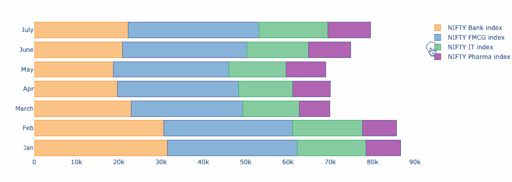

*带有 cufflinks 的堆叠条形图。*

1.  **饼图**

```py
nifty_data_resample.index=['Jan','Feb','March','Apr','May','June','July']
nifty_data_resample.reset_index().iplot(kind='pie',labels='index',values='NIFTY Bank index')

```

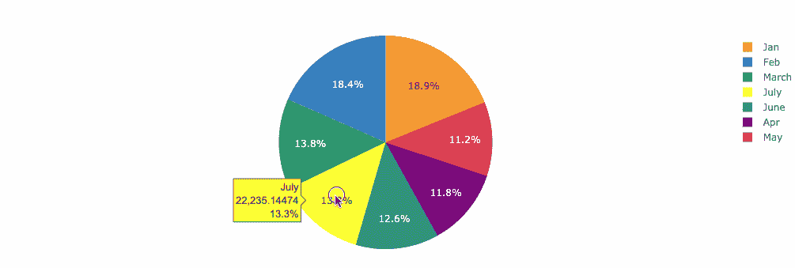

*带有 cufflinks 的饼图。*

Cufflinks 库提供了一种在 Plotly 内部获得 Plotly 强大功能的简单方法。语法的相似性是另一个优势。

### 结论

Bokeh 或 Plotly 图表可以独立传达所有信息。根据你的选择和偏好，你可以选择其中一个或两个，同时关注使可视化更直观和互动的主要目的。

[原文](https://towardsdatascience.com/get-interactive-plots-directly-with-pandas-13a311ebf426)。经许可转载。

**相关：**

+   [Python 中的动画条形图比赛](https://www.kdnuggets.com/2021/05/animated-race-bar-charts-python.html)

+   [如何确保你的分析实际得到应用](https://www.kdnuggets.com/2021/04/make-analysis-used.html)

+   [使用新的 Sweetviz Python 库更快地了解你的数据](https://www.kdnuggets.com/2021/03/know-your-data-much-faster-sweetviz-python-library.html)

### 更多相关内容

+   [停止学习数据科学以寻找目标，并寻找目标以……](https://www.kdnuggets.com/2021/12/stop-learning-data-science-find-purpose.html)

+   [一桩 $9B 的 AI 失败，经过审视](https://www.kdnuggets.com/2021/12/9b-ai-failure-examined.html)

+   [数据科学学习的顶级资源](https://www.kdnuggets.com/2021/12/springboard-top-resources-learn-data-science-statistics.html)

+   [成功的数据科学家的 5 个特征](https://www.kdnuggets.com/2021/12/5-characteristics-successful-data-scientist.html)

+   [为什么 Python 是初创企业的理想编程语言](https://www.kdnuggets.com/2021/12/makes-python-ideal-programming-language-startups.html)

+   [每个数据科学家都应该了解的三个 R 库（即使你使用 Python）](https://www.kdnuggets.com/2021/12/three-r-libraries-every-data-scientist-know-even-python.html)
