# 通过对抗正则化器进行自编码器插值

> 原文：[`www.kdnuggets.com/2019/03/interpolation-autoencoders-adversarial-regularizer.html`](https://www.kdnuggets.com/2019/03/interpolation-autoencoders-adversarial-regularizer.html)

 评论

**作者：Taraneh Khazaei（编辑：Mahsa Rahimi & Serena McDonnell）**

**对抗约束自编码器插值**（ACAI； [Berthelot et al., 2018](https://arxiv.org/abs/1807.07543)）是一种正则化程序，使用对抗策略来创建自编码器学习表示的高质量插值。本文做出了三项主要贡献：

+   提出了 ACAI 以生成语义上有意义的自编码器插值。

+   开发了一个合成基准来量化插值的质量。

+   检查了 ACAI 学习表示在下游任务中的表现。

AISC 最近介绍并讨论了由 Mahsa Rahimi 主导的这篇论文。事件的详细信息可以在 [AISC 网站](https://aisc.a-i.science/events/2019-02-07/)上找到，完整的演讲可以在 [YouTube](https://www.youtube.com/watch?v=FdeHlC4QiqA&t=2871s)上观看。这里，我们提供了对论文的概述，以及在 AISC 会议上提出的讨论要点。

**自编码器中的插值**

自编码器是一类神经网络，试图输出一个输入 xx 的近似重建，尽量减少信息损失。随着自编码器的训练，它学习将输入数据编码到一个潜在空间中，捕捉重建输出所需的所有信息。自编码器由两个部分组成，编码器和解码器，描述如下：

+   编码器接收输入数据  并生成一个潜在代码 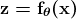。

+   解码器接收潜在代码 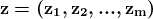 并尝试重建输入数据为 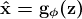。潜在空间通常维度低于数据（*m < n*）。

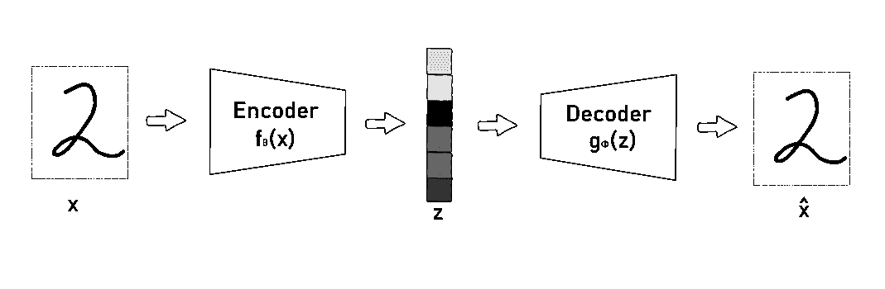*标准自编码器的架构*

标准自编码器关注于输入 x 的重建，并且几乎没有学习潜在数据集的概率特征。因此，它们的生成能力非常有限。一个允许标准自编码器生成合成数据的方法是通过混合潜在编码来促进插值。然而，常规自编码器学到的潜在空间可能不连续，并且潜在编码的簇之间可能存在较大的间隙。简单地混合先前学到的潜在编码可能会导致插值落入解码器从未见过的区域，从而产生不现实的数据点。为了解决这个问题，需要将插值过程集成到自编码器架构及其训练中，使自编码器能够学习潜在的数据流形并创建有意义的插值。通过借鉴生成对抗网络的理念（[Goodfellow et al., 2014](https://papers.nips.cc/paper/5423-generative-adversarial-nets)），ACAI 有效地将插值过程集成到自编码器架构中。 [Berthelot et al. (2018)](https://arxiv.org/abs/1807.07543) 提出了一种方法，能够创建高质量的插值，这些插值不仅与真实数据无差异，而且是输入的语义上有意义的组合。我们将在下面详细解释 ACAI 方法。

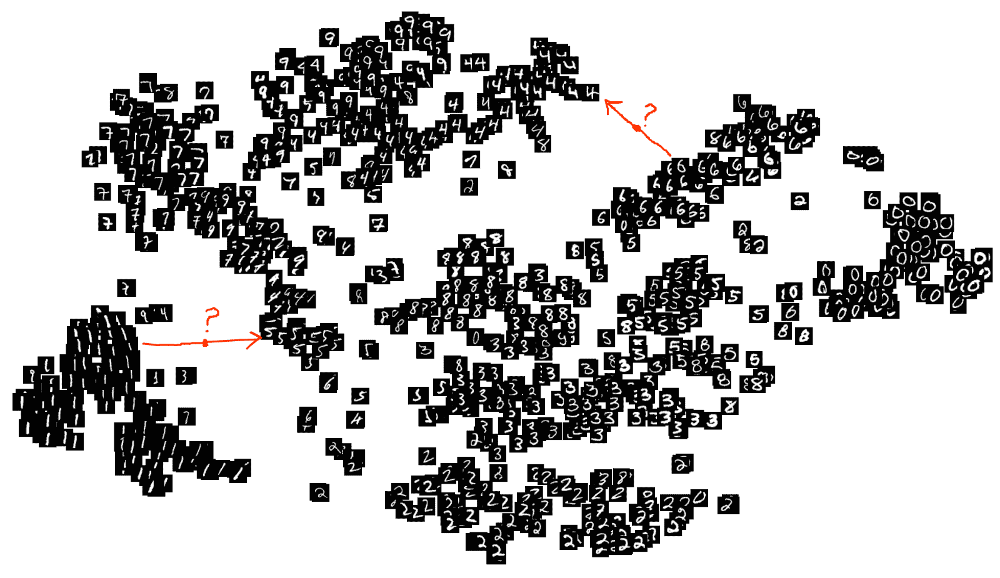*潜在编码在[MNIST](http://yann.lecun.com/exdb/mnist/)数据集上的可视化，展示了潜在空间的不连续性。*

*要了解更多关于潜在空间连续性的内容，你可以阅读这篇[博客文章](https://towardsdatascience.com/intuitively-understanding-variational-autoencoders-1bfe67eb5daf)。*

**对抗约束自编码器插值（ACAI）**

要插值两个输入  和 ，ACAI 执行以下步骤：

1.  使用两个编码器， 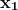 和 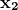 首先被编码为相应的潜在编码 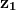 和 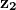，其中 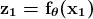 和 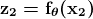。

1.  然后通过凸组合 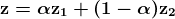 对两个潜在编码进行插值，某些 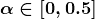。

1.  凸组合  然后通过解码器生成插值数据点，其中 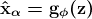。

1.  最后，为了确保插值的真实性，解码后的插值 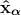​ 会通过一个判别器网络。判别器网络的目标是从插值数据点 ​中预测混合系数 α。然后，自动编码器被训练以欺骗判别器网络，使其认为  始终为 0，即尝试欺骗判别器网络，使其认为插值数据实际上是非插值的。

通过向自动编码器的损失函数添加一项来实现欺骗判别器网络。在 ACAI 中，编码器和解码器被训练以最小化以下损失函数：

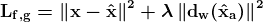

其中 λ 是一个标量超参数，可以用来控制右侧正则化项的权重，而 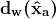 是由 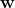 参数化的判别器网络。损失函数的第一个项试图重建输入，第二项则试图使判别器网络始终输出 0。判别器网络被训练以优化以下损失函数：

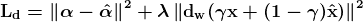

其中 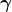 是一个标量超参数。损失函数的第一个项试图恢复 。第二项是正则化项，对于创建高质量插值并非至关重要，但在对抗学习过程中有两方面的帮助。首先，它强制判别器对非插值数据始终输出 0；其次，即使自动编码器的重建质量较差，它也确保判别器接触到真实的数据。

当算法收敛时，期望插值点与真实数据难以区分。经验上，作者展示了学到的插值是两个输入 ​ 和 ​的语义平滑插值。在一组聚类和分类任务上的评估结果表明，ACAI 学到的表示在下游任务上比非-ACAI 学到的表示更有效。鉴于下游任务的性能提升，作者指出插值和表示学习之间可能存在联系。

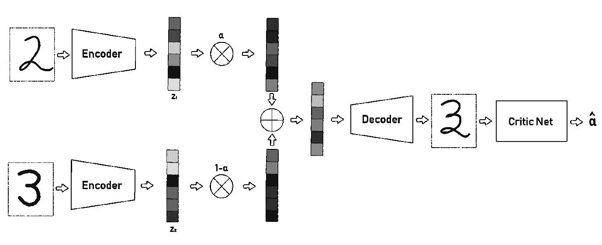*ACAI 架构*

**基准开发**

语义相似性的概念模糊、不明确且难以量化。本文的另一项贡献是定义一个基准来定量评估插值的质量。他们的基准集中在自编码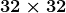灰度图像的任务上。这些线条长为 1616 像素，从图像中心开始，向外延伸，角度为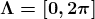，每张图像上有一条线。利用这些数据，一个有效的插值应是从到的图像，平滑且线性地调整从中的线条角度到中的线条角度，同时沿最短路径遍历。使用这些图像，可以轻松计算以下两个标准，并用于评估不同自编码器的插值能力：

1.  平均距离：衡量插值点与真实数据点之间的平均距离。

1.  平滑度：衡量插值线的角度是否在起点和终点之间遵循线性轨迹。

理想的插值应使两项评分都达到 0。以下是\piπ与 00 之间理想插值的示例。

*从到 0 的完美插值*

使用这个基准，结果显示 ACAI 在生成现实且具有语义意义的插值任务中显著优于常见的自编码器模型（如去噪自编码器和变分自编码器）。

**AISC 讨论**

在 AISC 会议中，提出了一系列[讨论点](https://youtu.be/Tu3FqCD7-BY?t=3513)，可以作为未来工作和自编码器插值实验的参考。

首先，对三种不同数据集上的 ACAI 表示进行了分类和聚类评估：[MNIST](http://yann.lecun.com/exdb/mnist/)、[SVHN](http://ufldl.stanford.edu/housenumbers/)和[CIFAR-10](https://www.cs.toronto.edu/~kriz/cifar.html)。虽然对于两个较简单的数据集（即 MNIST 和 SVHN），分类和聚类任务的结果都比较合理，但在 CIFAR 上的分类改进并不显著，而且所有自编码器（包括 ACAI）在 CIFAR 上的聚类结果都很差。AISC 提出了将 ACAI 扩展以在复杂数据集上更有效的想法。

其次，ACAI 论文主要关注计算机视觉任务，甚至根据图像的视觉属性定义了高质量的插值。探索 ACAI 和基准如何扩展以惠及非视觉任务如文本插值，将极具价值。最后，本文将正则化过程应用于普通自编码器。值得探索使用类似正则化机制对其他类型自编码器的影响。特别是，[使用相同思想改进变分自编码器的生成能力在 AISC 会议中进行了讨论](https://youtu.be/Tu3FqCD7-BY?t=3574)。

**附加资源:**

+   他们评估 ACAI 的数据集包括 [MNIST](http://yann.lecun.com/exdb/mnist/)、[SVHN](http://ufldl.stanford.edu/housenumbers/) 和 [CIFAR-10](https://www.cs.toronto.edu/~kriz/cifar.html)，这些数据集都是公开可用的。

+   ACAI 在 TensorFlow 的实现可以在 [GitHub](https://github.com/brain-research/acai) 上找到。

[原文](https://aisc.a-i.science/blog/2019/acai-interpolation-autoencoders-adversarial-regularizer/)。经许可转载。

**相关:**

+   GAN 也需要一些关注

+   变分自编码器详解

+   用对抗攻击突破神经网络

* * *

## 我们的前三个课程推荐

 1\. [Google 网络安全证书](https://www.kdnuggets.com/google-cybersecurity) - 快速进入网络安全职业生涯。

 2\. [Google 数据分析专业证书](https://www.kdnuggets.com/google-data-analytics) - 提升你的数据分析技能

 3\. [Google IT 支持专业证书](https://www.kdnuggets.com/google-itsupport) - 支持你的组织的信息技术工作

* * *

### 更多相关主题

+   [如何使用 Pandas 中的插值技术处理缺失数据](https://www.kdnuggets.com/how-to-deal-with-missing-data-using-interpolation-techniques-in-pandas)

+   [什么是对抗机器学习？](https://www.kdnuggets.com/2022/03/adversarial-machine-learning.html)
