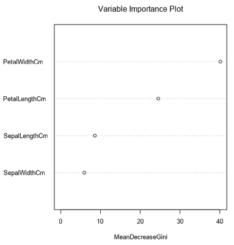
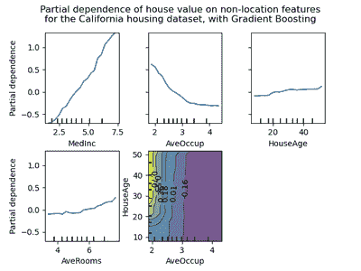

# 解释性、可解释性和机器学习——数据科学家需要知道的

> 原文：[`www.kdnuggets.com/2020/11/interpretability-explainability-machine-learning.html`](https://www.kdnuggets.com/2020/11/interpretability-explainability-machine-learning.html)

评论

**由 [Susan Sivek](https://www.linkedin.com/in/ssivek/)，Alteryx**。

我使用其中一个信用监控服务，它会定期通过邮件告知我我的信用评分：“恭喜，你的评分上升了！” “哎呀，你的评分下降了！”

* * *

## 我们的前三大课程推荐

 1. [谷歌网络安全证书](https://www.kdnuggets.com/google-cybersecurity) - 快速进入网络安全职业。

 2. [谷歌数据分析专业证书](https://www.kdnuggets.com/google-data-analytics) - 提升你的数据分析技能

 3. [谷歌 IT 支持专业证书](https://www.kdnuggets.com/google-itsupport) - 支持组织的 IT 需求

* * *

几个点的波动并不意味着什么。我耸耸肩，删除这些邮件。但是，是什么导致了这些波动？

信用评分只是基于复杂模型对我们作为个体做出的许多自动决策中的一个例子。我不知道是什么导致了我评分中的那些小变化。

一些机器学习模型被称为“黑箱”，这个术语常用来描述那些其内部工作——即不同变量如何通过算法相互关联——即使是设计者也可能无法完全解释和说明的模型。

*照片由*[ *Christian Fregnan*](https://unsplash.com/@christianfregnan?utm_source=unsplash&utm_medium=referral&utm_content=creditCopyText)* 提供，来源于*[ *Unsplash*](https://unsplash.com/s/photos/box?utm_source=unsplash&utm_medium=referral&utm_content=creditCopyText)。

这种奇怪的情况引发了有关优先级的问题：我们如何在模型开发中优先考虑准确性、解释性和可解释性？这些价值之间是否必须存在权衡？

但首先，免责声明：有很多不同的方式来定义你将在此看到的一些术语。这篇文章只是对这个复杂问题的一个看法！

### 解释和说明模型

让我们深入探讨与机器学习模型相关的*解释性*和*可解释性*。假设我创建了一个基于症状、家族史等因素的高度准确的疾病诊断模型。

如果我为这个目的创建了一个逻辑回归模型，你将能够准确看到模型中每个变量分配了多少权重来预测诊断（即每个变量对我预测的贡献程度）。

但如果我使用相同的变量构建了一个复杂的神经网络模型会怎样？我们可以查看模型的层次和它们的权重，但可能会很难理解这种配置在“现实世界”中实际上意味着什么，换句话说，就是这些层次和它们的权重如何以可识别的方式与我们的变量对应。即使是专家，神经网络模型的*可解释性*也可能较低。

此外，我们可以考虑*全局*可解释性（模型如何对所有观测值有效？）和*局部*可解释性（给定这些特定数据点，模型如何生成特定预测？）。这两种理解层次都有其价值。

如你所想，对于疾病预测这样的情况，患者希望知道模型是如何预测他们是否患病的。同样，我的信用评分计算可能对我的生活产生重大影响。因此，我们理想中希望拥有的不仅仅是专家能够解释的模型，而是*能够解释*给受其影响的人。

这种可解释性非常重要，以至于在某些地方已经立法规定。欧盟的一般数据保护条例（GDPR）包含了一个[“解释权”](https://www.privacy-regulation.eu/en/recital-71-GDPR.htm)，这被证明在解释上有些[挑战](https://papers.ssrn.com/sol3/papers.cfm?abstract_id=3196985)，但它要求对做出影响个人的数据驱动决策的机构有更大的“算法责任”。美国《平等信用机会法》要求金融机构向被拒绝信贷或给予较差贷款条件的人提供明确的决策解释。如果决策中使用了算法，它应该是可以解释的。正如[Federal Trade Commission](https://www.ftc.gov/news-events/blogs/business-blog/2020/04/using-artificial-intelligence-algorithms)所说，“... AI 工具的使用应该是透明的、可解释的、公正的，并且具有实证基础，同时促进问责制。”

即使在特定情况下解释性并不是法律要求，能够与受模型影响的利益相关者沟通模型的工作原理仍然很重要。有些模型天生更容易转化为不太技术化的受众。例如，有些模型可以方便地进行可视化并共享。[决策树模型](https://community.alteryx.com/t5/Alteryx-Knowledge-Base/Planting-Seeds-An-Introduction-to-Decision-Trees/ta-p/134623)通常可以绘制成熟悉的流程图形式，在许多情况下是可以解释的。（如果你想看看一个超级酷的动画可视化，可以浏览一下[这个教程](http://www.r2d3.us/visual-intro-to-machine-learning-part-1/)关于决策树的内容。）一些自然语言处理方法，如[主题建模](https://community.alteryx.com/t5/Data-Science-Blog/Getting-to-the-Point-with-Topic-Modeling-Part-1-What-is-LDA/ba-p/611874)使用 LDA，可能[提供可视化](http://bl.ocks.org/AlessandraSozzi/raw/ce1ace56e4aed6f2d614ae2243aab5a5/)来帮助观众理解其结果的原理。

*照片由[*Morning Brew*](https://unsplash.com/@morningbrew?utm_source=unsplash&utm_medium=referral&utm_content=creditCopyText)拍摄，来源于[*Unsplash*](https://unsplash.com/s/photos/global-local?utm_source=unsplash&utm_medium=referral&utm_content=creditCopyText)。*

在其他情况下，你可能需要依赖于定量度量来展示模型的构建方式，但它们的含义对于非技术观众来说不那么明显。例如，许多统计模型展示了每个变量如何与模型的输出相关（例如，线性回归中的预测变量系数）。即使是[random forest model](https://community.alteryx.com/t5/Alteryx-Designer-Knowledge-Base/Seeing-the-Forest-for-the-Trees-An-Introduction-to-Random-Forest/ta-p/158062)也可以提供每个变量在生成模型预测中的相对重要性度量。然而，你不会确切知道所有树是如何构建的，以及它们如何共同贡献于模型提供的最终预测。

*由[*Forest Model Tool*](https://community.alteryx.com/t5/Alteryx-Designer-Knowledge-Base/Tool-Mastery-Forest-Model/ta-p/305724)*生成的变量（特征）重要性图的示例。*

无论使用何种方法来洞察模型的操作，能够与利益相关者讨论模型如何做出预测是很重要的，这有助于通过他们的知情输入来改进模型，确保模型的公平性，并增加对其输出的信任。这种对模型洞察的需求可能会让你怀疑黑箱是否值得克服它们所带来的挑战。

### 黑箱是否应该避免？那准确性呢？

目前有一些任务依赖于黑箱模型。例如，图像分类任务通常由[卷积神经网络](https://machinelearningmastery.com/convolutional-layers-for-deep-learning-neural-networks/)处理，其详细操作人类难以理解——即使人类是其构建者！正如我将在下一部分讨论的那样，幸运的是，人类也构建了一些工具可以稍微窥探这些黑箱。不过，现在我们日常生活中有许多工具依赖于难以解释的模型，例如使用面部识别的设备。

然而，一个“黑箱”模型并不一定因为其不透明性就承诺更高的预测准确性。正如[一位研究人员](https://www.nature.com/articles/s42256-019-0048-x)所言：“在考虑具有结构化数据和有意义特征的问题时，经过预处理后，更复杂的分类器（深度神经网络、提升决策树、随机森林）和更简单的分类器（逻辑回归、决策列表）之间的性能差异通常不显著。”

显然，在准确性和可解释性之间并不总是需要权衡，特别是考虑到新开发的工具和策略可以提供对复杂模型操作的洞察。[一些研究人员](https://ieeexplore.ieee.org/stamp/stamp.jsp?arnumber=8882211)还提出了将“白箱”（可解释的）模型与黑箱模型“叠加”或以其他方式结合，以最大化准确性和可解释性。这些有时被称为“灰箱”模型。

### 黑箱模型窥探工具

如上所述，人类正在构建工具以更好地理解他们已经创建的工具！除了上述的视觉和定量方法，还有一些其他技术可以用来窥探这些不透明模型的工作原理。

Python 和 R 的模型可解释性包可以提供对模型功能的洞察。例如，LIME（局部可解释模型无关解释）创建一个围绕特定观察的局部线性可解释模型，以理解全球模型如何利用该数据点生成预测。（查看[Python](https://github.com/marcotcr/lime)包、[R](https://cran.r-project.org/web/packages/lime/index.html)端口和[vignette](https://cran.r-project.org/web/packages/lime/vignettes/Understanding_lime.html)、[介绍概述](https://www.oreilly.com/content/introduction-to-local-interpretable-model-agnostic-explanations-lime/)或[原始研究论文](https://arxiv.org/pdf/1602.04938.pdf)。）

*这个视频提供了 LIME 的快速概述，由其创建者制作。*

另一种工具包叫做[SHAP](https://github.com/slundberg/shap)，它基于博弈论中的 Shapley 值概念，计算每个特征对模型预测的贡献。这种方法提供了对任何模型的全局和局部解释性。（这里你可以选择在[Python](https://github.com/slundberg/shap)或[R](https://github.com/ModelOriented/shapper)中使用，并可以阅读[原始论文](http://papers.nips.cc/paper/7062-a-unified-approach-to-interpreting-model-predictions.pdf)，了解 SHAP 的工作原理。）

[部分依赖图](https://christophm.github.io/interpretable-ml-book/pdp.html)可以与许多模型一起使用，允许你查看模型的预测如何“依赖”于不同变量的大小。然而，这些图仅限于两个特征，这可能使它们在复杂的高维模型中不那么有用。部分依赖图可以在 Python 中使用[scikit-learn](https://scikit-learn.org/stable/modules/partial_dependence.html)或在 R 中使用[pdp](https://bgreenwell.github.io/pdp/articles/pdp.html)构建。

*图片来自*[*scikit-learn 文档*](https://scikit-learn.org/stable/modules/partial_dependence.html)*，展示了每个特征如何影响房屋价值的结果变量。*

[这篇论文](https://www.researchgate.net/profile/Josua_Krause/publication/301931162_Interacting_with_Predictions_Visual_Inspection_of_Black-box_Machine_Learning_Models/links/5a299994a6fdccfbbf8178ae/Interacting-with-Predictions-Visual-Inspection-of-Black-box-Machine-Learning-Models.pdf)展示了一个有趣的示例，说明了一个交互式界面的构建，该界面用于向利益相关者解释用于糖尿病诊断的随机森林模型。该界面以用户友好的格式使用了部分依赖的概念。通过这种解释，利益相关者不仅更好地理解了模型的操作方式，还对支持进一步开发额外的预测工具感到更加自信。

即使是复杂的图像识别算法的操作也可以部分窥探。“对抗性补丁”或图像修改可以用来操控神经网络预测的分类，从而 [提供洞察](https://www.wired.com/story/inside-black-box-of-neural-network/) 算法用于生成预测的特征。这些修改有时可能非常微小，但仍可能导致对算法之前准确分类的图像产生错误预测。查看 [这里的一些例子](https://christophm.github.io/interpretable-ml-book/adversarial.html)。 (酷/令人担忧的附注：这种方法也可以用来欺骗计算机视觉系统，比如 [欺骗监控系统](https://openaccess.thecvf.com/content_CVPRW_2019/papers/CV-COPS/Thys_Fooling_Automated_Surveillance_Cameras_Adversarial_Patches_to_Attack_Person_Detection_CVPRW_2019_paper.pdf)，有时仅需改变图像的一个像素。)

无论你采取何种方法来窥探模型内部，能够解释和说明其操作可以增加对模型的信任，满足监管要求，并帮助你向他人传达你的分析过程和结果。

**推荐阅读：**

+   [模型可解释性的神话](https://arxiv.org/pdf/1606.03490.pdf)，由 Zachary C. Lipton 撰写，深入探讨定义及其有用性

+   [可解释的机器学习：使黑箱模型可解释的指南](https://christophm.github.io/interpretable-ml-book/)，由 Christoph Molnar 提供的免费在线书籍

+   “停止为高风险决策解释黑箱机器学习模型，改用可解释的模型，” [文章](https://www.nature.com/articles/s42256-019-0048-x) 由 Cynthia Rudin 发表在 *Nature Machine Intelligence* 上

[原始](https://community.alteryx.com/t5/Data-Science/Interpretability-Explainability-and-Machine-Learning/ba-p/630765)。经许可转载。

**简历：** **[苏珊·库里·西维克](https://www.linkedin.com/in/ssivek/)，博士**，是一位作家和数据迷，喜欢用日常语言解释复杂的概念。在学术界担任了 15 年的新闻学教授和研究员后，苏珊将重点转向数据科学和分析，但仍然喜欢以创意的方式分享知识。她喜欢美食、科幻小说和狗。

**相关：**

+   [解释可解释的人工智能：一种两阶段方法](https://www.kdnuggets.com/2020/10/explaining-explainable-ai.html)

+   [开启黑箱：如何利用可解释的机器学习](https://www.kdnuggets.com/2019/08/open-black-boxes-explainable-machine-learning.html)

+   [理解神经网络的思维方式](https://www.kdnuggets.com/2020/07/understanding-neural-networks-think.html)

### 更多此主题内容

+   [关于可信图神经网络的综合调查：…](https://www.kdnuggets.com/2022/05/comprehensive-survey-trustworthy-graph-neural-networks-privacy-robustness-fairness-explainability.html)

+   [机器学习模型可解释性如何加速 AI 采用过程…](https://www.kdnuggets.com/2022/07/ml-model-explainability-accelerates-ai-adoption-journey-financial-services.html)

+   [使用 SHAP 值进行机器学习模型解释](https://www.kdnuggets.com/2023/08/shap-values-model-interpretability-machine-learning.html)

+   [KDnuggets 新闻，4 月 13 日：数据科学家应关注的 Python 库…](https://www.kdnuggets.com/2022/n15.html)

+   [使用 Python 和 Scikit-learn 简化决策树的可解释性](https://www.kdnuggets.com/2017/05/simplifying-decision-tree-interpretation-decision-rules-python.html)

+   [我们不需要数据科学家，我们需要数据工程师](https://www.kdnuggets.com/2021/02/dont-need-data-scientists-need-data-engineers.html)
