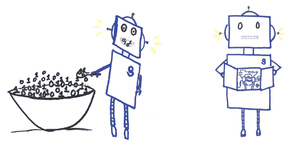

# 可解释性对于信任 AI 和机器学习至关重要

> 原文：[`www.kdnuggets.com/2018/11/interpretability-trust-ai-machine-learning.html`](https://www.kdnuggets.com/2018/11/interpretability-trust-ai-machine-learning.html)

 评论

**作者：[Ilknur Kaynar Kabul](https://blogs.sas.com/content/author/ilknurkaynarkabul/)，SAS**。

随着[machine learning](https://www.sas.com/en_us/webinars/implementing-ai-systems.html)在科学和技术领域的许多最新进展中占据了重要地位，机器学习模型的可解释性变得越来越重要。

我们周围充斥着由机器学习驱动的应用程序，机器做出的决定每天都越来越多地影响着我们个人。从平凡到挽救生命，我们向机器学习模型提出诸如：

+   我会喜欢哪首歌？

+   我能获得贷款吗？

+   我应该雇用谁？

+   我得癌症的概率是多少？

这些以及许多其他问题由大多数用户了解甚少的预测模型来回答。数据科学家通常强调模型的预测准确性——而不是理解*如何*这些预测实际上是如何做出的。使用机器学习，模型只是这样做的。

### **复杂模型更难以理解**

一些机器学习模型简单且易于理解。我们知道改变输入将如何影响预测结果，并且可以对每个预测做出解释。然而，随着机器学习和[人工智能](https://www.sas.com/en_us/insights/analytics/what-is-artificial-intelligence.html)的最新进展，模型变得非常复杂，包括复杂的深度神经网络和不同模型的集成。我们将这些复杂模型称为黑箱模型。

不幸的是，使黑箱模型具备卓越预测能力的复杂性也使它们非常难以理解和信任。黑箱模型内部的算法不会透露其秘密。它们通常不会提供明确的解释说明为何做出某个预测。它们只是给出一个概率，而且这些模型不透明且难以解释。有时模型参数多达数千（甚至数百万），输入特征与参数之间没有一一对应的关系，多个模型的组合以及许多参数常常影响预测结果。有些模型也对数据需求量大，需要大量数据才能达到高准确度。很难弄清楚它们从这些数据集中学到了什么，以及哪些数据点对结果的影响大于其他数据点。

由于这些原因，很难理解这些技术的过程和结果。弄清楚我们是否可以信任这些模型以及在使用它们时是否能够做出公平的决策也很困难。

如果他们学到错误的东西会发生什么？如果他们还没有准备好部署会发生什么？存在错误表述、过度简化或过拟合的风险。因此，我们在使用这些模型时需要小心，我们最好了解这些模型如何工作。

### **为什么准确性不够**

在机器学习中，准确性是通过将机器学习模型的输出与输入数据集中的已知实际值进行比较来衡量的。

一个模型可以通过记住数据集中的不重要特征或模式来实现高准确性。如果输入数据集存在偏差，也会影响模型。此外，训练环境中的数据可能无法很好地代表模型部署后生产环境中的数据。即使最初足够具有代表性，如果考虑到生产环境中的数据不是静态的，它也可能很快变得过时。

因此，我们不能仅仅依赖于特定数据集的预测准确性。我们需要了解更多。我们需要揭开黑箱机器学习模型的神秘面纱，提高透明度和解释性，使其更加可信赖和可靠。

### **什么是解释性？**

解释性意味着为最终用户提供特定决策或过程的解释。更具体来说，它包括：

+   理解影响结果的主要任务。

+   解释算法做出的决策。

+   发现算法学习到的模式/规则/特征。

+   对结果进行批判性分析。

+   探索算法的未知未知。

这不是关于理解模型如何处理训练数据中每一个数据点的每一个细节。

### **我们为什么需要解释性？**

解释性对不同的人有不同的重要性：

**数据科学家**希望建立具有高准确性的模型。他们希望了解细节，以找出如何选择最佳模型并改进该模型。他们还希望从模型中获得见解，以便将他们的发现传达给目标受众。

**最终用户**想知道模型为什么给出某个预测。他们想了解这些决策将如何影响他们。他们想知道自己是否被公平对待，以及是否需要对任何决策提出异议。他们希望在网上购物或点击网页广告时有一定程度的信任。

**监管者**和立法者希望使系统公平和透明。他们希望保护消费者。随着机器学习算法的不可避免的崛起，他们对模型做出的决策越来越感到担忧。

所有这些用户对黑箱模型有类似的期望。他们希望模型是透明的、可信赖的并且可以解释的。

1.  **透明**：系统可以解释它是如何工作的和/或为什么给出某些预测。

1.  **可信赖性**：系统能够在现实世界的不同场景中处理问题，而无需持续控制。

1.  **可解释性**：系统能够传达有关其内部工作原理的有用信息，包括其学习的模式和给出的结果。

在典型的机器学习流程中，我们对用于训练模型的数据集有控制权，对我们使用的模型有控制权，并且对如何评估和部署这些模型有控制权。

### **何时需要可解释性？**

如果你需要可解释性，首先需要问自己为什么需要它。在这个过程中，你在哪个阶段需要可解释性？并不是每种应用都需要理解模型如何做出预测。然而，如果这些预测用于高风险决策，你可能需要了解。如果你定义了目的，你应该关注在过程的哪个阶段需要哪些技术：

1.  **建模前的可解释性（模型输入的可解释性）**：在开始构建模型之前，理解数据集非常重要。你可以使用不同的探索性数据分析和可视化技术，以更好地理解数据集。这可能包括总结数据集的主要特征、找到数据集中的代表性或关键点，以及从数据集中找出相关特征。在对数据集有了整体理解后，你需要考虑在建模时将使用哪些特征。如果你想在建模后解释输入输出关系，你需要从有意义的特征开始。虽然高度工程化的特征（例如，从 t-sne、随机投影等获得的特征）可以提高模型的准确性，但在模型实际应用时，它们可能不可解释。

1.  **建模中的可解释性**：我们可以根据模型的简单性、透明度和解释性将模型分为白箱（透明）模型和黑箱（不透明）模型。

    1.  **白箱（透明）模型**：决策树、规则列表和回归算法通常被认为属于这一类别。这些模型在使用少量预测变量时易于理解。它们使用可解释的转换，并能提供关于如何工作的更多直观感受，这有助于你理解模型中的情况。你可以向技术观众解释它们。但当然，如果你有数百个特征并构建了一个非常深且大的决策树，事情仍然可能变得复杂和难以解释。

    1.  **黑箱（不透明）模型：** 深度神经网络、随机森林和梯度提升机可以被视为这一类别的模型。它们通常使用许多预测变量和复杂的转换，有些模型有很多参数。通常很难可视化和理解这些模型内部的工作情况，也更难以向目标受众进行沟通。然而，它们的预测准确性通常比其他模型要好。近期在这一领域的研究希望使这些模型更加透明。一些研究包括作为训练过程一部分的技术。在这些模型中生成解释是提高透明度的一种方式。另一种改进是包含训练过程后的特征可视化。

1.  **后建模可解释性（post hoc interpretability）：** 模型预测中的可解释性帮助我们检查输入特征与输出预测之间的动态关系。某些后建模活动是特定于模型的，而其他则是模型无关的。在这个阶段添加可解释性可以帮助我们理解模型中最重要的特征，这些特征如何影响预测，每个特征对预测的贡献，以及模型对某些特征的敏感性。除了模型特定的技术，如随机森林的变量重要性输出，还有模型无关的技术，例如部分依赖（PD）图、个体条件期望（ICE）图和局部可解释模型无关解释（LIME）。

敬请关注关于这个话题的更多帖子。[在这系列博客中](https://blogs.sas.com/content/tag/interpretability/)，我们将详细介绍一些可解释性技术。我们将解释如何使用模型无关的可解释性技术来理解黑箱模型。我们还会涵盖一些最新的可解释性进展。

**简介**：[Ilknur Kaynar Kabul](https://blogs.sas.com/content/author/ilknurkaynarkabul/) 是 SAS 高级分析部门的高级经理，她领导着 SAS 研发团队，专注于机器学习算法和应用。

[原文](https://blogs.sas.com/content/subconsciousmusings/2017/12/18/interpretability-crucial-trusting-ai-machine-learning/)。经许可转载。

**资源：**

+   [在线和基于网络的：分析、数据挖掘、数据科学、机器学习教育](https://www.kdnuggets.com/education/online.html)

+   [分析、数据科学、数据挖掘和机器学习的软件](https://www.kdnuggets.com/software/index.html)

**相关：**

+   [利用不确定性来解释你的模型](https://www.kdnuggets.com/2018/11/using-uncertainty-interpret-model.html)

+   [5 个你不应忽视的机器学习项目，2018 年 6 月](https://www.kdnuggets.com/2018/06/5-machine-learning-projects-overlook-jun-2018.html)

+   [机器学习模型的解释：概述](https://www.kdnuggets.com/2017/11/interpreting-machine-learning-models-overview.html)

* * *

## 我们的前三大课程推荐

 1\. [Google 网络安全证书](https://www.kdnuggets.com/google-cybersecurity) - 快速进入网络安全职业轨道

 2\. [Google 数据分析专业证书](https://www.kdnuggets.com/google-data-analytics) - 提升你的数据分析技能

 3\. [Google IT 支持专业证书](https://www.kdnuggets.com/google-itsupport) - 支持你的组织 IT 工作

* * *

### 更多相关内容

+   [对话式 AI 开发中的 3 个关键挑战及如何避免它们](https://www.kdnuggets.com/3-crucial-challenges-in-conversational-ai-development-and-how-to-avoid-them)

+   [大数据分析：为什么它对商业智能如此关键？](https://www.kdnuggets.com/2023/06/big-data-analytics-crucial-business-intelligence.html)

+   [制定有效编码例程的 5 个关键步骤](https://www.kdnuggets.com/2023/08/5-crucial-steps-develop-effective-coding-routine.html)

+   [使用 SHAP 值进行机器学习模型可解释性分析](https://www.kdnuggets.com/2023/08/shap-values-model-interpretability-machine-learning.html)

+   [使用 Python 和 Scikit-learn 简化决策树的可解释性](https://www.kdnuggets.com/2017/05/simplifying-decision-tree-interpretation-decision-rules-python.html)

+   [学习数据科学、机器学习和深度学习的可靠计划](https://www.kdnuggets.com/2023/01/mwiti-solid-plan-learning-data-science-machine-learning-deep-learning.html)
