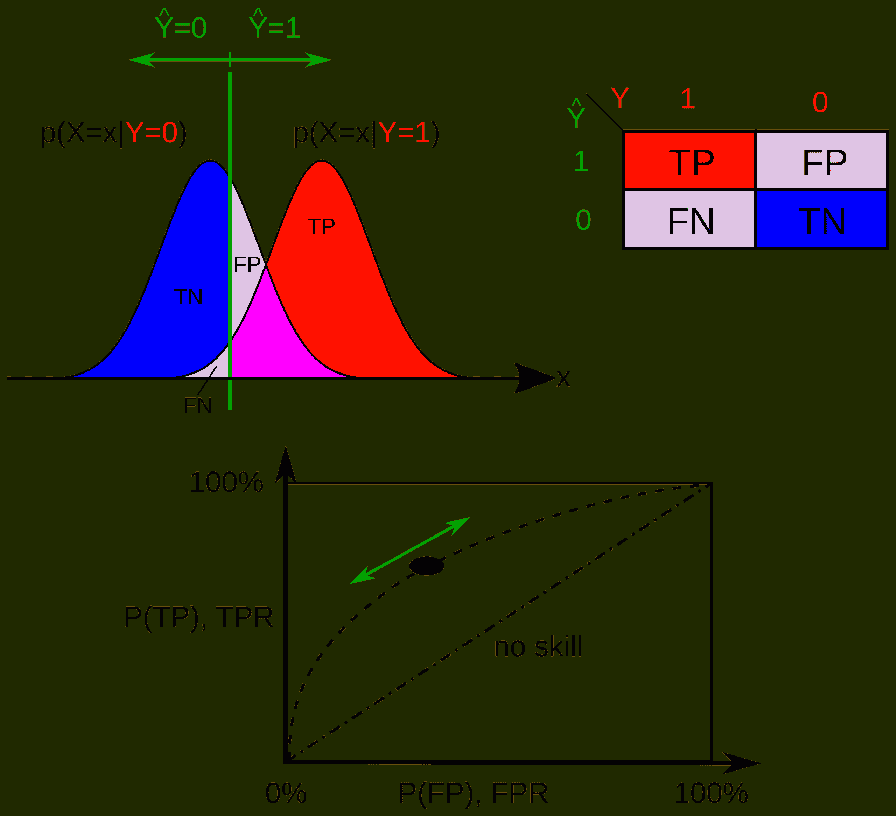

# 一种简单且可解释的二分类器性能测量方法

> 原文：[`www.kdnuggets.com/2020/03/interpretable-performance-measure-binary-classifier.html`](https://www.kdnuggets.com/2020/03/interpretable-performance-measure-binary-classifier.html)

评论

**由 [Mehmet Suzen](https://msuzen.github.io/) 提供，理论物理学家和研究科学家**。

机器学习模型的核心应用是 [二分类任务](https://en.wikipedia.org/wiki/Binary_classification)。这出现在医学中的 [诊断测试](https://en.wikipedia.org/wiki/Medical_test) 以及针对消费者的 [信用风险](https://global.oup.com/academic/product/consumer-credit-models-9780199232130?cc=us&lang=en&) 决策等多个领域。构建分类器的技术从简单的决策树到逻辑回归，最近还有利用多层神经网络的超级酷的深度学习模型。然而，尽管这些模型在构建和训练方法上有数学上的不同，但在性能测量方面，事情变得复杂。在这篇文章中，我们提出了一种简单且可解释的二分类器性能测量方法。假设读者对分类有一定的背景知识。

* * *

## 我们的前 3 名课程推荐

 1\. [谷歌网络安全证书](https://www.kdnuggets.com/google-cybersecurity) - 快速进入网络安全职业轨道。

 2\. [谷歌数据分析专业证书](https://www.kdnuggets.com/google-data-analytics) - 提升您的数据分析技能

 3\. [谷歌 IT 支持专业证书](https://www.kdnuggets.com/google-itsupport) - 支持您组织的 IT

* * *

### 为什么 ROC-AUC 不具有可解释性？

*不同阈值产生不同的混淆矩阵（维基百科）。*

报告分类器性能的事实标准是使用[接收器操作特性](https://en.wikipedia.org/wiki/Receiver_operating_characteristic) (ROC) - 曲线下面积 (AUC) 测量。它起源于 1940 年代美国海军在雷达的开发过程中，用于测量探测性能。 至少有 5 种不同的 ROC-AUC 定义，即使你拥有机器学习博士学位，人们也很难解释 AUC 作为性能度量的意义。由于几乎所有库中都有 AUC 功能，它几乎成为机器学习论文中分类性能的宗教仪式。然而，除了其荒谬的比较问题外，解释起来并不容易，请参见[hmeasure](http://www.hmeasure.net/)。AUC 衡量的是从[混淆矩阵](https://en.wikipedia.org/wiki/Confusion_matrix)提取的真实正率 (TPR) 曲线下的面积，作为假阳性率 (FPR) 的函数，不同阈值下的结果。

*f(x) = y*

*∫ 10 f(x)dx = AUC*

其中 *y* 是 TPR，*x* 是 FPR。除了有多种解释且容易产生混淆外，没有明确的目的来对 FPR 进行积分。显然，我们希望通过将 FPR 设为零来实现完美分类，但这个面积在数学上并不明确，这意味着作为*一个数学对象* 的具体意义并不清楚。

### 正确分类概率 (PCC)

对于二分类器来说，一个简单且易于解释的性能度量对技术数据科学家和非技术利益相关者都非常有用。这个方向的基本原则是分类器技术的目的是能够区分两个类别。这归结为一个概率值，即*正确分类概率 (PCC)*。显而易见的选择是所谓的平衡准确率 (BA)。即使由[SAS](https://support.sas.com/resources/papers/proceedings17/0942-2017.pdf)推荐用于不平衡问题，他们使用了概率的乘法。这里我们将 BA 称为 PCC，并改用加法，原因是统计依赖性：

*PCC = (TPR + TNR) / 2*

*TPR = TP / (ConditionPositive) = TP / (TP + FN)*

*TNR = TN / (ConditionNegative) = TN / (TN + FP).*

PCC 告诉我们分类器在检测任一类别时的效果，它是一个概率值，[0,1]。请注意，即使我们的训练数据在生产中是平衡的，使用正负案例的总体准确率也是误导性的，因为我们测量性能的批次可能不平衡，因此仅用准确率作为衡量标准并不理想。

### 生产问题

直接的问题是如何选择生成混淆矩阵的阈值？一种选择是选择一个能够最大化 PCC 的阈值，用于在测试集上进行生产。为了提高 PCC 的估计，可以在测试集上进行重采样，以获得良好的不确定性。

### 结论

我们尝试通过引入 PCC，或平衡准确率，作为二分类器的简单而可解释的性能指标，来规避报告 AUC 的问题。这对于非技术观众来说很容易解释。可以引入一种改进的 PCC，考虑更好的估计特性，但主要的解释仍然是*正确分类的概率。*

[原文](https://memosisland.blogspot.com/2020/02/a-simple-and-interpretable-performance.html)。经许可转载。

**相关内容：**

+   [你信任并理解你的预测模型吗？](https://www.kdnuggets.com/2020/02/h2o-trust-understand-predictive-models.html)

+   [接收器操作特征曲线揭秘（Python 版）](https://www.kdnuggets.com/2018/07/receiver-operating-characteristic-curves-demystified-python.html)

+   [选择正确的指标来评估机器学习模型——第二部分](https://www.kdnuggets.com/2018/06/right-metric-evaluating-machine-learning-models-2.html)

### 更多相关主题

+   [使用 PyCaret 进行二分类介绍](https://www.kdnuggets.com/2021/12/introduction-binary-classification-pycaret.html)

+   [学习如何设计、测量和实施可靠的 A/B 测试…](https://www.kdnuggets.com/2023/01/sphere-design-measure-implement-trustworthy-ab-tests-ronny-kohavi.html)

+   [使用 PyTorch 的可解释神经网络](https://www.kdnuggets.com/2022/01/interpretable-neural-networks-pytorch.html)

+   [从理论到实践：构建 k-近邻分类器](https://www.kdnuggets.com/2023/06/theory-practice-building-knearest-neighbors-classifier.html)

+   [优化你的 LLM 以提高性能和可扩展性](https://www.kdnuggets.com/optimizing-your-llm-for-performance-and-scalability)

+   [优化性能和成本的策略，适用于大型…](https://www.kdnuggets.com/strategies-for-optimizing-performance-and-costs-when-using-large-language-models-in-the-cloud)
