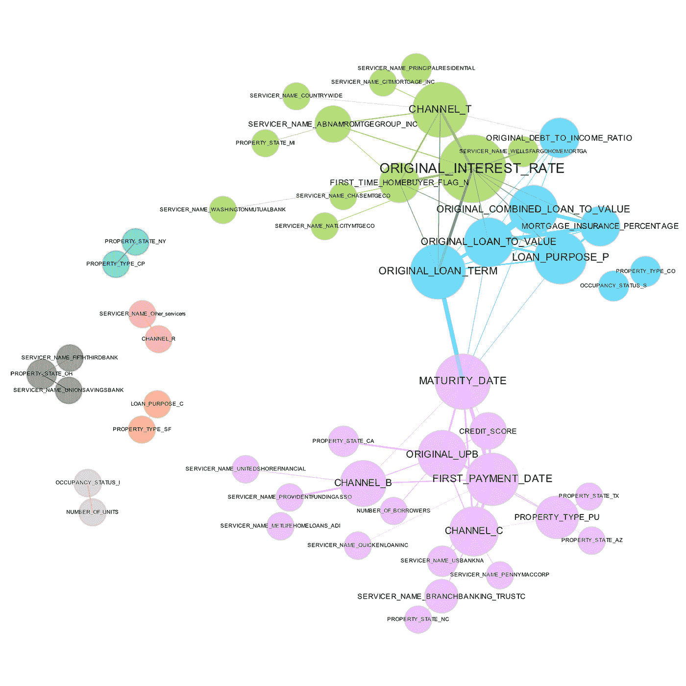
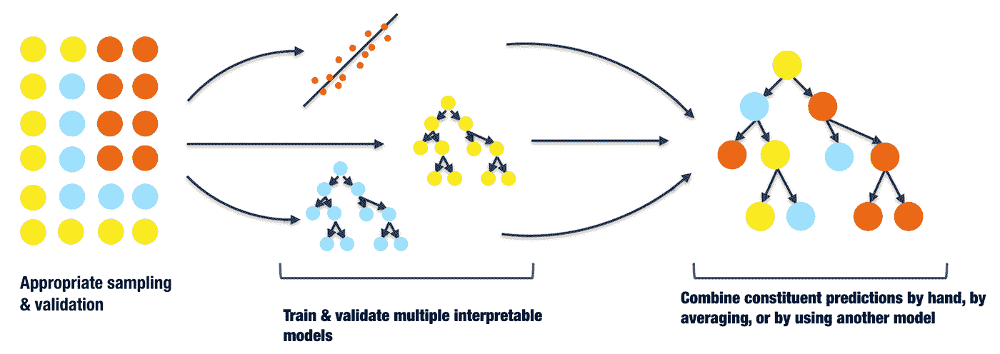
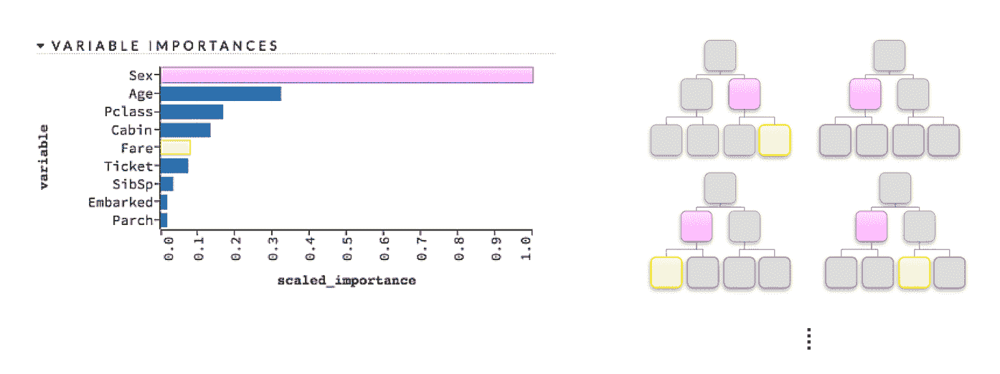

# 解释机器学习模型：概述

> 原文：[`www.kdnuggets.com/2017/11/interpreting-machine-learning-models-overview.html`](https://www.kdnuggets.com/2017/11/interpreting-machine-learning-models-overview.html)

[一篇文章](https://www.oreilly.com/ideas/ideas-on-interpreting-machine-learning)关于机器学习解释出现在 O'Reilly 的博客上，由 Patrick Hall、Wen Phan 和 SriSatish Ambati 撰写，概述了超越常用措施的多种方法。偶然间我在周末再次读到了这篇文章，决定分享其中的一些观点。这篇文章非常棒（虽然很长），推荐给有时间的人阅读。

文章的组织结构如下：

+   概述（机器学习）函数解释的不同复杂性

+   可解释性的范围概述，包括局部（条件分布的小区域）与全局（整个条件分布）的比较

+   讨论理解和信任，以及传统的理解措施——如交叉验证和评估图——如何常常不足以激发对模型的*信任*

+   解释技术的三部分拆解（文章的核心内容）

> 第一部分包括在训练和解释机器学习算法的背景下查看和理解数据的方法，第二部分介绍了将线性模型和机器学习算法结合起来的技术，以应对可解释性至关重要的情况，第三部分描述了理解和验证最复杂的预测模型的方法。

文章的重点是对每种技术及其技术组的可解释性进行分解，而这篇文章则总结了这些技术。

### 第一部分：查看你的数据

本节以缓慢的节奏开始文章，并指出一些在传统方法之外执行视觉数据探索的方法。

> [T]有许多种方法来可视化数据集。下面突出显示的大多数技术帮助在仅两个维度中展示整个数据集，而不仅仅是单变量或双变量的数据切片（即一次一个或两个变量）。这在机器学习中很重要，因为大多数机器学习算法会自动建模变量之间的高阶交互作用（即，结合多个变量的影响，即超过两个或三个变量）。

本节展示的可视化技术包括：

+   符号图

+   相关性图

+   2D 投影，例如 PCA、MDS 和 t-SNE

+   部分依赖图

+   残差分析

表示由大型金融公司发放贷款的相关性图。图片由 Patrick Hall 和 H2O.ai 团队提供。

推荐的一些问题可以帮助确定这些可视化技术的价值（类似的问题也会在后续部分的技术中提出），包括：

+   可视化可以帮助解释什么复杂度的函数？

+   可视化如何增强理解？

+   可视化如何增强信任？

### 第二部分：在受监管行业中使用机器学习

这里变得更加有趣了。

> 本节介绍的技术是更新的线性模型类型或使用机器学习来增强传统线性建模方法的模型。这些技术适用于那些由于可解释性问题而无法使用机器学习算法构建预测模型的从业人员。

本节概述的技术包括：

+   **广义加性模型（GAMs）**

+   **分位回归**

+   **构建机器学习模型基准**——也就是说，在从传统线性模型转向机器学习算法时，采用有意识的过程，逐步推进，并在过程中比较性能和结果，而不是直接从简单的回归模型跳到深度黑箱模型

+   **在传统分析过程中使用机器学习**——这是建议使用机器学习算法来增强分析生命周期过程，以获得更准确的预测，例如预测线性模型的退化

+   **小型可解释的集成**——目前已基本确定，集成方法总体上具有巨大价值，但使用*简单*的这种方法可能有助于提高准确性和可解释性。

+   **[单调性](https://en.wikipedia.org/wiki/Monotonic_function)** 约束——这种约束可能将复杂模型转换为可解释的非线性单调模型

> 单调性至少有两个非常重要的原因：
> 
> 1.  单调性通常是监管机构所期望的
> 1.  
> 1.  单调性支持一致的理由代码生成

一张小型堆叠集成模型的示意图。图例由 Vinod Iyengar 和 H2O.ai 团队提供。

### 第三部分：理解复杂的机器学习模型

在我看来，这里尤其有趣。我将复杂的机器学习模型可解释性视为自动化机器学习的支持者，因为我认为这两种技术是同一事物的两个方面：如果我们要使用自动化技术在前端生成模型，那么在后端设计和使用适当的方法来简化和理解这些模型就变得极为重要。

下面是本文中概述的帮助理解复杂机器学习模型的方法。

**替代模型** -- 简单地说，替代模型是一个可以用来解释更复杂模型的简单模型。如果替代模型是通过使用原始输入数据和更复杂模型的预测训练一个简单的线性回归或决策树来创建的，则简单模型的特征可以被认为是对复杂模型的准确描述。它可能根本不准确。

那么，为什么使用替代模型？

> 替代模型在其系数、变量重要性、趋势和交互作用与人类领域知识和合理期望一致时，能够增强信任。当与敏感性分析结合使用以测试解释是否保持稳定并与人类领域知识以及在数据轻微且有目的地扰动时、模拟有趣场景时或数据随时间变化时的合理期望一致时，替代模型可以增加信任。

**局部可解释模型无关解释（LIME）** -- LIME 用于基于单个观察构建替代模型。

> LIME 的实现可以按如下方式进行。首先，使用复杂模型对解释性记录进行评分。然后，为了解释关于另一条记录的决策，解释记录按其与该记录的接近程度加权，并在这个加权的解释性数据集上训练一个 L1 正则化的线性模型。线性模型的参数然后帮助解释对所选记录的预测。

**最大激活分析** -- 一种技术，旨在隔离出能够引发某个模型超参数最大响应的特定实例。

> 在最大激活分析中，寻找或模拟出能够最大限度激活神经网络中的某些神经元、层或滤波器，或决策树集合中的某些树的示例。对于最大激活分析而言，某个树的低残差类似于神经网络中高幅度的神经元输出。

那么... LIME，还是最大激活分析，还是两者结合？

> 如上所述，LIME 有助于解释模型在条件分布的局部区域内的预测。最大激活分析有助于增强对模型局部、内部机制的信任。这两者结合可以为复杂响应函数创建详细的局部解释。

**敏感性分析** -- 该技术有助于确定有意扰动的数据或类似数据变化是否会改变模型行为并使输出不稳定；它还用于研究特定场景或极端情况的模型行为。

**全局变量重要性度量** -- 通常是树模型的领域；变量重要性的启发式方法与给定变量的分裂点的深度和频率有关；较高和更频繁的变量显然更重要。

例如：

> 对于单个决策树，变量的重要性通过在每个选择该变量作为最佳分割候选的节点中，分割准则的累计变化来定量确定。

决策树集成模型中变量重要性的示意图。图由 Patrick Hall 和 H2O.ai 团队提供。

**Leave-One-Covariate-Out (LOCO)** -- “模型无关的均值准确度下降变量重要性度量”；最初为回归模型开发，但更广泛适用；该技术的目标是通过迭代地将变量值置为零来确定对给定行具有最大绝对影响的变量--即被确定为该行预测中最重要的变量。

> **变量重要性度量如何增强理解？**
> 
> 变量重要性度量增加了理解，因为它们告诉我们模型中最具影响力的变量及其相对排名。

[**Treeinterpreter**](https://github.com/andosa/treeinterpreter) -- 严格来说是基于树的模型（决策树、随机森林等）解释方法

> Treeinterpreter 仅仅输出一个给定模型中某变量的偏差和个别贡献的列表，或者输入变量在单个记录中对单个预测的贡献。

我目前正在试验 Treeinterpreter，并希望很快分享我的经验。

重申一下，[这篇 O'Reilly 文章](https://www.oreilly.com/ideas/ideas-on-interpreting-machine-learning)我已经进行了简单总结，如果你有时间，值得全面阅读，其中详细阐述了我只是触及皮毛的技术，比我更好地将每项技术的有用性以及使用这些技术所应期待的结果结合起来。

感谢 Patrick Hall、Wen Phan 和 SriSatish Ambati，这篇信息丰富的文章的作者。

**相关**：

+   用 Python 和 Scikit-learn 简化决策树解释

+   模型可解释性的神话

+   局部可解释模型无关解释 (LIME)

* * *

## 我们的前三大课程推荐

 1\. [Google 网络安全证书](https://www.kdnuggets.com/google-cybersecurity) - 快速进入网络安全职业道路。

 2\. [Google 数据分析专业证书](https://www.kdnuggets.com/google-data-analytics) - 提升你的数据分析技能

 3\. [Google IT 支持专业证书](https://www.kdnuggets.com/google-itsupport) - 支持你的组织进行 IT 管理

* * *

### 更多相关主题

+   [每个初学者数据科学家都应该掌握的 6 种预测模型](https://www.kdnuggets.com/2021/12/6-predictive-models-every-beginner-data-scientist-master.html)

+   [成为优秀数据科学家所需的 5 项关键技能](https://www.kdnuggets.com/2021/12/5-key-skills-needed-become-great-data-scientist.html)

+   [2021 年最佳 ETL 工具](https://www.kdnuggets.com/2021/12/mozart-best-etl-tools-2021.html)

+   [停止学习数据科学，寻找目标并找到目标…](https://www.kdnuggets.com/2021/12/stop-learning-data-science-find-purpose.html)

+   [学习数据科学统计学的最佳资源](https://www.kdnuggets.com/2021/12/springboard-top-resources-learn-data-science-statistics.html)

+   [成功数据科学家的 5 个特征](https://www.kdnuggets.com/2021/12/5-characteristics-successful-data-scientist.html)
